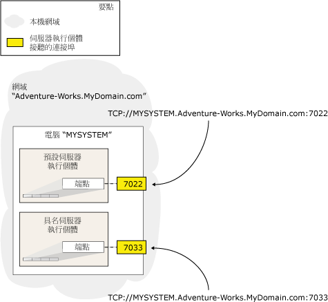

# <a name="specify-endpoint-url---adding-or-modifying-availability-replica"></a>指定端點 URL - 新增或修改可用性複本
[!INCLUDE[appliesto-ss-xxxx-xxxx-xxx-md](../../../includes/appliesto-ss-xxxx-xxxx-xxx-md.md)] 若要裝載可用性群組的可用性複本，伺服器執行個體必須擁有資料庫鏡像端點。 伺服器執行個體使用此端點接聽來自其他伺服器執行個體所裝載之可用性複本的 [!INCLUDE[ssHADR](../../../includes/sshadr-md.md)] 訊息。 若要定義可用性群組的可用性複本，您必須指定將要裝載此複本之伺服器執行個體的端點 URL。 *「端點 URL」* (Endpoint URL) 會識別資料庫鏡像端點的傳輸通訊協定 (TCP)、伺服器執行個體的系統位址，以及與端點相關聯的通訊埠編號。  
  
> [!NOTE]  
>  「端點 URL」一詞是資料庫鏡像使用者介面和文件集所用「伺服器網路位址」一詞的同義詞。  
  
-   [端點 URL 的語法](#SyntaxOfURL)  
  
-   [尋找系統的完整網域名稱](#Finding_FQDN)  
  
-   [相關工作](#RelatedTasks)  
  
-   [相關內容](#RelatedContent)  
  
##  <a name="SyntaxOfURL"></a> 端點 URL 的語法  
 端點 URL 的語法採用以下格式：  
  
 TCP**://***\<系統位址>***:***\<通訊埠>*  
  
 其中  
  
-   *\<系統位址>* 是可明確識別目標電腦系統的字串。 伺服器位址通常是系統名稱 (如果系統位於同一個網域內)、完整網域名稱或 IP 位址。  
  
    -   因為 Windows Server 容錯移轉叢集 (WSFC) 叢集的節點都是在相同網域中，您可以使用電腦系統的名稱，例如 `SYSTEM46`。  
  
    -   若要使用 IP 位址，則它在您的環境中必須是唯一的。 建議您只使用靜態的 IP 位址。 此 IP 位址可以是 IP 第 4 版 (IPv4) 或 IP 第 6 版 (IPv6)。 IPv6 位址必須使用方括弧括住，例如：**[**<IPv6 位址>**]**。  
  
         若要取得系統的 IP 位址，請在 Windows 命令提示字元下，輸入 **ipconfig** 命令。  
  
    -   完整網域名稱保證可以運作。 這是在不同位置會採用不同格式的本機定義位址字串。 完整網域名稱通常 (但不一定) 都是複合名稱，包含電腦名稱及一系列以句號分隔的網域區段，並採用下列格式：  
  
         *電腦名稱* **。** *網域區段*[...**.***網域區段*]  
  
         其中 *電腦名稱*是執行伺服器執行個體之電腦的網路名稱，而 *網域區段*[...**.***網域區段*] 則是伺服器的其餘網域資訊；例如： `localinfo.corp.Adventure-Works.com`。  
  
         網域區段的內容和數目是在公司或組織的內部決定的。 如需詳細資訊，請參閱本主題後面的＜ [尋找完整網域名稱](#Finding_FQDN)＞。  
  
-   *\<連接埠>* 是夥伴伺服器執行個體的鏡像端點所使用的連接埠號碼。  
  
     資料庫鏡像端點可以使用電腦系統上任何可用的通訊埠。 每個通訊埠編號必須只與一個端點產生關聯，而且每個端點會與單一伺服器執行個體產生關聯，因此相同伺服器上的不同伺服器執行個體會在具有不同通訊埠的不同端點上接聽。 因此，當您指定可用性複本時，在端點 URL 中指定的通訊埠，會永遠把內送訊息導向到端點與該通訊埠產生關聯的伺服器執行個體。  
  
     在端點 URL 中，只有通訊埠編號會識別與目標電腦上的鏡像端點相關聯的伺服器執行個體。 下圖說明單一電腦上兩個伺服器執行個體的端點 URL。 預設的執行個體會使用通訊埠 `7022` ，而具名執行個體則使用通訊埠 `7033`。 這兩個伺服器執行個體的端點 URL 分別為： `TCP://MYSYSTEM.Adventure-works.MyDomain.com:7022` 和 `TCP://MYSYSTEM.Adventure-works.MyDomain.com:7033`。 請注意，位址不包含伺服器執行個體的名稱。  
  
       
  
     若要識別目前關聯於伺服器執行個體之資料庫鏡像端點的通訊埠，請使用下列 [!INCLUDE[tsql](../../../includes/tsql-md.md)] 陳述式：  
  
    ```  
    SELECT type_desc, port FROM sys.TCP_endpoints  
    ```  
  
     尋找 **type_desc** 值是 "DATABASE_MIRRORING" 的資料列，並使用對應通訊埠編號。  
  
### <a name="examples"></a>範例  
  
#### <a name="a-using-a-system-name"></a>A. 使用系統名稱  
 下列端點 URL 會指定一個系統名稱 `SYSTEM46`和通訊埠 `7022`。  
  
 `TCP://SYSTEM46:7022`  
  
#### <a name="b-using-a-fully-qualified-domain-name"></a>B. 使用完整網域名稱  
 下列端點 URL 會指定一個完整網域名稱 `DBSERVER8.manufacturing.Adventure-Works.com`和通訊埠 `7024`。  
  
 `TCP://DBSERVER8.manufacturing.Adventure-Works.com:7024`  
  
#### <a name="c-using-ipv4"></a>C. 使用 IPv4  
 下列端點 URL 會指定一個 IPv4 位址 `10.193.9.134`和通訊埠 `7023`。  
  
 `TCP://10.193.9.134:7023`  
  
#### <a name="d-using-ipv6"></a>D. 使用 IPv6  
 下列端點 URL 會包含一個 IPv6 位址 `2001:4898:23:1002:20f:1fff:feff:b3a3`和通訊埠 `7022`。  
  
 `TCP://[2001:4898:23:1002:20f:1fff:feff:b3a3]:7022`  
  
##  <a name="Finding_FQDN"></a> 尋找系統的完整網域名稱  
 若要尋找系統的完整網域名稱，請在該系統的 Windows 命令提示字元下，輸入：  
  
 **IPCONFIG /ALL**  
  
 若要形成完整的網域名稱，請串連 <主機名稱> 和 <主要 DNS 尾碼> 的值，如下所示：  
  
 <主機名稱> **.** *<主要 DNS 尾碼>*  
  
 例如，IP 組態  
  
 `Host Name  .  .  .  .  .  .  : MYSERVER`  
  
 `Primary Dns Suffix  .  .  .  : mydomain.Adventure-Works.com`  
  
 等於下列完整的網域名稱：  
  
 `MYSERVER.mydomain.Adventure-Works.com`  
  
> [!NOTE]  
>  如果您需要有關完整網域名稱的詳細資訊，請洽詢您的系統管理員。  
  
##  <a name="RelatedTasks"></a> 相關工作  
 **若要設定資料庫鏡像端點**  
  
-   [針對 Always On 可用性群組建立資料庫鏡像端點 &#40;SQL Server PowerShell&#41;](../../../database-engine/availability-groups/windows/database-mirroring-always-on-availability-groups-powershell.md)  
  
-   [建立 Windows 驗證的資料庫鏡像端點 &#40;Transact-SQL&#41;](../../../database-engine/database-mirroring/create-a-database-mirroring-endpoint-for-windows-authentication-transact-sql.md)  
  
-   [使用資料庫鏡像端點憑證 &#40;Transact-SQL&#41;](../../../database-engine/database-mirroring/use-certificates-for-a-database-mirroring-endpoint-transact-sql.md)  
  
    -   [允許資料庫鏡像端點使用輸出連線的憑證 &#40;Transact-SQL&#41;](../../../database-engine/database-mirroring/database-mirroring-use-certificates-for-outbound-connections.md)  
  
    -   [允許資料庫鏡像端點使用輸入連線的憑證 &#40;Transact-SQL&#41;](../../../database-engine/database-mirroring/database-mirroring-use-certificates-for-inbound-connections.md)  
  
-   [指定伺服器網路位址 &#40;資料庫鏡像&#41;](../../../database-engine/database-mirroring/specify-a-server-network-address-database-mirroring.md)  
  
-   在加入或修改可用性複本時指定端點 URL (SQL Server)  
  
-   [疑難排解 Always On 可用性群組組態 &#40;SQL Server&#41;](../../../database-engine/availability-groups/windows/troubleshoot-always-on-availability-groups-configuration-sql-server.md)  
  
 **若要檢視有關資料庫鏡像端點的資訊**  
  
-   [sys.database_mirroring_endpoints &#40;Transact-SQL&#41;](../../../relational-databases/system-catalog-views/sys-database-mirroring-endpoints-transact-sql.md)  
  
 **若要加入可用性複本**  
  
-   [將次要複本加入可用性群組中 &#40;SQL Server&#41;](../../../database-engine/availability-groups/windows/add-a-secondary-replica-to-an-availability-group-sql-server.md)  
  
-   [將次要複本聯結至可用性群組 &#40;SQL Server&#41;](../../../database-engine/availability-groups/windows/join-a-secondary-replica-to-an-availability-group-sql-server.md)  
  
##  <a name="RelatedContent"></a> 相關內容  
  
-   [Microsoft SQL Server AlwaysOn 高可用性和災害復原解決方案指南](http://go.microsoft.com/fwlink/?LinkId=227600)  
  
## <a name="see-also"></a>另請參閱  
 [建立及設定可用性群組 &#40;SQL Server&#41;](../../../database-engine/availability-groups/windows/creation-and-configuration-of-availability-groups-sql-server.md)   
 [AlwaysOn 可用性群組概觀 &#40;SQL Server&#41;](../../../database-engine/availability-groups/windows/overview-of-always-on-availability-groups-sql-server.md)   
 [CREATE ENDPOINT &#40;Transact-SQL&#41;](../../../t-sql/statements/create-endpoint-transact-sql.md)  
  
  
