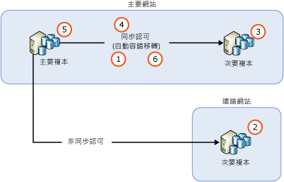
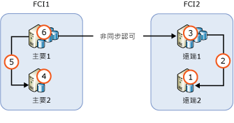

# <a name="upgrading-always-on-availability-group-replica-instances"></a>升級 AlwaysOn 可用性群組複本執行個體
[!INCLUDE [SQL Server](../../../includes/applies-to-version/sqlserver.md)]

將裝載 AlwaysOn 可用性群組 (AG) 的 [!INCLUDE[ssNoVersion](../../../includes/ssnoversion-md.md)] 執行個體升級為新的 [!INCLUDE[ssCurrent](../../../includes/sscurrent-md.md)] 版本、新的 [!INCLUDE[ssNoVersion](../../../includes/ssnoversion-md.md)] Service Pack 或累積更新，或安裝至新的 Windows Service Pack 或累積更新時，您可透過執行輪流升級來將主要複本的停機時間減少至僅單一手動容錯移轉 (回復為原始主要複本時則為兩次手動容錯移轉)。 在升級過程中無法使用次要複本執行容錯移轉或唯讀作業，且在升級完成後，次要複本可能需要花費一些時間趕上主要複本節點，根據主要複本節點的活動量而定 (因此網路流量會偏高)。 另請注意，在初始容錯移轉到執行較新版 SQL Server 的次要複本之後，該可用性群組中的資料庫會執行整個升級程序，以將其升級為最新版本。 在這段期間內，這些資料庫都不會有可讀取的複本。 初始容錯移轉之後的停機時間長短，取決於可用性群組中的資料庫數量。 如果您打算容錯回復為原始的主要複本，此步驟在您進行容錯回復時不會重覆。
  
>[!NOTE]  
>本文僅限討論 SQL Server本身的升級。 其未涵蓋包含 Windows Server 容錯移轉叢集 (WSFC) 的作業系統升級。 Windows Server 2012 R2 之前的作業系統，不支援裝載容錯移轉叢集的 Windows 作業系統升級。 若要升級在 Windows Server 2012 R2 上執行的叢集結點，請參閱[叢集作業系統輪流升級](https://docs.microsoft.com/windows-server/failover-clustering/cluster-operating-system-rolling-upgrade) \(機器翻譯\)。  
  
## <a name="prerequisites"></a>必要條件  
在開始之前，請檢閱以下重要資訊：  
  
- [支援的版本與版本升級](../../../database-engine/install-windows/supported-version-and-edition-upgrades.md)：確認您可從您的 Windows 作業系統版本與 SQL Server 版本升級至 SQL Server 2016。 例如，您無法直接從 SQL Server 2005 執行個體升級至 [!INCLUDE[ssCurrent](../../../includes/sscurrent-md.md)]。  
  
- [選擇資料庫引擎升級方法](../../../database-engine/install-windows/choose-a-database-engine-upgrade-method.md)：若要依正確順序升級，請根據您檢閱的支援版本與版本升級，選取適當的升級方法和步驟，此外亦根據環境中安裝的其他元件。  
  
- [計劃和測試資料庫引擎升級計畫](../../../database-engine/install-windows/plan-and-test-the-database-engine-upgrade-plan.md)：檢閱版本資訊與已知的升級問題、升級前檢查清單，並開發和測試升級計畫。  
  
- [安裝 SQL Server 的硬體和軟體需求](../../../sql-server/install/hardware-and-software-requirements-for-installing-sql-server.md)：檢閱安裝 [!INCLUDE[ssCurrent](../../../includes/sscurrent-md.md)] 的軟體需求。 如果需要其他軟體，請先將其安裝在每個節點上，然後開始升級程序，以將任何停機時間降到最低。  

- [檢查是否針對任何 AG 資料庫使用異動資料擷取或複寫](#special-steps-for-change-data-capture-or-replication)：如果啟用 AG 中的任何資料庫進行異動資料擷取 (CDC)，請完成這些[指示](#special-steps-for-change-data-capture-or-replication)。

>[!NOTE]  
>在輪流升級之外，不支援在相同 AG 中混用 SQL Server 執行個體的版本，且不應該長時間存在於該狀態，因為升級應該很快會發生。 升級 SQL Server 2016 和更新版本的另一個選項，是透過使用分散式的可用性群組。

## <a name="rolling-upgrade-basics-for-always-on-ags"></a>AlwaysOn AG 的輪流升級基本概念  
當您執行伺服器升級或更新時，請遵循下列指導方針，好讓停機時間及 AG 的資料遺失情況降至最低：  
  
- 在開始輪流升級之前，  
  
    - 至少在其中一個同步認可複本執行個體上，執行手動容錯移轉練習  
  
    - 在每一個可用性資料庫上執行完整資料庫備份來保護資料  
  
    - 在每一個可用性資料庫上執行 DBCC CHECKDB  
  
-   請務必先升級遠端次要複本執行個體，然後是本機次要複本執行個體，最後是主要複本執行個體。  
  
-   在進行升級的資料庫上，不會發生備份。  在升級次要複本之前，請設定自動備份喜好設定，只在主要複本上執行備份。  執行版本升級時，無法讀取任何複本或使用其執行備份。 執行非版本升級時，您可先設定要在次要複本上執行的自動備份，然後再升級主要複本。  
  
-   執行版本升級時，在升級可讀取次要複本之後，以及將主要複本容錯移轉至升級的次要複本或是升級主要複本之前，皆無法讀取可讀取的次要複本。  
  
-   為了避免 AG 在升級程序期間發生意外的容錯移轉，請從所有同步認可複本中移除可用性容錯移轉，再開始操作。  
  
-   將 AG 容錯移轉至包含次要複本的已升級執行個體之前，請勿升級主要複本執行個體。 否則，用戶端應用程式在主要複本執行個體的升級期間可能會受困於停機時間延長。  
  
-   一定要將 AG 容錯移轉至同步認可的次要複本執行個體。 若您容錯移轉到非同步認可的次要複本執行個體，資料庫將會很容易遺失資料，而且資料移動會自動暫停，直到您手動繼續資料移動為止。  
  
-   在您升級或更新其他任何次要複本執行個體之前，請勿升級主要複本執行個體。 已升級的主要複本將無法再傳送記錄到尚未升級 [!INCLUDE[ssCurrent](../../../includes/sscurrent-md.md)] 執行個體至相同版本的次要複本。 當移至次要複本的資料移動作業暫停時，該複本無法進行自動容錯移轉，而且您的可用性資料庫很容易發生資料遺失。 這也適用於輪流升級期間，在其中您可以從舊的主要複本手動容錯移轉至新主要複本。 因此，在升級舊的主要複本之後，您可能需要繼續同步處理。
  
-   在容錯移轉 AG 之前，請確認容錯移轉目標的同步處理狀態為 SYNCHRONIZED。  

  > [!WARNING]
  > 在已安裝較舊 SQL Server 版本的伺服器上安裝新執行個體或 SQL Server 新版本時，可能會意外**導致較舊 SQL Server 版本所裝載的任何可用性群組中斷。** 這是因為在執行個體或 SQL Server 版本的安裝期間，SQL Server 高可用性模組 (RHS.EXE) 會開始升級。 這會導致伺服器上主要角色中的現有可用性群組暫時中斷。 因此，當您在已裝載較舊 SQL Server 版本 (具有可用性群組) 的系統中安裝新版 SQL Server 時，強烈建議您執行下列其中一項：
  > - 在維護期間安裝新版 SQL Server。 
  > - 將可用性群組容錯移轉至次要複本，因此它在新的 SQL Server 執行個體安裝期間不是主要。 
  
## <a name="rolling-upgrade-process"></a>輪流升級處理程序  
 實際上，確切的程序將取決於一些因素，例如 AG 的部署拓撲和每個複本的認可模式。 但是在最簡單的案例中，輪流升級是多階段的程序，其最簡單的形式包含以下步驟：  
  
   
  
1.  在所有同步認可複本上移除自動容錯移轉  
  
2.  升級所有非同步認可次要複本執行個體。 
  
3.  升級所有遠端同步認可次要複本執行個體。 

4.  升級所有本機同步認可次要複本執行個體。 
  
4.  手動將 AG 容錯移轉至 (新升級的) 本機同步認可次要複本。  
  
5.  升級或更新先前裝載主要複本的本機複本執行個體。  
  
6.  視需要設定自動容錯移轉夥伴。
  
 必要時，您可以執行額外的手動容錯移轉，讓 AG 回到原始的設定。  
 
   > [!NOTE]
   > - 升級同步認可複本並使其離線，並不會延遲主要複本的交易。 在次要複本中斷連線後，交易會直接在主要複本上認可，而不會等候記錄強行寫入至次要複本。 
   > - 如果 `REQUIRED_SYNCHRONIZED_SECONDARIES_TO_COMMIT` 設為 `1` 或 `2`，則在更新程序期間有相對數量的同步次要複本無法使用時，主要複本可能無法供讀取/寫入。 
  
## <a name="ag-with-one-remote-secondary-replica"></a>具有一個遠端次要複本的 AG  
 如果您部署 AG 只是為了災害復原，您可能必須將 AG 容錯移轉至非同步認可的次要複本。 下圖說明這類組態：  
  
   
  
 在此情況下，您必須在輪流升級期間將 AG 容錯移轉至非同步認可的次要複本。 為了防止資料遺失，請將認可模式變更為同步認可，並等候次要複本同步處理，再容錯移轉 AG。 因此，輪流升級程序可能如下所示：  
  
1.  升級位於遠端站台的次要複本執行個體  
  
2.  將認可模式變更為同步認可  
  
3.  等到同步處理狀態變成 SYNCHRONIZED  
  
4.  將 AG 容錯移轉至遠端站台上的次要複本  
  
5.  升級或更新本機 (主要站台) 複本執行個體  
  
6.  將 AG 容錯移轉至主要站台  
  
7.  將認可模式變更為非同步認可  
  
 因為與遠端站台的資料同步處理不建議使用同步認可模式的設定，所以用戶端應用程式可能會注意到，設定變更之後會立刻增加資料庫延遲。 此外，執行容錯移轉會導致所有未認可的記錄訊息遭到捨棄。 捨棄的記錄訊息數量可能很龐大，這是因為兩個站台之間的高度網路延遲，導致用戶端遭遇大量的交易失敗。 您可以執行下列動作，讓用戶端應用程式的影響降至最低：  
  
-   謹慎選擇維護期間，使其發生於用戶端流量較低的期間  
  
-   在主要站台上升級或更新 [!INCLUDE[ssCurrent](../../../includes/sscurrent-md.md)] 時，請將可用性模式變更回非同步認可，當您再次準備好要容錯移轉至主要站台時，再還原成同步認可模式。  
  
## <a name="ag-with-failover-cluster-instance-nodes"></a>包含容錯移轉叢集執行個體節點的 AG  
 若 AG 包含容錯移轉叢集執行個體 (FCI) 節點，您應該先升級非使用中節點，再升級使用中節點。 下圖說明具有 FCI 的常見 AG 案例 (為了擁有本機高可用性及 FCI 之間用於遠端災害復原的非同步認可) 以及升級順序。  
  
   
  
1.  升級或更新 REMOTE2  
  
2.  將 FCI2 容錯移轉到 REMOTE2  
  
3.  升級或更新 REMOTE1  
  
4.  升級或更新 PRIMARY2  
  
5.  將 FCI1 容錯移轉到 PRIMARY2  
  
6.  升級或更新 PRIMARY1  
  
## <a name="upgrade-or-update-sql-server-instances-with-multiple-ags"></a>升級或更新具有多個 AG 的 SQL Server 執行個體  
 若您正在執行多個 AG，而其中的主要複本位於不同的伺服器節點上 (主動/主動設定)，則升級路徑會牽涉到更多的容錯移轉步驟，以保留程序中的高可用性。 假設您在三個伺服器節點上執行三個 AG，且其所有複本都是在同步認可模式中，如下表所示：  
  
|AG|Node1|Node2|Node3|  
|------------------------|-----------|-----------|-----------|  
|AG1|Primary|||  
|AG2||Primary||  
|AG3|||Primary|  
  
 在您的案例中，可能適合依照以下順序執行負載平衡的輪流升級：  
  
1.  將 AG2 容錯移轉到 Node3 (以釋出 Node2)  
  
2.  升級或更新 Node2  
  
3.  將 AG1 容錯移轉到 Node2 (以釋出 Node1)  
  
4.  升級或更新 Node1  
  
5.  將 AG2 和 AG3 容錯移轉到 Node1 (以釋出 Node3)  
  
6.  升級或更新 Node3  
  
7.  將 AG3 容錯移轉到 Node3  
  
 此升級順序的平均停機時間少於每個 AG 的兩次容錯移轉。 產生的設定如下表所示。  
  
|AG|Node1|Node2|Node3|  
|------------------------|-----------|-----------|-----------|  
|AG1||Primary||  
|AG2|Primary|||  
|AG3|||Primary|  
  
 根據您的特定實作方式，您的升級路徑可能會有不同，用戶端應用程式遇到的停機時間也可能會有差異。  
  
> [!NOTE]  
>  在許多情況下，您在完成輪流升級後會容錯回復至原始主要複本。 

## <a name="rolling-upgrade-of-a-distributed-availability-group"></a>分散式可用性群組的輪流升級
若要執行分散式可用性群組的輪流升級，請先升級所有次要複本。 接下來，請容錯移轉轉寄站，然後升級第二個可用性群組最後剩餘的執行個體。 在其他所有複本都升級後，請重錯移轉全域主要，然後升級第一個可用性群組最後剩餘的執行個體。 下方提供包含步驟的詳細圖表。 

 根據您的特定實作方式，您的升級路徑可能會有不同，用戶端應用程式遇到的停機時間也可能會有差異。  
  
> [!NOTE]  
>  在許多情況下，您在完成輪流升級後會容錯回復到原始主要複本。 

### <a name="general-steps-to-upgrade-a-distributed-availability-group"></a>升級分散式可用性群組的一般步驟
1. 請備份所有資料庫，包括系統資料庫和參與可用性群組的資料庫。 
2. 升級並重新啟動第二個可用性群組的所有次要複本 (下游)。 
3. 升級並重新啟動第一個可用性群組的所有次要複本 (上游)。 
4. 將轉寄站主要容錯移轉到第二個可用性群組已升級的次要複本。
5. 請等候資料同步。 資料庫應會在所有同步認可複本均顯示為已同步，而全域主要應與轉寄站同步。  
6. 升級並重新啟動第二個可用性群組最後剩餘的執行個體。 
7. 將全域主要容錯移轉到第一個可用性群組的已升級次要。  
8. 升級並重新啟動主要可用性群組最後剩餘的執行個體。
9. 重新啟動剛升級的伺服器。 
10. (選擇性) 將兩個可用性群組都容錯回復到原始的主要複本。  

>[!IMPORTANT]
>- 請在每個步驟之間驗證同步。 在繼續下一個步驟前，請確認您的同步認可複本在可用性群組內確實同步，而且您的全域主要與分散式 AG 中的轉寄站同步。 
>- **建議**：在您每次驗證同步時，請同時在 SQL Server Management Studio 中重新整理資料庫節點和分散式 AG 節點。 在所有項目都同步後，請儲存各複本狀態的螢幕擷取畫面。 這有助於您掌握當下進行到哪個步驟，證明在進行下一步之前一切運作正常，並在發生任何錯誤時協助您進行疑難排解。 


### <a name="diagram-example-for-a-rolling-upgrade-of-a-distributed-availability-group"></a>分散式可用性群組輪流升級的圖表範例

| 可用性群組 | 主要複本 | 次要複本|
| :------ | :----------------------------- |  :------ |
| AG1 | NODE1\SQLAG | NODE2\SQLAG|
| AG2 | NODE3\SQLAG | NODE4\SQLAG|
| Distributedag| AG1 (全域) | AG2 (轉寄站) |
| &nbsp; | &nbsp; | &nbsp; |


這個圖表中的執行個體升級步驟： 

1. 請備份所有資料庫，包括系統資料庫和參與可用性群組的資料庫。 
2. 升級 NODE4\SQLAG (AG2 的次要) 並重新啟動伺服器。 
3. 升級 NODE2\SQLAG (AG1 的次要) 並重新啟動伺服器。 
4. 將 AG2 從 NODE3\SQLAG 容錯移轉到 NODE4\SQLAG。 
5. 升級 NODE3\SQLAG 並重新啟動伺服器。 
6. 將 AG1 從 NODE1\SQLAG 容錯移轉到 NODE2\SQLAG。 
7. 升級 NODE1\SQLAG 並重新啟動伺服器。 
8. (選擇性) 容錯回復到原始的主要複本。
    1. 將 AG2 從 NODE4\SQLAG 容錯移轉到 NODE3\SQLAG。  
    2. 將 AG1 從 NODE2\SQLAG 容錯移轉到 NODE1\SQLAG。 

如果每個可用性群組中各存在第三個複本，則會在 NODE3\SQLAG 和 NODE1\SQLAG 之前升級。 

>[!IMPORTANT]
>- 請在每個步驟之間驗證同步。 在繼續下一個步驟前，請確認您的同步認可複本在可用性群組內確實同步，而且您的全域主要與分散式 AG 中的轉寄站同步。 
>- 建議：在您每次驗證同步時，請同時在 SQL Server Management Studio 中重新整理資料庫節點和分散式 AG 節點。 在所有項目都同步處理後，請建立螢幕擷取畫面並加以儲存。 這有助於您掌握當下進行到哪個步驟，證明在進行下一步之前一切運作正常，並在發生任何錯誤時協助您進行疑難排解。 


## <a name="special-steps-for-change-data-capture-or-replication"></a>異動資料擷取或複寫的特殊步驟

根據所套用的更新，可能需要額外的步驟才能啟用 AG 複本資料庫進行異動資料擷取或複寫。 請參閱更新的版本資訊，以判斷是否需要下列步驟：

1. 升級每個次要複本。

1. 升級所有次要複本之後，將 AG 容錯移轉至已升級的執行個體。 

1. 在裝載主要複本的執行個體上執行下列 Transact-SQL：

   ```sql
   EXECUTE [master].[sys].[sp_vupgrade_replication];
   ```

   >[!NOTE]
   >此命令可能需要幾分鐘才能完成執行。 

1. 升級原本為主要複本的執行個體。

如需背景資訊，請參閱 [CDC functionality may break after upgrading to the latest CU](https://blogs.msdn.microsoft.com/sql_server_team/cdc-functionality-may-break-after-upgrading-to-the-latest-cu-for-sql-server-2012-2014-and-2016/) (CDC 功能可能會在升級至最新版 CU 之後中斷)。

  
## <a name="see-also"></a>另請參閱  
 [使用安裝精靈升級為 SQL Server 2016 &#40;安裝程式&#41;](../../../database-engine/install-windows/upgrade-sql-server-using-the-installation-wizard-setup.md)   

 [從命令提示字元安裝 SQL Server 2016](../../../database-engine/install-windows/install-sql-server-2016-from-the-command-prompt.md)  
  
  
