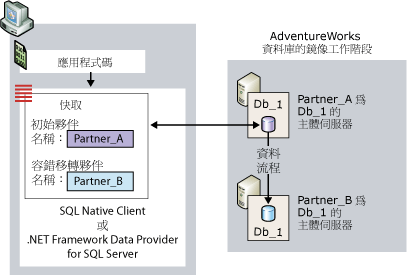
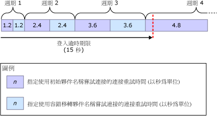
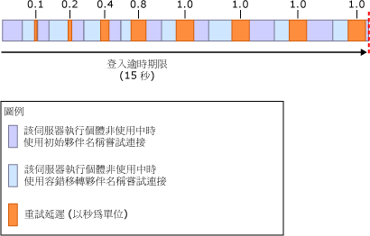

# <a name="connect-clients-to-a-database-mirroring-session-sql-server"></a>將用戶端連接至資料庫鏡像工作階段 (SQL Server)
[!INCLUDE[appliesto-ss-xxxx-xxxx-xxx-md](../../includes/appliesto-ss-xxxx-xxxx-xxx-md.md)]
  若要連接至資料庫鏡像工作階段，用戶端可以使用 [!INCLUDE[ssNoVersion](../../includes/ssnoversion-md.md)] Native Client 或 .NET Framework Data Provider for [!INCLUDE[ssNoVersion](../../includes/ssnoversion-md.md)]。 針對 [!INCLUDE[ssCurrent](../../includes/sscurrent-md.md)] 資料庫設定之後，這兩個資料存取提供者就會完全支援資料庫鏡像。 如需使用鏡像資料庫之程式設計考量的詳細資訊，請參閱＜ [Using Database Mirroring](../../relational-databases/native-client/features/using-database-mirroring.md)＞。 此外，目前的主體伺服器執行個體必須可以使用，而且必須在此伺服器執行個體上建立用戶端的登入。 如需詳細資訊，請參閱[孤立的使用者疑難排解 &#40;SQL Server&#41;](../../sql-server/failover-clusters/troubleshoot-orphaned-users-sql-server.md)。 資料庫鏡像工作階段的用戶端連接不會涉及見證伺服器執行個體 (如果此執行個體存在的話)。  
  
  
##  <a name="InitialConnection"></a> 建立資料庫鏡像工作階段的初始連接  
 為了建立鏡像資料庫的初始連接，用戶端必須提供連接字串，以便至少提供伺服器執行個體的名稱。 這個必要的伺服器名稱應該可識別目前的主體伺服器執行個體，而此名稱就稱為 *「初始夥伴名稱」* 。  
  
 此外，如果在第一次連接嘗試期間初始夥伴無法使用，連接字串也可以提供另一個伺服器執行個體的名稱 (應該可識別目前的鏡像伺服器執行個體) 以便使用。 第二個名稱就稱為 *「容錯移轉夥伴名稱」* 。  
  
 連接字串還必須提供資料庫名稱。 這是讓資料存取提供者進行容錯移轉嘗試必要的名稱。  
  
 接收到連接字串時，資料存取提供者就會將初始夥伴名稱和容錯移轉夥伴名稱 (如果有提供的話) 儲存在用戶端的動態記憶體快取中 (若為 Managed 程式碼，此快取的範圍是應用程式定義域)。 快取之後，資料存取提供者就不會再更新該初始夥伴名稱。 當用戶端提供容錯移轉夥伴名稱時，資料存取提供者也會暫時儲存此容錯移轉夥伴名稱，以便在提供者無法使用初始夥伴名稱連接時使用。  
  
 資料庫鏡像工作階段無法防止用戶端特有的伺服器存取問題發生，例如用戶端電腦無法與網路進行通訊。 鏡像資料庫的連接嘗試可能也會由於各種與資料存取提供者不相關的原因而失敗。例如，連接嘗試可能會因為主體伺服器執行個體非使用中 (當資料庫正在容錯移轉時發生) 或網路錯誤而失敗。  
  
 嘗試連接時，資料存取提供者會使用初始夥伴名稱開始。 如果指定的伺服器執行個體可以使用，而且它是目前的主體伺服器執行個體，則連接嘗試通常會成功。  
  
> [!NOTE]  
>  如果鏡像工作階段已暫停，用戶端通常會連接至主體伺服器並下載夥伴名稱。 不過，在繼續進行鏡像以前，用戶端無法使用資料庫。  
  
 如果該嘗試沒有用，資料存取提供者就會嘗試容錯移轉夥伴名稱 (如果可用的話)。 如果任何一個夥伴名稱可正確識別目前的主體伺服器，資料存取提供者通常就可以順利開啟初始連接。 完成此連接後，資料存取提供者會下載目前鏡像伺服器的伺服器執行個體名稱。 這個名稱會當做容錯移轉夥伴名稱儲存在快取中，並覆寫用戶端提供的容錯移轉夥伴名稱 (如果有的話)。 之後，.NET Framework Data Provider for [!INCLUDE[ssNoVersion](../../includes/ssnoversion-md.md)] 就不會更新容錯移轉夥伴名稱。 相較之下，每當後續連接或連接重設傳回不同的夥伴名稱時， [!INCLUDE[ssNoVersion](../../includes/ssnoversion-md.md)] Native Client 就會更新快取。  
  
 下圖說明用戶端連接到名為 **Db_1**之鏡像資料庫的初始夥伴 **Partner_A**。 此圖將顯示用戶端提供的初始夥伴名稱可正確識別目前主體伺服器 **Partner_A**。 初始連線嘗試成功，而且資料存取提供者將鏡像伺服器的名稱 (目前是 **Partner_B**) 當作容錯移轉夥伴名稱儲存在本機快取中。 最後，用戶端連接到 **Db_1** 資料庫的主體複本。  
  
   
  
 例如，初始連接嘗試可能會由於網路錯誤或非使用中的伺服器執行個體而失敗。 由於初始夥伴無法使用，資料存取提供者若嘗試連接到容錯移轉夥伴，則用戶端必須在連接字串中提供容錯移轉夥伴名稱。  
  
 在該情況下，如果容錯移轉夥伴名稱無法使用，原始的連接嘗試就會繼續進行，直到網路連接逾時或傳回錯誤為止 (只適用於非鏡像資料庫)。  
  
 如果連接字串中已提供容錯移轉夥伴名稱，資料存取提供者的行為就會根據用戶端的網路通訊協定和作業系統而定，如下所示：  
  
-   若為 TCP/IP，連接嘗試就會由資料庫鏡像專用的連接重試演算法進行管制。 「連線重試演算法」  會判斷指定連線嘗試中針對開啟連線所分配的最大時間 (「重試時間」  )。  
  
-   若為其他網路通訊協定  
  
     如果發生錯誤或初始夥伴無法使用，初始連接嘗試就會等候直到資料存取提供者的網路連接逾時期限到期，或者登入逾時期限到期為止。 一般而言，這項等候是按照 20 至 30 秒的順序進行。 之後，如果資料存取提供者尚未逾時，它就會嘗試連接至容錯移轉夥伴。 如果連接逾時期限在連接成功之前到期，或容錯移轉夥伴無法使用，連接嘗試就會失敗。 如果容錯移轉夥伴可在登入逾時期限內，而且它目前是主體伺服器，則連接嘗試通常會成功。  
  
  
### <a name="connection-strings-for-a-mirrored-database"></a>鏡像資料庫的連接字串  
 用戶端提供的連接字串，包含資料存取提供者用來連接資料庫的資訊。 本章節將討論使用 [!INCLUDE[ssNoVersion](../../includes/ssnoversion-md.md)] Native Client ODBC 驅動程式連接來連接至鏡像資料庫時，特別相關的關鍵字。  
  
#### <a name="network-attribute"></a>Network 屬性  
 連接字串應該包含 **Network** 屬性，以便指定網路通訊協定。 這項屬性可確保在連接至不同的夥伴時，會持續使用指定的網路通訊協定。 連接至鏡像資料庫的最佳通訊協定是 TCP/IP。 為了確保用戶端會針對夥伴的每個連接要求 TCP/IP，連接字串提供了下列屬性：  
  
```  
Network=dbmssocn;   
```  
  
> [!IMPORTANT]  
>  我們建議將 TCP/IP 保持在用戶端通訊協定清單的頂端。 不過，如果連接字串指定了 **Network** 屬性，這就會覆寫清單順序。  
  
 此外，為了確保用戶端會針對夥伴的每個連接要求具名管道，連接字串提供了下列屬性：  
  
```  
Network=dbnmpntw;   
```  
  
> [!IMPORTANT]  
>  由於具名管道不會使用 TCP/IP 重試演算法，所以在許多情況下，具名管道連接嘗試可能會在連接至鏡像資料庫之前逾時。  
  
#### <a name="server-attribute"></a>Server 屬性  
 連接字串必須包含 **Server** 屬性，以便提供初始夥伴名稱 (應該可識別目前的主體伺服器執行個體)。  
  
 識別伺服器執行個體最簡單的方式就是指定名稱： *<伺服器名稱>* [ **\\** <SQL Server 執行個體名稱>  ]。 例如：  
  
 `Server=Partner_A;`  
  
 或  
  
 `Server=Partner_A\Instance_2;`  
  
 不過，使用伺服器名稱時，用戶端必須執行 DNS 查閱來取得伺服器的 IP 位址，並執行 SQL Server Browser 查詢來取得夥伴所在之伺服器的通訊埠編號。 您可以透過在 **Server** 屬性中指定夥伴的 IP 位址和通訊埠編號 (而非指定伺服器名稱)，略過這些查閱和查詢。 這項建議是為了在連接至該夥伴時將外部延遲的可能性降至最低。  
  
> [!NOTE]  
>  如果連接字串指定了具名執行個體的名稱而非通訊埠，SQL Server Browser 查詢就是必要項目。  
  
 若要指定 IP 位址和連接埠，**Server** 屬性會採用下列格式：`Server=`<IP 位址>  `,`\<連接埠>  ，例如：  
  
```  
Server=123.34.45.56,4724;   
```  
  
> [!NOTE]  
>  此 IP 位址可以是 IP 第 4 版 (IPv4) 或 IP 第 6 版 (IPv6)。  
  
#### <a name="database-attribute"></a>Database 屬性  
 此外，連接字串必須指定 **Database** 屬性，以便提供鏡像資料庫的名稱。 如果用戶端嘗試連接的資料庫無法使用，就會產生例外狀況。  
  
 例如，為了明確連接到主體伺服器 Partner_A 的 **AdventureWorks** 資料庫，用戶端使用了下列連接字串：  
  
 `" Server=Partner_A; Database=AdventureWorks "`  
  
> [!NOTE]  
>  此字串省略了驗證資訊。  
  
> [!IMPORTANT]  
>  將通訊協定前置詞和 **Server** 屬性結合在一起 (`Server=tcp:`\<伺服器名稱>  ) 時，其與 **Network** 屬性不相容，而且在兩個位置指定通訊協定可能會導致錯誤發生。 因此，我們建議連接字串應該使用 **Network** 屬性來指定通訊協定，並且在 **Server** 屬性中僅指定伺服器名稱 (`"Network=dbmssocn; Server=`\<伺服器名稱>  `"`)。  
  
#### <a name="failover-partner-attribute"></a>Failover Partner 屬性  
 除了初始夥伴名稱以外，用戶端也可以指定容錯移轉夥伴名稱 (應該可識別目前的鏡像伺服器執行個體)。 容錯移轉夥伴是由 Failover Partner 屬性的其中一個關鍵字指定的。 這個屬性的關鍵字會因您所使用的 API 而不同。 下表將列出這些關鍵字：  
  
|API|Failover Partner 屬性的關鍵字|  
|---------|--------------------------------------------|  
|OLE DB 提供者|**FailoverPartner**|  
|ODBC 驅動程式|**Failover_Partner**|  
|ActiveX Data Objects (ADO)|**Failover Partner**|  
  
 識別伺服器執行個體最簡單的方式就是指定其系統名稱：<伺服器名稱>  [ **\\** <SQL Server 執行個體名稱>  ]。  
  
 此外，您可以在 **Failover Partner** 屬性中提供 IP 位址和通訊埠編號。 如果第一次連接至資料庫時，初始連接嘗試失敗，連接至容錯移轉夥伴的嘗試將不再仰賴 DNS 和 SQL Server Browser。 建立連接後，就會以容錯移轉夥伴名稱覆寫容錯移轉夥伴名稱，因此當容錯移轉發生時，重新導向的連接就會需要 DNS 和 SQL Server Browser。  
  
> [!NOTE]  
>  只有提供初始夥伴名稱時，除了重新連接的相關動作或程式碼以外，應用程式開發人員不需要採取任何動作或寫入任何程式碼。  
  
> [!NOTE]  
>  Managed 程式碼應用程式開發人員要在 **ConnectionString** 物件的 **SqlConnection** 中提供容錯移轉夥伴名稱。 如需使用此連接字串的詳細資訊，請參閱 ADO.NET 文件中的＜.NET Framework Data Provider 對於 SQL Server 的資料庫鏡像支援＞，其是 [!INCLUDE[msCoName](../../includes/msconame-md.md)] .NET Framework SDK 的一部份。  
  
#### <a name="example-connection-string"></a>連接字串範例  
 例如，為了使用 TCP/IP 明確連接到 Partner_A 或 Partner_B 的 **AdventureWorks** 資料庫，使用 ODBC 驅動程式的用戶端應用程式可能會提供下列連接字串：  
  
```  
"Server=Partner_A; Failover_Partner=Partner_B; Database=AdventureWorks; Network=dbmssocn"  
```  
  
 或者，用戶端可能會使用 IP 位址和通訊埠編號來識別初始夥伴 Partner_A。例如，如果 IP 位址是 250.65.43.21 而通訊埠編號是 4734，連接字串就會是：  
  
```  
"Server=250.65.43.21,4734; Failover_Partner=Partner_B; Database=AdventureWorks; Network=dbmssocn"  
```  
  
##  <a name="RetryAlgorithm"></a> 連接重試演算法 (TCP/IP 連接)  
 就 TCP/IP 連接而言，當兩個夥伴名稱都位於快取中時，資料存取提供者就會遵守連接重試演算法。 這在建立工作階段的初始連接以及失去已建立連接之後重新連接的情況都適用。 一旦開啟連接後，完成預先登入和登入步驟就會需要額外時間。  
  
> [!NOTE]  
>  開啟連接所用的時間可能會由於外部因素而超過重試時間，這些因素包括 DNS 查閱速度很慢、網域控制站/Kerberos 金鑰發佈中心 (KDC) 速度很慢、連絡 SQL Server Browser 所用的時間以及網路壅塞等。 這些外部因素可能會讓用戶端無法連接至鏡像資料庫。 此外，外部因素也會導致開啟連接所用的時間比分配的重試時間要長。 如需有關針對初始夥伴的連接嘗試略過 DNS 和 SQL Server Browser 的詳細資訊，請參閱本主題稍早的 [建立資料庫鏡像工作階段的初始連接](#InitialConnection)。  
  
 如果連接嘗試失敗或在成功之前重試時間過期，資料存取提供者就會嘗試其他夥伴。 如果在此時間點以前未開啟連接，提供者就會輪流嘗試初始和容錯移轉夥伴名稱，直到開啟連接或登入期限逾時為止。預設登入逾時期限是 15 秒。 我們建議登入逾時期限至少應該設定為 5 秒。 指定更小的逾時期限可能會讓所有連接嘗試無法成功。  
  
 重試時間是登入期限的百分比。 連接嘗試的重試時間在每個後續的重試回合都會更長。 在第一個重試回合中，兩次嘗試的重試時間都是總登入期限的百分之 8。 在每個後續的重試回合中，重試演算法會以相同的時間量，增加最大重試時間。 因此，前八個連接嘗試的重試時間如下：  
  
 8%, 8%, 16%, 16%, 24%, 24%, 32%, 32%  
  
 重試時間是使用下列公式計算的：  
  
 _RetryTime_ **=** _PreviousRetryTime_ **+(** 0.08 **&#42;** _LoginTimeout_ **)**  
  
 其中 *PreviousRetryTime* 最初是 0。  
  
 例如，如果使用預設登入逾時期限 15 秒，*LoginTimeout* *= 15*。 在此情況下，前三個重試回合中分配的重試時間如下：  
  
|Round|*RetryTime* 計算|每次嘗試的重試時間|  
|-----------|-----------------------------|----------------------------|  
|1|0 **+(** 0.08 **&#42;** 15 **)**|1.2 秒|  
|2|1.2 **+(** 0.08 **&#42;** 15 **)**|2.4 秒|  
|3|2.4 **+(** 0.08 **&#42;** 15 **)**|3.6 秒|  
|4|3.6 **+(** 0.08 **&#42;** 15 **)**|4.8 秒|  
  
 下圖將說明後續連接嘗試的這些重試時間，而且每次嘗試都逾時。  
  
   
  
 就預設的登入逾時期限而言，分配給連接嘗試之前三個重試回合的最大時間是 14.4 秒。 如果每次嘗試都使用所有分配的時間，在登入期限逾時之前，只會剩餘 0.6 秒的時間。在該情況下，第四個重試回合會縮短，僅允許使用初始夥伴名稱來進行最後一次快速連接嘗試。 不過，在少於分配之重試時間的情況下，連接嘗試可能會失敗，尤其是後面的重試回合。 例如，收到網路錯誤可能會導致嘗試在重試時間過期之前結束。 如果之前的嘗試由於網路錯誤而失敗，就會有額外的時間可供第四個重試回合使用，甚至供其他重試回合使用。  
  
 另一個導致嘗試失敗的原因是非使用中的伺服器執行個體，而這會在伺服器執行個體正在進行資料庫的容錯移轉時發生。 在此情況下，會加上重試延遲，以防止用戶端進行快速且連續的連接嘗試而導致夥伴超過負載。  
  
> [!NOTE]  
>  當兩個夥伴名稱都可以使用時，如果登入逾時期限是無限的，用戶端就會無限期地嘗試重新連接至伺服器 (在初始夥伴名稱和容錯移轉夥伴名稱之間輪流)。  
  
  
### <a name="retry-delays-during-failover"></a>在容錯移轉期間的重試延遲  
 如果用戶端嘗試連接至正在容錯移轉的夥伴，此夥伴就會立即回應，表示它目前非使用中。 在此情況下，每個連接嘗試的重試回合都會比分配的重試時間要短。 這表示連接嘗試的許多重試回合可以在登入期限逾時之前進行。為了避免在容錯移轉期間因快速且連續的連接嘗試而導致夥伴超過負載，資料存取提供者會在每個重試循環後面加入一個短暫的重試延遲。 指定重試延遲的長度是由重試延遲演算法決定的。 在第一個重試回合之後，延遲是 100 毫秒。 在後面三個回合之後，重試延遲便加倍至 200、400 和 800。 在所有後續的重試回合中，重試延遲是 1 秒，直到連接嘗試成功或逾時為止。  
  
> [!NOTE]  
>  如果伺服器執行個體停止，連接要求就會立即失敗。  
  
 下圖將說明在手動容錯移轉時，重試延遲如何影響連接嘗試，其中夥伴會切換角色。 登入逾時期限是 15 秒。  
  
   
  
##  <a name="Reconnecting"></a> 重新連接至資料庫鏡像工作階段  
 如果資料庫鏡像工作階段的已建立連接由於任何原因而失敗 (例如，由於資料庫鏡像容錯移轉)，而且應用程式嘗試重新連接至初始伺服器時，資料存取提供者就可以使用儲存在用戶端快取中的容錯移轉夥伴名稱，嘗試重新連接。 不過，重新連接不會自動進行。 應用程式必須注意這項錯誤。 然後，應用程式必須關閉失敗的連接，並使用相同的連接字串屬性來開啟新連接。 此時，資料存取提供者會將連接重新導向至容錯移轉夥伴。 如果以這個名稱識別的伺服器執行個體目前是主體伺服器，連接嘗試通常會成功。 如果交易已認可或已回復並不明確，應用程式必須檢查交易的狀態，方法就與重新連接至獨立的伺服器執行個體一樣。  
  
 重新連接很類似連接字串提供容錯移轉夥伴名稱的初始連接。 如果第一個連接嘗試失敗，連接嘗試就會在初始夥伴名稱和容錯移轉夥伴名稱之間輪流，直到用戶端連接至主體伺服器或者資料存取提供者逾時為止。  
  
> [!NOTE]  
>  [!INCLUDE[ssNoVersion](../../includes/ssnoversion-md.md)] Native Client 會驗證是否連接至主體伺服器執行個體，但不會驗證此執行個體是否為連接字串之初始夥伴名稱中指定的伺服器執行個體夥伴。  
  
 如果連接使用 TCP/IP，連接重試演算法就會決定每個重試回合中分配給連接嘗試的時間量。  
  
> [!IMPORTANT]  
>  如果用戶端與資料庫中斷連接，資料存取提供者就不會嘗試重新連接。 用戶端必須發出新的連接要求。 此外，如果應用程式在失去連接時關閉，它將失去快取的夥伴名稱。 如果因為主體伺服器無法使用而失去連接，則應用程式可以重新連接到鏡像伺服器的唯一方式，就是在其連接字串中提供容錯移轉夥伴名稱。  
  
  
### <a name="impact-of-redirection-on-a-client-application"></a>重新導向對用戶端應用程式的影響  
 在容錯移轉之後，資料存取提供者會將連接重新導向至目前的主體伺服器執行個體。 不過，重新導向對用戶端而言是透明的。 對於用戶端而言，重新導向的連接會呈現為初始夥伴名稱所識別之伺服器執行個體的連接。 當初始夥伴目前是鏡像伺服器時，用戶端似乎可以連接至鏡像伺服器並更新鏡像資料庫。 不過，用戶端實際上已經重新導向至容錯移轉夥伴 (目前的主體資料庫)，而且用戶端正在更新的是新主體資料庫。  
  
 重新導向至容錯移轉夥伴後，使用 [!INCLUDE[tsql](../../includes/tsql-md.md)] USE 陳述式來使用不同的資料庫時，用戶端可能會遇到非預期的結果。 如果目前的主體伺服器執行個體 (容錯移轉夥伴) 與原始的主體伺服器 (初始夥伴) 具有不同的資料庫集，就可能會發生這種情況。  
  
##  <a name="Benefits"></a>   
  
##  <a name="StalePartnerName"></a> 過時容錯移轉夥伴名稱的影響  
 資料庫管理員可隨時變更容錯移轉夥伴。 因此，用戶端提供的容錯移轉夥伴名稱可能會過期或「過時」  。 例如，考慮由另一個伺服器執行個體 Partner_C 取代的容錯移轉夥伴 Partner_B。 若用戶端接著提供 Partner_B 做為容錯移轉夥伴名稱，該名稱就會過時。 當用戶端提供過時的容錯移轉夥伴名稱時，資料存取提供者的行為跟用戶端未提供容錯移轉夥伴名稱時一樣。  
  
 例如，假設用戶端使用同一個連接字串連續進行四次連接嘗試。 在連接字串中，初始夥伴名稱是 Partner_A，而容錯移轉夥伴名稱是 Partner_B：  
  
```  
"Server=Partner_A; Failover Partner=Partner_B; Database=AdventureWorks"  
```  
  
 下表顯示四個夥伴組態，並指出對於每一個組態來說，此連接字串第一次是否可連接用戶端。  
  
> [!NOTE]  
>  應用程式可以追蹤組態變更，並據以變更其連接字串。 雖然這會需要額外程式碼，不過可減輕管理負擔。  
  
|組態|主體伺服器|鏡像伺服器|嘗試指定 Partner_A 和 Partner_B 來連接的行為|  
|-------------------|----------------------|-------------------|------------------------------------------------------------------------------|  
|原始的鏡像組態。|Db_1|Partner_B|已快取 Partner_A 作為初始夥伴名稱。 用戶端成功連接到 Partner_A。 用戶端下載鏡像伺服器名稱 Partner_B 並放入快取中，略過用戶端提供的容錯移轉夥伴名稱。|  
|Partner_A 遇到硬體失敗，而且發生容錯移轉 (中斷用戶端連接)。|Partner_B|無|仍然將 Partner_A 快取為初始夥伴名稱，但用戶端提供的容錯移轉夥伴名稱 Partner_B，允許用戶端連接到目前的主體伺服器。|  
|資料庫管理員停止鏡像功能 (中斷用戶端連接)，以 Partner_C 取代 Partner_A 後，重新啟動鏡像功能。|Partner_B|Partner_C|用戶端嘗試連接到 Partner_A 但失敗；接著用戶端嘗試連接 Partner_B (目前的主體伺服器)，結果成功。 資料存取提供者下載目前的鏡像伺服器名稱 Partner_C，並快取為目前的容錯移轉夥伴名稱。|  
|手動將服務容錯移轉至 Partner_C (中斷用戶端連接)。|Partner_C|Partner_B|用戶端一開始嘗試連接到 Partner_A，然後嘗試連接到 Partner_B。 兩個名稱都會失敗，最後連接要求會逾時並失敗。|  
  
  
## <a name="see-also"></a>另請參閱  
 [資料庫鏡像 &#40;SQL Server&#41;](../../database-engine/database-mirroring/database-mirroring-sql-server.md)   
 [資料庫鏡像期間可能發生的失敗](../../database-engine/database-mirroring/possible-failures-during-database-mirroring.md)  
  
  
