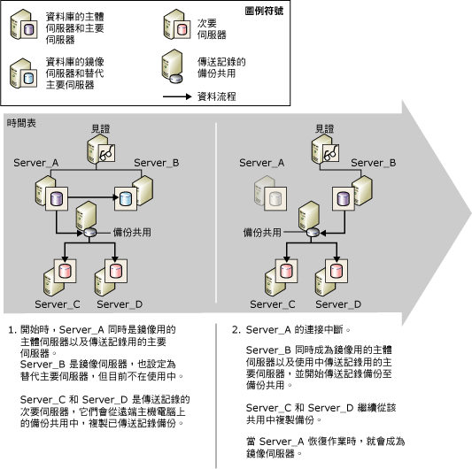

# 資料庫鏡像和記錄傳送 (SQL Server)
[!INCLUDE[appliesto-ss-xxxx-xxxx-xxx-md](../../includes/appliesto-ss-xxxx-xxxx-xxx-md.md)]
  給定的資料庫可以進行鏡像或記錄傳送；它也可以同時進行鏡像和記錄傳送。 選擇使用的方式時，請考慮下列事項：  
  
-   您需要多少個目的地伺服器？  
  
     若您只需要一個目的地資料庫，則建議您採用資料庫鏡像作為方案。  
  
     若您需要多個目的地資料庫，則必須使用記錄傳送，並視情況單獨或搭配資料庫鏡像使用。 結合這些方式，可讓您享有資料庫鏡像功能以及記錄傳送所提供的多重目的地支援。  
  
-   若必須延遲在目的地資料庫上還原記錄檔 (通常是為了防止邏輯錯誤)，請使用記錄傳送，並視情況搭配資料庫鏡像。  
  
 此主題將討論結合記錄傳送與資料庫鏡像時，應注意的事項。  
  
> [!NOTE]  
>  如需這些技術的簡介，請參閱[資料庫鏡像 &#40;SQL Server&#41;](../../database-engine/database-mirroring/database-mirroring-sql-server.md) 和[關於記錄傳送 &#40;SQL Server&#41;](../../database-engine/log-shipping/about-log-shipping-sql-server.md)。  
  
## 結合記錄傳送與資料庫鏡像  
 鏡像工作階段中的主體資料庫，也可作為記錄傳送組態中的主要資料庫，反之亦然，只要記錄傳送備份共用仍完整即可。 資料庫鏡像工作階段可在任何作業模式中執行，無論是同步 (交易安全性設為 FULL) 或非同步 (交易安全性設為 OFF)。  
  
> [!NOTE]  
>  若要在資料庫上使用資料庫鏡像，一定需要完整復原模式。  
  
 一般而言，在結合記錄傳送與資料庫鏡像時，會先建立鏡像工作階段然後再傳送記錄，不過這個步驟並非必要。 接著，會將目前的主體資料庫設定為記錄傳送主要資料庫 (「主體/主要資料庫」)，搭配一或多個遠端次要資料庫。 此外，鏡像資料庫必須設定為記錄傳送主要資料庫 (「鏡像/主要資料庫」)。 記錄傳送次要資料庫應與「主體/主要伺服器」或「鏡像/主要伺服器」位於不同的伺服器執行個體上。  
  
> [!NOTE]  
>  與記錄傳送有關的各伺服器，其大小寫設定必須相符。  
  
 在記錄傳送工作階段中，主要資料庫上的備份作業會在備份資料夾中建立記錄備份， 而次要伺服器的複製作業會從此處複製備份。 若要順利執行備份作業與複製作業，這些作業必須具備記錄傳送備份資料夾的存取權。 為了盡可能提高主要伺服器的可用性，建議您將備份資料夾建立在個別主機電腦的共用備份位置上。 請確定所有記錄傳送伺服器 (包括鏡像/主要伺服器) 都能存取共用備份位置 (稱為「備份共用」)。  
  
 若在資料庫鏡像容錯移轉後要讓記錄傳送還能繼續執行，您必須同時將鏡像伺服器設為主要伺服器，而所使用的組態必須與主體資料庫上主要伺服器所使用的相同。 鏡像資料庫會處於還原狀態，以防止備份作業備份鏡像資料庫上的記錄檔。 如此可確定鏡像/主要資料庫不會對主體/主要資料庫有所影響 (而後者的記錄備份目前正由次要伺服器進行複製中)。 為防止假警示，當備份作業在鏡像/主要資料庫上執行後，備份作業會將一則訊息記錄到**log_shipping_monitor_history_detail** 資料表中，然後代理程式作業會傳回成功狀態。  
  
 鏡像/主要資料庫在記錄傳送工作階段中是處於非使用中狀態， 然而，若發生鏡像容錯移轉，先前的鏡像資料庫就會連線成為主體資料庫。 此時，該資料庫也會變成使用中的記錄傳送主要資料庫， 而先前無法將記錄傳送至該資料庫的記錄傳送備份作業，則會開始傳送記錄。 相反地，容錯移轉會使先前的主體/主要資料庫成為新的鏡像/主要資料庫，並進入還原狀態，而該資料庫上的備份作業也會停止備份記錄。  
  
> [!NOTE]  
>  若是發生自動容錯移轉，則當先前的主體/主要資料庫重新加入鏡像工作階段時，它會切換為鏡像角色。  
  
 若要在具有自動容錯移轉的高安全性模式下執行，就應該使用稱為「見證」的其他伺服器執行個體來設定鏡像工作階段。 如果在資料庫同步處理後，主體資料庫因故失效，而鏡像伺服器與見證之間仍可彼此通訊，就會產生自動容錯移轉。 自動容錯移轉會使鏡像伺服器擔任主體角色，並使其資料庫連線成為主體資料庫。 若新的主體/主要伺服器可以存取記錄傳送備份位置，伺服器的備份作業就會開始傳送記錄備份至該位置上。 資料庫鏡像同步模式可確保記錄鏈結不會受到鏡像容錯移轉的影響，並確保只有有效記錄才會還原。 次要伺服器會繼續複製記錄備份，而不知道已由另一個伺服器執行個體變成主要伺服器。  
  
 在此狀況中，使用本機記錄傳送監視器時，沒有特別需要注意的因應事項。 如需在此狀況中使用遠端監視執行個體的相關資訊，請參閱本主題稍後的「資料庫鏡像對遠端監視執行個體的影響」。  
  
## 從主體資料庫容錯移轉至鏡像資料庫  
 下圖將說明當鏡像在具有自動容錯移轉的高安全性模式下執行時，記錄傳送與資料庫鏡像將如何搭配運作。 起初， **Server_A** 既是鏡像的主體伺服器，也是記錄傳送的主要伺服器。 **Server_B** 是鏡像伺服器，同時也設定為主要伺服器，目前處於非使用中狀態。 **Server_C** 與 **Server_D** 是記錄傳送的次要伺服器。 為盡可能提高記錄傳送工作階段的可用性，備份位置位於個別主機電腦的共用目錄上。  
  
   
  
 在鏡像容錯移轉後，次要伺服器上所定義的主要伺服器名稱不會變更。 執行個體時提供 SQL Server 登入。  
  
## 資料庫鏡像對遠端監視執行個體的影響  
 當記錄傳送與遠端監視執行個體搭配使用時，若將記錄傳送工作階段與資料庫鏡像結合，將會影響到監視器資料表中的資訊。 主要監視器的相關資訊，來自於主體/主要監視器以及每部次要監視器所設定之監視器的資訊組合。  
  
 為盡可能維持監視的緊密性，當您使用遠端監視器時，建議您在設定次要監視器上的主要監視器時，指定原始主要監視器的名稱。 這種方式也有助於變更 Microsoft [!INCLUDE[ssNoVersion](../../includes/ssnoversion-md.md)] Agent 的記錄傳送組態。 如需監視的詳細資訊，請參閱[監視記錄傳送 &#40;Transact-SQL&#41;](../../database-engine/log-shipping/monitor-log-shipping-transact-sql.md)。  
  
## 同時設定鏡像和記錄傳送  
 若要同時設定資料庫鏡像和記錄傳送，必須進行下列步驟：  
  
1.  使用 NORECOVERY，將主體/主要資料庫的備份還原到另一個伺服器執行個體上，以便稍後作為主體/主要資料庫用來進行資料庫鏡像的鏡像資料庫。 如需詳細資訊，請參閱[準備鏡像資料庫以進行鏡像 &#40;SQL Server&#41;](../../database-engine/database-mirroring/prepare-a-mirror-database-for-mirroring-sql-server.md)。  
  
2.  設定資料庫鏡像。 如需詳細資訊，請參閱[使用 Windows 驗證建立資料庫鏡像工作階段 &#40;SQL Server Management Studio&#41;](../../database-engine/database-mirroring/establish-database-mirroring-session-windows-authentication.md) 或[設定資料庫鏡像 &#40;SQL Server&#41;](../../database-engine/database-mirroring/setting-up-database-mirroring-sql-server.md)。  
  
3.  將主體/主要資料庫的備份還原到其他伺服器執行個體，以便稍後作為主要資料庫的記錄傳送次要資料庫。  
  
4.  針對一或多個次要資料庫，將主體資料庫上的記錄傳送設成與主要資料庫的相同。  
  
     您應設定單一共用作為備份目錄 (備份共用)。 如此可確保在主體與鏡像伺服器之間的角色切換後，備份作業仍會繼續寫入和以前相同的目錄中。 最好的作法是，確定此共用所在的實體伺服器，不同於主控鏡像及記錄傳送的相關資料庫之伺服器。  
  
     如需詳細資訊，請參閱[設定記錄傳送 &#40;SQL Server&#41;](../../database-engine/log-shipping/configure-log-shipping-sql-server.md)。  
  
5.  從主體資料庫手動容錯移轉至鏡像資料庫。  
  
     若要執行手動容錯移轉：  
  
    -   [手動容錯移轉資料庫鏡像工作階段 &#40;SQL Server Management Studio&#41;](../../database-engine/database-mirroring/manually-fail-over-a-database-mirroring-session-sql-server-management-studio.md)  
  
    -   [手動容錯移轉資料庫鏡像工作階段 &#40;Transact-SQL&#41;](../../database-engine/database-mirroring/manually-fail-over-a-database-mirroring-session-transact-sql.md)  
  
6.  在當做主要資料庫的新主體資料庫 (之前為鏡像資料庫) 上設定記錄傳送。  
  
    > [!IMPORTANT]  
    >  不要從次要資料庫執行任何設定。  
  
     您必須使用與步驟 4 中相同的備份共用。  
  
     [!INCLUDE[ssManStudioFull](../../includes/ssmanstudiofull-md.md)] 中的 [交易記錄傳送] 介面，在每個記錄傳送設定中只支援一個主要資料庫。 因此，您必須使用預存程序，將新的主體資料庫設定為主要資料庫。  
  
7.  執行另一個手動容錯移轉作業，在錯誤後回復至原始主體資料庫。  
  
  
