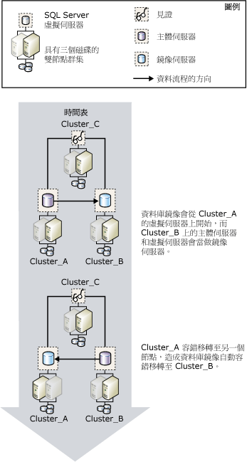

# 資料庫鏡像及 SQL Server 容錯移轉叢集執行個體
[!INCLUDE[appliesto-ss-xxxx-xxxx-xxx-md](../../includes/appliesto-ss-xxxx-xxxx-xxx-md.md)]
  容錯移轉叢集是 [!INCLUDE[msCoName](../../includes/msconame-md.md)] 叢集服務 (MSCS) 叢集群組 (即所謂的資源群組) 中一或多個實體磁碟的結合，它們是叢集的參與節點。 資源群組會設定為主控 [!INCLUDE[ssNoVersion](../../includes/ssnoversion-md.md)]執行個體的容錯移轉叢集執行個體。 [!INCLUDE[ssNoVersion](../../includes/ssnoversion-md.md)] 容錯移轉叢集執行個體會以單一電腦的型態出現在網路上，但是它具有在一個節點無法使用時，提供從一個節點容錯移轉到另一個節點的功能。 如需詳細資訊，請參閱 [AlwaysOn 容錯移轉叢集執行個體 &#40;SQL Server&#41;](../../sql-server/failover-clusters/windows/always-on-failover-cluster-instances-sql-server.md)。  
  
 與可為單一資料庫提供高可用性支援的資料庫鏡像相比，容錯移轉叢集提供整個[!INCLUDE[msCoName](../../includes/msconame-md.md)][!INCLUDE[ssNoVersion](../../includes/ssnoversion-md.md)]執行個體的高可用性支援。 資料庫鏡像可在容錯移轉叢集之間運作，也可以在容錯移轉叢集與非叢集主機之間運作。  
  
> [!NOTE]  
>  如需資料庫鏡像的簡介，請參閱 [資料庫鏡像 &#40;SQL Server&#41;](../../database-engine/database-mirroring/database-mirroring-sql-server.md)執行個體的容錯移轉叢集執行個體。  
  
## 鏡像與叢集  
 一般而言，將鏡像與叢集搭配使用時，主體伺服器和鏡像伺服器都是位在叢集上，其中主體伺服器是在某個叢集的容錯移轉叢集執行個體上執行，而鏡像伺服器則是在其他叢集的容錯移轉叢集執行個體上執行。 您可以建立一個鏡像工作階段，其中有一個夥伴位在叢集的容錯移轉叢集執行個體，而另一個夥伴則位在不同的非叢集電腦。  
  
 如果叢集容錯移轉使得主體伺服器暫時無法使用，用戶端與資料庫的連接將會中斷。 完成叢集容錯移轉之後，視 [作業模式](../../database-engine/database-mirroring/database-mirroring-operating-modes.md)而定，用戶端可以重新連接到相同叢集或不同叢集上的主體伺服器或非叢集電腦。 因此，在決定如何於叢集環境中設定資料庫鏡像時，用於鏡像的作業模式十分重要。  
  
### 具有自動容錯移轉的高安全性模式工作階段  
 如果您想要在具有自動容錯移轉的高安全性模式下建立資料庫鏡像，則建議夥伴使用兩個叢集的組態。 這種組態可提供最大的可用性。 見證可以位在第三個叢集或非叢集電腦上。  
  
 如果目前執行主體伺服器的節點失敗，資料庫的自動容錯移轉將在幾秒內開始，這段時間叢集仍會容錯移轉到另一個節點。 資料庫鏡像工作階段會容錯移轉至另一個叢集上的鏡像伺服器或非叢集電腦，而先前的鏡像伺服器會變成主體伺服器。 新的主體伺服器會儘快向前復原其資料庫副本，並使該副本上線作為主體資料庫。 叢集容錯移轉完成 (這個動作通常需要數分鐘) 之後，先前作為主體伺服器的容錯移轉叢集執行個體將變成鏡像伺服器。  
  
 下圖說明在含有見證 (支援自動容錯移轉) 之高安全性模式下執行的鏡像工作階段中，叢集之間的自動容錯移轉。  
  
   
  
 鏡像工作階段中的三個伺服器執行個體位於三個不同的叢集： **Cluster_A**、 **Cluster_B**，以及 **Cluster_C**。 在每一個叢集上， [!INCLUDE[ssNoVersion](../../includes/ssnoversion-md.md)] 的預設執行個體會以 [!INCLUDE[ssNoVersion](../../includes/ssnoversion-md.md)] 容錯移轉叢集執行個體的身分來執行。 鏡像工作階段啟動時， **Cluster_A** 上的容錯移轉叢集執行個體是主體伺服器、 **Cluster_B** 上的容錯移轉叢集執行個體是鏡像伺服器，而 **Cluster_C** 上的容錯移轉叢集執行個體則是鏡像工作階段中的見證。 最後， **Cluster_A** 上的使用中節點失敗，這造成主體伺服器無法使用。  
  
 在叢集有時間進行容錯移轉之前，鏡像伺服器透過見證的協助，而偵測到主體伺服器遺失。 鏡像伺服器會向前復原它的資料庫，並儘快將它與新的主體資料庫連線。 **Cluster_A** 完成容錯移轉時，先前的主體伺服器現在是鏡像伺服器，而且它會與目前在 **Cluster_B**上的主體資料庫同步處理其資料庫。  
  
### 不含自動容錯移轉的高安全性模式工作階段  
 如果您是在不含自動容錯移轉的高安全性模式下建立資料庫鏡像，則在執行目前主體伺服器的節點失敗時，叢集中的另一個節點就會成為主體伺服器。 請注意，在叢集無法使用的這段期間，資料庫也會無法使用。  
  
### 高效能模式工作階段  
 如果您想要以高效能模式建立資料庫鏡像，請考慮將主體伺服器放在叢集的容錯移轉叢集執行個體上，並將鏡像伺服器放在遠端位置的非叢集伺服器上。 如果叢集容錯移轉到不同節點，容錯移轉叢集執行個體將會繼續作為鏡像工作階段中的主體伺服器。 如果整個叢集都發生問題，則您可在鏡像伺服器上強制執行服務。  
  
 **若要設定新的 SQL Server 容錯移轉叢集**  
  
-   [建立新的 SQL Server 容錯移轉叢集 &#40;安裝程式&#41;](../../sql-server/failover-clusters/install/create-a-new-sql-server-failover-cluster-setup.md)  
  
 **若要設定資料庫鏡像**  
  
-   [設定資料庫鏡像 &#40;SQL Server&#41;](../../database-engine/database-mirroring/setting-up-database-mirroring-sql-server.md)  
  
-   [使用 Windows 驗證建立資料庫鏡像工作階段 &#40;SQL Server Management Studio&#41;](../../database-engine/database-mirroring/establish-database-mirroring-session-windows-authentication.md)  
  
## 另請參閱  
 [資料庫鏡像 &#40;SQL Server&#41;](../../database-engine/database-mirroring/database-mirroring-sql-server.md)   
 [資料庫鏡像作業模式](../../database-engine/database-mirroring/database-mirroring-operating-modes.md)   
 [AlwaysOn 容錯移轉叢集執行個體 &#40;SQL Server&#41;](../../sql-server/failover-clusters/windows/always-on-failover-cluster-instances-sql-server.md)  
  
  
