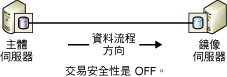
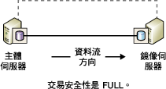
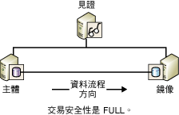

# <a name="database-mirroring-operating-modes"></a>資料庫鏡像作業模式
[!INCLUDE[appliesto-ss-xxxx-xxxx-xxx-md](../../includes/appliesto-ss-xxxx-xxxx-xxx-md.md)] 本主題描述資料庫鏡像工作階段的同步與非同步作業模式。  
  
> [!NOTE]  
>  如需資料庫鏡像的簡介，請參閱 [資料庫鏡像 &#40;SQL Server&#41;](../../database-engine/database-mirroring/database-mirroring-sql-server.md)。  
  
  
##  <a name="TermsAndDefinitions"></a> 詞彙和定義  
 本節介紹幾個詞彙，它們是本主題的核心。  
  
 高效能模式  
 資料庫鏡像工作階段會以非同步方式作業，而且僅使用主體伺服器和鏡像伺服器。 唯一的角色切換形式是強制的服務 (可能造成資料遺失)。  
  
 高安全性模式  
 資料庫鏡像工作階段會以同步方式作業，並選擇性地使用見證以及主體伺服器和鏡像伺服器。  
  
 交易安全性  
 鏡像特有的資料庫屬性，用來決定資料庫鏡像工作階段是以同步或非同步方式作業。 有兩個安全性層級：FULL 和 OFF。  
  
 Witness  
 只能搭配高安全性模式使用的一種 SQL Server 選擇性執行個體，可讓鏡像伺服器辨別是否要起始自動容錯移轉。 與兩個容錯移轉夥伴不同的是，見證並不是為資料庫服務。 支援自動容錯移轉是見證的唯一角色。  
  
## <a name="asynchronous-database-mirroring-high-performance-mode"></a>非同步資料庫鏡像 (高效能模式)  
 本節描述非同步資料庫鏡像如何運作、適合使用高效能模式的時機，以及主體伺服器失敗時如何回應。  
  
> [!NOTE]  
>  [!INCLUDE[ssCurrent](../../includes/sscurrent-md.md)] 的大部分版本僅支援同步資料庫鏡像 (「僅限 Safety Full」)。 如需哪些版本完全支援資料庫鏡像的資訊，請參閱 [SQL Server 2016 的版本和支援的功能](../../sql-server/editions-and-supported-features-for-sql-server-2016.md)中的＜高可用性 (AlwaysOn)＞。
  
 當交易安全性設為 OFF 時，資料庫鏡像工作階段就會以非同步的方式運作。 非同步作業只支援一種作業模式：高效能模式。 這種模式可提高效能，但代價是會降低高可用性。 高效能模式僅需使用主體伺服器與鏡像伺服器。 而鏡像伺服器方面的問題絕不會影響到主體伺服器。 如果主體伺服器失效，鏡像資料庫會標示為 DISCONNECTED，但仍可當做暖待命資料庫使用。  
  
 高效能模式僅支援一種角色切換形式：強制服務 (有遺失資料的可能)，此服務會使用鏡像伺服器做為暖待命伺服器。 強制服務是對主體伺服器失敗的其中一項可能回應。 由於資料有可能會遺失，因此在將服務強制切換到鏡像之前，您應先考慮其他替代方式。 如需詳細資訊，請參閱本主題稍後的 [回應主體的失敗](#WhenPrincipalFails)。  
  
 下圖顯示使用高效能模式之工作階段的組態。  
  
   
  
 在高效能模式中，當主體伺服器傳送交易記錄檔到鏡像伺服器時，主體伺服器會立即傳送確認給用戶端，而不需等候鏡像伺服器的收條。 交易認可，不需等候鏡像伺服器將記錄寫入磁碟中。 非同步作業可讓主體伺服器在執行時，可以將交易延遲降到最低。  
  
 鏡像伺服器會盡量跟上主體伺服器所傳送的記錄。 但鏡像資料庫的進度可能會落後於主體資料庫，不過資料庫之間的差距通常很小。 但是，若主體伺服器的工作負載很大，或鏡像伺服器的系統超載時，此差距就會變大。  
  
 **本節內容：**  
  
-   [高效能模式的適當使用時機](#WhenUseHighPerf)  
  
-   [見證對高效能模式的影響](#WitnessImpactOnHighPerf)  
  
-   [回應主體的失敗](#WhenPrincipalFails)  
  
###  <a name="WhenUseHighPerf"></a> 高效能模式的適當使用時機  
 在主體伺服器與鏡像伺服器的距離相隔很遠，以及您不希望有小失誤影響主體伺服器的災害復原狀況中，高效能模式會非常實用。  
  
> [!NOTE]  
>  記錄傳送可以是資料庫鏡像的補強方式，以及非同步資料庫鏡像的理想替代方式。 如需記錄傳送優點的資訊，請參閱[高可用性解決方案 &#40;SQL Server&#41;](../../sql-server/failover-clusters/high-availability-solutions-sql-server.md)。 如需一起使用記錄傳送與資料庫鏡像的資訊，請參閱[資料庫鏡像和記錄傳送 &#40;SQL Server&#41;](../../database-engine/database-mirroring/database-mirroring-and-log-shipping-sql-server.md)。  
  
###  <a name="WitnessImpactOnHighPerf"></a> 見證對高效能模式的影響  
 如果您使用 Transact-SQL 來設定高效能模式，每當 SAFETY 屬性設為 OFF 時，我們由衷建議您也將 WITNESS 屬性設為 OFF。 見證可與高效能模式並存，但見證沒有什麼好處，只會帶來風險。  
  
 其中一個夥伴效能降低，如果見證與工作階段中斷連接，資料庫會變成無法使用。 這是因為即使高效能模式不需要見證，但若設定了見證，則工作階段需要由兩個以上的伺服器執行個體所組成的仲裁。 如果工作階段失去仲裁，它就無法服務資料庫。  
  
 當見證設定於高效能模式工作階段時，強制仲裁意味著：  
  
-   如果失去鏡像伺服器，則主體伺服器必須連接到見證。 否則，主體伺服器會將其資料庫離線，直到見證或鏡像伺服器重新加入工作階段。  
  
-   若失去主體伺服器，則要強制將服務轉到鏡像伺服器，需要鏡像伺服器連接到見證。  
  
> [!NOTE]  
>  如需仲裁類型的資訊，請參閱[仲裁：見證如何影響資料庫可用性 &#40;資料庫鏡像&#41;](../../database-engine/database-mirroring/quorum-how-a-witness-affects-database-availability-database-mirroring.md)。  
  
###  <a name="WhenPrincipalFails"></a> 回應主體的失敗  
 當主體失敗時，資料庫擁有者有下列幾項選擇：  
  
-   在主體能夠再度使用之前，將資料庫保持在無法使用的狀態。  
  
     若主體資料庫與其交易記錄檔仍完整，則選擇此作法可保留所有已認可的交易，但會犧牲可用性。  
  
-   停止資料庫鏡像工作階段，改以手動更新資料庫，然後開始新的資料庫鏡像工作階段。  
  
     若主體資料庫已失效，但主體伺服器仍在執行中，請立即嘗試備份主體資料庫上的記錄結尾。 若順利完成結尾記錄備份，則移除鏡像可能會是最好的替代方式。 在移除鏡像後，您就可以將記錄還原到保存所有資料的先前鏡像資料庫中。  
  
    > [!NOTE]  
    >  若結尾記錄備份失敗，而且您無法等候主體伺服器復原，請考慮進行強制服務，其優點是可以保持工作階段狀態。  
  
-   在鏡像伺服器上強制服務 (可能會有資料遺失)。  
  
     強制服務主要是一種損毀復原方法，應該謹慎使用。 只有在主體伺服器已關機、工作階段非同步 (交易安全性設為 OFF) 以及工作階段沒有任何見證 (WITNESS 屬性設為 OFF) 或見證連接到鏡像伺服器 (亦即有仲裁) 時，才能執行強制服務。  
  
     若執行強制服務，會讓鏡像伺服器擔任主體的角色，並將其資料庫副本提供給用戶端使用。 在強制服務時，凡是尚未由主體傳送到鏡像伺服器的交易記錄檔，都會遺失。 因此，執行強制服務的時機，應限定在可以接受資料遺失所造成的損失以及必須立即可使用資料庫的情況下。 如需強制服務運作方式及其最佳做法的資訊，請參閱[資料庫鏡像工作階段期間的角色切換 &#40;SQL Server&#41;](../../database-engine/database-mirroring/role-switching-during-a-database-mirroring-session-sql-server.md)。  
  
##  <a name="Sync"></a> 同步資料庫鏡像 (高安全性模式)  
 本節描述同步資料庫鏡像如何運作，包括替代的高安全性模式 (含自動容錯移轉以及不含自動容錯移轉)，並包含有關自動容錯移轉中之見證角色的資訊。  
  
 如果交易安全性設為 FULL，在初始同步化階段之後，資料庫鏡像工作階段就會在高安全性模式下執行而且會以同步方式運作。 本節將詳細說明設定同步作業的資料庫鏡像工作階段。  
  
 若要達到工作階段的同步作業，鏡像伺服器必須將鏡像資料庫與主體資料庫進行同步處理。 工作階段開始時，主體伺服器就會開始將其使用中的記錄傳送至鏡像伺服器。 鏡像伺服器會儘快將所有內送記錄都寫入磁碟中。 一旦所有收到的記錄都寫入磁碟之後，資料庫便已完成同步處理。 只要夥伴保持通訊，資料庫就會持續同步處理。  
  
> [!NOTE]  
>  若要在資料庫鏡像工作階段中監視狀態變更，請使用 **資料庫鏡像狀態變更** 事件類別。 如需詳細資訊，請參閱 [Database Mirroring State Change Event Class](../../relational-databases/event-classes/database-mirroring-state-change-event-class.md)。  
  
 在同步處理完成之後，主體資料庫上認可的每項交易，也都會在鏡像伺服器上認可，以確保資料的安全。 達成同步處理的做法是：直到主體伺服器收到鏡像伺服器傳來的訊息，表示已將交易記錄儲存至磁碟後，才去認可主體資料庫上的交易。 請注意，等候此訊息會增加交易的延遲時間。  
  
 同步處理所需的時間，主要取決於：工作階段開始時，鏡像資料庫的進度落後主體資料庫多遠 (依據一開始從主體伺服器收到的記錄筆數來計算)；主體資料庫的工作負載；以及鏡像系統的速度。 同步處理工作階段之後，必須在鏡像資料庫上重做的強化記錄，仍會留在重做佇列中。  
  
 鏡像資料庫一旦完成同步處理，該資料庫兩個複本的狀態都會變成 SYNCHRONIZED。  
  
 維持同步作業的做法如下：  
  
1.  從用戶端收到交易時，主體伺服器會將交易的記錄寫入交易記錄。  
  
2.  主體伺服器會將交易寫入資料庫，同時也會傳送記錄至鏡像伺服器。 主體伺服器會等候鏡像伺服器發出收條，收到後才會向用戶端確認下列其中一項：交易認可或回復。  
  
3.  鏡像伺服器會將記錄儲存至磁碟，並回傳收條給主體伺服器。  
  
4.  主體伺服器收到鏡像伺服器的收條時，就會傳送確認訊息給用戶端。  
  
 高安全性模式會藉由要求兩地的資料同步化來保護資料。 所有經過認可的交易，都一定會寫入鏡像伺服器的磁碟上。  
  
 **本節內容：**  
  
-   [不具有自動容錯移轉的高安全性模式](#HighSafetyWithOutAutoFailover)  
  
-   [具有自動容錯移轉的高安全性模式](#HighSafetyWithAutoFailover)  
  
###  <a name="HighSafetyWithOutAutoFailover"></a> 不具有自動容錯移轉的高安全性模式  
 下圖將顯示不含自動容錯移轉之高安全性模式的組態。 這個組態僅包含兩個夥伴。  
  
   
  
 當夥伴已連接而且資料庫已經同步處理後，就會支援手動容錯移轉。 如果鏡像伺服器執行個體效能降低，主體伺服器執行個體不受影響，並且公開執行 (亦即沒有鏡像資料)。 如果遺失主體伺服器，就會暫停鏡像，不過可以將服務強制轉到鏡像伺服器 (可能會遺失資料)。 如需詳細資訊，請參閱 [資料庫鏡像工作階段期間的角色切換 &#40;SQL Server&#41;](../../database-engine/database-mirroring/role-switching-during-a-database-mirroring-session-sql-server.md)版本都可使用見證伺服器執行個體。  
  
###  <a name="HighSafetyWithAutoFailover"></a> 具有自動容錯移轉的高安全性模式  
 自動容錯移轉可確保某一台伺服器喪失之後，仍能繼續服務資料庫，藉以提供高度的可用性。 自動容錯移轉會要求工作階段包含第三個伺服器執行個體 ( *「見證」*)，而且此執行個體最好是位於第三部電腦上。 下圖將顯示支援自動容錯移轉之高安全性模式工作階段的組態。  
  
   
  
 與兩位夥伴不同的是，見證並不是為資料庫服務。 見證只是藉由確認主體伺服器是否已啟動而且可以正常運作，來支援自動容錯移轉。 只有當鏡像和見證與主體伺服器中斷連接後仍然保持相互連接時，鏡像伺服器才會開始進行自動容錯移轉。  
  
 當見證設定完成後，工作階段就會要求 *「仲裁」*(它是至少兩個伺服器執行個體之間的關聯性，以便讓資料庫可供使用)。 如需詳細資訊，請參閱[資料庫鏡像見證](../../database-engine/database-mirroring/database-mirroring-witness.md)和[仲裁：見證如何影響資料庫可用性 &#40;資料庫鏡像&#41;](../../database-engine/database-mirroring/quorum-how-a-witness-affects-database-availability-database-mirroring.md)。  
  
 自動容錯移轉必須符合下列條件：  
  
-   資料庫已同步處理。  
  
-   當所有三個伺服器執行個體都已連接，而且見證和鏡像伺服器維持連接狀態時，發生故障。  
  
 夥伴的遺失將具有下列結果：  
  
-   如果主體伺服器在上述條件下變得無法使用，就會進行自動容錯移轉。 鏡像伺服器會切換成主體的角色，並提供其資料庫來作為主體資料庫。  
  
-   如果主體伺服器在未達到這些條件時無法使用，強制服務 (可能發生資料遺失) 是可行的。 如需詳細資訊，請參閱[資料庫鏡像工作階段期間的角色切換 &#40;SQL Server&#41;](../../database-engine/database-mirroring/role-switching-during-a-database-mirroring-session-sql-server.md)。  
  
-   如果只有鏡像伺服器變得無法使用，主體及見證會繼續運作。  
  
 如果工作階段失去見證，仲裁就會需要這兩個夥伴。 如果任一個夥伴失去仲裁，這兩個夥伴都會失去仲裁，因此資料庫將變成無法使用，直到重新建立仲裁。 此仲裁需求可確保在沒有見證的情況下，資料庫絕不會 *「公開」*(亦即，在沒有鏡像的情況下) 執行。  
  
> [!NOTE]  
>  若要讓見證中斷連接維持一段較長的時間，我們建議您從工作階段中移除見證，直到它可用為止。  
  
##  <a name="TsqlSettingsAndOpModes"></a> Transact-SQL 設定和資料庫鏡像作業模式  
 本節描述與 ALTER DATABASE 設定和鏡像資料庫與見證狀態相關的資料庫鏡像工作階段 (如果有的話)。 本節適用於主要或專以 [!INCLUDE[tsql](../../includes/tsql-md.md)](而非 [!INCLUDE[ssManStudioFull](../../includes/ssmanstudiofull-md.md)]) 管理資料庫鏡像的使用者。  
  
> [!TIP]  
>  做為使用 [!INCLUDE[tsql](../../includes/tsql-md.md)]的替代方法，您可以使用 **[資料庫屬性]** 對話方塊的 **[鏡像]** 頁面，在物件總管中控制工作階段的作業模式。 如需詳細資訊，請參閱本主題稍後的 [使用 Windows 驗證建立資料庫鏡像工作階段 &#40;SQL Server Management Studio&#41;](../../database-engine/database-mirroring/establish-database-mirroring-session-windows-authentication.md)。  
  
 **本節內容：**  
  
-   [交易安全性和見證狀態影響作業模式的方式](#TxnSafetyAndWitness)  
  
-   [檢視安全性設定和見證狀態](#ViewWitness)  
  
-   [影響失去主體伺服器時之行為的因素](#FactorsOnLossOfPrincipal)  
  
###  <a name="TxnSafetyAndWitness"></a> 交易安全性和見證狀態影響作業模式的方式  
 工作階段的作業模式是由交易安全性設定和見證狀態的組合所決定。 資料庫擁有者可隨時變更交易安全性層級，且可加入或移除見證。  
  
 **本節內容：**  
  
-   [Transaction Safety](#TxnSafety)  
  
-   [見證狀態](#WitnessState)  
  
####  <a name="TxnSafety"></a> Transaction Safety  
 交易安全性是鏡像特有的資料庫屬性，用來決定資料庫鏡像工作階段是以同步或非同步方式作業。 有兩個安全性層級：FULL 和 OFF。  
  
-   SAFETY FULL  
  
     完整交易安全性會使工作階段在高效能模式中以同步方式運作。 如果見證存在的話，工作階段就會支援自動容錯移轉。  
  
     當您使用 ALTER DATABASE 陳述式建立工作階段時，工作階段一開始會將 SAFETY 屬性設定為 FULL；這表示工作階段會以高安全性模式開始。 在工作階段開始後，您就可以加入見證。  
  
     如需詳細資訊，請參閱本主題稍早的 [同步資料庫鏡像 (高安全性模式)](#Sync)。  
  
-   SAFETY OFF  
  
     關閉交易安全性會使工作階段在高效能模式中以非同步方式運作。 如果將 SAFETY 屬性設定為 OFF，則 WITNESS 屬性也應該設定為 OFF (預設值)。 如需見證在高效能模式中之影響的資訊，請參閱本主題稍後的 [見證的狀態](#WitnessState)。 如需關閉交易安全性執行的詳細資訊，請參閱本主題稍早的 [非同步資料庫鏡像 (高效能模式)](#asynchronous-database-mirroring-high-performance-mode)。  
  
 資料庫的交易安全性設定會記錄在每個夥伴之 **mirroring_safety_level** 和 **mirroring_safety_level_desc** 資料行的 **sys.database_mirroring** 目錄檢視中。 如需詳細資訊，請參閱 [sys.database_mirroring &#40;Transact-SQL&#41;](../../relational-databases/system-catalog-views/sys-database-mirroring-transact-sql.md)。  
  
 資料庫擁有者可以隨時變更交易安全性層級。  
  
####  <a name="WitnessState"></a> 見證的狀態  
 如果已設定見證，則需要仲裁，因此見證狀態永遠都很重要。  
  
 如果存在，則見證的狀態會是下列兩種狀態之一：  
  
-   見證連接到夥伴時，與該夥伴相關的見證會處於 CONNECTED 狀態，且具有該夥伴的仲裁。 在此情況下，即使其中一個夥伴無法使用，也可使用資料庫。  
  
-   見證存在但未連接到夥伴時，與該夥伴相關的見證會處於 UNKOWN 或 DISCONNECTED 狀態。 在此情況下，見證會缺少該夥伴的仲裁，而如果夥伴未彼此連接，資料庫會變成無法使用。  
  
 如需仲裁的資訊，請參閱[仲裁：見證如何影響資料庫可用性 &#40;資料庫鏡像&#41;](../../database-engine/database-mirroring/quorum-how-a-witness-affects-database-availability-database-mirroring.md)。  
  
 伺服器執行個體上每個見證的狀態，都會記錄在 **mirroring_witness_state** 和 **mirroring_witness_state_desc** 資料行的 **sys.database_mirroring** 目錄檢視中。 如需詳細資訊，請參閱 [sys.database_mirroring &#40;Transact-SQL&#41;](../../relational-databases/system-catalog-views/sys-database-mirroring-transact-sql.md)。  
  
 下表概述根據交易安全性設定和見證狀態而定的工作階段作業模式。  
  
|作業模式|交易安全性|見證狀態|  
|--------------------|------------------------|-------------------|  
|高效能模式|OFF|NULL (無見證)**|  
|不具有自動容錯移轉的高安全性模式|FULL|NULL (無見證)|  
|具有自動容錯移轉的高安全性模式*|FULL|CONNECTED|  
  
 *如果見證中斷連接，我們建議您設定 WITNESS OFF，直到見證伺服器執行個體可用為止。  
  
 **如果在高效能模式中有見證，該見證不會參與工作階段。 不過，若要讓資料庫可供使用，必須至少有兩個伺服器執行個體保持連接。 因此，建議您讓 WITNESS 屬性在高效能模式工作階段中保持設定為 OFF。 如需詳細資訊，請參閱[仲裁：見證如何影響資料庫可用性 &#40;資料庫鏡像&#41;](../../database-engine/database-mirroring/quorum-how-a-witness-affects-database-availability-database-mirroring.md)。  
  
###  <a name="ViewWitness"></a> 檢視安全性設定和見證狀態  
 若要檢視資料庫的安全性設定和見證狀態，請使用 **sys.database_mirroring** 目錄檢視。 相關的資料行如下：  
  
|因數|[資料行]|描述|  
|------------|-------------|-----------------|  
|交易安全性|**mirroring_safety_level** 或 **mirroring_safety_level_desc**|在鏡像資料庫上更新的交易安全性設定，其中一個為：<br /><br /> UNKNOWN<br /><br /> OFF<br /><br /> FULL<br /><br /> NULL= 資料庫不在線上。|  
|見證存在嗎？|**mirroring_witness_name**|資料庫鏡像見證的伺服器名稱或 NULL，表示沒有見證。|  
|見證狀態|**mirroring_witness_state** 或 **mirroring_witness_state_desc**|給定夥伴之資料庫中的見證狀態：<br /><br /> UNKNOWN<br /><br /> CONNECTED<br /><br /> DISCONNECTED<br /><br /> NULL = 沒有見證或資料庫不在線上。|  
  
 例如，在主體或鏡像伺服器上輸入：  
  
```  
SELECT mirroring_safety_level_desc, mirroring_witness_name, mirroring_witness_state_desc FROM sys.database_mirroring  
```  
  
 如需此目錄檢視的詳細資訊，請參閱 [sys.database_mirroring &#40;Transact-SQL&#41;](../../relational-databases/system-catalog-views/sys-database-mirroring-transact-sql.md)。  
  
###  <a name="FactorsOnLossOfPrincipal"></a> 影響失去主體伺服器時之行為的因素  
 下表概述失去主體伺服器時，交易安全性設定、資料庫狀態和見證狀態對於鏡像工作階段行為的聯合影響。  
  
|交易安全性|鏡像資料庫的鏡像狀態|見證狀態|遺失主體時的行為|  
|------------------------|----------------------------------------|-------------------|-------------------------------------|  
|FULL|SYNCHRONIZED|CONNECTED|自動容錯移轉發生。|  
|FULL|SYNCHRONIZED|DISCONNECTED|停止鏡像伺服器；無法進行容錯移轉且無法使用資料庫。|  
|OFF|SUSPENDED 或 DISCONNECTED|NULL (無見證)|服務可強制到鏡像伺服器 (可能會遺失資料)。|  
|FULL|SYNCHRONIZING 或 SUSPENDED|NULL (無見證)|服務可強制到鏡像伺服器 (可能會遺失資料)。|  
  
##  <a name="RelatedTasks"></a> 相關工作  
  
-   [新增或取代資料庫鏡像見證 &#40;SQL Server Management Studio&#41;](../../database-engine/database-mirroring/add-or-replace-a-database-mirroring-witness-sql-server-management-studio.md)  
  
-   [使用 Windows 驗證建立資料庫鏡像工作階段 &#40;SQL Server Management Studio&#41;](../../database-engine/database-mirroring/establish-database-mirroring-session-windows-authentication.md)  
  
-   [使用 Windows 驗證加入資料庫鏡像見證 &#40;Transact-SQL&#41;](../../database-engine/database-mirroring/add-a-database-mirroring-witness-using-windows-authentication-transact-sql.md)  
  
-   [從資料庫鏡像工作階段移除見證 &#40;SQL Server&#41;](../../database-engine/database-mirroring/remove-the-witness-from-a-database-mirroring-session-sql-server.md)  
  
-   [在資料庫鏡像工作階段中變更交易安全性 &#40;Transact-SQL&#41;](../../database-engine/database-mirroring/change-transaction-safety-in-a-database-mirroring-session-transact-sql.md)  
  
## <a name="see-also"></a>另請參閱  
 [監視資料庫鏡像 &#40;SQL Server&#41;](../../database-engine/database-mirroring/monitoring-database-mirroring-sql-server.md)   
 [資料庫鏡像見證](../../database-engine/database-mirroring/database-mirroring-witness.md)  
  
  
