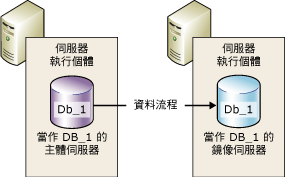
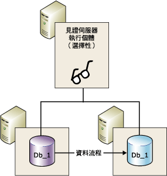
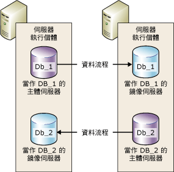

# 資料庫鏡像 (SQL Server)
    
> [!NOTE]  
>  [!INCLUDE[ssNoteDepFutureAvoid](../../includes/ssnotedepfutureavoid-md.md)] 請改用 [!INCLUDE[ssHADR](../../includes/sshadr-md.md)]。  
  
 *「資料庫鏡像」* (Database Mirroring) 是增加 [!INCLUDE[ssNoVersion](../../includes/ssnoversion-md.md)] 資料庫可用性的方案。 鏡像是以每個資料庫為基準實作，只適用於使用完整復原模式的資料庫。  
  
> [!IMPORTANT]  
>  如需資料庫鏡像支援、限制、必要條件、設定夥伴伺服器之建議及部署資料庫鏡像之建議的資訊，請參閱 [資料庫鏡像的必要條件、限制和建議事項](../../database-engine/database-mirroring/prerequisites-restrictions-and-recommendations-for-database-mirroring.md)。  
  
  
##   資料庫鏡像的優點  
 資料庫鏡像是一種簡單的策略，提供了下列優點：  
  
-   提高資料庫的可用性。  
  
     萬一發生損毀時，在具有自動容錯移轉的高安全性模式下，容錯移轉便會迅速將資料庫的待命副本變成線上狀態 (無資料遺失)。 在其他作業模式下，資料庫管理員則可選擇對資料庫的待命副本進行強制服務 (可能發生資料遺失)。 如需詳細資訊，請參閱本主題稍後的 [角色切換](#RoleSwitching)。  
  
-   增加資料保護。  
  
     資料庫鏡像可提供完整或近乎完整的資料備援性，端視作業模式是高安全性模式或高效能模式而定。 如需詳細資訊，請參閱本主題稍後的 [作業模式](#OperatingModes)。  
  
     在 [!INCLUDE[ssEnterpriseEd10](../../includes/ssenterpriseed10-md.md)] 或更新版本上執行的資料庫鏡像夥伴會自動嘗試解決阻礙讀取資料頁面的特定錯誤類型。 無法讀取頁面的夥伴會向其他夥伴要求全新副本。 如果這個要求成功，無法讀取的頁面就會使用副本取代，這通常會解決錯誤。 如需詳細資訊，請參閱本主題稍後的 [自動修復頁面 &#40;可用性群組：資料庫鏡像&#41;](../../sql-server/failover-clusters/automatic-page-repair-availability-groups-database-mirroring.md)。  
  
-   提升實際執行的資料庫在升級期間的可用性。  
  
     若要將鏡像資料庫的停機時間減至最少，您可以循序升級裝載容錯移轉夥伴的 [!INCLUDE[ssNoVersion](../../includes/ssnoversion-md.md)] 執行個體。 這只需要承擔單一容錯移轉的停機時間。 這種升級形式就稱為 *「輪流升級」*。 如需詳細資訊，請參閱 [升級鏡像執行個體](../../database-engine/database-mirroring/upgrading-mirrored-instances.md)。  
  
  
##   資料庫鏡像詞彙和定義  
 自動容錯移轉  
 如果主體伺服器變得無法使用，鏡像伺服器接替主體伺服器的角色，並使其資料庫副本連接成為主體資料庫的程序。  
  
 容錯移轉夥伴  
 充當鏡像資料庫之角色切換夥伴的兩個伺服器執行個體 (主體伺服器或鏡像伺服器)。  
  
 強制的服務  
 資料庫擁有者在主體伺服器失敗時所起始的容錯移轉，它會將服務傳送至鏡像資料庫 (處於未知狀態)。  
  
 高效能模式  
 資料庫鏡像工作階段會以非同步方式作業，而且僅使用主體伺服器和鏡像伺服器。 唯一的角色切換形式是強制的服務 (可能造成資料遺失)。  
  
 高安全性模式  
 資料庫鏡像工作階段會以同步方式作業，並選擇性地使用見證以及主體伺服器和鏡像伺服器。  
  
 手動容錯移轉  
 資料庫擁有者在主體伺服器仍然在執行時所起始的容錯移轉，它會將服務從主體資料庫傳送至鏡像資料庫 (它們都處於已同步處理狀態)。  
  
 鏡像資料庫  
 通常會與主體資料庫完全同步處理的資料庫副本。  
  
 鏡像伺服器  
 在資料庫鏡像組態中，指鏡像資料庫所在的伺服器執行個體。  
  
 主體資料庫  
 資料庫鏡像中的一種可讀寫資料庫，該資料庫的交易記錄檔記錄會套用至資料庫的唯讀副本 (鏡像資料庫)。  
  
 主體伺服器  
 資料庫鏡像中的夥伴，它的資料庫目前是主體資料庫。  
  
 重做佇列  
 在鏡像伺服器磁碟上等待且接收的交易記錄檔記錄。  
  
 角色 (role)  
 主體伺服器和鏡像伺服器會執行互補的主體與鏡像角色。 另外，也可以選擇由第三個伺服器執行個體扮演見證的角色。  
  
 角色切換  
 由鏡像接管主體角色。  
  
 傳送佇列  
 已經在主體伺服器的記錄檔磁碟上累積的未傳送交易記錄檔記錄。  
  
 工作階段 (session)  
 在資料庫鏡像期間，於主體伺服器、鏡像伺服器與見證伺服器 (如果存在的話) 之間所發生的關係。  
  
 當鏡像工作階段開始或繼續之後，將主體伺服器上所累積的主體資料庫記錄檔記錄傳送到鏡像伺服器的程序，這個程序會盡快將這些記錄檔記錄寫入磁碟，以便能趕上主體伺服器。  
  
 交易安全性  
 鏡像特有的資料庫屬性，用來決定資料庫鏡像工作階段是以同步或非同步方式作業。 有兩個安全性層級：FULL 和 OFF。  
  
 Witness  
 只能搭配高安全性模式使用的一種 SQL Server 選擇性執行個體，可讓鏡像伺服器辨別何時要起始自動容錯移轉。 與兩個容錯移轉夥伴不同的是，見證並不是為資料庫服務。 支援自動容錯移轉是見證的唯一角色。  
  
  
##   資料庫鏡像概觀  
 資料庫鏡像會維護單一資料庫的兩份副本，而這兩份副本必須位於不同的 [!INCLUDE[ssDEnoversion](../../includes/ssdenoversion-md.md)]伺服器執行個體上。 這些伺服器執行個體通常位於不同位置的電腦上。 在資料庫上啟動資料庫鏡像，起始這些伺服器執行個體之間的關係，稱為 *「資料庫鏡像工作階段」*(database mirroring session)。  
  
 其中一個伺服器執行個體會提供資料庫給用戶端 (「主體伺服器」)。 另一個執行個體則當做熱或暖待命伺服器 (「鏡像伺服器」)，端視鏡像工作階段的組態而定。 同步處理資料庫鏡像工作階段時，資料庫鏡像會提供熱待命伺服器來支援快速容錯移轉，因而不會遺失任何已認可的交易資料。 當工作階段無法同步處理時，鏡像伺服器通常會當做暖待命伺服器使用 (可能發生資料遺失)。  
  
 主體和鏡像伺服器會在 *「資料庫鏡像工作階段」* 內互相通訊，並如同 *「夥伴」*般彼此合作。 這兩個夥伴在工作階段中扮演互補的角色： *「主體角色」* (Principal Role) 和 *「鏡像角色」*(Mirror Role)。 在任何時間內，一定有一個夥伴扮演主體角色，而另一個夥伴就扮演鏡像角色。 我們會以每個夥伴所 *「擁有」* 的目前角色來描述它們， 擁有主體角色的夥伴稱為 *「主體伺服器」*，其資料庫副本就是目前的主體資料庫； 而擁有鏡像角色的夥伴則稱為 *「鏡像伺服器」*，其資料庫副本就是目前的鏡像資料庫。 在實際執行環境中部署資料庫鏡像時，主體資料庫就是 *「實際執行的資料庫」*。  
  
 資料庫鏡像涉及將主體資料庫上發生的每一項插入、更新和刪除作業，儘快 *「重做」* 到鏡像資料庫上。 完成重做的方式是將使用中交易記錄檔記錄的資料流傳送到鏡像伺服器，再由鏡像伺服器盡快依序將記錄套用到鏡像資料庫。 與在邏輯層級運作的複寫不同，資料庫鏡像是在實體記錄層級運作。 從 [!INCLUDE[ssKatmai](../../includes/sskatmai-md.md)]開始，主體伺服器會先壓縮交易記錄檔記錄的資料流，然後再將它傳送至鏡像伺服器。 這個記錄檔壓縮作業會在所有鏡像工作階段中進行。  
  
> [!NOTE]  
>  給定的伺服器執行個體可參與具有相同或不同夥伴的多個並行資料庫鏡像工作階段。 伺服器執行個體可以在某些工作階段中是夥伴，在其他工作階段中是見證。 鏡像伺服器執行個體必須執行相同版本的 [!INCLUDE[ssNoVersion](../../includes/ssnoversion-md.md)]。  
  
 **本節內容：**  
  
-   [作業模式](#OperatingModes)  
  
-   [角色切換](#RoleSwitching)  
  
-   [並行工作階段](#ConcurrentSessions)  
  
-   [用戶端連接](#ClientConnections)  
  
-   [暫停工作階段對主體交易記錄的影響](#ImpactOfPausing)  
  
  
###   作業模式  
 資料庫鏡像工作階段可與同步或非同步作業一起執行。 在非同步作業下，交易不會等待鏡像伺服器將記錄寫入磁碟，即逕行認可，藉以達到最大效能。 在同步作業下，交易將同時在兩個夥伴上進行認可，代價是會增加交易延遲性。  
  
 鏡像作業模式共有兩種。 其中一種模式 (「高安全性模式」) 可支援同步作業。 在高安全性模式下，當工作階段開始時，鏡像伺服器會儘快將鏡像資料庫與主體資料庫進行同步處理。 一旦資料庫同步處理完成之後，交易將同時在兩個夥伴上進行認可，代價是會增加交易延遲性。  
  
 第二種作業模式 (「高效能模式」) 則以非同步方式執行。 鏡像伺服器會盡量跟上主體伺服器所傳送的記錄。 鏡像資料庫可能會稍微落後主體資料庫。 然而，在資料庫之間的間距通常很小。 但是，若主體伺服器的工作負載很大，或鏡像伺服器的系統超載時，此差距就會變大。  
  
 在高效能模式中，當主體伺服器傳送記錄到鏡像伺服器時，主體伺服器會立即傳送確認給用戶端。 它不會等候鏡像伺服器的收條。 這表示交易不會等待鏡像伺服器將記錄寫入磁碟，即逕行認可。 這種非同步作業可以讓主體伺服器在執行時將交易延遲性降到最低，但必須承擔可能遺失資料的風險。  
  
 所有的資料庫鏡像工作階段都只能支援一部主體伺服器和一部鏡像伺服器。 這種組態顯示在下圖中。  
  
   
  
 具有自動容錯移轉的高安全性模式需要第三個伺服器執行個體，稱為「見證」。 與兩位夥伴不同的是，見證並不是為資料庫服務。 見證會藉由確認主體伺服器是否已啟動而且可以正常運作，支援自動容錯移轉。 只有當鏡像和見證與主體伺服器中斷連接後仍然保持相互連接時，鏡像伺服器才會開始進行自動容錯移轉。  
  
 下圖顯示包括見證的組態。  
  
   
  
 如需詳細資訊，請參閱本主題稍後的 [角色切換](#RoleSwitching)。  
  
> [!NOTE]  
>  建立新的鏡像工作階段或將見證加入至現有鏡像組態時，會要求所有涉及的伺服器執行個體都執行相同版本的 [!INCLUDE[ssNoVersion](../../includes/ssnoversion-md.md)]。 不過，當您升級為 [!INCLUDE[ssKatmai](../../includes/sskatmai-md.md)] 或更新版本時，這些相關執行個體的版本可能會不同。 如需詳細資訊，請參閱 [升級鏡像執行個體](../../database-engine/database-mirroring/upgrading-mirrored-instances.md)。  
  
  
####   交易安全性與作業模式  
 作業模式為同步或非同步作業需視其交易安全性設定而定。 如果您以獨佔模式使用 [!INCLUDE[ssManStudioFull](../../includes/ssmanstudiofull-md.md)] 來設定資料庫鏡像，系統便會在您選取作業模式時自動設定交易安全性設定。  
  
 如果使用 [!INCLUDE[tsql](../../includes/tsql-md.md)] 來設定資料庫鏡像，您就必須了解設定交易安全性的方式。 交易安全性是由 ALTER DATABASE 陳述式的 SAFETY 屬性所控制。 在要進行鏡像的資料庫上，SAFETY 不是 FULL 就是 OFF。  
  
-   如果 SAFETY 選項設為 FULL，在初始同步處理階段之後的資料庫鏡像便為同步作業。 如果見證是在高安全性模式下設定，工作階段就會支援自動容錯移轉。  
  
-   如果 SAFETY 選項設為 OFF，資料庫鏡像便為非同步作業。 工作階段將以高效能模式執行，而且 WITNESS 選項也應該設為 OFF。  
  
 如需詳細資訊，請參閱 [Database Mirroring Operating Modes](../../database-engine/database-mirroring/database-mirroring-operating-modes.md)。  
  
  
###   角色切換  
 在資料庫鏡像工作階段的內容中，主體與鏡像角色通常可以用一種稱為 *「角色切換」*的程序交換。 角色切換包括將主體角色傳送給鏡像伺服器。 在角色切換中，鏡像伺服器將充當主體伺服器的 *「容錯移轉夥伴」* 。 發生角色切換時，鏡像伺服器將接替主體角色，並使其資料庫副本變成線上狀態以做為主體資料庫。 先前的主體伺服器 (如果有的話) 將會擔任鏡像角色，而其資料庫則會變成新的鏡像資料庫。 原則上，各角色可以重複來回切換。  
  
 角色切換有下列三種形式。  
  
-   *Automatic failover*  
  
     這種形式需要使用高安全性模式而且鏡像伺服器和見證必須存在。 資料庫必須已同步處理，而見證也必須連接到鏡像伺服器。  
  
     見證角色是用來驗證特定的夥伴伺服器是否已啟動而且可以正常運作。 如果鏡像伺服器與主體伺服器的連接中斷，但見證仍與主體伺服器連接，鏡像伺服器就不會起始容錯移轉。 如需詳細資訊，請參閱 [資料庫鏡像見證](../../database-engine/database-mirroring/database-mirroring-witness.md)。  
  
-   *Manual failover*  
  
     這種形式需要使用高安全性模式。 夥伴必須互相連接，而且資料庫也必須已完成同步處理。  
  
-   強制服務 (可能發生資料遺失)  
  
     在高效能模式與不含自動容錯移轉的高安全性模式中，如果主體伺服器已經故障，但鏡像伺服器仍然可用，就可以使用強制服務。  
  
    > [!IMPORTANT]  
    >  高效能模式是在沒有見證的情況下執行的模式。 但是如果有見證存在，該見證就必須連接到鏡像伺服器，才能使用強制服務。  
  
 在任何角色切換案例中，一旦新主體資料庫變成線上狀態之後，用戶端應用程式就可以重新連接到該資料庫來快速復原。  
  
  
###   並行工作階段  
 給定的伺服器執行個體可以參與具有相同或不同伺服器執行個體的多個並行資料庫鏡像工作階段 (每個鏡像資料庫一個)。 通常，伺服器執行個體在所有資料庫鏡像工作階段中會專門當做夥伴或見證服務。 不過，由於每個工作階段獨立於其他工作階段，所以伺服器執行個體可以在某些工作階段中當做夥伴，而在其他工作階段中當做見證。 例如，請考慮下列在三個伺服器執行個體 (`SSInstance_1`、 `SSInstance_2`及 `SSInstance_3`) 中的四個工作階段。 每個伺服器執行個體會在某些工作階段中當做夥伴服務，而在其他工作階段中當做見證服務：  
  
|伺服器執行個體|資料庫 A 的工作階段|資料庫 B 的工作階段|資料庫 C 的工作階段|資料庫 D 的工作階段|  
|---------------------|----------------------------|----------------------------|----------------------------|----------------------------|  
|`SSInstance_1`|Witness|Partner|Partner|Partner|  
|`SSInstance_2`|Partner|Witness|Partner|Partner|  
|`SSInstance_3`|Partner|Partner|Witness|Witness|  
  
 下圖說明兩個伺服器執行個體以夥伴伺服器的角色，共同參與兩個鏡像工作階段。 其中一個工作階段用於名為 **Db_1**的資料庫，另一個工作階段則用於名為 **Db_2**的資料庫。  
  
   
  
 資料庫彼此之間無關。 例如，一個伺服器執行個體最初可能同時是兩個資料庫的鏡像伺服器。 如果其中一個資料庫發生容錯移轉，該伺服器執行個體會變成容錯移轉資料庫的主體伺服器，但同時維持另一個資料庫的鏡像伺服器身分。  
  
 另舉一例，假設有一個伺服器執行個體做為兩個以上資料庫的主體伺服器，並在具有自動容錯移轉的高安全性模式下執行；如果這個伺服器執行個體故障了，則所有資料庫都會自動容錯移轉到其各自的鏡像資料庫。  
  
 將伺服器執行個體設定為同時以夥伴與見證來運作時，請確定資料庫鏡像端點支援這兩個角色 (如需詳細資訊，請參閱 [資料庫鏡像端點 &#40;SQL Server&#41;](../../database-engine/database-mirroring/the-database-mirroring-endpoint-sql-server.md)) 中的四個工作階段。 另外，也請確定系統具有足夠資源，以減少資源競爭問題。  
  
> [!NOTE]  
>  由於鏡像資料庫彼此獨立，因此資料庫不能當做群組來容錯移轉。  
  
###   用戶端連接  
 資料庫鏡像工作階段的用戶端連接支援是由 [!INCLUDE[msCoName](../../includes/msconame-md.md)] .NET Data Provider for [!INCLUDE[ssNoVersion](../../includes/ssnoversion-md.md)]提供。 如需詳細資訊，請參閱本主題稍後的 [將用戶端連接至資料庫鏡像工作階段 &#40;SQL Server&#41;](../../database-engine/database-mirroring/connect-clients-to-a-database-mirroring-session-sql-server.md)。  
  
  
###   暫停工作階段對主體交易記錄的影響  
 資料庫擁有者可以隨時暫停工作階段。 暫停會保留工作階段狀態，同時移除鏡像。 工作階段暫停時，主體伺服器不會將任何新的記錄傳送到鏡像伺服器。 這些記錄全都保持使用中狀態，並累積到主體資料庫的交易記錄中。 只要資料庫鏡像工作階段保持暫停狀態，交易記錄便無法截斷。 因此，如果資料庫鏡像工作階段暫停太久，就會填滿記錄。  
  
 如需詳細資訊，請參閱本主題稍後的 [暫停與繼續資料庫鏡像 &#40;SQL Server&#41;](../../database-engine/database-mirroring/pausing-and-resuming-database-mirroring-sql-server.md)。  
  
##   設定資料庫鏡像工作階段  
 資料庫擁有者或系統管理員必須先建立鏡像資料庫、設定端點與登入，而在某些情況下，還必須建立並設定憑證，之後才可以開始鏡像工作階段。 如需詳細資訊，請參閱本主題稍後的 [設定資料庫鏡像 &#40;SQL Server&#41;](../../database-engine/database-mirroring/setting-up-database-mirroring-sql-server.md)。  
  
##   與其他 Database Engine 功能的互通性和共存性  
 資料庫鏡像可與 [!INCLUDE[ssNoVersion](../../includes/ssnoversion-md.md)]的下列功能或元件搭配使用。  
  
-   [記錄傳送](../../database-engine/database-mirroring/database-mirroring-and-log-shipping-sql-server.md)  
  
-   [全文檢索目錄](../../database-engine/database-mirroring/database-mirroring-and-full-text-catalogs-sql-server.md)  
  
-   [資料庫快照集](../../database-engine/database-mirroring/database-mirroring-and-database-snapshots-sql-server.md)  
  
-   [複寫](../../database-engine/database-mirroring/database-mirroring-and-replication-sql-server.md)  
  
##   本節內容  
 [資料庫鏡像的必要條件、限制和建議事項](../../database-engine/database-mirroring/prerequisites-restrictions-and-recommendations-for-database-mirroring.md)  
 描述設定資料庫鏡像的必要條件和建議事項。  
  
 [Database Mirroring Operating Modes](../../database-engine/database-mirroring/database-mirroring-operating-modes.md)  
 包含有關資料庫鏡像工作階段的同步與非同步作業模式，以及在資料庫鏡像工作階段期間切換夥伴角色的資訊。  
  
 [資料庫鏡像見證](../../database-engine/database-mirroring/database-mirroring-witness.md)  
 說明資料庫鏡像中見證的角色、如何在多個鏡像工作階段中使用單一見證、見證的軟體和硬體建議以及自動容錯移轉中見證的角色。 也包括有關加入或移除見證的資訊。  
  
 [資料庫鏡像工作階段期間的角色切換 &#40;SQL Server&#41;](../../database-engine/database-mirroring/role-switching-during-a-database-mirroring-session-sql-server.md)  
 包含有關在資料庫鏡像工作階段期間切換夥伴角色，包括自動容錯移轉、手動容錯移轉，以及強制服務 (資料可能會遺失) 的資訊。 同時包含有關評估角色切換期間服務中斷的資訊。  
  
 [資料庫鏡像期間可能發生的失敗](../../database-engine/database-mirroring/possible-failures-during-database-mirroring.md)  
 討論可能導致資料庫鏡像工作階段中發生失敗的實體、作業系統和 [!INCLUDE[ssNoVersion](../../includes/ssnoversion-md.md)] 問題，包括重大錯誤和軟性錯誤。 討論鏡像逾時機制如何回應軟性錯誤。  
  
 [資料庫鏡像端點 &#40;SQL Server&#41;](../../database-engine/database-mirroring/the-database-mirroring-endpoint-sql-server.md)  
 討論資料庫鏡像端點的運作方式。  
  
 [設定資料庫鏡像 &#40;SQL Server&#41;](../../database-engine/database-mirroring/setting-up-database-mirroring-sql-server.md)  
 包含有關設定資料庫鏡像之必要條件、建議事項及步驟的主題。  
  
 [將用戶端連接至資料庫鏡像工作階段 &#40;SQL Server&#41;](../../database-engine/database-mirroring/connect-clients-to-a-database-mirroring-session-sql-server.md)  
 包含涵蓋用戶端連接字串屬性以及將用戶端連接和重新連接至鏡像資料庫之演算法的主題。  
  
 [暫停與繼續資料庫鏡像 &#40;SQL Server&#41;](../../database-engine/database-mirroring/pausing-and-resuming-database-mirroring-sql-server.md)  
 討論當資料庫鏡像暫停時會發生什麼事 (包括對交易記錄截斷的影響) 並包含有關如何暫停和繼續資料庫鏡像的說明。  
  
 [移除資料庫鏡像 &#40;SQL Server&#41;](../../database-engine/database-mirroring/removing-database-mirroring-sql-server.md)  
 討論移除鏡像的影響，並包含有關如何結束工作階段的說明。  
  
 [監視資料庫鏡像 &#40;SQL Server&#41;](../../database-engine/database-mirroring/monitoring-database-mirroring-sql-server.md)  
 包含有關如何使用「資料庫鏡像監視器」或 **dbmmonitor** 預存程序來監視資料庫鏡像或工作階段的資訊。  
  
  
##   相關工作  
  
### 組態工作  
 **使用 SQL Server Management Studio**  
  
-   [啟動設定資料庫鏡像安全性精靈 &#40;SQL Server Management Studio&#41;](../../database-engine/database-mirroring/start-the-configuring-database-mirroring-security-wizard.md)  
  
-   [使用 Windows 驗證建立資料庫鏡像工作階段 &#40;SQL Server Management Studio&#41;](../../database-engine/database-mirroring/establish-database-mirroring-session-windows-authentication.md)  
  
 **使用 Transact-SQL**  
  
-   [使用 Windows 驗證允許資料庫鏡像的網路存取 &#40;SQL Server&#41;](../../database-engine/database-mirroring/database-mirroring-allow-network-access-windows-authentication.md)  
  
-   [允許資料庫鏡像端點使用輸出連線的憑證 &#40;Transact-SQL&#41;](../../database-engine/database-mirroring/database-mirroring-use-certificates-for-outbound-connections.md)  
  
-   [允許資料庫鏡像端點使用輸入連線的憑證 &#40;Transact-SQL&#41;](../../database-engine/database-mirroring/database-mirroring-use-certificates-for-inbound-connections.md)  
  
-   [建立 Windows 驗證的資料庫鏡像端點 &#40;Transact-SQL&#41;](../../database-engine/database-mirroring/create-a-database-mirroring-endpoint-for-windows-authentication-transact-sql.md)  
  
-   [使用 Windows 驗證建立資料庫鏡像工作階段 &#40;Transact-SQL&#41;](../../database-engine/database-mirroring/database-mirroring-establish-session-windows-authentication.md)  
  
-   [使用 Windows 驗證新增資料庫鏡像見證 &#40;Transact-SQL&#41;](../../database-engine/database-mirroring/add-a-database-mirroring-witness-using-windows-authentication-transact-sql.md)  
  
-   [設定鏡像資料庫以使用 Trustworthy 屬性 &#40;Transact-SQL&#41;](../../database-engine/database-mirroring/set-up-a-mirror-database-to-use-the-trustworthy-property-transact-sql.md)  
  
 **使用 Transact-SQL 或 SQL Server Management Studio**  
  
-   [升級鏡像執行個體](../../database-engine/database-mirroring/upgrading-mirrored-instances.md)  
  
-   [準備鏡像資料庫以進行鏡像 &#40;SQL Server&#41;](../../database-engine/database-mirroring/prepare-a-mirror-database-for-mirroring-sql-server.md)  
  
  
### 系統管理工作  
 **Transact-SQL**  
  
-   [在資料庫鏡像工作階段中變更交易安全性 &#40;Transact-SQL&#41;](../../database-engine/database-mirroring/change-transaction-safety-in-a-database-mirroring-session-transact-sql.md)  
  
-   [手動容錯移轉資料庫鏡像工作階段 &#40;Transact-SQL&#41;](../../database-engine/database-mirroring/manually-fail-over-a-database-mirroring-session-transact-sql.md)  
  
-   [在資料庫鏡像工作階段中強制服務 &#40;Transact-SQL&#41;](../../database-engine/database-mirroring/force-service-in-a-database-mirroring-session-transact-sql.md)  
  
-   [暫停或繼續資料庫鏡像工作階段 &#40;SQL Server&#41;](../../database-engine/database-mirroring/pause-or-resume-a-database-mirroring-session-sql-server.md)  
  
-   [從資料庫鏡像工作階段移除見證 &#40;SQL Server&#41;](../../database-engine/database-mirroring/remove-the-witness-from-a-database-mirroring-session-sql-server.md)  
  
-   [移除資料庫鏡像 &#40;SQL Server&#41;](../../database-engine/database-mirroring/remove-database-mirroring-sql-server.md)  
  
 **SQL Server Management Studio**  
  
-   [加入或取代資料庫鏡像見證 &#40;SQL Server Management Studio&#41;](../../database-engine/database-mirroring/add-or-replace-a-database-mirroring-witness-sql-server-management-studio.md)  
  
-   [手動容錯移轉資料庫鏡像工作階段 &#40;SQL Server Management Studio&#41;](../../database-engine/database-mirroring/manually-fail-over-a-database-mirroring-session-sql-server-management-studio.md)  
  
-   [暫停或繼續資料庫鏡像工作階段 &#40;SQL Server&#41;](../../database-engine/database-mirroring/pause-or-resume-a-database-mirroring-session-sql-server.md)  
  
-   [從資料庫鏡像工作階段移除見證 &#40;SQL Server&#41;](../../database-engine/database-mirroring/remove-the-witness-from-a-database-mirroring-session-sql-server.md)  
  
-   [移除資料庫鏡像 &#40;SQL Server&#41;](../../database-engine/database-mirroring/remove-database-mirroring-sql-server.md)  
  
  
## 另請參閱  
 [資料庫鏡像端點 &#40;SQL Server&#41;](../../database-engine/database-mirroring/the-database-mirroring-endpoint-sql-server.md)   
 [自動修復頁面 &#40;可用性群組：資料庫鏡像&#41;](../../sql-server/failover-clusters/automatic-page-repair-availability-groups-database-mirroring.md)   
 [為資料庫鏡像組態進行疑難排解 &#40;SQL Server&#41; &#40;SQL Server&#41;](../../database-engine/database-mirroring/troubleshoot-database-mirroring-configuration-sql-server.md)   
 [資料庫鏡像：互通性與共存性 &#40;SQL Server&#41;](../../database-engine/database-mirroring/database-mirroring-interoperability-and-coexistence-sql-server.md)   
 [資料庫鏡像的必要條件、限制和建議事項](../../database-engine/database-mirroring/prerequisites-restrictions-and-recommendations-for-database-mirroring.md)   
 [AlwaysOn 可用性群組概觀 &#40;SQL Server&#41;](../../database-engine/availability-groups/windows/overview-of-always-on-availability-groups-sql-server.md)   
 [關於記錄傳送 &#40;SQL Server&#41;](../../database-engine/log-shipping/about-log-shipping-sql-server.md)  
  
  

