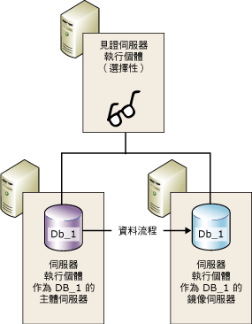
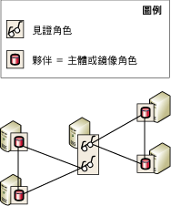

# 資料庫鏡像見證
  若要支援自動容錯移轉，就必須在高安全性模式下設定資料庫鏡像工作階段，而且它也會包含第三個伺服器執行個體，稱為「見證」。 見證是 [!INCLUDE[ssNoVersion](../../includes/ssnoversion-md.md)] 的選擇性執行個體，可以讓在高安全性模式工作階段中的鏡像伺服器辨別是否啟動自動容錯移轉。 與兩位夥伴不同的是，見證並不是為資料庫服務。 支援自動容錯移轉是見證的唯一角色。  
  
> [!NOTE]  
>  在高效能模式中，見證可能會對可用性有負面影響。 如果見證是設定供資料庫鏡像工作階段使用，則主體伺服器必須至少連接到一個其他伺服器執行個體、鏡像伺服器或見證，或者兩者都連接。 否則，資料庫會變得無法使用，而又不可能強制服務 (可能會有資料遺失)。 因此，對於高效能模式，強烈建議您永遠將見證設定為 OFF。 如需見證對高效能模式影響的相關資訊，請參閱[資料庫鏡像作業模式](../../database-engine/database-mirroring/database-mirroring-operating-modes.md)。  
  
 下圖將說明含有見證的高安全性模式工作階段。  
  
   
  
 **本主題內容：**  
  
-   [在多個工作階段中使用見證](#InMultipleSessions)  
  
-   [軟體和硬體建議](#SwHwRecommendations)  
  
-   [自動容錯移轉中見證的角色](#InAutoFo)  
  
-   [加入或移除見證](#AddRemoveWitness)  
  
##   在多個工作階段中使用見證  
 特定伺服器執行個體可以做為並行資料庫鏡像工作階段中的見證，每個不同的資料庫都有一個工作階段。 不同的工作階段可以有不同的夥伴。 下圖示範做為兩個有不同夥伴的資料庫鏡像工作階段之見證的伺服器執行個體。  
  
   
  
 單一伺服器執行個體也可以同時做為某些工作階段的見證與其他工作階段的夥伴。 但是實務上，伺服器執行個體通常是做為見證或夥伴。 這是因為夥伴需要配備足夠硬體的精密電腦以支援實際執行的資料庫，而見證則可以在支援 [!INCLUDE[ssCurrent](../../includes/sscurrent-md.md)]的任何可用 Windows 系統上執行。  
  
##   軟體和硬體建議  
 我們強烈建議見證應該與任何夥伴位於不同的電腦上。 只有 [!INCLUDE[ssNoVersion](../../includes/ssnoversion-md.md)] Standard Edition 和 [!INCLUDE[ssNoVersion](../../includes/ssnoversion-md.md)] Enterprise Edition 支援資料庫鏡像夥伴伺服器。 相較之下， [!INCLUDE[ssNoVersion](../../includes/ssnoversion-md.md)] Workgroup 和 [!INCLUDE[ssNoVersion](../../includes/ssnoversion-md.md)] Express 還支援見證。 除了從舊版 [!INCLUDE[ssNoVersion](../../includes/ssnoversion-md.md)]升級的期間以外，鏡像工作階段中的伺服器執行個體全都必須執行相同版本的 [!INCLUDE[ssNoVersion](../../includes/ssnoversion-md.md)]。 例如，當您從 [!INCLUDE[ssKatmai](../../includes/sskatmai-md.md)] 鏡像組態升級時可支援 [!INCLUDE[ssKatmai](../../includes/sskatmai-md.md)] 見證，但是此見證無法加入至現有或新的 [!INCLUDE[ssKilimanjaro](../../includes/sskilimanjaro-md.md)] 或更新版本的鏡像組態中。  
  
 見證可以在支援這些任何版本 [!INCLUDE[ssNoVersion](../../includes/ssnoversion-md.md)]的任何可靠電腦系統上執行。 不過，建議每一個當做見證使用的伺服器執行個體具有對應於所執行之 [!INCLUDE[ssNoVersion](../../includes/ssnoversion-md.md)] Standard 版本所需的最低組態。 如需這些需求的詳細資訊，請參閱[安裝 SQL Server 2016 的硬體與軟體需求](../../sql-server/install/hardware-and-software-requirements-for-installing-sql-server-2016.md)。  
  
##   自動容錯移轉中見證的角色  
 在資料庫鏡像工作階段內，所有伺服器執行個體會監視其連接狀態。 如果夥伴彼此之間中斷連接，就要依靠見證，確保目前只有其中一個為資料庫服務。 如果同步處理鏡像伺服器失去主體伺服器的連接，但仍然連接到見證，鏡像伺服器就會連絡見證，判斷見證是否失去與主體伺服器的連接。  
  
-   如果主體伺服器仍然與見證連接，就不會發生自動容錯移轉。 而是，主體伺服器繼續為資料庫服務，同時累積記錄，在夥伴重新連接時傳送鏡像伺服器。  
  
-   如果見證也與主體伺服器中斷連接，鏡像伺服器知道主體資料庫已無法使用。 在此情況下，鏡像伺服器會立即啟動自動容錯移轉。  
  
-   如果鏡像伺服器與見證中斷連接，而且也與主體伺服器中斷連接，則不管主體伺服器的狀態如何，都不可能進行自動容錯移轉。  
  
 至少連接兩個伺服器執行個體的需求，即所謂的 *「仲裁」*。 仲裁確保資料庫一次只能由一個夥伴提供服務。 如需仲裁如何運作及如何影響工作階段的相關資訊，請參閱[仲裁：見證如何影響資料庫可用性 &#40;資料庫鏡像&#41;](../../database-engine/database-mirroring/quorum-how-a-witness-affects-database-availability-database-mirroring.md)。  
  
##   加入或移除見證  
 **加入見證**  
  
-   [加入或取代資料庫鏡像見證 &#40;SQL Server Management Studio&#41;](../../database-engine/database-mirroring/add-or-replace-a-database-mirroring-witness-sql-server-management-studio.md)  
  
-   [使用 Windows 驗證加入資料庫鏡像見證 &#40;Transact-SQL&#41;](../../database-engine/database-mirroring/add-a-database-mirroring-witness-using-windows-authentication-transact-sql.md)  
  
 **移除見證**  
  
-   [從資料庫鏡像工作階段移除見證 &#40;SQL Server&#41;](../../database-engine/database-mirroring/remove-the-witness-from-a-database-mirroring-session-sql-server.md)  
  
## 另請參閱  
 [資料庫鏡像工作階段期間的角色切換 &#40;SQL Server&#41;](../../database-engine/database-mirroring/role-switching-during-a-database-mirroring-session-sql-server.md)   
 [資料庫鏡像作業模式](../../database-engine/database-mirroring/database-mirroring-operating-modes.md)   
 [仲裁：見證如何影響資料庫可用性 &#40;資料庫鏡像&#41;](../../database-engine/database-mirroring/quorum-how-a-witness-affects-database-availability-database-mirroring.md)   
 [資料庫鏡像期間可能發生的失敗](../../database-engine/database-mirroring/possible-failures-during-database-mirroring.md)   
 [鏡像狀態 &#40;SQL Server&#41;](../../database-engine/database-mirroring/mirroring-states-sql-server.md)  
  
  