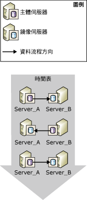
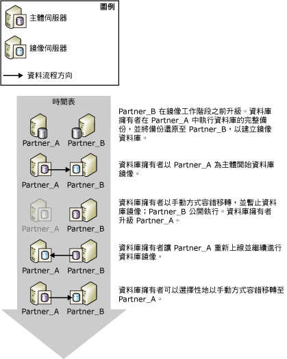
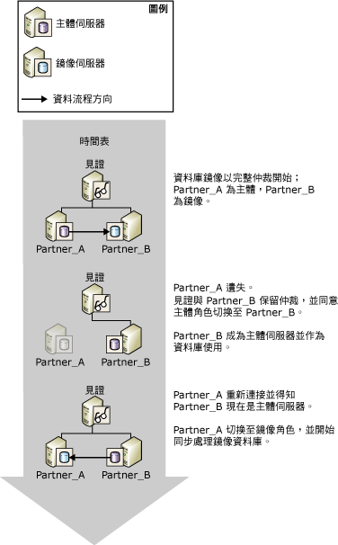
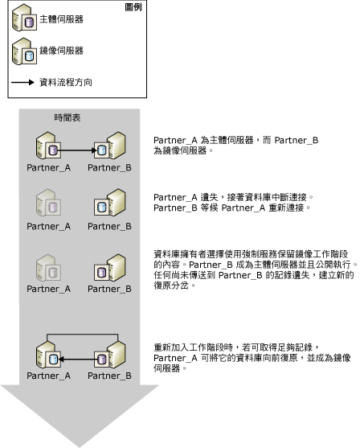

# 資料庫鏡像工作階段期間的角色切換 (SQL Server)
[!INCLUDE[appliesto-ss-xxxx-xxxx-xxx-md](../../includes/appliesto-ss-xxxx-xxxx-xxx-md.md)]
  在資料庫鏡像工作階段的內容中，主體與鏡像角色通常可以用一種稱為 *「角色切換」* 的程序交換。 在角色切換中，鏡像伺服器將充當主體伺服器的「容錯移轉夥伴」  、接替主體角色、復原其資料庫副本，並使其上線以作為新的主體資料庫。 先前的主體伺服器可用時，會擔任鏡像角色，而其資料庫即成為新的鏡像資料庫。 原則上，這些角色可以來回切換，以回應多項失敗或達成管理目的。  
  
> [!NOTE]  
>  本主題假設您已熟悉資料庫鏡像作業模式。 如需詳細資訊，請參閱 [Database Mirroring Operating Modes](../../database-engine/database-mirroring/database-mirroring-operating-modes.md)。  
  
 下圖顯示鏡像夥伴 **Partner_A** 和 **Partner_B**，在一連串的自動或手動容錯移轉期間，切換主體和鏡像角色。  
  
   
  
> [!IMPORTANT]  
>  在角色切換之後，您必須在新的主體伺服器上重新建立並執行原先主體資料庫上執行的作業。 如需詳細資訊，請參閱[角色切換後針對登入和作業進行管理 &#40;SQL Server&#41;](../../sql-server/failover-clusters/management-of-logins-and-jobs-after-role-switching-sql-server.md)。  
  
 角色切換類型共有三種：自動容錯移轉、手動容錯移轉和強制服務 (可能遺失資料)。 至於支援哪一種形式，需視工作階段的作業模式而定。  
  
> [!NOTE]  
>  如果您不熟悉這些作業模式，請參閱 [資料庫鏡像作業模式](../../database-engine/database-mirroring/database-mirroring-operating-modes.md)。  
  
-   **手動容錯移轉**  
  
     高安全性模式支援手動容錯移轉。 只要資料庫完成同步處理，資料庫擁有者即可起始手動容錯移轉。  
  
     手動容錯移轉是為管理用途而設計， 如需詳細資訊，請參閱本主題稍後的 [手動容錯移轉](#ManualFailover)。  
  
-   **Automatic failover**  
  
     如果見證存在的話，高安全性模式就支援自動容錯移轉。 當見證和鏡像伺服器仍然彼此連接而且資料庫已經同步處理時，自動容錯移轉只會在主體伺服器失效時進行。 如需詳細資訊，請參閱本主題稍後的 [自動容錯移轉](#AutomaticFailover)。  
  
-   **強制服務 (可能遺失資料)**  
  
     高安全性模式 (如果沒有設定見證的話) 和高效能模式下都支援強制服務。 主體伺服器失效後，資料庫擁有者可對鏡像伺服器執行強制服務 (可能遺失資料)，以讓資料庫成為可用狀態。  
  
    > [!NOTE]  
    >  在高效能模式下，我們建議將 WITNESS 屬性設定為 OFF。 否則，若要將資料庫帶上線，鏡像伺服器必須連接到見證。  
  
     如需詳細資訊，請參閱本主題稍後的 [強制服務 (可能遺失資料)](#ForcedService)。  
  
 下表將摘要列出每種作業模式下支援的容錯移轉形式。  
  
||高效能|不含見證的高安全性模式|含有見證的高安全性模式|  
|-|----------------------|-----------------------------------------|--------------------------------------|  
|自動容錯移轉|否|否|是|  
|手動容錯移轉|否|是|是|  
|強制服務|是|是|否|  
  
 角色切換之後，兩部夥伴伺服器上都必須有特定的中繼資料，以確保所有的資料庫使用者都能存取新的主體資料庫。 此外，您還必須在新的主體伺服器上建立備份作業，以確保該資料庫能夠繼續進行定期備份。 如需詳細資訊，請參閱[角色切換後針對登入和作業進行管理 &#40;SQL Server&#41;](../../sql-server/failover-clusters/management-of-logins-and-jobs-after-role-switching-sql-server.md)。  
  
 在角色切換期間，資料庫鏡像無法服務的時間量將依角色切換的類型及其原因而定。 如需詳細資訊，請參閱 [預估角色切換期間的服務中斷時間 &#40;資料庫鏡像&#41;](../../database-engine/database-mirroring/estimate-the-interruption-of-service-during-role-switching-database-mirroring.md)的程序交換。  
  
##   Manual Failover  
 手動容錯移轉會中斷用戶端與資料庫之間的連接，並將夥伴的角色反轉過來。 只有高安全性模式支援手動容錯移轉。  
  
 **本節內容：**  
  
-   [維護升級期間的可用性](#AvailabilityDuringUpgrades)  
  
-   [手動容錯移轉所需的條件](#ConditionsForManualFo)  
  
-   [手動容錯移轉如何運作](#HowManualFoWorks)  
  
###   維護升級期間的可用性  
 資料庫管理員可以使用手動容錯移轉來升級硬體或軟體，而不必犧牲可用性。 若要使用資料庫鏡像進行軟體升級，鏡像伺服器及/或系統必須已經升級。  
  
> [!NOTE]  
>  資料庫鏡像應該可進行輪流升級，但因為不知道未來是否會有所變更，所以無法保證一定可以進行這類升級。 如需詳細資訊，請參閱 [升級鏡像執行個體](../../database-engine/database-mirroring/upgrading-mirrored-instances.md)。  
  
 下圖說明在升級資料庫伺服器執行個體的同時，使用手動容錯移轉來維護資料庫可用性的範例。 升級完成時，系統管理員可以選擇性地容錯移轉回原始的伺服器執行個體。 如果系統管理員想要停止鏡像工作階段，轉而使用別處的鏡像伺服器，這個方法便很有用。 使用這個方法，更新一連串的資料庫伺服器執行個體時，就可以重複使用單一的伺服器執行個體。  
  
   
  
###   手動容錯移轉所需的條件  
 手動容錯移轉需要將交易安全性設定為 FULL (即為高安全性模式)。 當夥伴已連接而且資料庫已經同步處理後，就會支援手動容錯移轉。  
  
###   手動容錯移轉如何運作  
 手動容錯移轉會起始下列動作順序：  
  
1.  主體伺服器會中斷用戶端與主體資料庫的連接、將記錄結尾傳送至鏡像伺服器，並在準備切換到鏡像角色時，將鏡像狀態設定為 SYNCHRONIZING。  
  
2.  鏡像伺服器會將從主體伺服器接收到最後一筆記錄的記錄序號 (LSN) 記錄下來，做為容錯移轉 LSN。  
  
    > [!NOTE]  
    >  若要檢視此 LSN，請從 [sys.database_mirroring &#40;Transact-SQL&#41;](../../relational-databases/system-catalog-views/sys-database-mirroring-transact-sql.md) 選取 **mirroring_failover_lsn** 資料行。  
  
3.  如果在重做佇列中有任何記錄正在等待，則鏡像伺服器會完成鏡像資料庫的向前復原。 所需時間取決於系統的速度、最近的工作負載，以及重做佇列中的記錄量。 針對同步處理作業模式，容錯移轉時間可以藉由限制重做佇列的大小來調節。 但是，這可能會造成主體伺服器變慢，以便鏡像伺服器能夠跟上。  
  
    > [!NOTE]  
    >  若要了解重做佇列的目前大小，請使用資料庫鏡像效能物件中的 **Redo Queue** 效能計數器 (如需詳細資訊，請參閱[監視資料庫鏡像 &#40;SQL Server&#41;](../../database-engine/database-mirroring/monitoring-database-mirroring-sql-server.md))。  
  
4.  鏡像伺服器會變成新的主體伺服器，而舊的主體伺服器則會變成新的鏡像伺服器。  
  
5.  新的主體伺服器會回復至任何未認可的交易，並使它自己的資料庫副本變成線上狀態以做為主體資料庫。  
  
6.  舊的主體伺服器會接受鏡像角色，而舊的主體資料庫則變成鏡像資料庫。 新的鏡像伺服器將會以新的主體資料庫快速地重新同步處理新的鏡像伺服器。  
  
    > [!NOTE]  
    >  新鏡像伺服器重新同步處理資料庫後，就可以再次容錯移轉，但是方向會相反。  
  
 容錯移轉之後，用戶端必須重新連接到目前的主體資料庫。 如需詳細資訊，請參閱本主題稍後的 [將用戶端連接至資料庫鏡像工作階段 &#40;SQL Server&#41;](../../database-engine/database-mirroring/connect-clients-to-a-database-mirroring-session-sql-server.md)。  
  
 **若要初始化手動容錯移轉**  
  
-   [手動容錯移轉資料庫鏡像工作階段 &#40;SQL Server Management Studio&#41;](../../database-engine/database-mirroring/manually-fail-over-a-database-mirroring-session-sql-server-management-studio.md)  
  
-   [手動容錯移轉資料庫鏡像工作階段 &#40;Transact-SQL&#41;](../../database-engine/database-mirroring/manually-fail-over-a-database-mirroring-session-transact-sql.md)。  
  
##   Automatic Failover  
 只有在高安全性模式下搭配見證執行的資料庫鏡像工作階段才支援自動容錯移轉 (「具有自動容錯移轉的高安全性模式」  )。 在具有自動容錯移轉的高安全性模式下，一旦資料庫同步處理後，如果主體資料庫無法使用，就會進行自動容錯移轉。 自動容錯移轉會使鏡像伺服器接替主體伺服器的角色，使其資料庫副本連接成為主體資料庫。 同步處理資料庫的需求可避免容錯移轉期間發生資料遺失的狀況，因為主體資料庫上認可的每一筆交易也會在鏡像資料庫上認可。  
  
> [!IMPORTANT]  
>  為了讓自動容錯移轉能夠提高可靠性，鏡像與主體資料庫必須位於不同的電腦上。  
  
 **本節內容：**  
  
-   [自動容錯移轉所需的條件](#ConditionsForAutoFo)  
  
-   [自動容錯移轉如何運作](#HowAutoFoWorks)  
  
-   [若要停用自動容錯移轉 (SQL Server Management Studio)](#DisableAutoSSMS)  
  
-   [若要停用自動容錯移轉 (使用 Transact-SQL)](#DisableAutoTsql)  
  
###   自動容錯移轉所需的條件  
 自動容錯移轉必須符合下列條件：  
  
-   資料庫鏡像工作階段必須在高安全性模式下執行而且必須擁有見證。 如需詳細資訊，請參閱 [Database Mirroring Operating Modes](../../database-engine/database-mirroring/database-mirroring-operating-modes.md)。  
  
-   鏡像資料庫必須已經完成同步處理。 如此可確保所有傳送到鏡像伺服器的記錄都已寫入磁碟中。  
  
-   主體伺服器已經中斷與資料庫鏡像組態其他元件的通訊，但鏡像與見證仍保有仲裁。 不過，如果所有的伺服器執行個體都失去通訊，而見證與鏡像伺服器稍後重新取得通訊，則不會發生自動容錯移轉。  
  
    > [!NOTE]  
    >  如需詳細資訊，請參閱[仲裁：見證如何影響資料庫可用性 &#40;資料庫鏡像&#41;](../../database-engine/database-mirroring/quorum-how-a-witness-affects-database-availability-database-mirroring.md)。  
  
-   鏡像伺服器已偵測到主體伺服器的遺失。  
  
     鏡像伺服器偵測主體伺服器錯誤的方式需視其為硬性或軟性錯誤而定。 如需詳細資訊，請參閱 [資料庫鏡像期間可能發生的失敗](../../database-engine/database-mirroring/possible-failures-during-database-mirroring.md)。  
  
###   自動容錯移轉如何運作  
 在前述條件下，自動容錯移轉會起始下列動作順序：  
  
1.  如果主體伺服器仍在執行，就會將主體資料庫的狀態變更為 DISCONNECTED，並中斷主體資料庫中所有用戶端的連接。  
  
2.  見證伺服器與鏡像伺服器會將主體伺服器登錄為無法使用。  
  
3.  如果在重做佇列中有任何記錄正在等待，則鏡像伺服器會完成鏡像資料庫的向前復原。  
  
    > [!NOTE]  
    >  套用記錄所需時間量視系統的速度、最近的工作負載，以及重做佇列中的記錄量而定。  
  
4.  先前的鏡像資料庫會連線成為新的主體資料庫，而復原作業會儘快回復所有未認可的交易來加以清除。 鎖定會隔離這些交易。  
  
5.  當先前的主體伺服器重新加入工作階段，它會認定其容錯移轉夥伴此時已擁有主體角色。 先前的主體伺服器會接替鏡像的角色，並使其資料庫成為鏡像資料庫。 新的鏡像伺服器會儘快將新的鏡像資料庫與主體資料庫進行同步處理。 新鏡像伺服器重新同步處理資料庫後，就可以再次容錯移轉，但是方向會相反。  
  
 下圖顯示自動容錯移轉的單一執行個體。  
  
   
  
 一開始，三部伺服器都已連接 (也就是工作階段具有完整的仲裁)。 **Partner_A** 是主體伺服器， **Partner_B** 是鏡像伺服器。 **Partner_A** (或 **Partner_A**上的主體資料庫) 變得無法使用。 見證與 **Partner_B** 兩者皆認定主體已無法使用，且工作階段會重新取得仲裁。 **Partner_B** 會成為主體伺服器，並使其資料庫副本成為新的主體資料庫。 最後， **Partner_A** 重新連接到工作階段，並發現 **Partner_B** 此時已擁有主體角色。 **Partner_A** 會接替鏡像角色。  
  
 容錯移轉之後，用戶端必須重新連接到目前的主體資料庫。 如需詳細資訊，請參閱本主題稍後的 [將用戶端連接至資料庫鏡像工作階段 &#40;SQL Server&#41;](../../database-engine/database-mirroring/connect-clients-to-a-database-mirroring-session-sql-server.md)。  
  
> [!NOTE]  
>  在容錯移轉發生時，凡是已利用 [!INCLUDE[msCoName](../../includes/msconame-md.md)] 分散式交易協調器準備好但尚未認可的交易，都會在資料庫完成容錯移轉後被視為已中止。  
  
###   若要停用自動容錯移轉 (SQL Server Management Studio)  
 開啟 [資料庫屬性] 的 [鏡像]  頁面，並選取下列其中一項來變更作業模式：  
  
-   **不具有自動容錯移轉的高安全性 (同步)**  
  
     在此模式下，資料庫會繼續進行同步處理，而且可以手動容錯移轉。  
  
-   **高效能 (非同步)**  
  
     在此模式下，鏡像資料庫可能會稍微落後主體資料庫，而且無法進行手動容錯移轉。  
  
###   若要停用自動容錯移轉 (使用 Transact-SQL)  
 在資料庫鏡像工作階段的任何時間點上，資料庫擁有者可以透過關閉見證來停用自動容錯移轉。  
  
 **若要關閉見證**  
  
-   [從資料庫鏡像工作階段移除見證 &#40;SQL Server&#41;](../../database-engine/database-mirroring/remove-the-witness-from-a-database-mirroring-session-sql-server.md)  
  
    > [!NOTE]  
    >  在保有完整交易安全性時關閉見證，會將工作階段置於不含自動容錯移轉的高安全性模式中。  
  
##   Forced Service (with Possible Data Loss)  
 資料庫鏡像會提供強制服務 (可能遺失資料) 做為損毀復原方法，以便讓您將鏡像伺服器當做暖待命伺服器使用。 只有當主體伺服器在鏡像工作階段中與鏡像伺服器中斷連接時，才能進行強制服務。 由於強制服務會面臨可能遺失資料的風險，所以應該小心並謹慎使用。  
  
 強制服務的支援會根據工作階段的作業模式和狀態而定，如下所示：  
  
-   一般而言，每當主體伺服器中斷連接時，高效能模式就可支援強制服務。 不過，高效能模式工作階段的見證可以存在 (非必要)。 在此情況下，強制服務會要求鏡像伺服器和見證彼此連接。  
  
-   每當主體伺服器中斷連接時，不含自動容錯移轉的高安全性模式就可支援強制服務。  
  
-   每當鏡像伺服器和見證彼此連接，而且它們都沒有連接至主體伺服器時 (只要鏡像伺服器上次連接至主體時，它並不在回復鏡像資料庫的處理序中)，具有自動容錯移轉的高安全性模式就可支援強制服務。  
  
 只有在您必須立即還原資料庫的服務，並且願意承擔遺失資料的風險時，才建議使用強制服務。 強制服務的效果類似於在可能遺失資料的風險下移除鏡像，不過在繼續進行鏡像作業時，強制服務可方便您重新同步處理資料庫。 強制服務會將主體角色平順地轉換至鏡像資料庫。 鏡像伺服器將擔任主體伺服器的角色，並立即提供其資料庫副本來服務用戶端。 新的主體資料庫會在沒有鏡像的情況下執行 (亦即，公開執行)。  
  
> [!IMPORTANT]  
>  如果主體伺服器僅與資料庫鏡像工作階段中斷連接，但它仍在執行時，某些用戶端可能會繼續存取原始的主體資料庫。 在您進行強制服務之前，請務必防止用戶端存取原始的主體伺服器。 否則，在強制服務之後，原始的主體資料庫和目前的主體資料庫可能會彼此獨立更新。  
  
 **本節內容：**  
  
-   [強制服務的一般情況](#TypicalCaseFS)  
  
-   [強制服務的風險](#FSrisks)  
  
-   [管理潛在資料遺失](#ManageDataLoss)  
  
-   [管理強制容錯移轉的相關工作](#RelatedTasksForFS)  
  
###   強制服務的一般情況  
 下圖將說明強制服務的一般情況 (可能遺失資料)。  
  
   
  
 在該圖中，原始的主體伺服器 **Partner_A**無法讓鏡像伺服器 **Partner_B**使用，進而導致鏡像資料庫中斷連接。 在確定用戶端無法使用 **Partner_A** 後，資料庫管理員便在 **Partner_B** 上進行強制服務 (可能遺失資料)。 **Partner_B** 成為主體伺服器，並「公開」  資料庫執行 (亦即未鏡像)。 此時，用戶端可以重新連接至 **Partner_B**。  
  
 當 **Partner_A** 可以使用後，它就會重新連接至新的主體伺服器，並重新加入工作階段和擔任鏡像角色。 鏡像工作階段會立即暫停，而不會與新的鏡像資料庫進行同步處理。 暫停工作階段可讓資料庫管理員決定要繼續進行工作階段 (在極端情況下)，還是移除鏡像並嘗試搶救之前主體資料庫中的資料。 在這個情況中，資料庫管理員選擇繼續進行鏡像。 此時， **Partner_A** 會接管鏡像伺服器的角色並將之前的主體資料庫回復至上次成功同步處理交易的時間點。如果進行強制服務之前，任何已認可的交易未寫入鏡像伺服器的磁碟，這些交易就會遺失。 然後，**Partner_A** 會藉由套用自從之前鏡像伺服器成為新主體伺服器以來在新主體資料庫上進行的所有變更，向前復原新的鏡像資料庫。  
  
> [!NOTE]  
>  雖然高效能模式不需要見證，但是如果設定了見證，則只有在見證目前已連接到鏡像伺服器時，才能進行強制服務。  
  
###   強制服務的風險  
 您必須了解，強制服務可能會導致資料遺失。 由於鏡像伺服器無法與主體伺服器進行通訊，而且無法保證兩個資料庫會同步處理，所以可能會遺失資料。 此外，強制服務會啟動新的復原分岔。 由於原始的主體資料庫和鏡像資料庫位於不同的復原分岔，所以每個資料庫現在可能會包含其他資料庫沒有的資料：原始的主體資料庫會包含尚未從傳送佇列傳送至之前鏡像資料庫的所有變更 (未傳送記錄)，而之前的鏡像資料庫會包含強制服務之後進行的所有變更。  
  
 如果因為主體伺服器故障而進行強制服務，潛在資料遺失就會根據故障之前是否有任何交易記錄未傳送至鏡像伺服器而定。 在高安全性模式下，只有在鏡像資料庫同步處理後才會發生這種情況。 在高效能模式下，累積未傳送的記錄永遠是可能的。  
  
 強制服務的含意會部分根據工作階段是否具有見證而定：  
  
-   如果見證不存在，只要夥伴中斷連接 (例如，由於網路連接中斷)，就可以進行強制服務。 如果原始的主體伺服器仍在執行，這兩個夥伴就會同時擁有主體角色。 連接至新主體伺服器的用戶端將會存取目前的資料庫版本，而連接至原始主體伺服器的用戶端則會存取原始的主體資料庫。 這種情況就會增加資料遺失的可能性。 如果允許夥伴重新連接，原始的主體伺服器就會擔任鏡像角色並將它的資料庫狀態變更為「正在復原」，然後再暫停鏡像。 如果繼續進行工作階段，就會遺失自最近中斷連接以來位於原始主體資料庫上而記錄位於傳送佇列中的交易。 此外，在強制服務後發生的所有交易也會遺失。  
  
-   如果見證存在，當鏡像伺服器同時與主體伺服器和見證中斷連接後，只要後面兩者保持相互連接的狀態，主體就會公開執行。 如果主體伺服器之後與見證中斷連接，它就會停止服務資料庫。 之後，當鏡像伺服器重新連接至見證時，就可以進行強制服務。 如果進行強制服務，當原始的主體伺服器重新連接時，在原始主體伺服器公開執行時進行的所有變更都會遺失。  
  
 如需詳細資訊，請參閱本主題稍後的 [管理潛在資料遺失](#ManageDataLoss)。  
  
###   管理潛在資料遺失  
 在強制服務之後，一旦之前的主體伺服器可以使用，假設其資料庫未損毀，您就可以嘗試管理潛在資料遺失。 管理潛在資料遺失的可用方法會根據原始的主體伺服器是否已重新連接至夥伴並重新加入鏡像工作階段而定。 假設原始的主體伺服器可以存取新的主體執行個體，就會自動且透明地進行重新連接。  
  
#### 原始的主體伺服器已重新連接  
 一般而言，在發生故障後，當原始的主體伺服器重新啟動時，它就會迅速重新連接至夥伴。 重新連接後，原始的主體伺服器就會成為鏡像伺服器。 它的資料庫會成為鏡像資料庫並進入正在復原的狀態，然後再暫停工作階段。 除非您繼續進行鏡像，否則鏡像資料庫不會回復。  
  
 不過，正在復原的資料庫無法存取。因此，您無法檢查資料庫，以便評估繼續進行鏡像時哪些資料會遺失。 因此，要繼續進行或移除鏡像的決定會根據您是否願意完全接受任何資料遺失而定。  
  
-   如果您無法接受遺失任何資料，就應該移除鏡像以便搶救資料。  
  
     移除鏡像可讓資料庫管理員復原原始的主體資料庫並嘗試復原已經遺失的資料。 不過，當之前的鏡像資料庫成為線上狀態時，之前的夥伴將會服務相同名稱但內容不同的資料庫。 資料庫管理員必須讓其中一個資料庫無法供用戶端存取，藉以避免資料庫分歧擴大並防止用戶端容錯移轉問題發生。  
  
-   如果您可以接受遺失任何資料，就可以繼續進行鏡像。  
  
     繼續進行鏡像會導致新的鏡像資料庫回復至同步處理資料庫的第一個步驟。 如果發生故障時，有任何記錄檔記錄正在傳送佇列中等候，就會遺失對應的交易，即使這些交易已認可也一樣。  
  
#### 原始的主體伺服器尚未重新連接  
 如果您可以暫時防止原始主體伺服器透過網路重新連接至新的主體伺服器，就可以檢查原始的主體資料庫，以便評估繼續進行鏡像時哪些資料會遺失。  
  
-   如果可以接受潛在資料遺失  
  
     請允許原始的主體伺服器重新連接至夥伴。 重新連接會導致鏡像暫停。 若要繼續進行鏡像，只要繼續進行工作階段即可。 之前的主體伺服器會擔任鏡像角色。 新的鏡像伺服器會卸除原始的復原分岔，並遺失從未傳送至之前鏡像伺服器或由它接收的任何交易。  
  
-   如果無法接受資料遺失  
  
     如果原始主體資料庫包含繼續工作階段後便會遺失的重要資料，您可以移除鏡像，以便將這些資料保存在原始主體伺服器上。 建議您在這個時候嘗試備份主體記錄的結尾。 接著，您可以從原始主體資料庫匯出要搶救的資料，再將它匯入目前的主體資料庫中，以便更新目前的主體 (先前的鏡像資料庫)。 我們建議您儘快建立更新資料庫的完整資料庫備份。  
  
     若要使用更新資料庫做為初始主體資料庫來重新建立鏡像，請使用此備份 (以及至少一個後續記錄備份) 來建立新的鏡像資料庫。 移除鏡像之後建立的每個記錄備份都必須套用。 因此，我們建議延遲主體資料庫的其他記錄備份，直到新的鏡像工作階段啟動為止。  
  
###   管理強制容錯移轉的相關工作  
 **若要強制執行服務**  
  
-   [在資料庫鏡像工作階段中強制服務 &#40;Transact-SQL&#41;](../../database-engine/database-mirroring/force-service-in-a-database-mirroring-session-transact-sql.md)。  
  
 **若要繼續資料庫鏡像**  
  
-   [暫停或繼續資料庫鏡像工作階段 &#40;SQL Server&#41;](../../database-engine/database-mirroring/pause-or-resume-a-database-mirroring-session-sql-server.md)  
  
 **若要建立新的鏡像資料庫**  
  
 [準備鏡像資料庫以進行鏡像 &#40;SQL Server&#41;](../../database-engine/database-mirroring/prepare-a-mirror-database-for-mirroring-sql-server.md)  
  
 **若要啟動資料庫鏡像**  
  
-   [設定資料庫鏡像 &#40;SQL Server&#41;](../../database-engine/database-mirroring/setting-up-database-mirroring-sql-server.md)  
  
-   [使用 Windows 驗證建立資料庫鏡像工作階段 &#40;SQL Server Management Studio&#41;](../../database-engine/database-mirroring/establish-database-mirroring-session-windows-authentication.md)  
  
## 另請參閱  
 [預估角色切換期間的服務中斷時間 &#40;資料庫鏡像&#41;](../../database-engine/database-mirroring/estimate-the-interruption-of-service-during-role-switching-database-mirroring.md)   
 [資料庫鏡像期間可能發生的失敗](../../database-engine/database-mirroring/possible-failures-during-database-mirroring.md)   
 [將用戶端連接至資料庫鏡像工作階段 &#40;SQL Server&#41;](../../database-engine/database-mirroring/connect-clients-to-a-database-mirroring-session-sql-server.md)   
 [資料庫鏡像見證](../../database-engine/database-mirroring/database-mirroring-witness.md)   
 [完整資料庫還原 &#40;完整復原模式&#41;](../../relational-databases/backup-restore/complete-database-restores-full-recovery-model.md)   
 [資料庫鏡像作業模式](../../database-engine/database-mirroring/database-mirroring-operating-modes.md)   
 [鏡像狀態 &#40;SQL Server&#41;](../../database-engine/database-mirroring/mirroring-states-sql-server.md)  
  
  
