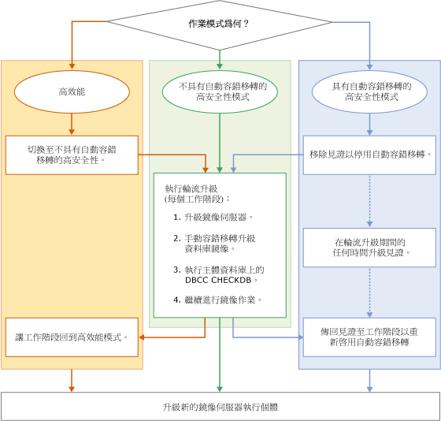

# 升級鏡像執行個體
  將 [!INCLUDE[ssNoVersion](../../includes/ssnoversion-md.md)] 鏡像執行個體升級至新的 [!INCLUDE[ssCurrent](../../includes/sscurrent-md.md)] 版本、新的 [!INCLUDE[ssNoVersion](../../includes/ssnoversion-md.md)] Service Pack 或累積更新或新的 Windows Service Pack 或累積更新時，您可執行輪流升級以將每個鏡像資料庫的停機時間減少至僅單一手動容錯移轉 (回復為原始主要複本時則為兩次手動容錯移轉)。 輪流升級是一種多階段程序，其最簡單的形式包括升級目前在鏡像工作階段中當作鏡像伺服器的 [!INCLUDE[ssCurrent](../../includes/sscurrent-md.md)] 執行個體，然後手動容錯移轉鏡像資料庫、升級之前的主體 [!INCLUDE[ssCurrent](../../includes/sscurrent-md.md)] 執行個體，以及繼續進行鏡像。 實際上，確切的程序會取決於作業模式以及在您要升級之 [!INCLUDE[ssCurrent](../../includes/sscurrent-md.md)] 執行個體上執行的鏡像工作階段數目和配置而定。  
  
> [!NOTE]  
>  如需在移轉期間搭配使用資料庫鏡像與記錄傳送的資訊，請下載此 [Database Mirroring and Log Shipping](https://t.co/RmO6ruCT4J) (資料庫鏡像和記錄傳送) 技術白皮書。  
  
## 必要條件  
 在開始之前，請檢閱以下重要資訊：  
  
-   [Supported Version and Edition Upgrades](../../database-engine/install-windows/supported-version-and-edition-upgrades.md)︰確認您可從您的 Windows 作業系統版本與 SQL Server 版本升級至 SQL Server 2016。 例如，您無法直接從 SQL Server 2005 執行個體升級至 [!INCLUDE[ssCurrent](../../includes/sscurrent-md.md)]。  
  
-   [Choose a Database Engine Upgrade Method](../../database-engine/install-windows/choose-a-database-engine-upgrade-method.md)︰根據您檢閱的支援版本與版本升級，選取適當的升級方法和步驟，此外亦根據作業環境中安裝的其他元件，依正確順序升級元件。  
  
-   [規劃和測試 Database Engine 升級計畫](../../database-engine/install-windows/plan-and-test-the-database-engine-upgrade-plan.md)︰檢閱版本資訊與已知的升級問題、升級前檢查清單，並開發和測試升級計畫。  
  
-   [安裝 SQL Server 2016 的硬體與軟體需求](../../sql-server/install/hardware-and-software-requirements-for-installing-sql-server-2016.md)：檢閱安裝 [!INCLUDE[ssCurrent](../../includes/sscurrent-md.md)] 的軟體需求。 如果需要其他軟體，請先將其安裝在每個節點上，然後開始升級程序，以將任何停機時間降到最低。  
  
## 建議的準備事項 (最佳做法)  
 開始輪流升級之前，我們建議您：  
  
1.  至少在其中一個鏡像工作階段上執行手動容錯移轉練習：  
  
    -   [手動容錯移轉資料庫鏡像工作階段 &#40;SQL Server Management Studio&#41;](../../database-engine/database-mirroring/manually-fail-over-a-database-mirroring-session-sql-server-management-studio.md)  
  
    -   [手動容錯移轉資料庫鏡像工作階段 &#40;Transact-SQL&#41;](../../database-engine/database-mirroring/manually-fail-over-a-database-mirroring-session-transact-sql.md)。  
  
    > [!NOTE]  
    >  如需手動容錯移轉如何運作的資訊，請參閱[資料庫鏡像工作階段期間的角色切換 &#40;SQL Server&#41;](../../database-engine/database-mirroring/role-switching-during-a-database-mirroring-session-sql-server.md)。  
  
2.  保護您的資料：  
  
    1.  在每個主體資料庫上執行完整資料庫備份：  
  
         [建立完整資料庫備份 &#40;SQL Server&#41;](../../relational-databases/backup-restore/create-a-full-database-backup-sql-server.md)。  
  
    2.  在每一個主體資料庫上執行 [DBCC CHECKDB](../../t-sql/database-console-commands/dbcc-checkdb-transact-sql.md) 命令。  
  
## 輪流升級的各個階段  
 輪流升級的特定步驟會因鏡像組態的作業模式而不同。 不過，基本階段都是相同的。  
  
> [!NOTE]  
>  如需作業模式的資訊，請參閱[資料庫鏡像作業模式](../../database-engine/database-mirroring/database-mirroring-operating-modes.md)。  
  
 下圖是一張流程圖，其中針對每個作業模式顯示輪流升級的基本階段。 對應的程序將在該圖之後描述。  
  
   
  
> [!IMPORTANT]  
>  伺服器執行個體可能在並行鏡像工作階段中執行不同的鏡像角色 (主體伺服器、鏡像伺服器或見證)。 在此情況下，您必須依照狀況來配合基本輪流升級程序。 如需詳細資訊，請參閱[資料庫鏡像工作階段期間的角色切換 &#40;SQL Server&#41;](../../database-engine/database-mirroring/role-switching-during-a-database-mirroring-session-sql-server.md)。  
  
> [!NOTE]  
>  在許多情況下，您在完成輪流升級後會容錯回復至原始主體伺服器。  
  
### 將工作階段從高效能模式變更為高安全性模式  
  
1.  如果鏡像工作階段是在高效能模式下執行，請在執行輪流升級之前，將作業模式變更為高安全性模式，而沒有自動容錯移轉。  
  
    > [!IMPORTANT]  
    >  如果鏡像伺服器與主體伺服器之間的地理位置遙遠，輪流升級可能不適合。  
  
    -   在 [!INCLUDE[ssManStudioFull](../../includes/ssmanstudiofull-md.md)] 中：使用 [資料庫屬性] 對話方塊的[鏡像頁面](../../relational-databases/databases/database-properties-mirroring-page.md)，將 [作業模式] 選項變更為 [不具有自動容錯移轉的高安全性 (同步)]。 如需如何存取此頁面的資訊，請參閱[啟動設定資料庫鏡像安全性精靈 &#40;SQL Server Management Studio&#41;](../../database-engine/database-mirroring/start the configuring database mirroring security wizard.md)。  
  
    -   在 [!INCLUDE[tsql](../../includes/tsql-md.md)] 中：將交易安全性設定為 FULL。 如需詳細資訊，請參閱[在資料庫鏡像工作階段中變更交易安全性 &#40;Transact-SQL&#41;](../../database-engine/database-mirroring/change-transaction-safety-in-a-database-mirroring-session-transact-sql.md)  
  
### 從工作階段中移除見證  
  
1.  如果鏡像工作階段牽涉到見證，我們建議您在執行輪流升級之前，最好先移除該見證。 否則，當升級鏡像伺服器執行個體時，資料庫可用性會相依於仍然連接至主體伺服器執行個體的見證。 當您移除見證之後，您可以在輪流升級期間的任何時候將它升級，避免發生資料庫停機的風險。  
  
    > [!NOTE]  
    >  如需詳細資訊，請參閱[仲裁：見證如何影響資料庫可用性 &#40;資料庫鏡像&#41;](../../database-engine/database-mirroring/quorum-how-a-witness-affects-database-availability-database-mirroring.md)。  
  
    -   [從資料庫鏡像工作階段移除見證 &#40;SQL Server&#41;](../../database-engine/database-mirroring/remove-the-witness-from-a-database-mirroring-session-sql-server.md)  
  
### 執行輪流升級  
  
1.  若要讓停機時間減至最少，我們建議您採取以下作法：在所有鏡像工作階段中更新目前為鏡像伺服器的任何鏡像夥伴伺服器，藉以開始輪流升級。 您在此時可能必須更新多個伺服器執行個體。  
  
    > [!NOTE]  
    >  您可以在輪流升級程序的任何時間升級見證。 例如，如果伺服器執行個體在工作階段 1 為鏡像伺服器，而在工作階段 2 為見證，您可以立刻升級此伺服器執行個體。  
  
     要升級的伺服器執行個體首先取決於鏡像工作階段的目前組態，如下面所述：  
  
    -   如果有任何伺服器執行個體在所有鏡像工作階段中已經是鏡像伺服器，請將此伺服器執行個體升級為新的版本。  
  
    -   如果所有的伺服器執行個體目前在任何鏡像工作階段中為主體伺服器，請先選取一個伺服器執行個體來升級。 然後，手動容錯移轉它的每一個主體資料庫，並升級該伺服器執行個體。  
  
     在升級之後，伺服器執行個體會自動重新加入它的每一個鏡像工作階段。  
  
2.  請針對剛剛升級鏡像伺服器執行個體的每一個鏡像工作階段，等候此工作階段同步處理。 然後，連接到主體伺服器執行個體，並手動容錯移轉工作階段。 在容錯移轉時，升級的伺服器執行個體會變成該工作階段的主體伺服器，而之前的主體伺服器會變成鏡像伺服器。  
  
     這個步驟的目標是要讓另一個伺服器執行個體在當做夥伴伺服器的每一個鏡像工作階段中變成鏡像伺服器。  
  
     **在容錯移轉至升級的伺服器執行個體之後的限制**  
  
     當您從舊版伺服器執行個體容錯移轉至 [!INCLUDE[ssCurrent](../../includes/sscurrent-md.md)] 伺服器執行個體之後，資料庫工作階段會暫停。 要等到其他夥伴伺服器升級之後，才會繼續此工作階段。 但是，主體伺服器仍然接受連接，並允許在主體資料庫上進行資料存取和修改。  
  
    > [!NOTE]  
    >  建立新的鏡像工作階段需要所有的伺服器執行個體都執行相同的 [!INCLUDE[ssNoVersion](../../includes/ssnoversion-md.md)] 版本。  
  
3.  在您容錯移轉之後，我們建議您在主體資料庫上執行 [DBCC CHECKDB](../../t-sql/database-console-commands/dbcc-checkdb-transact-sql.md) 命令。  
  
4.  如果有任何伺服器執行個體目前在當做夥伴伺服器的所有鏡像工作階段中為鏡像伺服器，請將它升級。 您在此時可能必須更新多部伺服器。  
  
    > [!IMPORTANT]  
    >  在複雜鏡像組態中，某些伺服器執行個體在一或多個鏡像工作階段中可能仍然是原始的主體伺服器。 請針對這些伺服器執行個體重複步驟 2–4，直到相關的所有執行個體都已升級為止。  
  
5.  繼續鏡像工作階段。  
  
    > [!NOTE]  
    >  要等到升級見證而且加回鏡像工作階段之後，自動容錯移轉才能運作。  
  
6.  如果有任何其餘的伺服器執行個體在所有鏡像工作階段中為見證，請將它升級。 在升級之後，見證會重新加入鏡像工作階段，而自動容錯移轉可再度運作。 您在此時可能必須更新多部伺服器。  
  
### 讓工作階段回到高效能模式  
  
1.  您可以選擇使用下列其中一個方法來回到高效能模式：  
  
    -   在 [!INCLUDE[ssManStudioFull](../../includes/ssmanstudiofull-md.md)] 中：使用 [資料庫屬性] 對話方塊的[鏡像頁面](../../relational-databases/databases/database-properties-mirroring-page.md)，將 [作業模式] 選項變更為 [高效能 (非同步)]。  
  
    -   在 [!INCLUDE[tsql](../../includes/tsql-md.md)]中：使用 [ALTER DATABASE](../Topic/ALTER%20DATABASE%20Database%20Mirroring%20\(Transact-SQL\).md)將交易安全性設定為 OFF。  
  
### 若要將見證加回鏡像工作階段  
  
1.  您可以選擇在高安全性模式下，重新建立每一個鏡像工作階段的見證。  
  
     **返回見證**  
  
    -   [加入或取代資料庫鏡像見證 &#40;SQL Server Management Studio&#41;](../../database-engine/database-mirroring/add-or-replace-a-database-mirroring-witness-sql-server-management-studio.md)  
  
    -   [使用 Windows 驗證加入資料庫鏡像見證 &#40;Transact-SQL&#41;](../../database-engine/database-mirroring/add-a-database-mirroring-witness-using-windows-authentication-transact-sql.md)  
  
## 另請參閱  
 [使用安裝精靈升級為 SQL Server 2016 &#40;安裝程式&#41;](../../database-engine/install-windows/upgrade-to-sql-server-2016-using-the-installation-wizard-setup.md)   
 [從命令提示字元安裝 SQL Server 2016](../../database-engine/install-windows/install-sql-server-2016-from-the-command-prompt.md)   
 [ALTER DATABASE 資料庫鏡像 &#40;Transact-SQL&#41;](../Topic/ALTER%20DATABASE%20Database%20Mirroring%20\(Transact-SQL\).md)   
 [BACKUP &#40;Transact-SQL&#41;](../../t-sql/statements/backup-transact-sql.md)   
 [檢視鏡像資料庫的狀態 &#40;SQL Server Management Studio&#41;](../../database-engine/database-mirroring/view-the-state-of-a-mirrored-database-sql-server-management-studio.md)   
 [資料庫鏡像 &#40;SQL Server&#41;](../../database-engine/database-mirroring/database-mirroring-sql-server.md)   
 [資料庫鏡像工作階段期間的角色切換 &#40;SQL Server&#41;](../../database-engine/database-mirroring/role-switching-during-a-database-mirroring-session-sql-server.md)   
 [在資料庫鏡像工作階段中強制服務 &#40;Transact-SQL&#41;](../../database-engine/database-mirroring/force-service-in-a-database-mirroring-session-transact-sql.md)   
 [啟動資料庫鏡像監視器 &#40;SQL Server Management Studio&#41;](../../database-engine/database-mirroring/start-database-mirroring-monitor-sql-server-management-studio.md)   
 [資料庫鏡像作業模式](../../database-engine/database-mirroring/database-mirroring-operating-modes.md)  
  
  