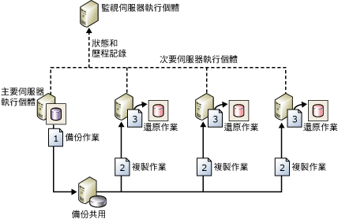

# 關於記錄傳送 (SQL Server)

[!INCLUDE [SQL Server](../../includes/applies-to-version/sqlserver.md)]

  [!INCLUDE[ssNoVersion](../../includes/ssnoversion-md.md)] 記錄傳送可讓您將 *「主要伺服器」* 執行個體上 *「主要資料庫」* 中的交易記錄備份，自動傳送到個別的 *「次要伺服器」* 執行個體上的一個或多個 *「次要資料庫」* 。 交易記錄備份會個別套用到每一個次要資料庫。 第三部選擇性的伺服器執行個體，稱為 *「監視伺服器」* ，負責記錄備份和還原作業的記錄與狀態，如果這些作業未依排程進行，還可以選擇性地發出警示。  
  
 **本主題內容：**  
  
-   [優點](#Benefits)  
  
-   [詞彙和定義](#TermsAndDefinitions)  
  
-   [記錄傳送概觀](#ComponentsAndConcepts)  
  
-   [互通性](#Interoperability)  
  
-   [相關工作](#RelatedTasks)  
  
##   優點  
  
-   為單一主要資料庫以及一個或多個次要資料庫 (每個資料庫都位於單獨的 [!INCLUDE[ssNoVersion](../../includes/ssnoversion-md.md)]執行個體上) 提供災害復原方案。  
  
-   支援對次要資料庫的有限唯讀存取 (在還原作業之間的間隔期間)。  
  
-   可讓使用者指定在主要伺服器備份主要資料庫的記錄檔之後，延遲多久次要伺服器才必須還原 (套用) 記錄備份。 長時間的延遲可能會有幫助，例如，當您意外變更了主要資料庫上的資料時。 如果您很快就注意到這項意外變更，延遲便可讓您在次要資料庫反映變更之前，從次要資料庫擷取尚未變更的資料。  
  
##   詞彙和定義  
 「主要資料庫」  
 做為實際執行伺服器的 [!INCLUDE[ssNoVersion](../../includes/ssnoversion-md.md)] 執行個體。  
  
 「主要伺服器」  
 主要伺服器上的資料庫，也就是您要備份至其他伺服器的資料庫。 所有透過 [!INCLUDE[ssManStudioFull](../../includes/ssmanstudiofull-md.md)] 進行的記錄傳送組態管理，都是從主要資料庫執行。  
  
 「次要資料庫」  
 您要在其中保留主要資料庫暖待命副本的 [!INCLUDE[ssNoVersion](../../includes/ssnoversion-md.md)] 執行個體。  
  
 次要資料庫  
 主要資料庫的暖待命副本。 次要資料庫可以處於 RECOVERING 狀態或 STANDBY 狀態，讓資料庫提供有限的唯讀存取。  
  
 「監視伺服器」  
 選擇性的 [!INCLUDE[ssNoVersion](../../includes/ssnoversion-md.md)] 執行個體，可以追蹤記錄傳送的所有詳細資料，包括：  
  
-   主要資料庫上次備份交易記錄檔的時間。  
  
-   次要伺服器上次複製及還原備份檔案的時間。  
  
-   任何備份失敗警示的相關資訊。  
  
> [!IMPORTANT]  
>  在設定監視伺服器之後，如果未先移除記錄傳送，就無法進行變更。  
  
 備份作業 (backup job)  
 [!INCLUDE[ssNoVersion](../../includes/ssnoversion-md.md)] Agent 作業，可執行備份作業、將記錄記錄到本機伺服器與監視伺服器上，以及刪除舊的備份檔案與記錄資訊。 啟用記錄傳送時，「記錄傳送備份」作業類別目錄會在主要伺服器執行個體上建立。  
  
 複製作業 (copy job)  
 [!INCLUDE[ssNoVersion](../../includes/ssnoversion-md.md)] Agent 作業，可將主要伺服器的備份檔案複製到次要伺服器上可設定的目的地，並在次要伺服器與監視伺服器上記錄記錄。 在資料庫上啟用記錄傳送時，「記錄傳送複製」作業類別目錄會在每個次要伺服器執行個體的記錄傳送組態中建立。  
  
 還原作業 (restore job)  
 [!INCLUDE[ssNoVersion](../../includes/ssnoversion-md.md)] Agent 作業，可將複製的備份檔案還原到次要資料庫上。 它可將記錄在本機伺服器與監視伺服器上，並刪除舊的檔案與記錄資訊。 在資料庫上啟用記錄傳送時，「記錄傳送還原」作業類別目錄會在次要伺服器執行個體上建立。  
  
 警示作業 (alert job)  
 [!INCLUDE[ssNoVersion](../../includes/ssnoversion-md.md)] Agent 作業，若備份或還原作業未在指定臨界值內順利完成，此作業就會為主要及次要資料庫發出警示。 在資料庫上啟用記錄傳送時，「記錄傳送警示」作業類別目錄會在監視伺服器執行個體上建立。  
  
> [!TIP]  
>  對於每個警示，您需要指定警示編號。 此外，請務必設定警示，以便在引發警示時通知操作員。  
  
##   記錄傳送概觀  
 記錄傳送由三項作業組成：  
  
1.  在主要伺服器執行個體上備份交易記錄檔。  
  
2.  將交易記錄檔複製到次要伺服器執行個體上。  
  
3.  在次要伺服器執行個體上還原記錄備份。  
  
 記錄可傳送到多個次要伺服器執行個體上。 在此情況下，會為每個次要伺服器執行個體重複執行作業 2 與作業 3。  
  
 記錄傳送組態不會自動從主要伺服器容錯移轉到次要伺服器， 若主要資料庫無法使用，您可以手動將任何次要資料庫連上線。  
  
 您可以將次要資料庫做為報表用途。  
  
 此外，您可以在記錄傳送組態中設定警示。  
  
### 典型記錄傳送組態  
 下圖顯示的記錄傳送組態含有主要伺服器執行個體、三個次要伺服器執行個體和一個監視伺服器執行個體。 此圖說明備份、複製和還原作業執行的步驟，如下所示：  
  
1.  主要伺服器執行個體執行備份作業來備份主要資料庫上的交易記錄。 此伺服器執行個體將記錄備份放在主要記錄備份檔中，再將它傳送到備份資料夾。  在此圖中，備份資料夾位於共用目錄，亦即「備份共用」。  
  
2.  三個次要伺服器執行個體的每一個都執行它自己的複製作業，將主要記錄備份檔複製到它自己的本機目的資料夾。  
  
3.  每一個次要伺服器執行個體執行它自己的還原作業，將本機目的資料夾的記錄備份還原到本機次要資料庫。  
  
 主要和次要伺服器執行個體傳送其記錄和狀態至監視伺服器執行個體。  
  
   
  
##   互通性  
 記錄傳送只能與 [!INCLUDE[ssNoVersion](../../includes/ssnoversion-md.md)]的下列功能或元件搭配使用：  
  
-   [從記錄傳送移轉至 AlwaysOn 可用性群組的必要條件 &#40;SQL Server&#41;](../../database-engine/availability-groups/windows/prereqs-migrating-log-shipping-to-always-on-availability-groups.md)  
  
-   [資料庫鏡像和記錄傳送 &#40;SQL Server&#41;](../../database-engine/database-mirroring/database-mirroring-and-log-shipping-sql-server.md)  
  
-   [記錄傳送和複寫 &#40;SQL Server&#41;](../../database-engine/log-shipping/log-shipping-and-replication-sql-server.md)  
  
> [!NOTE]  
>  [!INCLUDE[ssHADR](../../includes/sshadr-md.md)] 和資料庫鏡像互斥。 資料庫已設定其中一項功能後，便不能設定另一項功能。  
  
##   相關工作  
  
-   [將記錄傳送升級至 SQL Server 2016 &#40;Transact-SQL&#41;](../../database-engine/log-shipping/upgrading-log-shipping-to-sql-server-2016-transact-sql.md)  
  
-   [設定記錄傳送 &#40;SQL Server&#41;](../../database-engine/log-shipping/configure-log-shipping-sql-server.md)  
  
-   [將次要資料庫加入至記錄傳送組態 &#40;SQL Server&#41;](../../database-engine/log-shipping/add-a-secondary-database-to-a-log-shipping-configuration-sql-server.md)  
  
-   [從記錄傳送組態中移除次要資料庫 &#40;SQL Server&#41;](../../database-engine/log-shipping/remove-a-secondary-database-from-a-log-shipping-configuration-sql-server.md)  
  
-   [移除記錄傳送 &#40;SQL Server&#41;](../../database-engine/log-shipping/remove-log-shipping-sql-server.md)  
  
-   [檢視記錄傳送報表 &#40;SQL Server Management Studio&#41;](../../database-engine/log-shipping/view-the-log-shipping-report-sql-server-management-studio.md)  
  
-   [監視記錄傳送 &#40;Transact-SQL&#41;](../../database-engine/log-shipping/monitor-log-shipping-transact-sql.md)  
  
-   [容錯移轉至記錄傳送次要 &#40;SQL Server&#41;](../../database-engine/log-shipping/fail-over-to-a-log-shipping-secondary-sql-server.md)  
  
-   [容錯移轉至記錄傳送次要 &#40;SQL Server&#41;](../../database-engine/log-shipping/fail-over-to-a-log-shipping-secondary-sql-server.md)  
  
-   [角色切換後針對登入和作業進行管理 &#40;SQL Server&#41;](../../sql-server/failover-clusters/management-of-logins-and-jobs-after-role-switching-sql-server.md)  
  
## 另請參閱  
 [AlwaysOn 可用性群組概觀 &#40;SQL Server&#41;](../../database-engine/availability-groups/windows/overview-of-always-on-availability-groups-sql-server.md)  
  
  
