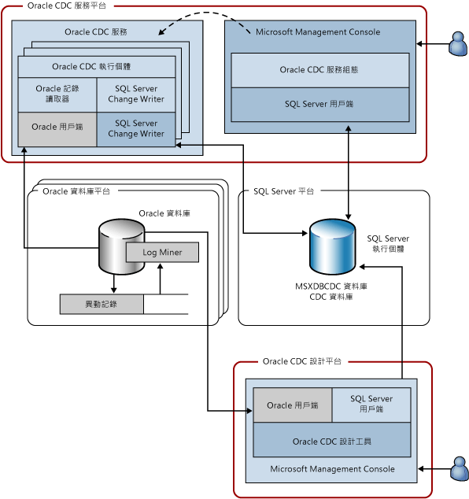

# Attunity Oracle Change Data Capture (CDC) 服務系統架構

[!INCLUDE[ssis-appliesto](../../includes/ssis-appliesto-ssvrpluslinux-asdb-asdw-xxx.md)]

  Oracle CDC 服務會將一個或多個來源 Oracle 資料庫中選定資料表所做的變更擷取到位於 [!INCLUDE[ssNoVersion](../../includes/ssnoversion-md.md)] 執行個體上的 [!INCLUDE[ssNoVersion](../../includes/ssnoversion-md.md)] CDC 資料庫中。 下圖顯示組成 Oracle CDC 服務的元件。  
  
   
  
 這個圖說明使用的四個平台。 在許多情況下，這些平台可以重疊，但是這個圖代表標準使用情況。 例如，以下是合理的情況：Oracle 和 [!INCLUDE[ssNoVersion](../../includes/ssnoversion-md.md)] 資料庫各自在不同的電腦上執行，而且不與 Oracle CDC 服務平台或是設計 CDC 服務所使用的平台共用。 此圖所說明的平台如下：  
  
-   Oracle CDC 服務：這可以是安裝和執行 Oracle CDC 服務所在任何支援的 Windows 電腦。 這個平台也可能代表 Microsoft 容錯移轉叢集中的叢集節點 (本文稍後會討論高可用性組態)。  
  
-   Oracle 資料庫：這可以是執行支援的 Oracle 資料庫版本所在的任何電腦。 其中包括執行 Windows、Linux 或是安裝之 Oracle 資料庫版本所支援的任何其他作業系統的電腦。 請注意，此圖以複數形式顯示這個平台，因為單一 Oracle CDC 服務可以從多個來源 Oracle 資料庫擷取變更。  
  
-   [!INCLUDE[ssNoVersion](../../includes/ssnoversion-md.md)]：這可以是執行目標 [!INCLUDE[ssNoVersion](../../includes/ssnoversion-md.md)] 資料庫 ([!INCLUDE[ssCurrent](../../includes/sscurrent-md.md)] 支援的 SKU) 所在的任何電腦。 Oracle CDC 服務支援一個 [!INCLUDE[ssNoVersion](../../includes/ssnoversion-md.md)] 目標，它會將變更資料表和服務組態儲存在此目標上。 [!INCLUDE[ssNoVersion](../../includes/ssnoversion-md.md)] 平台也可能代表 [!INCLUDE[ssCurrent](../../includes/sscurrent-md.md)] 的叢集執行個體，或是使用 [!INCLUDE[ssCurrent](../../includes/sscurrent-md.md)] AlwaysOn **功能的** 鏡像執行個體。  
  
-   Oracle CDC 設計工具：這可以是可存取來源 Oracle 資料庫和目標 [!INCLUDE[ssNoVersion](../../includes/ssnoversion-md.md)] 資料庫的任何支援的 Windows 電腦。  
  
 下表描述在上述四個平台上執行的元件。  
  
|元件/描述|元件的組成項目：|  
|----------------------------|----------------------------|  
|Oracle CDC 服務：這是異動資料擷取活動執行所在的 Windows 服務。|Oracle CDC 執行個體：Oracle CDC 服務的一個子處理序，可處理單一來源 Oracle 資料庫的異動資料擷取活動 (每個來源 Oracle 資料庫有一個 Oracle CDC 執行個體)。|  
||Oracle 記錄讀取器：使用 Oracle 用戶端讀取 Oracle 交易記錄。|  
||Oracle 用戶端：用於與 Oracle 通訊的 Oracle Instant Client。 這是應該從 Oracle 取得的必要元件，而且必須在安裝 Oracle CDC 服務之前安裝。|  
||[!INCLUDE[ssNoVersion](../../includes/ssnoversion-md.md)] 變更寫入器：這會將擷取的 Oracle 資料表所做的認可變更寫入 [!INCLUDE[ssNoVersion](../../includes/ssnoversion-md.md)] 變更資料表。 此元件也會在目標 [!INCLUDE[ssNoVersion](../../includes/ssnoversion-md.md)] 資料庫中維護該擷取狀態。|  
||[!INCLUDE[ssNoVersion](../../includes/ssnoversion-md.md)]ODBC 用戶端：Microsoft Native Client for [!INCLUDE[ssCurrent](../../includes/sscurrent-md.md)]。 這是應該從 Microsoft 取得的必要元件，而且必須在安裝 Oracle CDC 服務之前安裝。|  
|Oracle CDC 服務設定：這是建立 Windows 服務並設定其組態的 Microsoft Management Console 嵌入式管理單元。|[!INCLUDE[ssNoVersion](../../includes/ssnoversion-md.md)] 用戶端：隨附在 .NET framework 版本 4 中的 SQL ADO.NET 用戶端。|  
|Oracle 資料庫：來源 Oracle 資料庫，可從中擷取選取資料表的變更。|記錄採礦器：一種 Oracle 元件，可透過此元件讀取 Oracle 交易記錄。|  
||交易記錄：Oracle 所使用的線上和封存的 Oracle 重做記錄，以確保資料庫可以回復交易，並從失敗復原 (在此情況下，Oracle 資料庫必須在封存-記錄模式中操作)。|  
|[!INCLUDE[ssNoVersion](../../includes/ssnoversion-md.md)] 執行個體：裝載 CDC 資料庫的 [!INCLUDE[ssNoVersion](../../includes/ssnoversion-md.md)] 執行個體。 這可能是 [!INCLUDE[ssNoVersion](../../includes/ssnoversion-md.md)] 叢集執行個體 (容錯移轉叢集) 或鏡像資料庫 (AlwaysOn)。|MSXDBCDC 資料庫：用來保存與此 [!INCLUDE[ssNoVersion](../../includes/ssnoversion-md.md)] 執行個體一起運作之 CDC 服務相關資訊的資料庫。 它也會保存有關每一個 CDC 服務所處理之 Oracle CDC 執行個體的資訊。 這個資料庫會在建立 CDC 服務的過程中建立。|  
||CDC 資料庫：儲存其中一個來源 Oracle 資料庫所做之變更的 [!INCLUDE[ssNoVersion](../../includes/ssnoversion-md.md)] 資料庫。 CDC 資料庫會啟用 [!INCLUDE[ssNoVersion](../../includes/ssnoversion-md.md)] CDC，好讓這些資料庫擁有 [!INCLUDE[ssNoVersion](../../includes/ssnoversion-md.md)] CDC 資料表和函數，如此便可輕鬆地取用來自 Oracle 的變更。|  
|Oracle CDC 設計工具：可協助建立 Oracle CDC 執行個體的 Microsoft Management Console 嵌入式管理單元。 使用這個項目來選取要擷取的資料表和資料行、提供 Oracle 連接資訊及管理 CDC 執行個體的生命週期。|[!INCLUDE[ssNoVersion](../../includes/ssnoversion-md.md)] 用戶端：隨附在 .NET framework 版本 4 中的 SQL ADO.NET 用戶端。|  
||Oracle 用戶端：用於與 Oracle 通訊的 Oracle Instant Client。 這是應該從 Oracle 取得的必要元件，而且必須在安裝 Oracle CDC 服務之前安裝。|  
  
 Oracle CDC 服務和其子項 Oracle CDC 執行個體只能與來源 Oracle 資料庫及當做用戶端的目標 [!INCLUDE[ssNoVersion](../../includes/ssnoversion-md.md)] 執行個體通訊。 它們不會主動接聽任何網路或其他通訊協定。 Oracle CDC 服務會監控 CDC 資料庫中的組態變更，並根據更新的組態更新其作業。  
  
  
