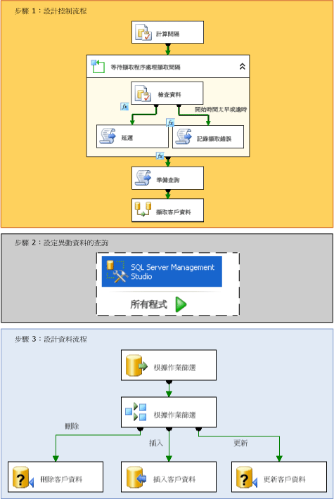

# 異動資料擷取 (SSIS)

[!INCLUDE[ssis-appliesto](../../includes/ssis-appliesto-ssvrpluslinux-asdb-asdw-xxx.md)]

  在 [!INCLUDE[ssNoVersion](../../includes/ssnoversion-md.md)] 中，異動資料擷取會針對將累加式載入從來源資料表有效執行到資料超市和資料倉儲的挑戰，提供有效的方案。  
  
## 什麼是異動資料擷取？  
 來源資料表會隨著時間變更。 以這些資料表為基礎的資料超市或資料倉儲必須反映這些變更。 不過，定期複製完整來源之快照集的程序會耗費太多時間和資源。 包括時間戳記資料行、觸發程序或複雜查詢的替代方式通常有損效能並增加複雜度。 需要的是變更資料結構化的可靠資料流，讓消費者可以將其輕鬆地套用到資料的目標表示法。 [!INCLUDE[ssNoVersion](../../includes/ssnoversion-md.md)] 中的異動資料擷取會提供這個解決方案。  
  
 [!INCLUDE[ssDE](../../includes/ssde-md.md)] 的異動資料擷取功能會擷取套用到 [!INCLUDE[ssNoVersion](../../includes/ssnoversion-md.md)] 資料表的插入、更新與刪除活動，並以容易取用的關聯式格式，提供變更的詳細資料。 異動資料擷取所使用的變更資料表包含鏡像追蹤來源資料表之資料行結構的資料行，以及了解逐資料列發生之變更所需的中繼資料。  
  
> [!NOTE]
>  並非每個 [!INCLUDE[msCoName](../../includes/msconame-md.md)][!INCLUDE[ssNoVersion](../../includes/ssnoversion-md.md)]版本中都無法異動資料擷取。 如需 [!INCLUDE[ssNoVersion](../../includes/ssnoversion-md.md)]版本支援的功能清單，請參閱 [SQL Server 2016 版本支援的功能](~/sql-server/editions-and-supported-features-for-sql-server-2016.md)。  
  
## 異動資料擷取在 Integration Services 中的運作方式  
 [!INCLUDE[ssISnoversion](../../includes/ssisnoversion-md.md)] 封裝可以輕易地收集 [!INCLUDE[ssNoVersion](../../includes/ssnoversion-md.md)] 資料庫中的異動資料，從而對資料倉儲執行有效率的累加式載入。 不過，在您可以使用 [!INCLUDE[ssISnoversion](../../includes/ssisnoversion-md.md)] 載入變更資料前，管理員必須在您要擷取變更的資料庫和資料表上啟用異動資料擷取。 如需如何在資料庫上設定異動資料擷取的詳細資訊，請參閱[啟用和停用異動資料擷取 &#40;SQL Server&#41;](../../relational-databases/track-changes/enable-and-disable-change-data-capture-sql-server.md)。  
  
 一旦管理員已經在資料庫上啟用異動資料擷取，您就可以建立執行累加式變更資料載入的封裝。 下圖顯示建立可從單一資料表執行累加式載入這種封裝的步驟：  
  
   
  
 如上圖所示，建立可執行累加式變更資料載入的封裝包含下列步驟：  
  
 **步驟 1：設計控制流程**  
 在封裝的控制流程中，必須定義下列工作：  
  
-   針對您要擷取的來源資料，計算變更間隔的開始和結束 **datetime** 值。  
  
     若要計算這些值，請搭配 [!INCLUDE[ssISnoversion](../../includes/ssisnoversion-md.md)] datetime **函數使用「執行 SQL」工作或** 運算式。 然後您可以用封裝變數儲存這些端點，以便稍後在封裝中使用。  
  
     **如需詳細資訊：＜＞**[指定變更資料的間隔](../../integration-services/change-data-capture/specify-an-interval-of-change-data.md)  
  
-   判斷所選間隔的變更資料是否就緒。 由於非同步的擷取程序可能還沒有達到所選的端點，因此這是必要的步驟。  
  
     若要判斷資料是否就緒，如果必要，開始使用「For 迴圈」容器延遲執行，直到所選間隔的變更資料就緒為止。 在迴圈容器內部，使用「執行 SQL」工作查詢由異動資料擷取所維護的時間對應資料表。 然後，使用呼叫 **Thread.Sleep** 方法的「指令碼」工作，或搭配 **WAITFOR** 陳述式使用另一個「執行 SQL」工作，暫時延遲封裝的執行 (如有必要)。 或者，使用其他「指令碼」工作記錄錯誤條件或逾時。  
  
     **如需詳細資訊：＜＞**[判斷變更資料是否就緒](../../integration-services/change-data-capture/determine-whether-the-change-data-is-ready.md)  
  
-   準備將用於查詢變更資料的查詢字串。  
  
     使用「指令碼」工作或「執行 SQL」工作來組合將用於查詢變更的 SQL 陳述式。  
  
     **如需詳細資訊：＜＞**[準備查詢變更資料](../../integration-services/change-data-capture/prepare-to-query-for-the-change-data.md)  
  
 **步驟 2：設定異動資料的查詢**  
 建立將會查詢資料的資料表值函數。  
  
 使用 [!INCLUDE[ssManStudioFull](../../includes/ssmanstudiofull-md.md)] 來開發及儲存查詢。  
  
 **如需詳細資訊：＜＞**[擷取與了解變更資料](../../integration-services/change-data-capture/retrieve-and-understand-the-change-data.md)  
  
 **步驟 3：步驟 3：設計資料流程**  
 在封裝的資料流程中，必須定義下列工作：  
  
-   從變更資料表擷取變更資料。  
  
     若要擷取資料，使用來源元件來查詢所選間隔內之變更的變更資料表。 此來源會呼叫您必須在先前已經建立的 Transact-SQL 資料表值函數。  
  
     **如需詳細資訊：＜＞**[擷取與了解變更資料](../../integration-services/change-data-capture/retrieve-and-understand-the-change-data.md)  
  
-   將變更分割為要處理的插入、更新與刪除。  
  
     若要分割變更，使用「條件式分割」轉換，將插入、更新與刪除導引到不同的輸出以便進行適當的處理。  
  
     **如需詳細資訊：＜＞**[處理插入、更新與刪除作業](../../integration-services/change-data-capture/process-inserts-updates-and-deletes.md)  
  
-   將插入、刪除與更新套用到目的地。  
  
     若要將變更套用到目的地，請使用目的地元件，將插入套用到目的地。 同時，搭配參數化的 UPDATE 和 DELETE 陳述式使用「OLE DB 命令」轉換，將更新與刪除套用到目的地。 您也可以使用目的地元件來套用更新與刪除，以便將資料列儲存到暫存資料表中。 接著，使用「執行 SQL」工作，根據暫存資料表的目的地，執行大量更新與大量刪除作業。  
  
     **如需詳細資訊：＜＞**[將變更套用到目的地](../../integration-services/change-data-capture/apply-the-changes-to-the-destination.md)  
  
### 多個資料表的資料變更  
 在上圖與上述步驟中所述的程序包含來自單一資料表的累加式載入。 當您必須從多個資料表執行累加式載入時，整個程序都相同。 不過，必須變更封裝的設計以配合多個資料表的處理。 如需如何建立可從多個資料表執行累加式載入之封裝的詳細資訊，請參閱 [執行多個資料表的累加式載入](../../integration-services/change-data-capture/perform-an-incremental-load-of-multiple-tables.md)。  
  
## 異動資料擷取封裝的範例  
 [!INCLUDE[ssISnoversion](../../includes/ssisnoversion-md.md)] 提供兩個範例，示範如何在封裝中使用異動資料擷取。 如需詳細資訊，請參閱下列主題：  
  
-   [讀我檔案_指定之間隔的異動資料擷取封裝範例](https://go.microsoft.com/fwlink/?LinkId=133507)  
  
-   [讀我檔案_自上次要求後的異動資料擷取封裝範例](https://go.microsoft.com/fwlink/?LinkId=133508)  
  
## 相關工作  
  
-   [指定變更資料的間隔](../../integration-services/change-data-capture/specify-an-interval-of-change-data.md)  
  
-   [判斷變更資料是否就緒](../../integration-services/change-data-capture/determine-whether-the-change-data-is-ready.md)  
  
-   [準備查詢變更資料](../../integration-services/change-data-capture/prepare-to-query-for-the-change-data.md)  
  
-   [建立函式以擷取變更資料](../../integration-services/change-data-capture/create-the-function-to-retrieve-the-change-data.md)  
  
-   [擷取與了解變更資料](../../integration-services/change-data-capture/retrieve-and-understand-the-change-data.md)  
  
-   [處理插入、更新與刪除作業](../../integration-services/change-data-capture/process-inserts-updates-and-deletes.md)  
  
-   [將變更套用到目的地](../../integration-services/change-data-capture/apply-the-changes-to-the-destination.md)  
  
-   [執行多個資料表的累加式載入](../../integration-services/change-data-capture/perform-an-incremental-load-of-multiple-tables.md)  
  
## 相關內容  
 sqlblog.com 上的部落格文章：[SSIS Design Pattern – Incremental Load](https://go.microsoft.com/fwlink/?LinkId=217679)(SSIS 設計模式 - 累加式載入)  
  
  
