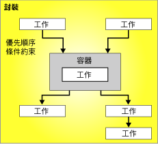

# 控制流程
  封裝由控制流程及選擇性的一個或多個資料流程所組成。 [!INCLUDE[ssNoVersion](../../includes/ssnoversion-md.md)][!INCLUDE[ssISnoversion](../../includes/ssisnoversion-md.md)]提供三種不同類型的控制流程元素： 提供封裝、 工作提供功能，以及連接成一個排序的控制流程的可執行檔、 容器和工作的優先順序條件約束中結構的容器。  
  
 如需相關資訊，請參閱 [Precedence Constraints](../../integration-services/control-flow/precedence-constraints.md)、 [Integration Services Containers](../../integration-services/control-flow/integration-services-containers.md)及 [Integration Services Tasks](../../integration-services/control-flow/integration-services-tasks.md)。  
  
 下圖顯示具有一個容器和六個工作的控制流程。 其中五個工作是在封裝層級定義，另外有一個工作是在容器層級定義， 該工作會位在容器內。  
  
   
  
 [!INCLUDE[ssISnoversion](../../includes/ssisnoversion-md.md)] 架構支援巢狀容器，且控制流程中可包含多個層級的巢狀容器。 例如，封裝中可以包含諸如「Foreach 迴圈」容器，而該容器中可再包含另一個「Foreach 迴圈」容器，依此類推。  
  
 事件處理常式也有控制流程，而且是使用相同類型的控制流程元素來建立。  
  
## 控制流程實作  
 您可以使用 **設計師的** [控制流程] [!INCLUDE[ssIS](../../includes/ssis-md.md)] 索引標籤，在封裝中建立控制流程。 當 **[控制流程]** 索引標籤作用中時，工具箱內會包含可加入控制流程的工作和容器。  
  
 下圖顯示控制流程設計師中某個簡單封裝的控制流程。 圖中顯示的控制流程由三個封裝層級的工作，和包含這三個工作的一個封裝層級容器組成。 使用優先順序條件約束連接工作與容器。  
  
   
  
 建立控制流程包括下列工作：  
  
-   加入容器，該容器可以實作封裝中重複的工作流程，或將一個控制流程分割成幾個子集。  
  
-   加入工作，該工作可支援資料流程、準備資料、執行工作流程和商業智慧功能，以及實作指令碼。  
  
     [!INCLUDE[ssISnoversion](../../includes/ssisnoversion-md.md)] 包括各種工作，您可使用這些工作建立滿足封裝商務需求的控制流程。 如果封裝必須使用資料，則控制流程必須至少包含一個「資料流程」工作。 例如，封裝可能必須擷取資料、彙總資料值，然後將結果寫入資料來源。  如需詳細資訊，請參閱 [Integration Services 工作](../../integration-services/control-flow/integration-services-tasks.md) 和 [在控制流程中加入或刪除工作或容器](../../integration-services/control-flow/add-or-delete-a-task-or-a-container-in-a-control-flow.md)。  
  
-   使用優先順序條件約束將容器與工作連接成一個排序控制流程。  
  
     將工作或容器加入 **[控制流程]** 索引標籤的設計介面後， [!INCLUDE[ssIS](../../includes/ssis-md.md)] 設計師會自動將連接子加入該項目。 如果封裝包括兩個以上的項目、工作或容器，則您可透過將它們的連接子從一個項目拖曳至另一個項目，來將其聯結到控制流程中。  
  
     兩個項目之間的連接子代表一個優先順序條件約束。 優先順序條件約束定義兩個已連接項目之間的關聯性。 它指定在執行階段工作與容器的執行順序，以及執行工作與容器的條件約束。 例如，優先順序條件約束可以指定某個工作必須成功，然後才可以執行控制流程中的下一個工作。 如需詳細資訊，請參閱 [Precedence Constraints](../../integration-services/control-flow/precedence-constraints.md)。  
  
-   加入連接管理員。  
  
     許多工作都需要連接到資料來源，因此您必須將工作所需的連接管理員加入封裝。 視其使用的列舉值類型而定，「Foreach 迴圈」容器也可能需要連接管理員。 您可以在逐項建構控制流程時，或在開始建構控制流程之前加入連接管理員。 如需詳細資訊，請參閱 [Integration Services &#40;SSIS&#41; 連接](../../integration-services/connection-manager/integration-services-ssis-connections.md)和[建立連接管理員](http://msdn.microsoft.com/library/6ca317b8-0061-4d9d-b830-ee8c21268345)。  
  
 [!INCLUDE[ssIS](../../includes/ssis-md.md)]設計工具也包含許多設計階段功能可用來管理設計介面，並使控制流程可以自我記錄。  
  
## 相關工作  
  
-   [加入或刪除工作或容器中的控制流程](../../integration-services/control-flow/add-or-delete-a-task-or-a-container-in-a-control-flow.md)  
  
-   [設定工作或容器的屬性](http://msdn.microsoft.com/library/52d47ca4-fb8c-493d-8b2b-48bb269f859b)  
  
-   [群組或取消群組的元件](../../integration-services/group-or-ungroup-components.md)  
  
  

