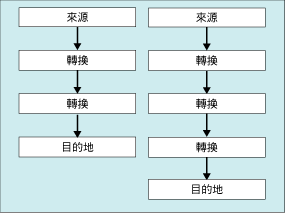

# 資料流程工作
  資料流程工作會封裝在來源與目的地之間移動資料的資料流程引擎，並讓使用者在資料移動時轉換、清除及修改資料。 將資料流程工作加入封裝控制流程，使得封裝擷取、轉換和載入資料成為可能。  
  
 資料流程至少要包含一個資料流程元件，但通常資料流程是一組連接的資料流程元件：擷取資料的來源；修改、路由或摘要資料的轉換；載入資料的目的地。  
  
 在執行階段，資料流程工作會從資料流程建立執行計畫，而資料流程引擎會執行該計畫。 您可以建立不具有資料流程的資料流程工作，但只有在至少含有一個資料流程時才會執行該工作。  
  
 若要從文字檔將資料大量插入 [!INCLUDE[ssNoVersion](../../includes/ssnoversion-md.md)] 資料庫，您可以使用「大量插入」工作取代資料流程工作和資料流程。 但是，「大量插入」工作無法轉換資料。 如需詳細資訊，請參閱 [大量插入工作](../../integration-services/control-flow/bulk-insert-task.md)。  
  
## 多個資料流程  
 資料流程工作可包含多個資料流程。 如果工作複製數個資料集，且不需要特別考慮複製資料的順序，則在資料流程工作中包含多個資料流程會更方便。 例如，您可以建立五個資料流程，每個資料流程都可將資料從一般檔案複製到資料倉儲星狀結構描述中的其他維度資料表。  
  
 但是，當一個資料流程工作中存在多個資料流程時，資料流程引擎會決定執行順序。 因此，當必須考慮順序時，封裝應使用多個資料流程工作，且每個工作包含一個資料流程。 然後，您可以套用優先順序條件約束，以控制工作的執行順序。  
  
 下圖顯示具有多個資料流程的資料流程工作。  
  
   
  
## 記錄項目  
 [!INCLUDE[ssISnoversion](../../includes/ssisnoversion-md.md)] 提供一組可用於所有工作的記錄事件。 [!INCLUDE[ssISnoversion](../../includes/ssisnoversion-md.md)] 也為許多工作提供自訂記錄項目。 如需詳細資訊，請參閱 [Integration Services &#40;SSIS&#41; 記錄](../../integration-services/performance/integration-services-ssis-logging.md)。 資料流程工作包含下列自訂記錄項目：  
  
|記錄項目|說明|  
|---------------|-----------------|  
|**BufferSizeTuning**|指出資料流程工作已經變更緩衝區的大小。 記錄項目會描述大小變更的原因，並列出暫存的新緩衝區大小。|  
|**OnPipelinePostEndOfRowset**|表示已經為元件指定了資料列集結尾信號，此信號是由 **ProcessInput** 方法的最後一次呼叫所設定。 處理輸入之資料流程中的每個元件都會寫入一個項目。 項目中包含元件的名稱。|  
|**OnPipelinePostPrimeOutput**|指出元件已經完成 **PrimeOutput** 方法的最後一次呼叫。 根據資料流程而定，可能會寫入多個記錄項目。 如果元件是來源，這個記錄項目則表示元件已經完成資料列的處理。|  
|**OnPipelinePreEndOfRowset**|指出元件即將接收其資料列集結尾信號，此信號是由 **ProcessInput** 方法的最後一次呼叫所設定。 處理輸入之資料流程中的每個元件都會寫入一個項目。 項目中包含元件的名稱。|  
|**OnPipelinePrePrimeOutput**|指出元件即將從 **PrimeOutput** 方法接收其呼叫。 根據資料流程而定，可能會寫入多個記錄項目。|  
|**OnPipelineRowsSent**|報告由 **ProcessInput** 方法之呼叫提供給元件輸入的資料列數目。 記錄項目會包含元件名稱。|  
|**PipelineBufferLeak**|提供在緩衝區管理員停止之後使緩衝區保持運作之任何元件的相關資訊。 如果緩衝區仍然在作用中，就不會釋放緩衝區資源，並可能造成記憶體遺漏的問題。 記錄項目會提供元件的名稱和緩衝區的識別碼。|  
|**PipelineComponentTime**|報告元件在五個主要處理步驟的每個步驟中所花費的時間量 (以毫秒為單位)：Validate、PreExecute、PostExecute、ProcessInput 和 ProcessOutput。|  
|**PipelineExecutionPlan**|報告資料流程的執行計畫。 執行計畫提供有關如何將緩衝區傳送至元件的資訊， 這項資訊會結合 PipelineExecutionTrees 記錄項目，以描述資料流程工作內所發生的情況。|  
|**PipelineExecutionTrees**|報告資料流程中的配置執行樹狀目錄。 資料流程引擎的排程器會使用這些樹狀目錄來建立資料流程的執行計畫。|  
|**PipelineInitialization**|提供有關工作的初始化資訊。 這項資訊包括作為 BLOB 資料暫存儲存位置使用的目錄、預設緩衝區大小，以及緩衝區中的資料列數目。 根據資料流程工作的組態而定，可能會寫入多個記錄項目。|  
  
 這些記錄項目會提供每次您執行封裝時許多有關資料流程工作執行的資訊。 當您重複執行封裝時，所擷取的資訊會隨著時間累積，而提供工作執行之處理、可能會影響效能之問題、以及工作處理之資料量等重要的記錄資訊。  
  
 如需有關如何使用這些記錄項目來監視並改善資料流程之效能的詳細資訊，請參閱下列其中一個主題：  
  
-   [效能計數器](../../integration-services/performance/performance-counters.md)  
  
-   [Data Flow Performance Features](../../integration-services/data-flow/data-flow-performance-features.md)  
  
### 來自資料流程工作的範例訊息  
 下表為非常簡單的封裝列出了記錄項目的範例訊息。 該封裝會使用 OLE DB 來源擷取資料表的資料、使用「排序」轉換來排序資料，以及使用 OLE DB 目的地將資料寫入不同的資料表。  
  
|記錄項目|訊息|  
|---------------|--------------|  
|**BufferSizeTuning**|`Rows in buffer type 0 would cause a buffer size greater than the configured maximum. There will be only 9637 rows in buffers of this type.`   `Rows in buffer type 2 would cause a buffer size greater than the configured maximum. There will be only 9497 rows in buffers of this type.`   `Rows in buffer type 3 would cause a buffer size greater than the configured maximum. There will be only 9497 rows in buffers of this type.`|  
|**OnPipelinePostEndOfRowset**|`A component will be given the end of rowset signal. : 1180 : Sort : 1181 : Sort Input`   `A component will be given the end of rowset signal. : 1291 : OLE DB Destination : 1304 : OLE DB Destination Input`|  
|**OnPipelinePostPrimeOutput**|`A component has returned from its PrimeOutput call. : 1180 : Sort`   `A component has returned from its PrimeOutput call. : 1 : OLE DB Source`|  
|**OnPipelinePreEndOfRowset**|`A component has finished processing all of its rows. : 1180 : Sort : 1181 : Sort Input`   `A component has finished processing all of its rows. : 1291 : OLE DB Destination : 1304 : OLE DB Destination Input`|  
|**OnPipelinePrePrimeOutput**|`PrimeOutput will be called on a component. : 1180 : Sort`   `PrimeOutput will be called on a component. : 1 : OLE DB Source`|  
|**OnPipelineRowsSent**|`Rows were provided to a data flow component as input. :  : 1185 : OLE DB Source Output : 1180 : Sort : 1181 : Sort Input : 76`   `Rows were provided to a data flow component as input. :  : 1308 : Sort Output : 1291 : OLE DB Destination : 1304 : OLE DB Destination Input : 76`|  
|**PipelineComponentTime**|`The component "Calculate LineItemTotalCost" (3522) spent 356 milliseconds in ProcessInput.`   `The component "Sum Quantity and LineItemTotalCost" (3619) spent 79 milliseconds in ProcessInput.`   `The component "Calculate Average Cost" (3662) spent 16 milliseconds in ProcessInput.`   `The component "Sort by ProductID" (3717) spent 125 milliseconds in ProcessInput.`   `The component "Load Data" (3773) spent 0 milliseconds in ProcessInput.`   `The component "Extract Data" (3869) spent 688 milliseconds in PrimeOutput filling buffers on output "OLE DB Source Output" (3879).`   `The component "Sum Quantity and LineItemTotalCost" (3619) spent 141 milliseconds in PrimeOutput filling buffers on output "Aggregate Output 1" (3621).`   `The component "Sort by ProductID" (3717) spent 16 milliseconds in PrimeOutput filling buffers on output "Sort Output" (3719).`|  
|**PipelineExecutionPlan**|`SourceThread0`   `Drives: 1`   `Influences: 1180 1291`   `Output Work List`   `CreatePrimeBuffer of type 1 for output ID 11.`   `SetBufferListener: "WorkThread0" for input ID 1181`   `CreatePrimeBuffer of type 3 for output ID 12.`   `CallPrimeOutput on component "OLE DB Source" (1)`   `End Output Work List`   `End SourceThread0`   `WorkThread0`   `Drives: 1180`   `Influences: 1180 1291`   `Input Work list, input ID 1181 (1 EORs Expected)`   `CallProcessInput on input ID 1181 on component "Sort" (1180) for view type 2`   `End Input Work list for input 1181`   `Output Work List`   `CreatePrimeBuffer of type 4 for output ID 1182.`   `SetBufferListener: "WorkThread1" for input ID 1304`   `CallPrimeOutput on component "Sort" (1180)`   `End Output Work List`   `End WorkThread0`   `WorkThread1`   `Drives: 1291`   `Influences: 1291`   `Input Work list, input ID 1304 (1 EORs Expected)`   `CallProcessInput on input ID 1304 on component "OLE DB Destination" (1291) for view type 5`   `End Input Work list for input 1304`   `Output Work List`   `End Output Work List`   `End WorkThread1`|  
|**PipelineExecutionTrees**|`begin execution tree 0`   `output "OLE DB Source Output" (11)`   `input "Sort Input" (1181)`   `end execution tree 0`   `begin execution tree 1`   `output "OLE DB Source Error Output" (12)`   `end execution tree 1`   `begin execution tree 2`   `output "Sort Output" (1182)`   `input "OLE DB Destination Input" (1304)`   `output "OLE DB Destination Error Output" (1305)`   `end execution tree 2`|  
|**PipelineInitialization**|`No temporary BLOB data storage locations were provided. The buffer manager will consider the directories in the TEMP and TMP environment variables.`   `The default buffer size is 10485760 bytes.`   `Buffers will have 10000 rows by default`   `The data flow will not remove unused components because its RunInOptimizedMode property is set to false.`|  
  
 許多記錄事件會寫入多個項目，並且有些記錄項目的訊息包含複雜的資料。 若要更容易了解和溝通複雜訊息的內容，您可以剖析訊息文字。 視記錄的位置而定，您可以使用 Transact-SQL 陳述式或指令碼元件，將複雜的文字區分成資料行或其他更有用的格式。  
  
 例如，下表包含剖析成資料行的訊息：「資料列是提供給資料流程元件做為輸入。 :  : 1185 : OLE DB 來源輸出 : 1180 : 排序 : 1181 : 排序輸入 : 76」。 這個訊息是在資料列從 OLE DB 來源傳送到「排序」轉換時，由 **OnPipelineRowsSent** 事件寫入。  
  
|資料行|說明|Value|  
|------------|-----------------|-----------|  
|**PathID**|OLE DB 來源和「排序」轉換之間路徑的 **ID** 屬性的值。|1185|  
|**PathName**|路徑之 **Name** 屬性的值。|OLE DB 來源輸出|  
|**ComponentID**|「排序」轉換之 **ID** 屬性的值。|1180|  
|**ComponentName**|「排序」轉換之 **Name** 屬性的值。|排序|  
|**InputID**|「排序」轉換之輸入的 **ID** 屬性的值。|1181|  
|**InputName**|「排序」轉換之輸入的 **Name** 屬性的值。|排序輸入|  
|**RowsSent**|已傳送至「排序」轉換之輸入的資料列數目。|76|  
  
## 資料流程工作的組態  
 您可以在 [屬性] 視窗中或以程式設計方式設定屬性。  
  
 如需如何在 [屬性] 視窗中設定這些屬性的詳細資訊，請按一下下列主題：  
  
-   [設定工作或容器的屬性](http://msdn.microsoft.com/library/52d47ca4-fb8c-493d-8b2b-48bb269f859b)  
  
## 資料流程工作的程式設計組態  
 如需有關以程式設計方式將資料流程工作加入封裝，並設定資料流程屬性的詳細資訊，請按下列主題：  
  
-   [以程式設計方式加入資料流程工作](../../integration-services/building-packages-programmatically/adding-the-data-flow-task-programmatically.md)  
  
## 相關工作  
 [設定工作或容器的屬性](http://msdn.microsoft.com/library/52d47ca4-fb8c-493d-8b2b-48bb269f859b)  
  
## 相關內容  
 technet.microsoft.com 上的影片： [Balanced Data Distributer](http://go.microsoft.com/fwlink/?LinkID=226278&clcid=0x409)(平衡型資料散發者)。  
  
  

