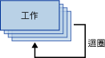

# For 迴圈容器
  「For 迴圈」容器定義封裝中重複的控制流程。 迴圈實作與程式設計語言中 **For** 迴圈的結構類似。 在每次迴圈重複中，「For 迴圈」容器都會評估運算式並重複其工作流程，直到運算式評估為 **False**為止。  
  
 「For 迴圈」容器使用下列元素定義迴圈：  
  
-   選擇性初始化運算式，會指派值給迴圈計數器。  
  
-   評估運算式，其中含有用來測試迴圈應停止或繼續的運算式。  
  
-   選擇性反覆運算的運算式，會累加或遞減迴圈計數器。  
  
 下列圖表顯示含有傳送郵件工作的「For 迴圈」容器。 如果初始化運算式為 `@Counter = 0`、評估運算式為 `@Counter < 4`，且反覆運算的運算式為 `@Counter = @Counter + 1`，則迴圈會重複四次並傳送四則電子郵件訊息。  
  
   
  
 運算式必須是有效的 [!INCLUDE[ssNoVersion](../../includes/ssnoversion-md.md)] [!INCLUDE[ssISnoversion](../../includes/ssisnoversion-md.md)] 運算式。  
  
 若要建立初始化和指派運算式，可使用指派運算子 (=)。 除了「For 迴圈」容器中的初始化和指派運算式類型可使用此運算子外，Integration Services 運算式文法不另外支援此運算子。 任何使用指派運算子的運算式都必須使用此語法 `@Var = <expression>`，其中 **Var** 是執行階段變數，而 \<運算式> 是遵循 [!INCLUDE[ssIS](../../includes/ssis-md.md)] 運算式語法規則的運算式。 運算式可包含變數、常值，以及任何 SSIS 運算式文法支援的運算子和函數。 運算式必須評估為可轉換成變數資料類型的資料類型。  
  
 「For 迴圈」容器只能有一個評估運算式。 這表示「For 迴圈」容器執行其所有控制流程元素的次數皆相同。 由於「For 迴圈」容器可包含其他「For 迴圈」容器，因此您可以在封裝中建立巢狀迴圈並實作複雜的迴圈。  
  
 您可以在「For 迴圈」容器上設定交易屬性，用來定義封裝控制流程子集的交易。 使用這種方式，可以以更細微的層級管理交易。 例如，如果「For 迴圈」容器多次重複更新資料表中資料的控制流程，您可設定讓「For 迴圈」容器及其控制流程使用交易，以確保若非所有資料都成功更新，則不更新任何資料。 如需詳細資訊，請參閱 [Integration Services 交易](../../integration-services/integration-services-transactions.md)。  
  
## 將列舉新增至有 For 迴圈容器的控制流程
  [!INCLUDE[ssISnoversion](../../includes/ssisnoversion-md.md)] 包括 For 迴圈容器，該容器為控制流程項目，可簡化在套件中包括有條件地重複控制流程的迴圈。 如需詳細資訊，請參閱 [For 迴圈容器](../../integration-services/control-flow/for-loop-container.md)為止。  
  
 「For 迴圈」容器會評估迴圈中每個反覆運算的條件，並在條件評估為 False 時停止。 「For 迴圈」容器包括許多運算式，可用於初始化迴圈，指定停止執行重複控制流程的評估條件，以及為更新評估條件之比較值的運算式指派值。 您必須提供評估條件，但初始化及指派運算式是選擇性的。  
  
 「For 迴圈」容器不提供功能，它僅提供可在其中建立可重複控制流程的結構。 若要提供容器功能，「For 迴圈」容器中必須至少包括一個工作。 如需詳細資訊，請參閱 [Integration Services Tasks](../../integration-services/control-flow/integration-services-tasks.md)。  
  
 「For 迴圈」容器可以包括具有多個工作的控制流程，還可以包括其他容器。 將工作及容器加入「For 迴圈」容器與將它們加入封裝類似，不同之處在於，您要將工作及容器拖曳至「For 迴圈」容器而不是封裝。 如果「For 迴圈」容器包含一個以上的工作或容器，則您可以如同在封裝中所做的一樣，使用優先順序條件約束來連接它們。 如需詳細資訊，請參閱 [優先順序條件約束](../../integration-services/control-flow/precedence-constraints.md)。  
  
## 在控制流程中新增 For 迴圈容器  
  
1.  將「For 迴圈」容器加入封裝。 如需詳細資訊，請參閱[在控制流程中加入或刪除工作或容器](../../integration-services/control-flow/add-or-delete-a-task-or-a-container-in-a-control-flow.md)。  
  
2.  將工作和容器加入「For 迴圈」容器。 如需詳細資訊，請參閱 [在控制流程中加入或刪除工作或容器](../../integration-services/control-flow/add-or-delete-a-task-or-a-container-in-a-control-flow.md)。  
  
3.  使用優先順序條件約束連接「For 迴圈」容器中的工作和容器。 如需詳細資訊，請參閱[使用預設的優先順序條件約束來連接工作和容器](http://msdn.microsoft.com/library/8f31f15f-98ff-4c35-b41f-8b8cfd148d75)。  
  
4.  設定「For 迴圈」容器。 如需詳細資訊，請參閱 [設定 For 迴圈容器](http://msdn.microsoft.com/library/b9cd7ea7-b198-4a35-8b16-6acf09611ca5)為止。  

##  設定 For 迴圈容器
此程序描述如何使用 [For 迴圈編輯器] 對話方塊設定「For 迴圈」容器。  
  
 如需 For 迴圈容器的範例，請參閱 bimonkey.com 上的 [SSIS Loops that do not fail](http://go.microsoft.com/fwlink/?LinkId=240295)。  
  
1.  在 [!INCLUDE[ssBIDevStudioFull](../../includes/ssbidevstudiofull-md.md)] 中，按兩下「For 迴圈」容器以開啟 [For 迴圈編輯器]。  
  
2.  (選擇性) 修改「For 迴圈」容器的名稱和描述。  
  
3.  (選擇性) 在 [InitExpression] 文字方塊中輸入初始化運算式。  
  
4.  在 [EvalExpression] 文字方塊中輸入評估運算式。  
  
    > [!NOTE]  
    >  運算式必須評估為布林。 如果運算式評估為 **false**，迴圈將停止執行。  
  
5.  (選擇性) 在 [AssignExpression] 文字方塊中輸入指派運算式。  
  
6.  (選擇性) 按一下 [運算式]，然後在 [運算式] 頁面上建立「For 迴圈」容器之屬性的屬性運算式。 如需詳細資訊，請參閱[加入或變更屬性運算式](../../integration-services/expressions/add-or-change-a-property-expression.md)。  
  
7.  按一下 [確定]，以關閉 [For 迴圈編輯器]。  

## For 迴圈編輯器對話方塊
使用 **[For 迴圈編輯器]** 對話方塊的 **[For 迴圈]** 頁面，即可設定迴圈，使工作流程重複到指定的條件評估為 False 為止。  
  
 若要了解 For 迴圈容器以及如何在封裝中使用該容器，請參閱＜ [For Loop Container](../../integration-services/control-flow/for-loop-container.md)＞。  
  
### 選項。  
 **InitExpression**  
 選擇性地提供運算式，以初始化迴圈使用的值。  
  
 **EvalExpression**  
 提供運算式以評估迴圈應停止或繼續。  
  
 **AssignExpression**  
 選擇性地提供運算式，在每次迴圈重複時就變更條件。  
  
 **名稱**  
 提供 For 迴圈容器的唯一名稱。 這個名稱是作為工作圖示中的標籤使用。  
  
> [!NOTE]  
>  物件名稱在封裝內必須是唯一的。  
  
 **說明**  
 提供 For 迴圈容器的描述。  
 
## 使用有 For 迴圈容器的運算式  
 藉由指定評估條件、初始化值或指派值來設定「For 迴圈」容器時，您可以使用常值或運算式。  
  
 運算式可以包含變數。 使用變數的優點是，可以在執行階段對它們進行更新，使封裝更為靈活也易於管理。 運算式的最大長度為 4000 個字元。  
  
 在運算式中指定變數時，必須在變數名稱之前加上 at 符號 (@)。 例如，對於名為 **Counter** 的變數，請在 For 迴圈容器所使用的運算式中輸入 @Counter。 如果您在變數中包括命名空間屬性，則您必須使用括號將變數與命名空間括起來。 例如，對於 **MyNamespace** 命名空間中的 **Counter** 變數，請鍵入 [@MyNamespace::Counter]。  
  
 「For 迴圈」容器使用的變數必須定義在「For 迴圈」容器的範圍內，或封裝容器階層中任何更高容器的範圍內。 例如，「For 迴圈」容器可以使用其範圍內定義的變數，也可以使用封裝範圍內定義的變數。 如需詳細資訊，請參閱 [Integration Services &#40;SSIS&#41; 變數](../../integration-services/integration-services-ssis-variables.md)和[在封裝中使用變數](http://msdn.microsoft.com/library/7742e92d-46c5-4cc4-b9a3-45b688ddb787)。  
  
 [!INCLUDE[ssIS](../../includes/ssis-md.md)] 運算式文法提供完整的運算子及函數集合，以實作評估、初始化或指派所使用的複雜運算式。 如需詳細資訊，請參閱 [Integration Services &#40;SSIS&#41; 運算式](../../integration-services/expressions/integration-services-ssis-expressions.md)為止。  
  
  
## 另請參閱  
 [控制流程](../../integration-services/control-flow/control-flow.md)   
 [Integration Services &#40;SSIS&#41; 運算式](../../integration-services/expressions/integration-services-ssis-expressions.md)  
  
  
