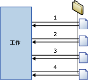

# Foreach 迴圈容器
  「Foreach 迴圈」容器定義封裝中重複的控制流程。 迴圈實作與程式設計語言中 **Foreach** 迴圈的結構類似。 在封裝中，迴圈是使用 Foreach 列舉值啟用。  「Foreach 迴圈」容器會為指定列舉值的每個成員重複控制流程。  
  
 [!INCLUDE[ssNoVersion](../../includes/ssnoversion-md.md)] [!INCLUDE[ssISnoversion](../../includes/ssisnoversion-md.md)] 提供下列列舉值類型：  
  
-   Foreach ADO 列舉值，用來列舉資料表中的資料列。 例如，您可以在 ADO 資料錄集中取得資料列。  
  
     資料錄集目的地會將記憶體中的資料儲存到 **Object** 資料類型之封裝變數中儲存的資料錄集。 您通常會使用具有 Foreach ADO 列舉值的 Foreach 迴圈容器來一次處理資料錄集的一個資料列。 針對 Foreach ADO 列舉值指定的變數必須屬於 Object 資料類型。 如需資料錄集目的地的詳細資訊，請參閱[使用資料錄集目的地](../../integration-services/data-flow/use-a-recordset-destination.md)。  
  
-   「Foreach ADO.NET 結構描述資料列集」列舉值，用來列舉有關資料來源的結構描述資訊。 例如，您可以列舉並取得一份 [!INCLUDE[ssSampleDBnormal](../../includes/sssampledbnormal-md.md)] [!INCLUDE[ssNoVersion](../../includes/ssnoversion-md.md)] 資料庫中資料表的清單。  
  
-   「Foreach 檔案」列舉值，用來列舉資料夾中的檔案。 列舉值可往返子資料夾。 例如，您可以讀取 Windows 資料夾及其子資料夾中所有副檔名為 *.log 的檔案。  
  
-   Foreach From Variable 列舉值，用來列舉指定的變數所包含的可列舉物件。 可列舉物件可以是陣列、ADO.NET **DataTable**、 [!INCLUDE[ssISnoversion](../../includes/ssisnoversion-md.md)] 列舉值等等。 例如，您可以列舉包含伺服器名稱之陣列的值。  
  
-   「Foreach 項目」列舉值，用來列舉集合項目。 例如，您可以列舉「執行處理」工作使用之可執行檔與工作目錄的名稱。  
  
-   Foreach Nodelist 列舉值，用來列舉 XML 路徑語言 (XPath) 運算式的結果集。 例如，此運算式會列舉並取得一份古典時期所有作者的清單： `/authors/author[@period='classical']`。  
  
-   Foreach SMO 列舉值，用來列舉 [!INCLUDE[ssNoVersion](../../includes/ssnoversion-md.md)] Management Objects (SMO) 物件。 例如，您可以列舉並取得一份 [!INCLUDE[ssNoVersion](../../includes/ssnoversion-md.md)] 資料庫中檢視的清單。  
  
-   [Foreach HDFS 檔案列舉值] 可列舉所指定 HDFS 位置中的 HDFS 檔案。  
  
-   Foreach Azure Blob 列舉值會列舉在 Azure 儲存體 blob 容器中的 Blob。  

-   Foreach ADLS 檔案列舉值，列舉 Azure Data Lake Store 目錄中的檔案。
  
 下列圖表顯示擁有「檔案系統」工作的「Foreach 迴圈」容器。 Foreach 迴圈會使用「Foreach 檔案」列舉值，而「檔案系統」工作則設定為複製檔案。 如果列舉值指定的資料夾含有四個檔案，則迴圈會重複四次並複製四個檔案。  
  
   
  
 您可以使用變數和屬性運算式的組合，以列舉值集合值更新封裝物件的屬性。 首先，對應集合值與使用者定義的變數，接著在使用該變數的屬性上實作屬性運算式。 例如，「Foreach 檔案」列舉值的集合值會對應到稱為 **MyFile** 的變數，接著會在傳送郵件工作的 Subject 屬性的屬性運算式中使用此變數。 當執行封裝時，便會在每次迴圈重複時以某個檔案名稱更新 Subject 屬性。 如需詳細資訊，請參閱 [在封裝中使用屬性運算式](../../integration-services/expressions/use-property-expressions-in-packages.md)。  
  
 對應至列舉值集合值的變數亦可在運算式和指令碼中使用。  
  
 「Foreach 迴圈」容器可包含多項工作和容器，但它只能使用一種列舉值。 如果「Foreach 迴圈」容器包含多項工作，您可將列舉值集合值對應至每項工作的多個屬性。  
  
 您可以在「Foreach 迴圈」容器上設定交易屬性，用來定義封裝控制流程子集的交易。 您可利用此方式於「Foreach 迴圈」層級管理交易，而非封裝層級。 例如，如果「Foreach 迴圈」容器重複更新星狀結構描述中維度和事實資料表的控制流程，則可設定交易以確認所有事實資料表均成功更新，或不更新任何資料表。 如需詳細資訊，請參閱 [Integration Services 交易](../../integration-services/integration-services-transactions.md)。  
  
## 列舉值類型  
 列舉值可加以設定，而您必須根據列舉值提供不同的資訊。  
  
 下表摘要說明各列舉值類型所需的資訊。  
  
|列舉值|組態需求|  
|----------------|--------------------------------|  
|Foreach ADO|指定 ADO 物件來源變數和列舉值模式。 此變數必須屬於 Object 資料類型。|  
|Foreach ADO.NET 結構描述資料列集|指定資料庫的連接和要列舉的結構描述。|  
|Foreach 檔案|指定資料夾和要列舉的檔案、所擷取檔案的檔名格式，以及是否往返子資料夾。|  
|Foreach From Variable|指定包含要列舉物件的變數。|  
|Foreach 項目|定義「Foreach 項目」集合中的項目，包括資料行和資料行資料類型。|  
|Foreach Nodelist|指定 XML 文件的來源並設定 XPath 作業。|  
|Foreach SMO|指定資料庫的連接和要列舉的 SMO 物件。|  
|Foreach HDFS 檔案列舉值|指定資料夾和要列舉的檔案、所擷取檔案的檔名格式，以及是否往返子資料夾。|  
|Foreach Azure Blob|指定要列舉的 blob 容器的 Azure Blob 容器。|  
|Foreach ADLS 檔案|指定包含要列舉之檔案的 Azure Data Lake Store 目錄。|

## 使用 Foreach 迴圈容器將列舉新增至控制流程
 [!INCLUDE[ssISnoversion](../../includes/ssisnoversion-md.md)] 包括 Foreach 迴圈容器，該容器為控制流程項目，可簡化在套件的控制流程中包括列舉檔案及物件的迴圈建構。 如需詳細資訊，請參閱 [Foreach 迴圈容器](../../integration-services/control-flow/foreach-loop-container.md)＞。  
  
 「Foreach 迴圈」容器不提供功能，僅提供可在其中建立可重複控制流程、指定列舉類型並設定列舉值的結構。 若要提供容器功能，必須在「Foreach 迴圈」容器中至少包括一個工作。 如需詳細資訊，請參閱 [Integration Services Tasks](../../integration-services/control-flow/integration-services-tasks.md)。  
  
 「Foreach 迴圈」容器可以包括具有多個工作的控制流程及其他容器。 將工作及容器加入「Foreach 迴圈」容器與將它們加入封裝類似，只是您要將工作及容器拖曳至「Foreach 迴圈」容器而不是封裝。 如果「Foreach 迴圈」容器包含一個以上的工作或容器，則您可以如同在封裝中所做的一樣，使用優先順序條件約束來連接它們。 如需詳細資訊，請參閱 [優先順序條件約束](../../integration-services/control-flow/precedence-constraints.md)。  
  
### 新增與設定 Foreach 迴圈容器
  
1.  將「Foreach 迴圈」容器加入封裝。 如需詳細資訊，請參閱 [在控制流程中加入或刪除工作或容器](../../integration-services/control-flow/add-or-delete-a-task-or-a-container-in-a-control-flow.md)。  
  
2.  將工作和容器加入「Foreach 迴圈」容器。 如需詳細資訊，請參閱 [在控制流程中加入或刪除工作或容器](../../integration-services/control-flow/add-or-delete-a-task-or-a-container-in-a-control-flow.md)。  
  
3.  使用優先順序條件約束連接「Foreach 迴圈」容器中的工作和容器。 如需詳細資訊，請參閱 [使用預設的優先順序條件約束來連接工作和容器](http://msdn.microsoft.com/library/8f31f15f-98ff-4c35-b41f-8b8cfd148d75)。  
  
4.  設定「Foreach 迴圈」容器。 如需詳細資訊，請參閱 [設定 Foreach 迴圈容器](http://msdn.microsoft.com/library/519c6f96-5e1f-47d2-b96a-d49946948c25)＞。  

## 設定 Foreach 迴圈容器
此程序描述如何設定「Foreach 迴圈」容器，包括列舉值及容器層級的屬性運算式。  
  
1.  在 [!INCLUDE[ssBIDevStudioFull](../../includes/ssbidevstudiofull-md.md)]中，開啟包含所需封裝的 [!INCLUDE[ssISnoversion](../../includes/ssisnoversion-md.md)] 專案。  
  
2.  按一下 [控制流程] 索引標籤，然後按兩下 [Foreach 迴圈]。  
  
3.  在 [Foreach 迴圈編輯器] 對話方塊中，按一下 [一般]，然後選擇性地修改 [Foreach 迴圈] 的名稱及描述。  
  
4.  按一下 [集合]從 [列舉值] 清單選取列舉值類型。  
  
5.  指定列舉值並設定列舉值選項如下：  
  
    -   若要使用 Foreach 檔案列舉值，請提供包含要列舉之檔案的資料夾，指定檔案名稱及類型的篩選，並指定是否應該傳回完整的檔案名稱。 同時，指示是否遞迴所有子資料夾，以取得更多檔案。  
  
    -   若要使用 Foreach 項目列舉值，請按一下 [資料行]，然後在 [For Each 項目資料行] 對話方塊中，按一下 [加入]以加入資料行。 在 [資料類型] 清單中為每個資料行選取資料類型，然後按一下 [確定]。  
  
         在資料行中鍵入值，或從清單選取值。  
  
        > [!NOTE]  
        >  若要加入新的資料列，請按一下您鍵入項目之資料格以外的任何位置。  
  
        > [!NOTE]  
        >  如果值與資料行資料類型不相容，則文字會反白顯示。  
  
    -   若要使用 Foreach ADO 列舉值，請選取現有的變數，或按一下 [ADO 物件來源變數] 清單中的 [新增變數]，以指定包含要列舉之 ADO 物件名稱的變數，然後選取列舉模式選項。  
  
         如果要建立新變數，請在 [加入變數] 對話方塊中設定變數屬性。  
  
    -   若要使用 Foreach ADO.NET 結構描述資料列集列舉值，請選取現有的 ADO.NET 連接，或按一下 [連接] 清單中的 [新增連接]，然後選取結構描述。  
  
         您可選擇按一下 [設定限制] 並選取結構描述限制，再選取包含限制值的變數或輸入限制值，然後按一下 [確定]。  
  
    -   若要使用 Foreach From Variable 列舉值，請在 [變數] 清單中選取變數。  
  
    -   若要使用 Foreach NodeList 列舉值，請按一下 [DocumentSourceType] 並從清單中選取來源類型，然後按一下 [DocumentSource]。 視 DocumentSourceType 所選的值而定，從清單中選取變數或檔案連接、建立新的變數或檔案連接，或在 [文件來源編輯器] 中輸入 XML 來源。  
  
         接著，按一下 [EnumerationType] 並從清單中選取列舉類型。 如果 EnumerationType 是 **Navigator、Node 或 NodeText**，請按一下 [OuterXPathStringSourceType] 並選取來源類型，然後按一下 [OuterXPathString]。 視 OuterXPathStringSourceType 所設定的值而定，從清單中選取變數或檔案連接、建立新的變數或檔案連接，或為外部 XML 路徑語言 (XPath) 運算式輸入字串。  
  
         如果 EnumerationType 是 **ElementCollection**，請如上所述設定 OuterXPathStringSourceType 和 OuterXPathString。 然後，按一下 [InnerElementType] 並為內部元素選取列舉類型，再按一下 [InnerXPathStringSourceType]。 視 InnerXPathStringSourceType 所設定的值而定，選取變數或檔案連接、建立新的變數或檔案連接，或為內部 XPath 運算式輸入字串。  
  
    -   若要使用 Foreach SMO 列舉值，請選取現有的 ADO.NET 連接，或按一下 [連接] 清單中的 [新增連接]，然後輸入要使用的字串或按一下 [瀏覽]。 如果按一下 [選取 SMO 列舉] 對話方塊中的 [瀏覽]，請選取要列舉的物件類型及列舉類型，然後按一下 [確定]。  
  
6.  (選擇性) 按一下 [集合] 頁面上 [運算式] 文字方塊中的瀏覽按鈕 **(…)**，以建立更新屬性值的運算式。 如需詳細資訊，請參閱[加入或變更屬性運算式](../../integration-services/expressions/add-or-change-a-property-expression.md)。  
  
    > [!NOTE]  
    >  [屬性] 清單中列出的屬性會隨列舉值而不同。  
  
7.  (選擇性) 按一下 [變數對應]，以將物件屬性對應至集合值，然後執行下列操作：  
  
    1.  在 [變數] 清單中選取變數，或按一下 [\<新增變數>]，以建立新的變數。  
  
    2.  如果您加入新的變數，請在 [加入變數] 對話方塊中設定變數屬性，然後按一下 [確定]。  
  
    3.  如果您使用 ForEach 項目列舉值，則可以在 [索引] 清單中更新索引值。  
  
        > [!NOTE]  
        >  索引值指示項目中要對應至變數的資料行。 只有「For Each 項目」列舉值可以使用 0 之外的索引值。  
  
8.  (選擇性) 按一下 [運算式] 頁面上的 [運算式]，建立 Foreach 迴圈容器之屬性的屬性運算式。 如需詳細資訊，請參閱[加入或變更屬性運算式](../../integration-services/expressions/add-or-change-a-property-expression.md)。  
  
9. 按一下 [確定] 。  

## 一般頁面 - Foreach 迴圈編輯器
使用 **[Foreach 迴圈編輯器]** 對話方塊的 **[一般]** 頁面，即可命名並描述 Foreach 迴圈容器，使用指定的列舉值為集合的每一個成員重複工作流程。  
  
 若要了解 Foreach 迴圈容器以及如何設定該容器，請參閱 [Foreach 迴圈容器](../../integration-services/control-flow/foreach-loop-container.md) 和 [設定 Foreach 迴圈容器](http://msdn.microsoft.com/library/519c6f96-5e1f-47d2-b96a-d49946948c25)。  
  
### 選項。  
 **名稱**  
 為 Foreach 迴圈容器提供唯一的名稱。 此名稱會用於工作圖示和記錄中的標籤。  
  
> [!NOTE]  
>  物件名稱在封裝內必須是唯一的。  
  
 **說明**  
 輸入 Foreach 迴圈容器的描述。  

## 集合頁面 - Foreach 迴圈編輯器
 使用 [Foreach 迴圈編輯器] 對話方塊的 [集合] 頁面，即可指定列舉值類型和設定列舉值。  
  
 若要了解 Foreach 迴圈容器以及如何設定該容器，請參閱 [Foreach 迴圈容器](../../integration-services/control-flow/foreach-loop-container.md) 和 [設定 Foreach 迴圈容器](http://msdn.microsoft.com/library/519c6f96-5e1f-47d2-b96a-d49946948c25)。  
  
### 靜態選項  
 **列舉值**  
 從清單中選取列舉值類型。 此屬性具有下表所列的選項：  
  
|ReplTest1|描述|  
|-----------|-----------------|  
|**Foreach 檔案列舉值**|列舉檔案。 選取這個值就會在 **[Foreach 檔案列舉值]**區段中顯示動態選項。|  
|**Foreach 項目列舉值**|列舉項目中的值。 選取這個值就會在 **[Foreach 項目列舉值]**區段中顯示動態選項。|  
|**Foreach ADO 列舉值**|列舉資料表或資料表中的資料列。 選取這個值就會在 **[Foreach ADO 列舉值]**區段中顯示動態選項。|  
|**Foreach ADO.NET 結構描述資料列集列舉值**|列舉結構描述。 選取這個值就會在 **[Foreach ADO.NET 列舉值]**區段中顯示動態選項。|  
|**Foreach From Variable 列舉值**|列舉變數中的值。 選取這個值就會在 **[Foreach From Variable 列舉值]**區段中顯示動態選項。|  
|**Foreach NodeList 列舉值**|以 XML 文件列舉節點。 選取這個值就會在 **[Foreach NodeList 列舉值]**區段中顯示動態選項。|  
|**Foreach SMO 列舉值**|列舉 SMO 物件。 選取這個值就會在 **[Foreach SMO 列舉值]**區段中顯示動態選項。|  
|**Foreach HDFS 檔案列舉值**|列舉所指定 HDFS 位置中的 HDFS 檔案。 選取這個值就會在 [Foreach HDFS 檔案列舉值] 區段中顯示動態選項。|  
|**Foreach Azure Blob 列舉值**|列舉指定 Blob 位置中的 Blob 檔案。 選取此值可在 **[Foreach ADO 列舉值]**區段中顯示動態選項。|  
|**Foreach ADLS 檔案列舉值**|列舉指定的 Data Lake Store 目錄中的檔案。 選取這個值就會在 [Foreach ADLS 檔案列舉值] 區段中顯示動態選項。|
  
 **運算式**  
 按一下或展開 **[運算式]** ，即可檢視現有屬性運算式的清單。 按一下省略符號 **(...)** 按鈕以加入列舉值屬性的屬性運算式，或是編輯和評估現有的屬性運算式。  
  
 **相關主題**︰[Integration Services &#40;SSIS&#41; 運算式](../../integration-services/expressions/integration-services-ssis-expressions.md)、[屬性運算式編輯器](../../integration-services/expressions/property-expressions-editor.md)、[運算式產生器](../../integration-services/expressions/expression-builder.md)  
  
### 列舉值動態選項  
  
#### 列舉值 = Foreach 檔案列舉值  
 Foreach 檔案列舉值可用來列舉資料夾中的檔案。 例如，如果 Foreach 迴圈包括「執行 SQL」工作，則您可使用 Foreach 檔案列舉值來列舉檔案，而這些檔案包含執行「執行 SQL」工作的 SQL 陳述式。 您也可以將列舉值設定成包括子資料夾。  
  
 因為迴圈中的外部處理序或工作在迴圈執行時加入、重新命名或刪除檔案，所以 Foreach 檔案列舉值所列舉的資料夾和子資料夾內容在迴圈執行時可能會變更。 這些變更可能會引發許多非預期的狀況：  
  
-   如果刪除檔案，則 Foreach 迴圈中某項工作的許多動作可能會影響與後續工作所用檔案不同的檔案集合。  
  
-   如果重新命名檔案，且外部處理序自動新增檔案以取代重新命名的檔案，則 Foreach 迴圈工作的動作可能會影響相同的檔案兩次。  
  
-   如果新增檔案，則很難判斷受 Foreach 迴圈影響的是哪些檔案。  
  
 **資料夾**  
 提供要列舉的根資料夾之路徑。  
  
 **瀏覽**  
 瀏覽以尋找根資料夾。  
  
 **檔案**  
 指定要列舉的檔案。  
  
> [!NOTE]  
>  使用萬用字元 (*) 即可指定要包含在集合中的檔案。 例如，若要包括名稱內含 "abc" 的檔案，可使用下列篩選： \*abc\*。  
>   
>  當您指定副檔名時，此列舉值也會傳回附加其他字元之相同副檔名的檔案 (這個行為與作業系統中 **dir** 命令的行為相同，而且此命令也會針對回溯相容性比較 8.3 檔案名稱)。列舉值的這個行為可能會導致非預期的結果。 例如，您只想要列舉 Excel 2003 檔案，而且指定了 "*.xls"。 不過，此列舉值也會傳回 Excel 2007 檔案，因為這些檔案的副檔名為 ".xlsx"。  
>   
>  您可以使用運算式指定要包括在集合內的檔案，方法是展開 [集合] 頁面上的 [運算式]，選取 **FileSpec** 屬性，然後按一下省略符號按鈕 (…) 加入屬性運算式。  
  
 **完整**  
 選取即可擷取檔案名稱的完整路徑。 如果在檔案選項中指定萬用字元，則會傳回符合篩選的完整路徑。  
  
 **只有名稱**  
 選取即可只擷取檔案名稱。 如果在檔案選項中指定萬用字元，則會傳回符合篩選的檔案名稱。  
  
 **名稱和副檔名**  
 選取即可擷取檔案名稱及其副檔名。 如果在檔案選項中指定萬用字元，則會傳回符合篩選的檔案名稱和副檔名。  
  
 **周遊子資料夾**  
 選取即可在列舉中包含子資料夾。  
  
#### 列舉值 = Foreach 項目列舉值  
 Foreach 項目列舉值可用來列舉集合中的項目。 您指定資料行和資料行值，即可定義集合中的項目。 一個資料列中的所有資料行都可定義項目。 例如，指定用來執行「執行處理」工作之可執行檔及該工作所使用之工作目錄的項目會有兩個資料行，一個會列出可執行檔名稱，而另一個會列出工作目錄。 資料列數目會決定迴圈的重複次數。 如果資料表有 10 個資料列，則迴圈會重複 10 次。  
  
 若要更新執行處理工作的屬性，則使用資料行的索引，您可以將變數對應至項目資料行。 列舉值項目中所定義之第一個資料行的索引值為 0，第二個資料行則為 1，以此類推。 每次重複迴圈時，都會更新變數值。 **Executable** 然後，會透過使用這些變數的屬性運算式來更新「執行處理」工作的 **WorkingDirectory** 和  屬性。  
  
 **定義 For Each 項目集合中的項目**  
 提供資料表中每個資料行的值。  
  
> [!NOTE]  
>  在資料列資料行輸入值之後，就會在資料表中自動加入新的資料列。  
  
> [!NOTE]  
>  如果提供的值與資料行資料類型不相容，文字就會以紅色顯示。  
  
 **資料行資料類型**  
 列出使用中資料行的資料類型。  
  
 **移除**  
 選取項目，然後按一下 **[移除]** 即可從清單中移除。  
  
 **資料行**  
 按一下即可在項目中設定資料行的資料類型。  
  
 **相關主題** [For Each 項目資料行對話方塊 UI 參考](http://msdn.microsoft.com/library/ea76aae0-8798-4677-8ab8-4a579de4957c)  
  
#### 列舉值 = Foreach ADO 列舉值  
 Foreach ADO 列舉值可用來列舉 ADO 或 ADO.NET 物件中的資料列或資料表，而這類物件是儲存在變數中。 例如，如果 Foreach 迴圈包括將資料集寫入變數的指令碼工作，您可以使用 Foreach ADO 列舉值來列舉該資料集中的資料列。 如果變數包含 ADO.NET 資料集，則可將列舉值設定成列舉多個資料表中的資料列，或設定成列舉資料表。  
  
 **ADO 物件來源變數**  
 在清單中選取使用者定義變數，或按一下 [\<新增變數...>]，以建立新的變數。  
  
> [!NOTE]  
>  變數必須為物件資料類型，否則會發生錯誤。  
  
 **相關主題**︰[Integration Services &#40;SSIS&#41; 變數](../../integration-services/integration-services-ssis-variables.md)、[加入變數](http://msdn.microsoft.com/library/d09b5d31-433f-4f7c-8c68-9df3a97785d5)  
  
 **第一個資料表的資料列**  
 選取此選項即可只列舉第一個資料表的資料列。  
  
 **所有資料表的資料列 (僅 ADO.NET 資料集)**  
 選取即可列舉所有資料表的資料列。 唯有所有列舉的物件都是相同 ADO.NET 資料集的成員時，才可以使用此選項。  
  
 **所有資料表 (僅 ADO.NET 資料集)**  
 選取即可只列舉資料表。  
  
#### 列舉值 = Foreach ADO.NET 結構描述資料列集列舉值  
 Foreach ADO.NET 結構描述資料列集列舉值可用來列舉所指定之資料來源的結構描述。 例如，如果 Foreach 迴圈包括「執行 SQL」工作，您可以使用 Foreach ADO.NET 結構描述資料列集列舉值來列舉結構描述 (例如 **AdventureWorks** 資料庫中的資料行)，以及使用「執行 SQL」工作來取得結構描述權限。  
  
 **[連接]**  
 在清單中選 ADO.NET 連線管理員，或按一下 [\<新增連線...>]，以建立新的 ADO.NET 連線管理員。  
  
> [!IMPORTANT]  
>  ADO.NET 連接管理員必須使用 OLE DB 的 .NET 提供者。 如果連接到 SQL Server，則建議使用的提供者是 [!INCLUDE[ssNoVersion](../../includes/ssnoversion-md.md)] Native Client，會列在 **[連接管理員]** 對話方塊的 **[OleDb 的 .Net 提供者]** 區段中。  
  
 **相關主題** [ADO Connection Manager](../../integration-services/connection-manager/ado-connection-manager.md)、 [Configure ADO.NET Connection Manager](../../integration-services/connection-manager/configure-ado-net-connection-manager.md)  
  
 **結構描述**  
 選取要列舉的結構描述。  
  
 **設定限制**  
 設定要套用至指定之結構描述的限制。  
  
 **相關主題** [結構描述限制對話方塊](http://msdn.microsoft.com/library/92e5fd32-4944-4f7c-a448-b458df93d0d5)  
  
#### 列舉值 = Foreach From Variable 列舉值  
 Foreach From Variable 列舉值可用來列舉所指定之變數中可列舉的物件。 例如，如果 Foreach 迴圈包括執行查詢並將結果儲存在變數中的「執行 SQL」工作，您可以使用 Foreach From Variable 列舉值來列舉查詢結果。  
  
 **變數**  
 在清單中選取變數，或按一下 [\<新增變數...>] 建立新的變數。  
  
 **相關主題**︰[Integration Services &#40;SSIS&#41; 變數](../../integration-services/integration-services-ssis-variables.md)、[加入變數](http://msdn.microsoft.com/library/d09b5d31-433f-4f7c-8c68-9df3a97785d5)  
  
#### 列舉值 = Foreach NodeList 列舉值  
 Foreach Nodelist 列舉值可用來列舉因為將 XPath 運算式套用至 XML 檔案而產生的 XML 節點集合。 例如，如果 Foreach 迴圈包括指令碼工作，則您可使用 Foreach NodeList 列舉值將符合 XPath 運算式條件的值從 XML 檔案傳送給該指令碼工作。  
  
 套用至 XML 檔案的 XPath 運算式就是儲存在 OuterXPathString 屬性中的外部 XPath 作業。 如果 XPath 列舉類型設定為 [ElementCollection]，則 Foreach NodeList 列舉值可將儲存在 InnerXPathString 屬性中的內部 XPath 運算式套用至元素集合。  
  
 若要深入了解 XML 文件和資料，請參閱 MSDN Library 中的[在 .NET Framework 內採用 XML](http://go.microsoft.com/fwlink/?LinkId=56214)。  
  
 **DocumentSourceType**  
 選取 XML 文件的來源類型。 此屬性具有下表所列的選項：  
  
|ReplTest1|描述|  
|-----------|-----------------|  
|**直接輸入**|設定 XML 文件的來源。|  
|**檔案連接**|選取包含 XML 文件的檔案。|  
|**變數**|設定包含 XML 文件的變數來源。|  
  
 **DocumentSource**  
 如果 [DocumentSourceType] 設定為 [直接輸入]，請提供 XML 程式碼，或按一下省略符號 (...) 按鈕，以使用 [文件來源編輯器] 對話方塊來提供 XML。  
  
 如果 [DocumentSourceType] 設定為 [檔案連線]，請選取檔案連線管理員，或按一下 [\<新增連線...>]，以建立新的連線管理員。  
  
 **相關主題：** [File Connection Manager](../../integration-services/connection-manager/file-connection-manager.md)、 [File Connection Manager Editor](../../integration-services/connection-manager/file-connection-manager-editor.md)  
  
 如果 [DocumentSourceType] 設定為 [變數]，請選取現有的變數，或按一下 [\<新增變數...>]，以建立新的變數。  
  
 **相關主題**：[Integration Services &#40;SSIS&#41; 變數](../../integration-services/integration-services-ssis-variables.md)、[加入變數](http://msdn.microsoft.com/library/d09b5d31-433f-4f7c-8c68-9df3a97785d5)。  
  
 **EnumerationType**  
 從清單中選取列舉類型。 此屬性具有下表所列的選項：  
  
|ReplTest1|描述|  
|-----------|-----------------|  
|**Navigator**|使用 XPathNavigator 列舉。|  
|**節點**|列舉 XPath 作業傳回的節點。|  
|**NodeText**|列舉 XPath 作業傳回的文字節點。|  
|**ElementCollection**|列舉 XPath 作業傳回的元素節點。|  
  
 **OuterXPathStringSourceType**  
 選取 XPath 字串的來源類型。 此屬性具有下表所列的選項： 
  
|ReplTest1|描述|  
|-----------|-----------------|  
|**直接輸入**|設定 XML 文件的來源。|  
|**檔案連接**|選取包含 XML 文件的檔案。|  
|**變數**|設定包含 XML 文件的變數來源。|  
  
 **OuterXPathString**  
 如果 [OuterXPathStringSourceType] 設定為 [直接輸入]，請提供 XPath 字串。  
  
 如果 [OuterXPathStringSourceType] 設定為 [檔案連線]，請選取檔案連線管理員，或按一下 [\<新增連線...>]，以建立新的連線管理員。  
  
 **相關主題：** [File Connection Manager](../../integration-services/connection-manager/file-connection-manager.md)、 [File Connection Manager Editor](../../integration-services/connection-manager/file-connection-manager-editor.md)  
  
 如果 [OuterXPathStringSourceType] 設定為 [變數]，請選取現有的變數，或按一下 [\<新增變數...>]，以建立新的變數。  
  
 **相關主題**：[Integration Services &#40;SSIS&#41; 變數](../../integration-services/integration-services-ssis-variables.md)、[加入變數](http://msdn.microsoft.com/library/d09b5d31-433f-4f7c-8c68-9df3a97785d5)。  
  
 **InnerElementType**  
 如果 **[EnumerationType]** 設定為 **[ElementCollection]**，請在清單中選取內部元素的類型。  
  
 **InnerXPathStringSourceType**  
 選取內部 XPath 字串的來源類型。 此屬性具有下表所列的選項：  
  
|ReplTest1|描述|  
|-----------|-----------------|  
|**直接輸入**|設定 XML 文件的來源。|  
|**檔案連接**|選取包含 XML 文件的檔案。|  
|**變數**|設定包含 XML 文件的變數來源。|  
  
 **InnerXPathString**  
 如果 [InnerXPathStringSourceType] 設定為 [直接輸入]，請提供 XPath 字串。  
  
 如果 [InnerXPathStringSourceType] 設定為 [檔案連線]，請選取檔案連線管理員，或按一下 [\<新增連線...>]，以建立新的連線管理員。  
  
 **相關主題：** [File Connection Manager](../../integration-services/connection-manager/file-connection-manager.md)、 [File Connection Manager Editor](../../integration-services/connection-manager/file-connection-manager-editor.md)  
  
 如果 [InnerXPathStringSourceType] 設定為 [變數]，請選取現有的變數，或按一下 [\<新增變數...>]，以建立新的變數。  
  
 **相關主題**：[Integration Services &#40;SSIS&#41; 變數](../../integration-services/integration-services-ssis-variables.md)、[加入變數](http://msdn.microsoft.com/library/d09b5d31-433f-4f7c-8c68-9df3a97785d5)。  
  
#### 列舉值 = Foreach SMO 列舉值  
 Foreach SMO 列舉值可用來列舉 SQL Server 管理物件 (SMO) 物件。 例如，如果 Foreach 迴圈包括「執行 SQL」工作，您可以使用 Foreach SMO 列舉值來列舉 **AdventureWorks** 資料庫中的資料表，並執行用來計算每個資料表中資料列數目的查詢。  
  
 **[連接]**  
 選取現有的 ADO.NET 連線管理員，或按一下 [\<新增連線...>]，以建立新的連線管理員。  
  
 [ADO.NET Connection Manager](../../integration-services/connection-manager/ado-net-connection-manager.md), [Configure ADO.NET Connection Manager](../../integration-services/connection-manager/configure-ado-net-connection-manager.md)＞  
  
 **列舉**  
 指定要列舉的 SMO 物件。  
  
 **瀏覽**  
 選取 SMO 列舉。  
  
 **相關主題**：[選取 SMO 列舉對話方塊](http://msdn.microsoft.com/library/64ada1fe-21a2-4675-98fc-d5c803aa32f0)  
  
####   列舉值 = Foreach HDFS 檔案列舉值  
 [Foreach HDFS 檔案列舉值] 可讓 SSIS 封裝列舉所指定 HDFS 位置中的 HDFS 檔案。 每個 HDFS 檔案的名稱可以儲存在變數中，也可以用於 Foreach 迴圈容器內的工作中。  
  
 **Hadoop 連線管理員**  
 指定現有的 Hadoop 連線管理員或建立新的連線管理員，這個連線管理員指向 HDFS 檔案的裝載位置。 如需詳細資訊，請參閱＜ [Hadoop Connection Manager](../../integration-services/connection-manager/hadoop-connection-manager.md)＞。  
  
 **目錄路徑**  
 指定包含要列舉之 HDFS 檔案的 HDFS 目錄名稱。  
  
 **檔案名稱篩選**  
 指定名稱篩選，以選取具有特定名稱模式的檔案。 例如，MySheet*.xls\* 包含 MySheet001.xls 及 MySheetABC.xlsx 等檔案。  
  
 **擷取檔案名稱**  
 指定 SSIS 所擷取的檔案名稱類型。  
  
-   [完整名稱] 表示包含目錄路徑和檔案名稱的完整名稱。  
  
-   [只有名稱] 表示只擷取檔案名稱不擷取路徑。  
  
 **周遊子資料夾**  
 指定是否要遞迴地循環使用子資料夾。  
  
 在編輯器的 [變數對應] 頁面上，選取或建立變數來儲存所列舉 HDFS 檔案的名稱。  
  
####   列舉值 = Foreach Azure Blob 列舉值  
 [Azure Blob Enumerator (Azure Blob 列舉值)] 可讓 SSIS 封裝列舉所指定 Blob 位置中的 Blob 檔案。 您可將列舉的 Blob 檔案名稱儲存在變數中，並用於 Foreach 迴圈容器內的工作中。  
  
 [Azure Blob Enumerator (Azure Blob 列舉值)] 是適用於 [!INCLUDE[ssSQL15](../../includes/sssql15-md.md)] 之 Azure SQL Server Integration Services (SSIS) 功能套件的元件。 請在 [這裡](http://go.microsoft.com/fwlink/?LinkID=626967)。  
  
 **Azure 儲存體連線管理員**  
 選取現有的 Azure 儲存體連接管理員，或建立參考 Azure 儲存體帳戶的新連接管理員。  
  
 相關主題：[Azure 儲存體連線管理員](../../integration-services/connection-manager/azure-storage-connection-manager.md)。  
  
 **Blob 容器名稱**  
 指定包含要列舉 Blob 檔案之 Blob 容器的名稱。
  
 **Blob 目錄**  
 指定包含要列舉之 Blob 檔案的 Blob 目錄。 Blob 目錄是虛擬的階層式結構。  
  
 **Blob 名稱篩選**  
 指定名稱篩選條件以列舉具有特定名稱模式的檔案。 例如，`MySheet*.xls\*` 包含 MySheet001.xls 及 MySheetABC.xlsx 等檔案。  
  
 **Blob 的起迄時間範圍篩選**  
 指定時間範圍篩選條件。 這會列舉在 **TimeRangeFrom** 之後及在 **TimeRangeTo** 之前修改的檔案。 

####   列舉值 = Foreach ADLS 檔案列舉值 
**ADLS 檔案列舉值**可讓 SSIS 套件列舉 Azure Data Lake Store 中的檔案。 您可以將列舉檔案的完整路徑 (前面加上斜線 - `/`) 儲存在變數中，並在 Foreach 迴圈容器內的工作中使用此檔案路徑。
  
**AzureDataLakeConnection**  
指定 Azure Data Lake 連線管理員，或建立參考 ADLS 帳戶的新連線管理員。   
  
**AzureDataLakeDirectory**  
指定包含要列舉之檔案的 ADLS 目錄。
  
**FileNamePattern**  
指定檔案名稱篩選。 只列舉名稱符合指定模式的檔案。 支援萬用字元 `*` 和 `?`。 
  
**SearchRecursively**  
指定是否在指定的目錄內以遞迴方式搜尋。  

## 變數對應頁面 - Foreach 迴圈編輯器
 使用 [Foreach 迴圈編輯器] 對話方塊的 [變數對應] 頁面，即可將變數對應至集合值。 會用迴圈之每個反覆運算上的集合值來更新變數的值。  
  
 若要了解如何在 Integration Services 套件中使用 Foreach 迴圈容器，請參閱 [Foreach 迴圈容器](../../integration-services/control-flow/foreach-loop-container.md)。 若要了解如何設定此容器，請參閱 [設定 Foreach 迴圈容器](http://msdn.microsoft.com/library/519c6f96-5e1f-47d2-b96a-d49946948c25)。  
  
 [!INCLUDE[msCoName](../../includes/msconame-md.md)] [!INCLUDE[ssNoVersion](../../includes/ssnoversion-md.md)] [!INCLUDE[ssISnoversion](../../includes/ssisnoversion-md.md)] 教學課程中的＜建立簡易 ETL 封裝教學課程＞包含了一門教您加入和設定「Foreach 迴圈」的課程。  
  
### 選項。  
 **變數**  
 選取現有的變數，或按一下 [新增變數] 以建立新的變數。  
  
> [!NOTE]  
>  對應變數之後，新資料列會自動加入 [變數] 清單。  
  
 **相關主題**：[Integration Services &#40;SSIS&#41; 變數](../../integration-services/integration-services-ssis-variables.md)、[加入變數](http://msdn.microsoft.com/library/d09b5d31-433f-4f7c-8c68-9df3a97785d5)  
  
 **Index**  
 如果使用 Foreach 項目列舉值，請指定集合值中要對應至變數的資料行索引。 針對其他列舉值類型，此索引是唯讀的。  
  
> [!NOTE]  
>  索引是以 0 為基底。  
  
**刪除**  
 選取變數，然後按一下 [刪除]。  

## 結構描述限制對話方塊 (ADO.NET)
使用 [結構描述限制] 對話方塊，即可設定要套用至 Foreach ADO.NET 結構描述資料列集列舉值的結構描述限制。  
  
### 選項。  
 **限制**  
 選取要套用至結構描述的條件約束。  
  
 **變數**  
 使用變數以定義限制。 在清單中選取變數，或按一下 [<新增變數>]，以建立新的變數。  
  
 **相關主題：**[Integration Services &#40;SSIS&#41; 變數](../../integration-services/integration-services-ssis-variables.md)、[加入變數](http://msdn.microsoft.com/library/d09b5d31-433f-4f7c-8c68-9df3a97785d5)  
  
 **Text**  
 提供文字以定義限制。  
 
## For Each 項目資料行對話方塊
使用 [For Each 項目資料行] 對話方塊，即可定義項目中 Foreach 項目列舉值會列舉的資料行。  
  
### 選項。  
 **資料行**  
 列出資料行。  
  
 **資料類型**  
 選取資料類型。  
  
 **[加入]**  
 加入新資料行。  
  
 **移除**  
 選取資料行，然後按一下 [移除]。  
 
 ## 選取 SMO 列舉對話方塊
使用 [選取 SMO 列舉] 對話方塊，即可在指定的 [!INCLUDE[ssNoVersion](../../includes/ssnoversion-md.md)] 執行個體上指定 [!INCLUDE[ssNoVersion](../../includes/ssnoversion-md.md)] 管理物件 (SMO) 物件，以列舉和選取列舉類型。  
  
### 選項。  
 **列舉**  
 展開伺服器並選取 SMO 物件。  
  
 **物件**  
 使用物件列舉類型。  
  
 **預先擴展**  
 使用 [預先擴展] 選項與物件列舉類型搭配使用。  
  
 **名稱**  
 使用名稱列舉類型。  
  
 **URN**  
 使用 URN 列舉類型。  
  
 **位置**  
 使用位置列舉類型。 此選項僅適用於檔案。  

## 使用屬性運算式與 Foreach 迴圈容器  
 封裝可以設定成同時執行多個可執行檔。 當封裝包含實作屬性運算式的「Foreach 迴圈」容器時，請謹慎使用這項組態。  
  
 實作屬性運算式通常非常適合用來設定「Foreach 迴圈」列舉值所使用之連線管理員的 ConnectionString 屬性值。 ConnectionString 的屬性運算式是由對應至列舉值之集合值的變數加以設定，並於迴圈的每個反覆運算中進行更新。  
  
 為了避免可執行檔平行執行時機不確定的負面影響，您應該將封裝設定為一次只執行一個可執行檔。 例如，如果封裝可以同時執行多項工作，當執行 SQL 工作的兩個執行個體試圖同時進行寫入時，負責列舉資料夾中的檔案、擷取檔案名稱，然後使用執行 SQL 工作將檔案名稱插入資料表等步驟的「Foreach 迴圈」容器可能會引發寫入衝突。 如需詳細資訊，請參閱 [在封裝中使用屬性運算式](../../integration-services/expressions/use-property-expressions-in-packages.md)。  

## 另請參閱  
 [控制流程](../../integration-services/control-flow/control-flow.md)   
 [Integration Services 容器](../../integration-services/control-flow/integration-services-containers.md)  
  
  
