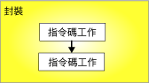
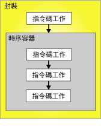

# 優先順序條件約束
  優先順序條件約束可在控制流程中，連結封裝中的可執行檔、容器和工作，並指定判斷可執行檔是否執行的條件。 可執行檔可以是「For 迴圈」容器、「Foreach 迴圈」容器、「時序」容器、工作或事件處理常式。 事件處理常式也可使用優先順序條件約束，以將其可執行檔連結至控制流程。  
  
 優先順序條件約束會連結兩個可執行檔：優先順序可執行檔和受條件約束的可執行檔。 優先順序可執行檔在條件約束可執行檔之前執行，且優先順序可執行檔的執行結果可以決定條件約束可執行檔是否執行。 下圖顯示了由優先順序條件約束連結的兩個可執行檔。  
  
   
  
 在線性控制流程 (即沒有分支的控制流程) 中，優先順序條件約束單獨管理工作執行的順序。 在控制流程分支中， [!INCLUDE[ssISnoversion](../../includes/ssisnoversion-md.md)] 執行階段引擎決定直接跟隨在分支後面的工作和容器之執行順序。 執行階段引擎也決定控制流程中未連接的工作流程之執行順序。  
  
 除僅封裝單一工作的工作主機容器之外， [!INCLUDE[ssISnoversion](../../includes/ssisnoversion-md.md)] 的巢狀容器架構會啟用所有容器，用以包含每個都具有其各自控制流程的其他容器。 「For 迴圈」容器、「Foreach 迴圈」容器和「時序」容器可以包含多個工作和其他容器，而工作和其他容器進而可以包含多個工作和容器。 例如，具有「指令碼」工作和「時序」容器的封裝具有連結「指令碼」工作和「時序」容器的優先順序條件約束。 「時序」容器包括三個「指令碼」工作，且其優先順序條件約束會將這三個「指令碼」工作連結至一個控制流程。 下圖顯示具有兩個巢狀層級之封裝中的優先順序條件約束。  
  
   
  
 因為封裝位於 [!INCLUDE[ssIS](../../includes/ssis-md.md)] 容器架構的最上層，所以優先順序條件約束無法連結多個封裝；但是，您可以將「執行封裝」工作加入封裝，然後間接地將其他封裝連結至控制流程。  
  
 您可以利用下列方式設定優先順序條件約束：  
  
-   指定評估作業。 優先順序條件約束同時使用條件約束值和運算式，或使用其中之一，來決定條件約束可執行檔是否執行。  
  
-   如果優先順序條件約束使用執行結果，則您可以將執行結果指定為成功、失敗或完成。  
  
-   如果優先順序條件約束使用評估結果，則您可以提供評估為布林的運算式。  
  
-   指定只評估優先順序條件約束，還是同時評估套用至條件約束可執行檔的其他條件約束。  
  
## 評估作業  
 [!INCLUDE[ssISnoversion](../../includes/ssisnoversion-md.md)] 提供下列評估作業：  
  
-   僅使用優先順序可執行檔之執行結果的條件約束，以決定條件約束可執行檔是否執行。 優先順序可執行檔的執行結果可以是完成、成功或失敗。 這是預設作業。  
  
-   運算式，對其進行評估以決定條件約束可執行檔是否執行。 如果運算式評估為 true，則條件約束可執行檔會執行。  
  
-   運算式與條件約束，此條件約束會組合優先順序可執行檔之執行結果與評估運算式之傳回結果兩者的需求。  
  
-   運算式或條件約束，此條件約束會使用優先順序可執行檔的執行結果或評估運算式的傳回結果。  
  
 [!INCLUDE[ssIS](../../includes/ssis-md.md)] 設計師使用色彩識別優先順序條件約束的類型。 「成功」條件約束為綠色，「失敗」條件約束為紅色，而「完成」條件約束則為藍色。 若要在顯示條件約束類型的 [ [!INCLUDE[ssIS](../../includes/ssis-md.md)] 設計師] 中顯示文字標籤，則必須設定 [ [!INCLUDE[ssIS](../../includes/ssis-md.md)] 設計師] 的協助工具功能。  
  
 運算式必須為有效的 [!INCLUDE[ssIS](../../includes/ssis-md.md)] 運算式，並且它可以包括函數、運算子、系統和自訂變數。 如需詳細資訊，請參閱 [Integration Services &#40;SSIS&#41; 運算式](../../integration-services/expressions/integration-services-ssis-expressions.md)和 [Integration Services &#40;SSIS&#41; 變數](../../integration-services/integration-services-ssis-variables.md)。  
  
## 執行結果  
 優先順序條件約束可以只使用下列執行結果，或與運算式一起使用。  
  
-   完成，只要求優先順序可執行檔完成 (無須考慮結果)，就可執行條件約束可執行檔。  
  
-   成功，要求優先順序可執行檔必須成功完成，才可執行條件約束可執行檔。  
  
-   失敗，要求優先順序可執行檔失敗時，才可執行條件約束可執行檔。  
  
> [!NOTE]  
>  只有是同一 **Precedence Constraint** 集合之成員的優先順序條件約束，才可以使用邏輯 AND 條件將其分組。 例如，您無法結合來自兩個「Foreach 迴圈」容器的優先順序條件約束。  
  
## 設定優先順序條件約束與優先順序條件約束編輯器中的屬性  
  
1.  在 [!INCLUDE[ssBIDevStudioFull](../../includes/ssbidevstudiofull-md.md)]中，開啟包含所需封裝的 [!INCLUDE[ssISnoversion](../../includes/ssisnoversion-md.md)] 專案。  
  
2.  在 [方案總管] 中，按兩下封裝將其開啟。  
  
3.  按一下 **[控制流程]** 索引標籤。  
  
4.  按兩下優先順序條件約束，  
  
     以開啟 [優先順序條件約束編輯器]。  
  
5.  在 [評估作業] 下拉式清單中，選取評估作業。  
  
6.  在 [值] 下拉式清單中，選取優先順序可執行檔的執行結果。  
  
7.  如果評估作業使用運算式，請在 [運算式] 方塊中，鍵入運算式，然後按一下 [測試] 以評估該運算式。  
  
    > [!NOTE]  
    >  變數名稱會區分大小寫。  
  
8.  如果有多個工作或容器連接到受條件約束的可執行檔，請選取 [邏輯 AND]，以指定所有先前可執行檔的執行結果都必須評估為 [true]。 選取 [邏輯 OR]，以指定只有一個執行結果必須評估為 [true]。  
  
9. 按一下 [確定]，以關閉 [優先順序條件約束編輯器]。  
  
10. 若要儲存已更新的封裝，請在 **[檔案]** 功能表上，按一下 **[儲存選取項目]** 。  

## 優先順序條件約束編輯器
使用 **[優先順序條件約束編輯器]** 對話方塊，即可設定優先順序條件約束。  
  
### 選項。  
 **評估作業**  
 指定優先順序條件約束所使用的評估作業。 這些作業有： **[條件約束]**、 **[運算式]**、 **[運算式與條件約束]**，以及 **[運算式或條件約束]**。  
  
 **值**  
 指定下列條件約束值：[成功]、[失敗] 或 [完成]。  
  
> [!NOTE]  
>  優先順序條件約束線條若是綠色代表**成功**、 反白顯示代表**失敗**，而藍色代表**完成**。  
  
 **運算式**  
 如果使用 [運算式]、[運算式與條件約束] 或 [運算式或條件約束] 作業，請輸入運算式或啟動運算式產生器以建立運算式。 運算式必須評估為布林。  
  
 **測試**  
 驗證運算式。  
  
 **邏輯 AND**  
 選取即可指定同一個可執行檔上的多個優先順序條件約束必須一起評估。 所有運算式都必須評估為 **True**。  
  
> [!NOTE]  
>  此種類型的優先順序條件約束會顯示為綠色、反白顯示或藍色的實線。  
  
 **邏輯 OR**  
 選取即可指定同一個可執行檔上的多個優先順序條件約束必須一起評估。 必須至少有一個條件約束評估為 **True**。  
  
> [!NOTE]  
>  此種類型的優先順序條件約束會顯示為綠色、反白顯示或藍色的虛線。  
  
## 在 [屬性] 視窗中設定的優先順序條件約束屬性  
  
1.  在 [!INCLUDE[ssBIDevStudioFull](../../includes/ssbidevstudiofull-md.md)]中，開啟包含要修改之封裝的 [!INCLUDE[ssISnoversion](../../includes/ssisnoversion-md.md)] 專案。  
  
2.  在 [方案總管] 中，按兩下封裝將其開啟。  
  
3.  按一下 **[控制流程]** 索引標籤。在 [控制流程] 索引標籤的設計介面上，以滑鼠右鍵按一下優先順序條件約束，然後按一下 [屬性]。 在 [屬性] 視窗中，修改屬性值。  
  
4.  在 [屬性] 視窗中，設定優先順序條件約束的下列讀取/寫入屬性：  
  
    |讀取/寫入屬性|組態動作|  
    |--------------------------|--------------------------|  
    |說明|提供描述。|  
    |EvalOp|選取評估作業。 如果選取 [Expression]、[ExpressionAndConstant] 或 [ExpressionOrConstant] 作業，您就可以指定運算式。|  
    |運算式|如果評估作業包含運算式，請提供一個運算式。 運算式必須評估為布林。 如需運算式語言的詳細資訊，請參閱 [Integration Services &#40;SSIS&#41; 運算式](../../integration-services/expressions/integration-services-ssis-expressions.md)。|  
    |LogicalAnd|設定 [LogicalAnd]，指定當多個可執行檔優先於並連結到受條件約束的可執行檔時，優先順序條件約束是否要配合其他優先順序條件約束進行評估|  
    |名稱|更新優先順序條件約束的名稱。|  
    |ShowAnnotation|指定要使用之註解的類型。 選擇 [Never] 以停用註解，選擇 [AsNeeded] 以視需要啟用註解，選擇 [ConstraintName] 以使用 Name 屬性的值來自動註解，選擇 [ConstraintDescription] 以使用 Description 屬性的值來自動註解，以及選擇 [ConstraintOptions] 以使用 Value 和 Expression 屬性的值來自動註解。|  
    |Value|如果 EvalOP 屬性中指定的評估作業包含條件約束，請選取具有條件約束之可執行檔的執行結果。|  
  
5.  關閉 [屬性] 視窗。  
  
6.  若要儲存已更新的封裝，請在 **[檔案]** 功能表上，按一下 **[儲存選取項目]** 。  

## 設定快顯功能表的優先順序條件約束的值  
  
1.  在 [!INCLUDE[ssBIDevStudioFull](../../includes/ssbidevstudiofull-md.md)]中，開啟包含所需封裝的 [!INCLUDE[ssISnoversion](../../includes/ssisnoversion-md.md)] 專案。  
  
2.  在 [方案總管] 中，按兩下封裝將其開啟。  
  
3.  按一下 **[控制流程]** 索引標籤。  
  
4.  在 [控制流程] 索引標籤的設計介面上，以滑鼠右鍵按一下優先順序條件約束，然後按一下 [成功]、[失敗] 或 [完成]。  
  
5.  若要儲存更新的封裝，請按一下 [檔案] 功能表上的 [儲存選取項目]。  

## 將運算式加入優先順序條件約束
 優先順序條件約束可以使用運算式來定義兩個可執行檔之間的條件約束：優先順序可執行檔和受條件約束的可執行檔。 可執行檔可以是工作或容器。 運算式可以單獨使用，或與優先順序可執行檔的執行結果組合使用。 可執行檔的執行結果為成功或失敗。 設定優先順序條件約束的執行結果時，可以將執行結果設為 [成功]、[失敗] 或 [完成]。 **成功**：表示優先順序可執行檔必須執行成功；**失敗**：表示優先順序可執行檔必須執行失敗；**完成**：指示不論優先順序工作成功與否，受條件約束的可執行檔都應該執行。 如需詳細資訊，請參閱 [Precedence Constraints](../../integration-services/control-flow/precedence-constraints.md)。  
  
 運算式必須評估為 **True** 或 **False**，且必須是有效的 [!INCLUDE[ssISnoversion](../../includes/ssisnoversion-md.md)] 運算式。 運算式可以使用常值、系統及自訂變數，以及 [!INCLUDE[ssIS](../../includes/ssis-md.md)] 運算式文法提供的函數與運算子。 例如，運算式 `@Count == SQRT(144) + 10` 使用變數 **Count**、SQRT 函數及等於 (==) 和加 (+) 運算子。 如需詳細資訊，請參閱 [Integration Services &#40;SSIS&#41; 運算式](../../integration-services/expressions/integration-services-ssis-expressions.md)。  
  
 在下圖中，工作 A 及工作 B 由使用執行結果及運算式的優先順序條件約束連結。 條件約束值設為 [成功] 且運算式為 `@X >== @Z`。 工作 B (受條件約束的工作) 只在工作 A 順利完成且變數 **X** 的值大於或等於變數 **Z**的值時執行。  
  
   
  
 可執行檔也可以使用包含不同運算式的多個優先順序條件約束來連結。 例如在下圖中，工作 B 和 C 由使用執行結果及運算式的優先順序條件約束連結至工作 A。 二個條件約束值都設為 [成功]。 一個優先順序條件約束包含運算式 `@X >== @Z`，另一個優先順序條件約束包含運算式 `@X < @Z`。 視變數 **X** 與 **Z**的值而定，會執行工作 C 或工作 B。  
  
   
  
 使用 [[!INCLUDE[ssIS](../../includes/ssis-md.md)] 設計師] 中的 [優先順序條件約束編輯器] 及 [!INCLUDE[ssBIDevStudioFull](../../includes/ssbidevstudiofull-md.md)] 提供的 [屬性] 視窗，可以新增或修改運算式。 然而，[屬性] 視窗不提供運算式語法的驗證。  
  
 如果優先順序條件約束包含運算式，則會在 [控制流程] 索引標籤之設計介面上優先順序條件約束的旁邊出現圖示，且圖示上的工具提示會顯示運算式。  

### 將運算式加入優先順序條件約束  
  
1.  在 [!INCLUDE[ssBIDevStudioFull](../../includes/ssbidevstudiofull-md.md)]中，開啟包含所需封裝的 [!INCLUDE[ssISnoversion](../../includes/ssisnoversion-md.md)] 專案。  
  
2.  在 [方案總管] 中，按兩下封裝將其開啟。  
  
3.  按一下 **[控制流程]** 索引標籤。  
  
4.  在 [控制流程] 索引標籤的設計介面上，按兩下優先順序條件約束。 [優先順序條件約束編輯器] 隨即開啟。  
  
5.  在 [評估作業] 清單中，選取 [運算式]、[運算式與條件約束] 或 [運算式或條件約束]。  
  
6.  在 [運算式] 文字方塊中輸入運算式，或啟動運算式產生器以建立運算式。  
  
7.  若要驗證運算式語法，請按一下 [測試]。  
  
8.  若要儲存已更新的封裝，請在 **[檔案]** 功能表上，按一下 **[儲存選取項目]** 。  
 
### 組合執行值與運算式  
 下表描述將執行值條件約束與優先順序條件約束中的運算式進行組合的影響。  
  
|評估作業|條件約束評估為|運算式評估為|受條件約束的可執行檔執行|  
|--------------------------|-----------------------------|-----------------------------|---------------------------------|  
|條件約束|True|不適用|True|  
|條件約束|False|不適用|False|  
|運算式|不適用|True|True|  
|運算式|不適用|False|False|  
|條件約束與運算式|True|True|True|  
|條件約束與運算式|True|False|False|  
|條件約束與運算式|False|True|False|  
|條件約束與運算式|False|False|False|  
|條件約束或運算式|True|True|True|  
|條件約束或運算式|True|False|True|  
|條件約束或運算式|False|True|True|  
|條件約束或運算式|False|False|False|  

## 使用多個優先順序條件約束的複雜條件約束案例 
優先順序條件約束會連接兩個可執行檔：兩個工作、兩個容器，或一個工作和一個容器。 其稱為優先順序可執行檔與受條件約束的可執行檔。 條件約束可執行檔可包含多個優先順序條件約束。 如需詳細資訊，請參閱 [Precedence Constraints](../../integration-services/control-flow/precedence-constraints.md)。  
  
 藉由群組條件約束來組裝複雜的條件約束案例，可讓您在封裝中實作複雜的控制流程。 例如，在下圖中，工作 D 按 [成功] 條件約束連結到工作 A、按 [失敗] 條件約束連結到工作 B，同時按 [成功] 條件約束連結到工作 C。 工作 D 與工作 A、工作 D 與工作 B，以及工作 D 與工作 C 之間的優先順序條件約束會參與邏輯 *and* 關聯性。 因此，工作 A 必須成功執行、工作 B 必須失敗，而且工作 C 必須成功執行，才可以執行工作 D。  
  
   
  
### LogicalAnd 屬性  
 如果工作或容器具有多個條件約束，則 **LogicalAnd** 屬性會指定是只評估優先順序條件約束，還是同時評估其他條件約束。  
  
 您可以使用 [!INCLUDE[ssIS](../../includes/ssis-md.md)] 設計師中的 [優先順序條件約束編輯器] (或在 [!INCLUDE[ssBIDevStudioFull](../../includes/ssbidevstudiofull-md.md)] 提供的 [屬性] 視窗中)，設定 **LogicalAnd** 屬性。  

## 設定優先順序條件約束的預設值  
首次使用 [ [!INCLUDE[ssIS](../../includes/ssis-md.md)] 設計師] 時，優先順序條件約束的預設值為 **Success**。 請遵循下列步驟來設定「 [!INCLUDE[ssIS](../../includes/ssis-md.md)] 設計師」，以便使用優先順序條件約束的其他預設值。
  
1.  開啟 [!INCLUDE[ssBIDevStudioFull](../../includes/ssbidevstudiofull-md.md)]。  
  
2.  在 **[工具]** 功能表上，按一下 **[選項]**。  
  
3.  在 [選項] 對話方塊中，展開 [商業智慧設計師]，然後展開 [Integration Services 設計師]。  
  
4.  按一下 [控制流程自動連接]，然後選取 [依預設，將新形狀連接到選取的形狀]。  
  
5.  在下拉式清單中，選擇 [在新形狀使用「失敗」條件約束] 或 [在新形狀使用「完成」條件約束]。  
  
6.  按一下 **[確定]**。  
  
## 建立預設優先順序條件約束  
  
1.  在 [!INCLUDE[ssBIDevStudioFull](../../includes/ssbidevstudiofull-md.md)]中，開啟包含所需封裝的 [!INCLUDE[ssISnoversion](../../includes/ssisnoversion-md.md)] 專案。  
  
2.  在 [方案總管] 中，按兩下封裝將其開啟。  
  
3.  按一下 **[控制流程]** 索引標籤。  
  
4.  在 [控制流程] 索引標籤的設計介面上，按一下工作或容器，然後將其連接子拖曳到您要套用優先順序條件約束的可執行檔。  
  
5.  若要儲存已更新的封裝，請在 **[檔案]** 功能表上，按一下 **[儲存選取項目]** 。  

