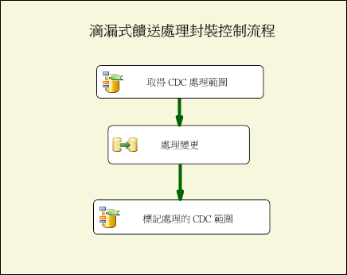
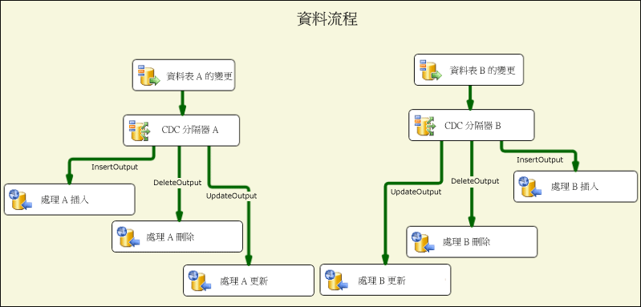
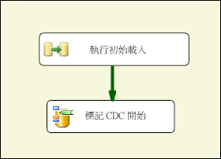
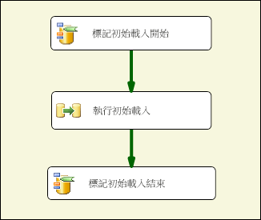
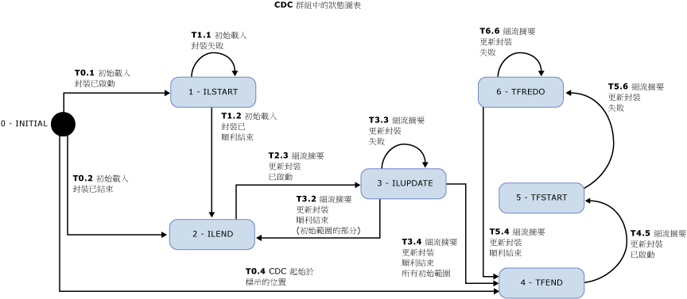

# CDC 流程元件
  Change Data Capture Components by Attunity for Microsoft [!INCLUDE[ssISCurrent](../../includes/ssiscurrent-md.md)] 可協助 SSIS 開發人員使用 CDC 並且降低 CDC 封裝的複雜性。  
  
 SSIS CDC 元件的設計目的是要搭配來源資料表為相同 [!INCLUDE[ssCurrent](../../includes/sscurrent-md.md)] 資料庫或 Oracle 資料庫 (使用 [!INCLUDE[ssCurrent](../../includes/sscurrent-md.md)] 的 Oracle CDC 服務時) 的 [!INCLUDE[ssCurrent](../../includes/sscurrent-md.md)] CDC 功能運作。 支援分割資料表。  
  
 這些元件包括控制和資料流程元件，可簡化在 SSIS 封裝中讀取和處理變更資料的體驗。 這些元件可以加入至 Microsoft [!INCLUDE[ssCurrent](../../includes/sscurrent-md.md)] 的元件程式庫，但是必須另外安裝。  
  
 Change Data Capture Components by Attunity 如下所示：  
  
 **CDC 控制流程元件**：  
  
 [CDC 控制工作](../../integration-services/control-flow/cdc-control-task.md)  
  
 **CDC 資料流程元件**：  
  
 [CDC 來源](../../integration-services/data-flow/cdc-source.md)  
  
 [CDC 分隔器](../../integration-services/data-flow/cdc-splitter.md)  
  
## 安裝  
 本節描述 Microsoft [!INCLUDE[ssISCurrent](../../includes/ssiscurrent-md.md)] CDC 元件的安裝程序。  
  
 SSIS 的 CDC 元件隨附於 Attunity 所提供適用於 Microsoft SQL Server® 2016 的 Microsoft® Change Data Capture Designer for Oracle 和 Change Data Capture Service for Oracle。 此下載是 SQL Server 2016 Feature Pack 的一部分。 從 [SQL Server 2016 Feature Pack 網頁](http://go.microsoft.com/fwlink/?LinkId=746297)下載 Feature Pack 的元件。  
  
### 版本支援  
 SSIS CDC 元件支援下列 Microsoft [!INCLUDE[ssNoVersion](../../includes/ssnoversion-md.md)] 產品：  
  
-   Microsoft [!INCLUDE[ssCurrent](../../includes/sscurrent-md.md)]  
  
-   Microsoft [!INCLUDE[ssBIDevStudio](../../includes/ssbidevstudio-md.md)] for Visual Studio 2015  
  
 下列作業系統和平台都支援這些版本：  
  
-   Windows Vista Service Pack 2  
  
-   Windows 7  
  
-   Windows 10  
  
-   Windows Server 2008 Service Pack 2  
  
-   Windows Server 2008 R2  
  
-   Windows Server 2012  
  
### 執行安裝程式  
 執行安裝精靈之前，請確定 [!INCLUDE[ssCurrent](../../includes/sscurrent-md.md)][!INCLUDE[ssBIDevStudio](../../includes/ssbidevstudio-md.md)] 已關閉。 然後，遵循安裝精靈中的指示進行。  
  
### 重新啟動 SSIS  
 安裝 CDC 元件之後，您必須重新啟動 SSIS 服務，才能確保在 SQL [!INCLUDE[ssBIDevStudio](../../includes/ssbidevstudio-md.md)] 中開發封裝時，這些元件可正確運作。  
  
 安裝元件之後，系統會顯示一則訊息。 出現提示時，請按一下 [是]。  
  
### 解除安裝 Microsoft CDC 元件  
 您可以使用解除安裝精靈來解除安裝 CDC 來源、CDC 分隔器或 CDC 控制工作。 解除安裝元件之前，您必須先確定下列事項：  
  
 如果您正在使用 [!INCLUDE[ssCurrent](../../includes/sscurrent-md.md)][!INCLUDE[ssBIDevStudio](../../includes/ssbidevstudio-md.md)] 進行封裝開發，請確定 [!INCLUDE[ssBIDevStudio](../../includes/ssbidevstudio-md.md)] 已關閉，然後再執行解除安裝精靈。  
  
## 優點  
 [!INCLUDE[ssCurrent](../../includes/sscurrent-md.md)][!INCLUDE[ssISnoversion](../../includes/ssisnoversion-md.md)] 元件的 CDC 元件可讓 SSIS 開發人員輕鬆地建置處理變更資料的 SSIS 封裝。 這些元件可強化 SSIS 開發人員處理 CDC 的能力，並且降低 CDC 封裝的複雜性。  
  
 SSIS CDC 元件是用來以方便進一步處理的方式提供變更資料，以便複寫、載入資料倉儲、更新 OLAP 的緩時變維度、稽核變更或進行其他可能的用途。 所使用的進一步處理類型是由 SSIS 開發人員決定。  
  
 SSIS CDC 元件的設計目的是要搭配變更資料表位於相同 [!INCLUDE[ssCurrent](../../includes/sscurrent-md.md)] 資料庫中的 [!INCLUDE[ssCurrent](../../includes/sscurrent-md.md)] CDC 功能運作。  
  
## 開始使用異動資料擷取元件  
 一般的 CDC 封裝會處理一組資料表的變更。 下圖顯示這種 CDC 封裝類型的基本控制流程部分。 這種封裝稱為 Trickle 摘要處理封裝。  
  
   
  
 這個 [!INCLUDE[ssCurrent](../../includes/sscurrent-md.md)][!INCLUDE[ssISnoversion](../../includes/ssisnoversion-md.md)] 控制流程包含兩項 CDC 控制工作和資料流程工作。 名為「取得 CDC 處理範圍」的第一項工作會針對在名為「處理變更」之資料流程工作中處理的變更建立 LSN 範圍。 這個範圍是根據最後一個封裝執行期間所處理的內容以及儲存在永續性存放區中的內容所建立。  
  
 如需使用 CDC 控制工作的詳細資訊，請參閱 [CDC 控制工作](../../integration-services/control-flow/cdc-control-task.md)和 [CDC 控制工作編輯器](../../integration-services/control-flow/cdc-control-task-editor.md)。  
  
 下圖顯示「處理變更」資料流程，就概念上說明變更的處理方式。  
  
   
  
 此圖所說明的步驟如下：  
  
-   「資料表 X 的變更」是讀取對資料表 X 所做變更的 CDC 來源，這些變更是在父控制流程中決定的 CDC 處理範圍內進行。  
  
-   「CDC 分隔器 X」是用來將變更分割成插入、刪除和更新。 此案例會假設 CDC 來源設定成產生淨變更，以便以平行方式處理不同的變更類型。  
  
-   然後，在下游進一步處理特定變更。 在本圖中，這些變更會插入使用多個 ODBC 目的地的資料表，但在實際的情況中，處理方式可能有所不同。  
  
 如需有關 CDC 來源的詳細資訊，請參閱：  
  
 [CDC 來源](../../integration-services/data-flow/cdc-source.md)  
  
 [CDC 來源編輯器 &#40;連線管理員頁面&#41;](../../integration-services/data-flow/cdc-source-editor-connection-manager-page.md)  
  
 [CDC 來源編輯器 &#40;資料行頁面&#41;](../../integration-services/data-flow/cdc-source-editor-columns-page.md)  
  
 [CDC 來源編輯器 &#40;錯誤輸出頁面&#41;](../../integration-services/data-flow/cdc-source-editor-error-output-page.md)  
  
 如需有關 CDC 分隔器的詳細資訊，請參閱：  
  
 [CDC 分隔器](../../integration-services/data-flow/cdc-splitter.md)  
  
 建置 CDC 封裝時需要注意的其中一個基本問題是，變更處理如何與資料的初始載入 (或初始處理) 互動。  
  
 CDC 元件支援三種相異初始載入和變更處理案例：  
  
-   透過資料庫快照集完成初始載入。 在此情況中，變更處理會從快照集事件的 LSN 開始進行。  
  
-   從靜止資料庫進行初始載入。 在此情況中，初始載入期間不會進行任何變更，因此系統會在初始載入期間的某個時間點對目前 LSN 進行取樣，而且變更處理會從該 LSN 開始進行。  
  
-   從使用中資料庫進行初始載入。 在此情況中，當初始載入正在進行時，系統會對資料庫進行變更，而且沒有能夠據以精確啟動變更處理的單一 LSN。 在此情況中，初始載入封裝開發人員可以在初始載入前後對來源資料庫的目前 LSN 進行取樣。 然後，在處理變更時，應該小心處理以平行方式對初始載入所做的變更，因為某些處理的變更已經顯示在初始載入中 (例如，插入變更可能失敗並發生重複索引鍵錯誤，因為插入的資料列已由初始載入程序讀取)。  
  
 下圖顯示可處理前兩種案例的 SSIS 封裝：  
  
   
  
 下圖顯示可處理第三種案例的 SSIS 封裝：  
  
   
  
 初始載入封裝之後，Trickle 摘要更新封裝會根據處理變更的排程重複執行，因為它們變成可供取用。  
  
 將 CDC 處理的狀態從初始載入封裝傳遞至 Trickle 摘要封裝以及在每個封裝內不同工作之間傳遞的作業是經由特殊的 SSIS 封裝字串變數進行。 此變數的值稱為 CDC 狀態，它會針對初始載入和 Trickle 摘要封裝所處理的資料表群組反映 CDC 處理的目前狀態。  
  
 CDC 狀態變數的值必須在持續性儲存體中維護、應該在啟動 CDC 處理之前讀取，而且應該在處理完成之後，與目前狀態一起儲存。 雖然 SSIS 開發人員可以處理 CDC 狀態的載入和儲存工作，不過 CDC 控制元件可以在資料庫資料表中維護 CDC 狀態值，藉以自動化這項工作。  
  
## 安全性考量  
 本節列出一些在 SSIS 中使用 CDC 元件的相關安全性考量。  
  
### 變更資料的存取授權  
 Trickle 摘要更新封裝需要 [!INCLUDE[ssCurrent](../../includes/sscurrent-md.md)] CDC 功能的存取權。 根據預設，這類存取權會授與 **db_owner** 固定資料庫角色的成員。 因為 **db_owner** 是功能強大的角色，所以在 [!INCLUDE[ssCurrent](../../includes/sscurrent-md.md)] 中定義擷取執行個體時，建議您將控制安全性角色與每個擷取執行個體產生關聯，讓 SSIS CDC 封裝使用更受限制的使用者來處理變更。  
  
### CDC 資料庫目前 LSN 的存取權  
 針對變更處理標記啟始 LSN 的 CDC 控制工作作業必須能夠尋找 CDC 資料庫目前 LSN。 這項作業是使用 master 資料庫的 **sp_replincrementlsn** 程序來完成。 您必須將此程序的執行權限提供給用於連接至 [!INCLUDE[ssCurrent](../../includes/sscurrent-md.md)] CDC 資料庫的登入。  
  
### CDC 狀態資料表的存取權  
 CDC 狀態資料表是用於自動保存 CDC 狀態，而用於連接至 [!INCLUDE[ssCurrent](../../includes/sscurrent-md.md)] CDC 資料庫的登入必須能夠更新這些狀態。 因為這個資料表是由 SSIS 開發人員所建立，所以請將 [!INCLUDE[ssCurrent](../../includes/sscurrent-md.md)] 系統管理員設定為獲授權可建立 [!INCLUDE[ssCurrent](../../includes/sscurrent-md.md)] 資料庫並執行管理和維護工作的使用者。 此外，使用啟用 CDC 之資料庫的 [!INCLUDE[ssCurrent](../../includes/sscurrent-md.md)] 系統管理員必須充分了解 [!INCLUDE[ssCurrent](../../includes/sscurrent-md.md)] CDC 技術和實作。  
  
## 將資料表分組以進行 CDC 處理  
 資料庫專案大小的範圍從許多資料表到數千個資料表不等。 設計初始載入和 CDC 封裝時，建議您將資料表分組成較小的群組以方便管理並提高效率。 本節列出將資料表排序成小型群組時可能會影響的各種考量 (一開始載入每個群組中的資料表，然後再當做群組來更新)。  
  
 CDC 元件所支援的 CDC 模式會假設已經決定此群組。 每個群組都會定義不同的 CDC 內容，並且與其他群組分開維護內容。 每個群組都會建立初始載入和 Trickle 摘要更新封裝。 Trickle 摘要更新是根據變更處理條件約束的比率 (例如 CPU 和 IO 耗用量，對其他系統的影響) 以及所需的延遲，排程為定期執行。  
  
 資料表是根據下列考量進行分組：  
  
1.  根據目標資料庫。 寫入不同目標資料庫或進行不同處理的所有資料表都應該指派給不同的 CDC 群組。  
  
2.  與參考完整性條件約束相關的資料表應該指派給相同的群組，避免目標發生參考完整性問題。  
  
3.  可容許較高延遲的資料表可以組成群組，以便降低處理這些資料表的頻率並且減少整體系統負載。  
  
4.  變動率較高的資料表應該位於較小的群組中，而變動率較低的資料表則可組成較大的群組。  
  
 下列兩種封裝是針對每個 CDC 群組建立的：  
  
-   初始載入封裝，它會從來源資料表讀取完整的資料範圍並且套用至目標資料表。  
  
-   Trickle 摘要更新封裝，它會讀取對來源資料表所做的變更並且將變更套用至目標資料表。 這個封裝應該定期執行。  
  
## CDC 狀態  
 每個 CDC 群組都具有相關聯的狀態，由特定格式的字串表示。 如需詳細資訊，請參閱 [CDC 控制工作](../../integration-services/control-flow/cdc-control-task.md)。 下表顯示可能的 CDC 狀態值。  
  
|State|說明|  
|-----------|-----------------|  
|0-(INITIAL)|在目前 CDC 群組上執行任何封裝之前就存在的狀態。 這也是 CDC 狀態為空白時呈現的狀態。   如需 CDC 控制工作作業的詳細資訊，請參閱 [CDC 控制工作](../../integration-services/control-flow/cdc-control-task.md)。|  
|1-ILSTART (初始載入開始)|這是初始載入封裝啟動時存在的狀態。 這個狀態會在 CDC 控制工作的 **MarkInitialLoadStart** 作業呼叫之後出現。   如需 CDC 控制工作作業的詳細資訊，請參閱 [CDC 控制工作](../../integration-services/control-flow/cdc-control-task.md)。|  
|2-ILEND (初始載入結束)|這是初始載入封裝順利結束時存在的狀態。 這個狀態會在 CDC 控制工作的 MarkInitialLoadEnd 作業呼叫之後出現。   如需 CDC 控制工作作業的詳細資訊，請參閱 [CDC 控制工作](../../integration-services/control-flow/cdc-control-task.md)。|  
|3-ILUPDATE (初始載入更新)|這是在初始載入之後仍在處理初始處理範圍時第一次執行更新封裝之後存在的狀態。 這個狀態會在 CDC 控制工作的 **GetProcessingRange** 作業呼叫之後出現。   如果正在使用 **_$reprocessing** 資料行，它就會設定為 1，表示封裝可能要重新處理已經位於目標上的資料列。   如需 CDC 控制工作作業的詳細資訊，請參閱 [CDC 控制工作](../../integration-services/control-flow/cdc-control-task.md)。|  
|4-TFEND (Trickle 摘要更新結束)|這是一般 CDC 回合所預期的狀態。 這種狀態表示上一個回合已順利完成，而且可以啟動具有新處理範圍的新回合。|  
|5-TFSTART (Trickle 摘要更新開始)|這是在 CDC 控制工作的 **GetProcessingRange** 作業呼叫之後，後續執行更新封裝時存在的狀態。   這種狀態表示一般 CDC 回合已啟動，但是沒有完成或者尚未全部完成 (**MarkProcessedRange**)。   如需 CDC 控制工作作業的詳細資訊，請參閱 [CDC 控制工作](../../integration-services/control-flow/cdc-control-task.md)。|  
|6-TFREDO (重新處理 Trickle 摘要更新)|這是在 TFSTART 之後發生 **GetProcessingRange** 時的狀態。 這種狀態表示上一個回合並未順利完成。   如果正在使用 __$reprocessing 資料行，它就會設定為 1，表示封裝可能要重新處理已經位於目標上的資料列。|  
|7-ERROR|CDC 群組處於 ERROR 狀態。|  
  
 下面是 CDC 元件的狀態圖表。 達到非預期的狀態時，就會達到 ERROR 狀態。 預期的狀態如下圖所示，但是此圖表不會顯示 ERROR 狀態。  
  
 例如，在初始載入封裝的結尾，嘗試將狀態設定為 ILEND 時，如果狀態為 TFSTART，則 CDC 群組就會處於錯誤狀態，而且 Trickle 摘要更新封裝不會執行 (初始載入封裝會執行)。  
  
   
  
 一旦初始載入封裝順利執行之後，Trickle 摘要更新封裝就會依照預先決定的排程重複執行，以便處理來源資料表的變更。 Trickle 摘要更新封裝的每個回合都是 CDC 回合。  
  
## 本節內容  
  
-   [CDC 來源](../../integration-services/data-flow/cdc-source.md)  
  
-   [CDC 分隔器](../../integration-services/data-flow/cdc-splitter.md)  
  
## 相關工作  
  
-   [依據變更類型來導向 CDC 資料流](../../integration-services/data-flow/direct-the-cdc-stream-according-to-the-type-of-change.md)  
  
-   [定義狀態變數](../../integration-services/data-flow/define-a-state-variable.md)  
  
## 相關內容  
  
-   mattmasson.com 上的部落格文章：[CDC in SSIS for SQL Server 2012](http://www.mattmasson.com/2011/12/cdc-in-ssis-for-sql-server-2012-2/)。  
  
-   blogs.msdn.com 上有關設定 CDC 服務的部落格文章：[CDC for Oracle in SQL Server 2012](http://go.microsoft.com/fwlink/?LinkId=247827)SQL Server 2012 中的 Oracle CDC)。  
  
-   social.technet.microsoft.com 上的技術文章： [安裝 Microsoft SQL Server 2012 Change Data Capture for Oracle by Attunity](http://go.microsoft.com/fwlink/?LinkId=252958)。  
  
-   social.technet.microsoft.com 上的技術文章： [疑難排解 Microsoft SQL Server 2012 Change Data Capture for Oracle by Attunity 中的組態問題](http://go.microsoft.com/fwlink/?LinkId=252960)。  
  
-   social.technet.microsoft.com 上的技術文章： [疑難排解 Microsoft SQL Server 2012 Change Data Capture for Oracle by Attunity 中的 CDC 執行個體錯誤](http://go.microsoft.com/fwlink/?LinkId=252961)。  
  
-   technet.microsoft.com 上的影片：[CDC for Oracle Databases using SQL Server Integration Services 2012](http://technet.microsoft.com/sqlserver/jj218898) (使用 SQL Server Integration Services 2012 的 Oracle CDC 資料庫) (SQL Server 影片)。  
  
## 請參閱＜  
 [CDC 控制工作](../../integration-services/control-flow/cdc-control-task.md)  
  
  