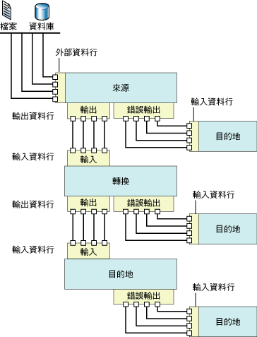

# 資料流程
  [!INCLUDE[ssNoVersion](../../includes/ssnoversion-md.md)] [!INCLUDE[ssISnoversion](../../includes/ssisnoversion-md.md)] 提供三種不同類型的資料流程元件：來源、轉換與目的地。 來源從關聯式資料庫、檔案和 [!INCLUDE[ssASnoversion](../../includes/ssasnoversion-md.md)] 資料庫中的資料表和檢視等資料存放區擷取資料。 轉換會修改、摘要並清除資料。 目的地則將資料載入資料存放區或建立記憶體中資料集。  
  
> [!NOTE]  
>  使用自訂提供者時，您需要使用中繼資料資料行值更新 ProviderDescriptors.xml 檔。  
  
 此外， [!INCLUDE[ssISnoversion](../../includes/ssisnoversion-md.md)] 提供將一個元件的輸出連接到另一個元件的輸入之路徑。 路徑會定義元件的順序，還能讓您將附註加入資料流程或檢視資料行的來源。  
  
 您可透過將來源和目的地的輸出，連接到轉換和目的地的輸入，以連接資料流程元件。 在建構資料流程時，您通常會在加入第二個和後續元件至資料流程時連接這些元件。 在您連接元件之後，輸入資料行便可用於設定元件。 當沒有任何輸入資料行可使用時，您將需要在元件已連接到資料流程後完成該元件的組態。 如需詳細資訊，請參閱 [Integration Services 路徑](../../integration-services/data-flow/integration-services-paths.md) 和 [以路徑連接元件](http://msdn.microsoft.com/library/05633e4c-1370-4b05-802b-f36b07dd71c8)。  
  
 下圖顯示了具有來源、一個輸入與一個輸出的轉換，以及目的地的資料流程。 除輸入資料行、輸出資料行和外部資料行之外，該圖還包含了輸入、輸出和錯誤輸出。  
  
   
  
## 資料流程實作  
 在封裝中實作資料流程時，第一個步驟便是將「資料流程」工作加入封裝的控制流程。 封裝可以包含多個「資料流程」工作，每個工作各有其自己的資料流程。 例如，如果封裝要求資料流程以指定的順序執行，或需要在資料流程之間執行其他工作，您必須對每個資料流程使用個別的「資料流程」工作。  
  
 在控制流程包含「資料流程」工作後，您便可以開始建立封裝所使用的資料流程。 如需詳細資訊，請參閱 [資料流程工作](../../integration-services/control-flow/data-flow-task.md)。  
  
 建立資料流程包含下列步驟：  
  
-   加入一個或多個來源，以從檔案和資料庫中擷取資料並加入連接管理員，以連接來源。  
  
-   加入符合封裝之商務需求的轉換。 資料流程不一定要包含轉換。  
  
     某些轉換會需要連接管理員。 例如，「查閱」轉換使用連接管理員來連接到包含查閱資料的資料庫。  
  
-   將來源和轉換的輸出連接到轉換和目的地的輸入，以連接資料流程元件。  
  
-   加入一個或多個目的地，以將資料載入檔案和資料庫一類的資料存放區並加入連接管理員，以連接資料來源。  
  
-   設定元件的錯誤輸出，以處理問題。  
  
     在執行階段，當資料流程元件轉換資料、執行查閱或評估運算式時，可能會發生資料列層級錯誤。 例如，具有字串值的資料行無法轉換成整數，或運算式嘗試除以零。 這兩個作業都會導致錯誤，但可以使用錯誤流程分別處理包含錯誤的資料列。 如需如何在封裝資料流程中使用錯誤流程的詳細資訊，請參閱 [處理資料中的錯誤](../../integration-services/data-flow/error-handling-in-data.md)。  
  
-   包括註解，讓資料流程能夠自行記錄。 如需詳細資訊，請參閱 [使用封裝中的註解](../../integration-services/use-annotations-in-packages.md)。  
  
> [!NOTE]  
>  當您建立新的封裝時，也可以使用精靈來幫助您正確設定連線管理員、來源和目的地。 如需詳細資訊，請參閱 [在 SQL Server 資料工具中建立封裝](../../integration-services/create-packages-in-sql-server-data-tools.md)。  
  
 當 [資料流程] 索引標籤作用中時，工具箱內會包含可加入資料流程的來源、轉換與目的地。  
  
## 運算式  
 某些資料流程元件 (來源、轉換及目的地) 支援在它們的某些屬性中使用屬性運算式。 屬性運算式是在封裝載入時取代屬性值的運算式。 在執行階段，封裝會使用更新的屬性值。 這些運算式是以 [!INCLUDE[ssISnoversion](../../includes/ssisnoversion-md.md)] 運算式語法所建置，而且可以包含 [!INCLUDE[ssISnoversion](../../includes/ssisnoversion-md.md)] 函數、運算子、識別碼和變數。 如需詳細資訊，請參閱 [Integration Services &#40;SSIS&#41; 運算式](../../integration-services/expressions/integration-services-ssis-expressions.md)、[Integration Services &#40;SSIS&#41; 運算式](../../integration-services/expressions/integration-services-ssis-expressions.md)和[在封裝中使用屬性運算式](../../integration-services/expressions/use-property-expressions-in-packages.md)。  
  
 如果在 [!INCLUDE[ssBIDevStudioFull](../../includes/ssbidevstudiofull-md.md)] 中建構封裝，任何支援屬性運算式之資料流程元件的屬性便會在其所屬的資料流程工作上公開。 若要加入、變更及移除資料流程元件的屬性運算式，請按一下資料流程工作，然後使用 [屬性] 視窗或工作編輯器加入、變更或刪除屬性運算式。 資料流程工作本身的屬性運算式是在 [屬性] 視窗中進行管理。  
  
 如果資料流程包含使用運算式的任何元件，[屬性] 視窗中也會公開運算式。 若要檢視運算式，請選取元件所屬的資料流程工作。 您可以依類別或是以字母順序檢視屬性。 如果您在 [屬性] 視窗中使用分類檢視，任何沒有在特定屬性中使用的運算式都會列在 [其他] 類別中。 如果您使用依字母順序檢視，就會以資料流程元件的名稱順序列出運算式。  
  
## 來源  
 在 [!INCLUDE[ssISnoversion](../../includes/ssisnoversion-md.md)]中，來源是一個資料流程元件，可讓資料流程中的其他元件使用不同外部資料來源的資料。 您可以從一般檔案、XML 檔案、Microsoft Excel 活頁簿及包含原始資料的檔案中擷取資料。 您也可以透過存取資料庫中的資料表和檢視以及執行查詢來擷取資料。  
  
 資料流程可以包含單一來源或多個來源。  
  
 資料流程的來源通常具有一個規則輸出。 規則輸出包含輸出資料行，這些是加入到資料流程的來源資料行。  
  
 規則輸出參考外部資料行。 外部資料行即來源中的資料行。 例如， **AdventureWorks** 資料庫之 **Product** 資料表中的 **MadeFlag** 資料行，便是可以加入到規則輸出的外部資料行。 外部資料行的中繼資料包括名稱、資料類型及來源資料行的長度等資訊。  
  
 來源的錯誤輸出包含與規則輸出相同的資料行，還包含其他兩個提供錯誤相關資訊的資料行。 [!INCLUDE[ssISnoversion](../../includes/ssisnoversion-md.md)] 物件模型對來源可具有的一般輸出數目和錯誤輸出數目沒有限制。 除「指令碼」元件之外， [!INCLUDE[ssISnoversion](../../includes/ssisnoversion-md.md)] 包含的大部份來源都具有一個規則輸出，且許多來源都有一個錯誤輸出。 自訂來源可以進行編碼，以實作多個一般輸出和錯誤輸出。  
  
 所有的輸出資料行都可以用作資料流程中下一個資料流程元件的輸入資料行。  
  
 您也可以撰寫自訂的來源。 如需詳細資訊，請參閱 [開發自訂資料流程元件](../../integration-services/extending-packages-custom-objects/data-flow/developing-a-custom-data-flow-component.md) 和 [開發特定類型的資料流程元件](../../integration-services/extending-packages-custom-objects-data-flow-types/developing-specific-types-of-data-flow-components.md)。  
  
 下列來源擁有可由屬性運算式進行更新的屬性。  
  
-   [ADO NET 來源](../../integration-services/data-flow/ado-net-source.md)  
  
-   [XML 來源](../../integration-services/data-flow/xml-source.md)  
  
### 可下載的來源  
 下表列出您可以從 [!INCLUDE[msCoName](../../includes/msconame-md.md)] 網站下載的其他來源。  
  
|來源|描述|  
|------------|-----------------|  
|Oracle 來源|Oracle 來源是 [!INCLUDE[msCoName](../../includes/msconame-md.md)] Connector for Oracle by Attunity 的來源元件。 [!INCLUDE[msCoName](../../includes/msconame-md.md)] Connector for Oracle by Attunity 也包含連接管理員和目的地。 如需詳細資訊，請參閱下載頁面上的 [Microsoft Connectors for Oracle and Teradata by Attunity](http://go.microsoft.com/fwlink/?LinkId=789384)。|  
|SAP BI 來源|SAP BI 來源是 [!INCLUDE[msCoName](../../includes/msconame-md.md)] Connector for SAP BI 的來源元件。 [!INCLUDE[msCoName](../../includes/msconame-md.md)] Connector for SAP BI 也包含連接管理員和目的地。 如需詳細資訊，請參閱下載頁面的 [Microsoft SQL Server 功能套件](http://go.microsoft.com/fwlink/?LinkID=746297)。|  
|Teradata 來源|Teradata 來源是 [!INCLUDE[msCoName](../../includes/msconame-md.md)] Connector for Teradata by Attunity 的來源元件。 [!INCLUDE[msCoName](../../includes/msconame-md.md)] Connector for Teradata by Attunity 也包含連接管理員和目的地。 如需詳細資訊，請參閱下載頁面上的 [Microsoft Connectors for Oracle and Teradata by Attunity](http://go.microsoft.com/fwlink/?LinkId=789384)。|  
  
 如需如何利用 [!INCLUDE[msCoName](../../includes/msconame-md.md)] Connector for Oracle by Attunity 獲致效能提升的示範，請參閱 [Microsoft Connector for Oracle by Attunity 的效能 (SQL Server 視影片)](http://go.microsoft.com/fwlink/?LinkID=210369)。  
  
## 轉換  
 轉換具有廣泛的功能。 它可以執行例如更新、摘要、清除、合併和散發資料等工作。 您可以修改資料行中的值、查閱資料表中的值、清除資料，以及彙總資料行值。  
  
 轉換的輸入和輸出定義傳入和傳出資料的資料行。 視對資料執行的作業而定，某些轉換具有單一輸入和多個輸出，而其他轉換則具有多個輸入和單一輸出。 轉換也可以包含錯誤輸出，提供錯誤發生的相關資訊以及失敗的資料：例如，無法轉換為整數資料類型的字串資料。 [!INCLUDE[ssISnoversion](../../includes/ssisnoversion-md.md)] 物件模型對轉換可以包含的輸入、一般輸出和錯誤輸出沒有數目限制。 您可以建立實作多個輸入、一般輸出和錯誤輸出之任意組合的自訂轉換。  
  
 轉換的輸入定義為一或多個輸入資料行。 某些 [!INCLUDE[ssISnoversion](../../includes/ssisnoversion-md.md)] 轉換也可以參考外部資料行作為輸入。 例如，OLE DB 命令轉換的輸入包含外部資料行。 輸出資料行是轉換加入到資料流程的資料行。 一般輸出和錯誤輸出均包含輸出資料行。 這些輸出資料行進而做為資料流程中下一個元件 (可以是另一個轉換，也可以是目的地) 的輸入資料行。  
  
 下列轉換擁有可由屬性運算式進行更新的屬性。  
  
-   [條件式分割轉換](../../integration-services/data-flow/transformations/conditional-split-transformation.md)  
  
-   [衍生的資料行轉換](../../integration-services/data-flow/transformations/derived-column-transformation.md)  
  
-   [模糊群組轉換](../../integration-services/data-flow/transformations/fuzzy-grouping-transformation.md)  
  
-   [模糊查閱轉換](../../integration-services/data-flow/transformations/fuzzy-lookup-transformation.md)  
  
-   [OLE DB 命令轉換](../../integration-services/data-flow/transformations/ole-db-command-transformation.md)  
  
-   [百分比取樣轉換](../../integration-services/data-flow/transformations/percentage-sampling-transformation.md)  
  
-   [樞紐轉換](../../integration-services/data-flow/transformations/pivot-transformation.md)  
  
-   [資料列取樣轉換](../../integration-services/data-flow/transformations/row-sampling-transformation.md)  
  
-   [排序轉換](../../integration-services/data-flow/transformations/sort-transformation.md)  
  
-   [取消樞紐轉換](../../integration-services/data-flow/transformations/unpivot-transformation.md)  
  
 如需詳細資訊，請參閱 [Integration Services 轉換](../../integration-services/data-flow/transformations/integration-services-transformations.md)。  
  
## 目的地  
 目的地是將資料流程中的資料寫入特定資料存放區，或者建立記憶體中資料集的資料流程元件。 您可以將資料載入一般檔案、處理分析資料，以及提供資料給其他處理序。 您也可以透過存取資料庫中的資料表和檢視以及執行查詢來載入資料。  
  
 資料流程可以包含將資料載入至不同資料存放區的多個目的地。  
  
 [!INCLUDE[ssISnoversion](../../includes/ssisnoversion-md.md)] 目的地必須具有至少一個輸入。 該輸入包含來自另一個資料流程元件的輸入資料行。 這些輸入資料行會對應到目的地中的資料行。  
  
 許多目的地還具有一個錯誤輸出。 目的地的錯誤輸出包含輸出資料行，這些資料行通常包含將資料寫入目的地資料存放區時所發生之錯誤的相關資訊。 錯誤發生有許多原因。 例如，資料行可以包含 Null 值，而目的地資料行卻無法設定為 Null。  
  
 [!INCLUDE[ssISnoversion](../../includes/ssisnoversion-md.md)] 物件模型對目的地可具有的規則輸入和錯誤輸出沒有數目限制，您可以建立實作多個輸入和錯誤輸出的自訂目的地。  
  
 您也可以撰寫自訂目的地。 如需詳細資訊，請參閱 [開發自訂資料流程元件](../../integration-services/extending-packages-custom-objects/data-flow/developing-a-custom-data-flow-component.md) 和 [開發特定類型的資料流程元件](../../integration-services/extending-packages-custom-objects-data-flow-types/developing-specific-types-of-data-flow-components.md)。  
  
 下列目的地擁有可由屬性運算式進行更新的屬性。  
  
-   [一般檔案目的地](../../integration-services/data-flow/flat-file-destination.md)  
  
-   [SQL Server Compact Edition 目的地](../../integration-services/data-flow/sql-server-compact-edition-destination.md)  
  
### 可下載的目的地  
 下表列出您可以從 [!INCLUDE[msCoName](../../includes/msconame-md.md)] 網站下載的其他目的地。  
  
|來源|描述|  
|------------|-----------------|  
|Oracle 目的地|Oracle 目的地是 [!INCLUDE[msCoName](../../includes/msconame-md.md)] Connector for Oracle by Attunity 的目的地元件。 [!INCLUDE[msCoName](../../includes/msconame-md.md)] Connector for Oracle by Attunity 也包含連接管理員和來源。 如需詳細資訊，請參閱下載頁面上的 [Microsoft Connectors for Oracle and Teradata by Attunity](http://go.microsoft.com/fwlink/?LinkId=789384)。|  
|SAP BI 目的地|SAP BI 目的地是 [!INCLUDE[msCoName](../../includes/msconame-md.md)] Connector for SAP BI 的目的地元件。 [!INCLUDE[msCoName](../../includes/msconame-md.md)] Connector for SAP BI 也包含連接管理員和來源。 如需詳細資訊，請參閱下載頁面的 [Microsoft SQL Server 功能套件](http://go.microsoft.com/fwlink/?LinkID=746297)。|  
|Teradata 目的地|Teradata 目的地是 [!INCLUDE[msCoName](../../includes/msconame-md.md)] Connector for Teradata by Attunity 的目的地元件。 [!INCLUDE[msCoName](../../includes/msconame-md.md)] Connector for Teradata by Attunity 也包含連接管理員和來源。 如需詳細資訊，請參閱下載頁面上的 [Microsoft Connectors for Oracle and Teradata by Attunity](http://go.microsoft.com/fwlink/?LinkId=789384)。|  
  
 如需如何利用 [!INCLUDE[msCoName](../../includes/msconame-md.md)] Connector for Oracle by Attunity 獲致效能提升的示範，請參閱 [Microsoft Connector for Oracle by Attunity 的效能 (SQL Server 視影片)](http://go.microsoft.com/fwlink/?LinkID=210369)。  
  
## 連接管理員  
 許多資料流程元件會連接到資料來源，您必須在封裝中加入元件所需的連接管理員，才能正確設定元件。 您可以在建構資料流程時，或是在開始建構資料流程之前，加入連接管理員。 如需詳細資訊，請參閱 [Integration Services &#40;SSIS&#41; 連接](../../integration-services/connection-manager/integration-services-ssis-connections.md)和[建立連接管理員](http://msdn.microsoft.com/library/6ca317b8-0061-4d9d-b830-ee8c21268345)。  
  
## 外部中繼資料  
 當您使用 [!INCLUDE[ssIS](../../includes/ssis-md.md)] 設計師在封裝中建立資料流程時，來自來源和目的地的中繼資料會複製到來源和目的地的外部資料行，做為結構描述的快照集。 當 [!INCLUDE[ssISnoversion](../../includes/ssisnoversion-md.md)] 驗證封裝時，[ [!INCLUDE[ssIS](../../includes/ssis-md.md)] 設計師] 會根據變更，比較此對照集與來源結構描述，或比較此對照集與目的地的結構描述，並公佈錯誤和警告。  
  
 [!INCLUDE[ssISnoversion](../../includes/ssisnoversion-md.md)] 專案提供離線模式。 當您以離線狀態工作時，不會對封裝使用的來源或目的地進行連接，外部資料行的中繼資料也不會更新。  
  
## 輸入和輸出  
 來源具有輸出，目的地具有輸入，而轉換既有輸入又有輸出。 此外，許多資料流程元件都可以設定為使用錯誤輸出。  
  
### 輸入  
 目的地和轉換具有輸入。 輸入包含一或多個輸入資料行，如果資料流程元件已設定為使用外部資料行，這些輸入資料行便可以參考外部資料行。 輸入可以設定為監視和控制資料的流向：例如，您可以指定元件是否應在回應錯誤時失敗、忽略錯誤，或者將錯誤資料列重新導向至錯誤輸出。 您也可以指派輸入的描述或更新輸入名稱。 在 [[!INCLUDE[ssIS](../../includes/ssis-md.md)] 設計師] 中，可以使用 [進階編輯器] 對話方塊設定輸入。 如需**進階編輯器**詳細資訊，請參閱 [Integration Services 使用者介面](../../integration-services/integration-services-user-interface.md)。  
  
### 輸出  
 來源和轉換始終具有輸出。 輸出包含一或多個輸出資料行，如果資料流程元件設定為使用外部資料行，這些輸出資料行便可以參考外部資料行。 輸出可以設定為對資料之下游處理提供有用的資訊。 例如，您可以指示是否對輸出進行排序。 您也可以提供輸出的描述，或更新輸出名稱。 在 [[!INCLUDE[ssIS](../../includes/ssis-md.md)] 設計師] 中，可以使用 [進階編輯器] 對話方塊設定輸出。  
  
### 錯誤輸出  
 來源、目的地和轉換都可以包含錯誤輸出。 您可以使用 [設定錯誤輸出] 對話方塊，指定資料流程元件如何回應每個輸入或資料行中的錯誤。 如果在執行階段發生錯誤或資料截斷，且資料流程元件設定為重新導向至資料列，則包含錯誤的資料列會被傳送至錯誤輸出。 錯誤輸出可以連接到轉換，該轉換會套用其他轉換或將資料導向不同目的地。 依預設，錯誤輸出包含輸出資料行和兩個錯誤資料行： **ErrorCode** 和 **ErrorColumn**。 輸出資料行包含來自失敗資料列的資料， **ErrorCode** 提供錯誤碼， **ErrorColumn** 識別失敗的資料行。  
  
 如需詳細資訊，請參閱 [處理資料中的錯誤](../../integration-services/data-flow/error-handling-in-data.md)。  
  
### [資料行]  
 輸入、輸出和錯誤輸出都是資料行的集合。 每個資料行皆可供設定，[!INCLUDE[ssISnoversion](../../includes/ssisnoversion-md.md)] 會依據資料行類型 (輸入、輸出或外部) 提供不同的資料行屬性。 [!INCLUDE[ssISnoversion](../../includes/ssisnoversion-md.md)] 提供三種不同的方式用於設定資料行屬性，包括以程式設計的方式、使用元件特定對話方塊，或是使用 [進階編輯器] 對話方塊。  
  
## 路徑  
 路徑連接資料流程元件。 在 [ [!INCLUDE[ssIS](../../includes/ssis-md.md)] 設計師] 中，您可以檢視和修改路徑屬性、檢視路徑起始點的輸出中繼資料，還可以將資料檢視器附加到某個路徑。  
  
 如需詳細資訊，請參閱 [Integration Services 路徑](../../integration-services/data-flow/integration-services-paths.md) 和 [偵錯資料流程](../../integration-services/troubleshooting/debugging-data-flow.md)。  
  
## 資料流程元件的組態  
 資料流程元件可以在元件層級設定，也可以在輸入、輸出和錯誤輸出層級設定，還可以在資料行層級設定。  
  
-   在元件層級，您可以設定所有元件的通用屬性以及元件的自訂屬性。  
  
-   在輸入、輸出和錯誤輸出層級，您可以設定輸入、輸出和錯誤輸出的通用屬性。 如果元件支援多個輸出，您可以加入輸出。  
  
-   在資料行層級，除元件提供給資料行的任何自訂屬性之外，您還可以設定所有資料行的通用屬性。 如果元件支援輸出資料行的加入，您可以將資料行加入到輸出。  
  
 您可以透過 [!INCLUDE[ssIS](../../includes/ssis-md.md)] 設計師或以程式設計方式設定屬性。 在 [[!INCLUDE[ssIS](../../includes/ssis-md.md)] 設計師] 中，您可以使用提供給每個元素類型的自訂對話方塊，或者使用 [屬性] 視窗或 [進階編輯器] 對話方塊，設定元素屬性。  
  
 如需如何使用 [[!INCLUDE[ssIS](../../includes/ssis-md.md)] 設計師] 設定屬性的詳細資訊，請參閱[設定資料流程元件的屬性](../../integration-services/data-flow/set-the-properties-of-a-data-flow-component.md)。  
  
## 相關工作  
 [在資料流程中新增或刪除元件](../../integration-services/data-flow/add-or-delete-a-component-in-a-data-flow.md)  
  
 [連接資料流程中的元件](../../integration-services/data-flow/connect-components-in-a-data-flow.md)  
  
## 相關內容  
 technet.microsoft.com 上的影片： [Microsoft Connector for Oracle by Attunity 的效能 (SQL Server 影片)](http://go.microsoft.com/fwlink/?LinkID=210369)。  
