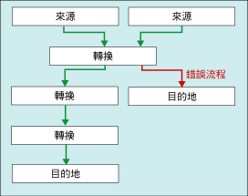

# <a name="error-handling-in-data"></a>處理資料中的錯誤
  當資料流程元件將轉換套用至資料行資料、從來源擷取資料或將資料載入目的地時，可能會發生錯誤。 錯誤通常是因為非預期的資料值所產生的。 例如，資料轉換失敗的原因是資料行包含字串而非數字；向資料庫資料行插入失敗的原因是資料為日期，而資料行是數值資料類型；運算式評估失敗的原因是資料行值為零，導致數學運算無效。  
  
 通常，錯誤可歸類為下列類別之一：  
  
-   資料轉換錯誤，當轉換導致遺失有效數位、遺失無效位數以及字串截斷時，會發生此錯誤。 如果所要求的轉換不受支援，也會發生資料轉換錯誤。  
  
-   運算式評估錯誤，如果在執行階段評估的運算式執行無效作業，或者，由於遺失或錯誤的資料值而語法不正確，則會發生此錯誤。  
  
-   查閱錯誤，如果查閱作業無法在查閱資料表中找到相符部分，則會發生此錯誤。  
  
 如需 Integration Services 錯誤、警告和其他訊息的清單，請參閱 [Integration Services 錯誤和訊息參考](../../integration-services/integration-services-error-and-message-reference.md)。  
  
## <a name="use-error-outputs-to-capture-row-level-errors"></a>使用錯誤輸出擷取資料列層級錯誤  
 許多資料流程元件都支援錯誤輸出，這可讓您控制元件處理內送資料與外送資料中資料列層級錯誤的方式。 您可以藉由設定輸入或輸出中個別資料行的選項，來指定發生截斷或錯誤時元件的行為方式。 例如，您可以指定，如果客戶名稱資料被截斷則元件應失敗，但忽略包含不重要資料之其他資料行的錯誤。  
  
 錯誤輸出可以連接到其他轉換的輸入，或載入無錯誤輸出以外的其他目的地。 例如，錯誤輸出可以連接到為空白資料行提供字串之「衍生的資料行」轉換。  
  
 下圖顯示包含錯誤輸出的簡單資料流程。  
  
   
  
 如需詳細資訊，請參閱 [資料流程](../../integration-services/data-flow/data-flow.md) 和 [Integration Services 路徑](../../integration-services/data-flow/integration-services-paths.md)。  

## <a name="configure-error-output-dialog-box"></a>設定錯誤輸出 對話方塊
使用 [設定錯誤輸出] 對話方塊，即可為支援錯誤輸出的資料流程轉換設定錯誤處理選項。  
  
 若要深入了解如何使用錯誤輸出，請參閱[處理資料中的錯誤](../../integration-services/data-flow/error-handling-in-data.md)。  
  
### <a name="options"></a>選項。  
 **輸入或輸出**  
 檢視輸出的名稱。  
  
 **資料行**  
 檢視您在 [轉換編輯器] 對話方塊中選取的輸出資料行。  
  
 **錯誤**  
 如果適用的話，請指定錯誤發生時要採取的動作：忽略失敗、重新導向資料列，或使元件失效。  
  
 **相關主題** [處理資料中的錯誤](../../integration-services/data-flow/error-handling-in-data.md)  
  
 **截斷**  
 如果適用的話，請指定截斷發生時要採取的動作：忽略失敗、重新導向資料列，或使元件失效。  
  
 **相關主題** [處理資料中的錯誤](../../integration-services/data-flow/error-handling-in-data.md)  
  
 **說明**  
 檢視作業的描述。  
  
 **將這個值設定到選取的資料格**  
 指定發生錯誤或截斷時要對所有選取之資料格採取的動作：忽略失敗、重新導向資料列，或使元件失效。  
  
 **套用**  
 將錯誤處理選項套用至選取的資料格。  
  
## <a name="errors-are-either-failures-or-truncations"></a>錯誤是失敗或截斷  
 錯誤可以歸類為下列兩種類別之一：錯誤或截斷。  
  
 **錯誤**。 錯誤表示明確的失敗，並產生 NULL 結果。 此類錯誤可以包含資料轉換錯誤或運算式評估錯誤。 例如，嘗試將包含字母字元的字串轉換為數值時，會導致錯誤。 資料轉換、運算式評估，以及運算式結果指派至變數、屬性和資料行可能會因為不合法的轉型和不相容的資料類型而失敗。 如需詳細資訊，請參閱 [Cast &#40;SSIS 運算式&#41;](../../integration-services/expressions/cast-ssis-expression.md)、[運算式中的 Integration Services 資料類型](../../integration-services/expressions/integration-services-data-types-in-expressions.md)和 [Integration Services 資料類型](../../integration-services/data-flow/integration-services-data-types.md)。  
  
 **截斷**。 截斷的嚴重性低於錯誤。 截斷產生的結果可能是可使用的，甚至可能是想要的結果。 您可以選擇將截斷視為錯誤或可接受的條件。 例如，如果您要將 15 個字元的字串插入寬度僅為一個字元的資料行中，則您可以選擇截斷字串。  
  
## <a name="select-an-error-handling-option"></a>選取錯誤處理選項  
 您可以設定來源、轉換及目的地處理錯誤和截斷的方式。 下表描述這些選項。  
  
|選項|說明|  
|------------|-----------------|  
|失敗元件|當發生錯誤或截斷時，資料流程工作將失敗。 失敗是錯誤和截斷的預設選項。|  
|忽略失敗|會忽略錯誤或截斷，並會將資料列導向轉換或來源的輸出。|  
|重新導向資料列|會將錯誤或截斷資料列導向來源、轉換或目的地的錯誤輸出。|  
  
## <a name="get-more-info-about-the-error"></a>取得錯誤的詳細資訊  
 除資料行之外，錯誤輸出還包含 **ErrorCode** 和 **ErrorColumn** 資料行。 **ErrorCode** 資料行可以識別錯誤， **ErrorColumn** 包含錯誤資料行的歷程識別碼。  
  
 在某些情況下， **ErrorColumn** 資料行的值會被設定為零。 當錯誤狀況影響整個資料列而非單一資料行時，就會發生這種情況。 其中一個例子是查閱轉換中的查閱失敗時。  
  
 這兩項數值若無對應的錯誤描述和資料行名稱，則用途有限。 以下是一些方法，以取得錯誤描述和資料行名稱。  
  
-   您可以藉由附加至錯誤輸出的資料檢視器看到錯誤描述和資料行名稱。 在 [SSIS 設計師] 中，以滑鼠右鍵按一下連至錯誤輸出的紅色箭頭，然後選取 [啟用資料檢視器]。  
  
-   您可以啟用記錄並選取 **DiagnosticEx** 事件，找到資料行名稱。 此事件會將資料流程資料行對應寫入記錄檔。 接著從這個資料行對應中的資料行識別項，查閱資料行名稱。 請注意， **DiagnosticEx** 事件不會在其 XML 輸出中保留空白，以縮減記錄檔的大小。 若要改善可讀性，可將記錄檔複製到 XML 編輯器 (例如，在 Visual Studio 中)，該編輯器需支援 XML 格式設定和語法反白顯示。 如需記錄的詳細資訊，請參閱 [Integration Services &#40;SSIS&#41; 記錄](../../integration-services/performance/integration-services-ssis-logging.md)。  
  
     資料流資料行對應的範例如下。  
  
    ```xml  
  
    \<DTS:PipelineColumnMap xmlns:DTS="www.microsoft.com/SqlServer/Dts">  
        \<DTS:Pipeline DTS:Path="\Package\Data Flow Task">  
            \<DTS:Column DTS:ID="11" DTS:IdentificationString="ADO NET Source.Outputs[ADO NET Source Output].Columns[Customer]"/>  
            \<DTS:Column DTS:ID="12" DTS:IdentificationString="ADO NET Source.Outputs[ADO NET Source Output].Columns[Product]"/>  
            \<DTS:Column DTS:ID="13" DTS:IdentificationString="ADO NET Source.Outputs[ADO NET Source Output].Columns[Price]"/>  
            \<DTS:Column DTS:ID="14" DTS:IdentificationString="ADO NET Source.Outputs[ADO NET Source Output].Columns[Timestamp]"/>  
            \<DTS:Column DTS:ID="20" DTS:IdentificationString="ADO NET Source.Outputs[ADO NET Source Error Output].Columns[Customer]"/>  
            \<DTS:Column DTS:ID="21" DTS:IdentificationString="ADO NET Source.Outputs[ADO NET Source Error Output].Columns[Product]"/>  
            \<DTS:Column DTS:ID="22" DTS:IdentificationString="ADO NET Source.Outputs[ADO NET Source Error Output].Columns[Price]"/>  
            \<DTS:Column DTS:ID="23" DTS:IdentificationString="ADO NET Source.Outputs[ADO NET Source Error Output].Columns[Timestamp]"/>  
            \<DTS:Column DTS:ID="24" DTS:IdentificationString="ADO NET Source.Outputs[ADO NET Source Error Output].Columns[ErrorCode]"/>  
            \<DTS:Column DTS:ID="25" DTS:IdentificationString="ADO NET Source.Outputs[ADO NET Source Error Output].Columns[ErrorColumn]"/>  
            \<DTS:Column DTS:ID="31" DTS:IdentificationString="Flat File Destination.Inputs[Flat File Destination Input].Columns[Customer]"/>  
            \<DTS:Column DTS:ID="32" DTS:IdentificationString="Flat File Destination.Inputs[Flat File Destination Input].Columns[Product]"/>  
            \<DTS:Column DTS:ID="33" DTS:IdentificationString="Flat File Destination.Inputs[Flat File Destination Input].Columns[Price]"/>  
            \<DTS:Column DTS:ID="34" DTS:IdentificationString="Flat File Destination.Inputs[Flat File Destination Input].Columns[Timestamp]"/>  
        \</DTS:Pipeline>  
    \</DTS:PipelineColumnMap>  
  
    ```  
  
-   您也可以使用指令碼元件在錯誤輸出的其他資料行中包含錯誤描述和資料行名稱。 如需範例，請參閱 [使用指令碼元件增強錯誤輸出](../../integration-services/extending-packages-scripting-data-flow-script-component-examples/enhancing-an-error-output-with-the-script-component.md)。  
  
    -   您可以使用單行指令碼來呼叫 <xref:Microsoft.SqlServer.Dts.Pipeline.Wrapper.IDTSComponentMetaData100.GetErrorDescription%2A> 介面的 <xref:Microsoft.SqlServer.Dts.Pipeline.Wrapper.IDTSComponentMetaData100> 方法，以便將錯誤描述包含在其他的資料行中。  
  
    -   您可以使用單行指令碼呼叫 <xref:Microsoft.SqlServer.Dts.Pipeline.Wrapper.IDTSComponentMetaData100.GetIdentificationStringByID%2A> 介面的 <xref:Microsoft.SqlServer.Dts.Pipeline.Wrapper.IDTSComponentMetaData100> 方法，以便將錯誤描述包含在其他的資料行中。  
  
     您可以將指令碼元件加入資料流程元件 (此元件有您想要擷取的錯誤) 下游內，任何一處的資料流程錯誤區段中。 通常您會在錯誤資料列寫入目的地之前，立刻放入指令碼元件。 如此一來指令碼就只會查閱寫入之錯誤資料列的描述。 資料流程的錯誤區段可能會更新某些錯誤，而且不會將這些資料列寫入錯誤目的地。  

## <a name="see-also"></a>另請參閱  
 [資料流程](../../integration-services/data-flow/data-flow.md)   
 [使用轉換來轉換資料](../../integration-services/data-flow/transformations/transform-data-with-transformations.md)   
 [以路徑連接元件](http://msdn.microsoft.com/library/05633e4c-1370-4b05-802b-f36b07dd71c8)   
 [資料流程工作](../../integration-services/control-flow/data-flow-task.md)   
 [資料流程](../../integration-services/data-flow/data-flow.md)  
  
  

