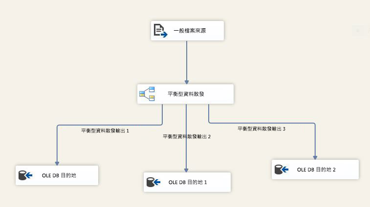

# 平衡資料分佈器轉換
  平衡資料分佈器 (BDD) 轉換利用新型 CPU 的並行處理能力。 它會將傳入資料列的緩衝區一致地分佈到個別執行緒上的輸出。 透過針對每個輸出路徑使用個別執行緒，BDD 元件可提升 SSIS 封裝在多核心或多處理器機器上的效能。  
  
 下列圖表顯示使用 BDD 轉換的簡單範例。 在此範例中，BDD 轉換會在從一般檔案來源輸入資料時，挑選一個管線緩衝區，然後以循環配置資源的方式向下傳送至三個輸出路徑的其中一個路徑。 在 SQL Server Data Tools，您可以檢查的值<xref:Microsoft.SqlServer.Dts.Pipeline.Wrapper.MainPipeClass.DefaultBufferSize%2A>（預設管線緩衝區的大小） 和<xref:Microsoft.SqlServer.Dts.Pipeline.Wrapper.MainPipeClass.DefaultBufferMaxRows%2A>（預設管線緩衝區中的資料列的最大數目） 中**屬性**視窗顯示資料流程工作的屬性。  
  
   
  
 在符合下列條件的狀況下，平衡資料分佈器轉換將有助於提升封裝的效能：  
  
1.  大量資料傳入 BDD 轉換。 如果資料大小很小，而且只要一個緩衝區即可保存資料，則不需要使用 BDD 轉換。 如果資料大小很大，而且需要多個緩衝區來保存資料，BDD 可透過個別執行緒有效率地並行處理資料緩衝區。  
  
2.  資料的讀取速度比資料流程其餘部分的處理速度更快。 在此狀況下，資料轉換的執行速度會比資料傳入的速度更慢。 如果瓶頸在目的地，目的地必須可以並行處理。  
  
3.  資料不需要經過排序。 例如，如果資料需要保持固定順序，則不應該使用 BDD 轉換分割資料。  
  
 請注意，如果 SSIS 封裝的瓶頸是由於資料可從來源讀取的速度，則 BDD 元件對於提升效能並沒有幫助。 如果 SSIS 封裝的瓶頸是因為目的地不支援平行處理原則，則 BDD 沒有用；不過，您可以平行執行所有轉換，並使用聯集全部轉換結合 BDD 轉換之不同輸出路徑傳出的輸出資料，再將資料傳送至目的地。  
  
> [!IMPORTANT]  
>  如需使用轉換的示範簡報，請參閱 TechNet Library 上的 [平衡型資料分配器影片](http://go.microsoft.com/fwlink/?LinkID=226278) 。  
  
  

