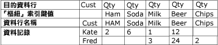
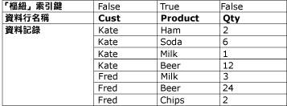

# 取消樞紐轉換

[!INCLUDE[sqlserver-ssis](../../../includes/applies-to-version/sqlserver-ssis.md)]

  「取消樞紐」轉換可以使非正規化的資料集變成較正規化的版本，方法是將單一記錄中多個資料行的值擴充為單一資料行中具有同一值的多個記錄。 例如，列出客戶名稱的資料集對每個客戶都具有一個資料列，同時產品及購買數量會顯示在資料列的資料行中。 當「取消樞紐」轉換將資料集正規化之後，資料集便會對客戶購買的每種產品包含不同的資料列。  
  
 下圖顯示資料在 Product 資料行上取消樞紐之前的資料集。  
  
   
  
 下圖顯示在 Product 資料行上取消樞紐之後的資料集。  
  
   
  
 在某些情況下，取消樞紐結果可能會包含非預期之值的資料列。 例如，如果圖表中顯示為要取消樞紐的範例資料中，Fred 的所有 Qty 資料行中都有 Null 值，那麼在輸出中只會包含一個 Fred 的資料列，而不是五個。 視資料行資料類型而定，Qty 資料行可能包含 Null 或零。  
  
## 設定取消樞紐轉換  
 取消樞紐轉換包括 **PivotKeyValue** 自訂屬性。 屬性運算式可以在載入封裝時更新這個屬性。 如需詳細資訊，請參閱 [Integration Services &#40;SSIS&#41; 運算式](../../../integration-services/expressions/integration-services-ssis-expressions.md)、[在封裝中使用屬性運算式](../../../integration-services/expressions/use-property-expressions-in-packages.md)和[轉換自訂屬性](../../../integration-services/data-flow/transformations/transformation-custom-properties.md)。  
  
 此轉換有一個輸入和一個輸出。 但沒有錯誤輸出。  
  
 您可以透過 [!INCLUDE[ssIS](../../../includes/ssis-md.md)] 設計師或以程式設計方式設定屬性。  
  
 如需有關可以在 **[進階編輯器]** 對話方塊中或以程式設計方式設定之屬性的詳細資訊，請按下列其中一個主題：  
  
-   [Common Properties](https://msdn.microsoft.com/library/51973502-5cc6-4125-9fce-e60fa1b7b796)  
  
-   [轉換自訂屬性](../../../integration-services/data-flow/transformations/transformation-custom-properties.md)  
  
 如需如何設定屬性的詳細資訊，請參閱 [設定資料流程元件的屬性](../../../integration-services/data-flow/set-the-properties-of-a-data-flow-component.md)。  
  
## 取消樞紐轉換編輯器
  使用 **[取消樞紐轉換編輯器]** 對話方塊，即可選取要樞紐轉換為資料列的資料行，以及指定資料行和新的樞紐值輸出資料行。  
  
> [!NOTE]  
>  此主題依賴於 [取消樞紐轉換](../../../integration-services/data-flow/transformations/unpivot-transformation.md) 中所描述的取消樞紐狀況，來說明選項的使用。  
  
### 選項。  
 **可用的輸入資料行**  
 使用此核取方塊，指定要樞紐轉換為資料列的資料行。  
  
 **名稱**  
 檢視可用輸入資料行的名稱。  
  
 **通過**  
 指出是否將資料行包含在取消樞紐的輸出中。  
  
 **輸入資料行**  
 從每個資料列的可用輸入資料行清單中選取。 您的選擇會反映在 **[可用的輸入資料行]** 資料表的核取方塊選擇中。  
  
 在＜ [Unpivot Transformation](../../../integration-services/data-flow/transformations/unpivot-transformation.md)＞所描述的取消樞紐狀況中，輸入資料行是 **Ham**, **Soda**, **Milk**, **Beer**和 **Chips** 資料行。  
  
 **目的地資料行**  
 提供資料行的名稱。  
  
 在 [取消樞紐轉換](../../../integration-services/data-flow/transformations/unpivot-transformation.md)所描述的取消樞紐狀況中，目的地資料行就是數量 (**Qty**) 資料行。  
  
 **樞紐索引鍵值**  
 提供樞紐值的名稱。 預設是輸入資料行的名稱；但是，您可以選擇任何唯一的、描述性名稱。  
  
 此屬性的值可以使用屬性運算式指定。  
  
 在＜ [Unpivot Transformation](../../../integration-services/data-flow/transformations/unpivot-transformation.md)＞所描述的取消樞紐狀況中，樞紐值會在 **[樞紐索引鍵值資料行名稱]** 選項所指定之新 Product 資料行中顯示為下列文字值： **Ham**, **Soda**, **Milk**, **Beer**和 **Chips**。  
  
 **[樞紐索引鍵值資料行名稱]**  
 提供樞紐值資料行的名稱。 預設為「樞紐索引鍵值」；然而，您可以選擇任何唯一的、描述性名稱。  
  
 在＜ [Unpivot Transformation](../../../integration-services/data-flow/transformations/unpivot-transformation.md)＞所描述的取消樞紐狀況中，樞紐索引鍵值資料行名稱為 **Product** ，並且會將新的 **Product** 資料行指定給 **Ham**, **Soda**, **Milk**, **Beer**和 **Chips** 資料行，以取消樞紐。  
  
## 另請參閱  
 [Integration Services 錯誤和訊息參考](../../../integration-services/integration-services-error-and-message-reference.md)   
 [樞紐轉換](../../../integration-services/data-flow/transformations/pivot-transformation.md)  
  
  
