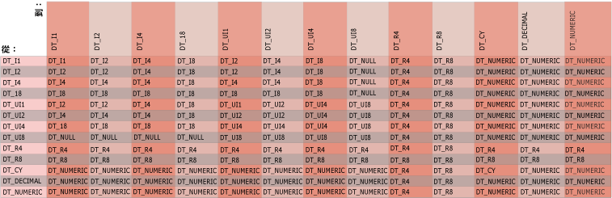

# 運算式中的 Integration Services 資料類型

[!INCLUDE[ssis-appliesto](../../includes/ssis-appliesto-ssvrpluslinux-asdb-asdw-xxx.md)]

  運算式評估工具使用 [!INCLUDE[ssISnoversion](../../includes/ssisnoversion-md.md)] 資料類型。 當資料初次進入 [!INCLUDE[ssISnoversion](../../includes/ssisnoversion-md.md)] 封裝中的資料流程時，資料流程引擎會將所有資料行的資料轉換成 [!INCLUDE[ssISnoversion](../../includes/ssisnoversion-md.md)] 資料類型，而運算式所使用的資料行資料已為 [!INCLUDE[ssISnoversion](../../includes/ssisnoversion-md.md)] 資料類型。 「條件式分割」和「衍生的資料行」轉換中使用的運算式可參考資料行，因為它們是包含資料行資料的資料流程中的一部分。  
  
## 變數  
 運算式亦可使用變數。 變數的資料類型為 Variant，且運算式評估工具會先將變數的資料類型從 Variant 子類型轉換成 [!INCLUDE[ssISnoversion](../../includes/ssisnoversion-md.md)] 資料類型，然後才評估運算式。 變數只能使用 [!INCLUDE[ssISnoversion](../../includes/ssisnoversion-md.md)] 資料類型的子集。 例如，變數無法使用「二進位大型物件區塊」(Binary Large Object Block，BLOB) 資料類型。  
  
 如需 [!INCLUDE[ssISnoversion](../../includes/ssisnoversion-md.md)] 資料類型，以及將 Variant 資料類型對應到 [!INCLUDE[ssISnoversion](../../includes/ssisnoversion-md.md)] 資料類型的詳細資訊，請參閱 [Integration Services 資料類型](../../integration-services/data-flow/integration-services-data-types.md)。  
  
## 常值  
 此外，運算式還可包含字串、布林，以及數值常值。 如需將數值常值轉換為數值 [!INCLUDE[ssISnoversion](../../includes/ssisnoversion-md.md)] 資料類型的詳細資訊，請參閱[常值 &#40;SSIS&#41;](../../integration-services/expressions/numeric-string-and-boolean-literals.md)。  
  
## 字串  
 您可以使用 DT_STR 或 DT_WSTR 作為運算式的傳回類型。 不過，在運算式中僅支援 DT_WSTR，因此會將 DT_STR 值轉換成 DT_WSTR 值。 當您撰寫運算式時，這種行為會有幾個隱含式。  
  
-   在運算式中，使用 NULL(DT_WSTR, ...) 而不是 NULL(DT_STR, ...)。如需此函數的詳細資訊，請參閱 [NULL &#40;SSIS 運算式&#41;](../../integration-services/expressions/null-ssis-expression.md)。  
  
-   在運算式中，您只可以在運算式的根位置使用 CAST 函數將值轉換成 DT_STR 類型；亦即，當您要傳回運算式的最終結果時。 否則，請在運算式中使用 DT_WSTR 類型。  
  
 請參考下列螢幕擷取畫面中的運算式。  
  
   
  
1.  第一個運算式可順利執行而不會發生錯誤，因為 NULL(DT_STR, ...) 函數位於運算式的根層級。  
  
2.  第二個運算式可順利執行而不會發生錯誤，因為它是使用 NULL(DT_WSTR, ...)。  
  
3.  第三個運算式會引發錯誤，因為它在運算式內使用 NULL(DT_STR, ...)。  
  
4.  第四個運算式可順利執行而不會發生錯誤，因為它在運算式內轉換 NULL(DT_STR, ...) 的結果。  
  
     運算式評估工具可以智慧的方式處理這項轉換：它辨識出作業不是運算式的根層級，因此會將其轉換為 DT_WSTR，而不是 DT_STR。  
  
 下列範例示範轉換的效果。  
  
   
  
1.  在第一個運算式中，轉換不是在運算式的根層級。 運算式評估工具可以智慧的方式處理這項轉換，並將其轉換為 DT_WSTR，而不是 DT_STR。 運算式會傳回 DT_WSTR。  
  
2.  在第二個運算式中，轉換是在運算式的根層級。 運算式會傳回 DT_STR。  
  
## 隱含資料轉換  
 當運算式評估工具自動將資料從一種資料類型轉換為另一種資料類型時，會發生資料類型的隱含轉換。 例如，如果將 **smallint** 與 **int**做比較，就會先將 **smallint** 隱含轉換成 **int** ，然後再執行比較。  
  
 當引數和運算元的資料類型不相容時，運算式評估工具無法執行隱含資料轉換。 此外，運算式評估工具無法將任何值隱含轉換為布林。 而必須使用轉換運算子隱含轉換引數和運算元。 如需詳細資訊，請參閱 [Cast &#40;SSIS 運算式&#41;](../../integration-services/expressions/cast-ssis-expression.md)。  
  
 下圖顯示 BINARY 運算之隱含轉換的結果類型。 此資料表中資料行和資料列的交集為具有左 (從) 和右 (至) 類型之運算元的二進位運算結果類型。  
  
   
  
 帶正負號和不帶正負號的整數之間的交集，應是大於任一引數的帶正負號整數。  
  
 運算子會比較字串、日期、布林和其他資料類型。 在運算子比較兩個值之前，運算式評估工具會先執行某些隱含轉換。 運算式評估工具會固定將字串常值轉換為 DT_WSTR 資料類型，以及將布林常值轉換為 DT_BOOL 資料類型。 運算式評估工具會將所有加上引號的值解譯為字串。 數值常值會轉換為其中一種數值 [!INCLUDE[ssISnoversion](../../includes/ssisnoversion-md.md)] 資料類型。  
  
> [!NOTE]  
>  布林值是邏輯值，而非數字。 雖然布林值可以在某些環境下顯示為數字，但不會儲存為數字，而且不同的程式設計語言將布林值表示成數值的方式各有不同，.NET Framework 方法也是如此。  
>   
>  例如，Visual Basic 提供的轉換函數會將 **True** 轉換為 -1；然而 .NET Framework 中的 **System.Convert.ToInt32** 方法卻將 **True** 轉換為 +1。 [!INCLUDE[ssISnoversion](../../includes/ssisnoversion-md.md)] 運算式語言則會將 **True** 轉換為 -1。  
>   
>  若要避免錯誤或非預期結果，您所撰寫的程式碼不應該以特定數值表示 **True** 和 **False**。 您應該盡可能將布林變數的使用限制在當初所設計的邏輯值上。  
  
 如需詳細資訊，請參閱下列主題：  
  
-   [== &#40;等於&#41; &#40;SSIS 運算式&#41;](../../integration-services/expressions/equal-ssis-expression.md)  
  
-   [\!= &#40;不等於&#41; &#40;SSIS 運算式&#41;](../../integration-services/expressions/unequal-ssis-expression.md)  
  
-   [&#62; &#40;大於&#41; &#40;SSIS 運算式&#41;](../../integration-services/expressions/greater-than-ssis-expression.md)  
  
-   [&#60; &#40;小於&#41; &#40;SSIS 運算式&#41;](../../integration-services/expressions/less-than-ssis-expression.md)  
  
-   [&#62;= &#40;大於或等於&#41; &#40;SSIS 運算式&#41;](../../integration-services/expressions/greater-than-or-equal-to-ssis-expression.md)  
  
-   [&#60;= &#40;小於或等於&#41; &#40;SSIS 運算式&#41;](../../integration-services/expressions/less-than-or-equal-to-ssis-expression.md)  
  
 使用單一引數之函數所傳回的結果與引數具有相同資料類型，但有下列例外狀況：  
  
-   DAY、MONTH 和 YEAR 接受日期並傳回整數 (DT_I4) 結果。  
  
-   ISNULL 接受任何 [!INCLUDE[ssIS](../../includes/ssis-md.md)] 資料類型的運算式，並傳回布林 (DT_BOOL) 結果。  
  
-   SQUARE 和 SQRT 接受數值運算式並傳回非整數的數值 (DT_R8) 結果。  
  
 如果引數的資料類型相同，則結果為該類型。 唯一的例外為關於兩個 DT_DECIMAL 資料類型之值的二進位運算結果，其會傳回 DT_NUMERIC 資料類型的結果。  
  
## 運算式中所用資料的需求  
 運算式評估工具支援所有的 [!INCLUDE[ssISnoversion](../../includes/ssisnoversion-md.md)] 資料類型。 不過，根據運算和函數而定，運算元和引數會需要特定資料類型。 運算式評估工具對於運算式中使用的資料，有下列資料類型需求的規定︰  
  
-   **邏輯**運算中使用的運算元評估結果必須為布林。 例如，ColumnA > 1&&ColumnB < 2。  
  
-   **數學**運算中使用的運算元評估結果必須為數值。 例如，23.75 * 4。  
  
-   比較運算中使用的運算元 (例如邏輯和等式運算) 必須評估為相容的資料類型。  
  
     例如，下列範例中的其中一個運算式使用 DT_DBTIMESTAMPOFFSET 資料類型：  
  
     `(DT_DBTIMESTAMPOFFSET,3) "1999-10-11 20:34:52.123 -3:30" != (DT_DBDATE)"1999-10-12"`  
  
     系統會將運算式 `(DT_DBDATE)"1999-10-12"`轉換為 DT_DBTIMESTAMPOFFSET。 轉換的運算式會變成 "1999-10-12 00:00:00.000 +00:00" (不等於其他運算式 `(DT_DBTIMESTAMPOFFSET,3) "1999-10-11 20:34:52.123 -3:30"`的值)，因此，此範例會評估為 TRUE。  
  
-   傳遞至數學函數的引數評估結果必須為數值資料類型。 根據函數或運算而定，可能會需要特定的數值資料類型。 例如，HEX 函數需要帶正負號或不帶正負號的整數。  
  
-   傳遞至字串函數的引數評估結果必須為字元資料類型︰DT_STR 或 DT_WSTR。 例如，UPPER("flower")。 某些字串函數 (例如 SUBSTRING) 的起始位置和字串長度需要額外的整數引數。  
  
-   傳遞至日期和時間函數的引數評估結果必須為有效的日期。 例如，DAY(GETDATE())。 某些函數 (例如 DATEADD) 針對其加入至日期的日數，需要額外的整數引數。  
  
 結合不帶正負號八位元組整數和帶正負號整數的運算需要明確轉換，才能明定結果格式。 如需詳細資訊，請參閱 [Cast &#40;SSIS 運算式&#41;](../../integration-services/expressions/cast-ssis-expression.md)。  
  
 許多運算和函數的結果都需要預定的資料類型。 此資料類型可能是引數的資料類型，或運算式評估工具轉換結果的資料類型。 例如，邏輯 OR 運算子 (||) 的結果固定為布林、ABS 函數的結果為引數的數值資料類型，而乘法的結果為可保留結果且不會遺失的最小數值資料類型。 如需結果之資料類型的詳細資訊，請參閱[運算子 &#40;SSIS 運算式&#41;](../../integration-services/expressions/operators-ssis-expression.md) 和[函數 &#40;SSIS 運算式&#41;](../../integration-services/expressions/functions-ssis-expression.md)。  
  
## 相關工作  
 [在資料流程元件中使用運算式](https://msdn.microsoft.com/library/9181b998-d24a-41fb-bb3c-14eee34f910d)  
  
## 相關內容  
  
-   pragmaticworks.com 上的技術文件： [SSIS 運算式小抄](https://go.microsoft.com/fwlink/?LinkId=746575)  
  
-   social.technet.microsoft.com 上的技術文件： [SSIS 運算式範例](https://go.microsoft.com/fwlink/?LinkId=220761)  
  
  
