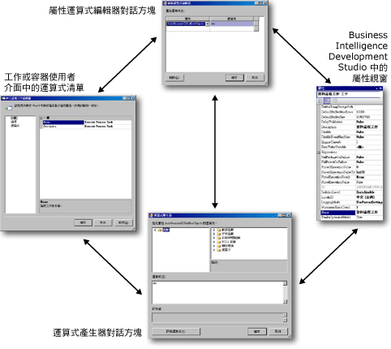

# 在封裝中使用屬性運算式
  屬性運算式是指派給屬性的運算式，用於在執行階段啟用該屬性的動態更新。 例如，屬性運算式可更新「收件者」欄位，傳送郵件工作透過插入儲存在變數中的電子郵件地址來使用該欄位。  
  
 運算式可加入封裝、工作、「Foreach 迴圈」、「For 迴圈」、「時序」、Foreach 列舉值、事件處理常式、封裝或專案層級的連接管理員或記錄提供者中。 此物件任何為讀取/寫入的屬性，都可以實作屬性運算式。 [!INCLUDE[ssISnoversion](../../includes/ssisnoversion-md.md)] 也支援在資料流程元件的某些自訂屬性中，使用屬性運算式。 變數和優先順序條件約束不支援屬性運算式，但是它們包含您可以在其中使用運算式的特殊屬性。  
  
 屬性運算式可以使用下列不同的方式進行更新：  
  
-   使用者定義變數可包含在封裝組態中，然後在部署封裝時進行更新。 在執行階段，會使用更新的變數值來評估屬性運算式。  
  
-   在執行階段更新包含在運算式中的系統變數，這樣會變更屬性評估的結果。  
  
-   在執行階段評估日期和時間函數，並將更新的值提供給屬性運算式。  
  
-   運算式中的變數可由指令碼工作和「指令碼」元件所執行的指令碼進行更新。  
  
 運算式是使用 [!INCLUDE[msCoName](../../includes/msconame-md.md)] [!INCLUDE[ssISnoversion](../../includes/ssisnoversion-md.md)] 運算式語言所建立。 這些運算式可以使用系統變數或使用者定義變數，以及運算式語言提供的運算子、函數和類型轉換。  
  
> [!NOTE]  
>  使用者定義變數和系統變數的名稱會區分大小寫。  
  
 如需詳細資訊，請參閱 [Integration Services &#40;SSIS&#41; 運算式](../../integration-services/expressions/integration-services-ssis-expressions.md)為止。  
  
 屬性運算式的重要用法是為封裝之每個部署的執行個體自訂組態。 這樣可以動態地更新不同環境的封裝屬性。 例如，您可以建立將變數指派給連接管理員之連接字串的屬性運算式，然後在部署封裝時更新該變數，以確保連接字串在執行階段是正確的。 在評估屬性運算式前會載入封裝組態。  
  
 屬性只可使用一個屬性運算式，而屬性運算式只可套用至一個屬性。 不過，您可以建立多個相同的屬性運算式，並將它們指派給不同的屬性。  
  
 部分屬性是使用於自列舉值的值加以設定。 在屬性運算式中參考列舉值成員時，您必須使用相當於列舉值成員之易記名稱的數值。 例如，如果屬性運算式設定 **LoggingMode** 屬性，而該屬性使用來自 **DTSLoggingMode** 列舉的值，則屬性運算式就必須使用 0、1 或 2 來取代易記名稱 **Enabled**、 **Disabled**或 **UseParentSetting**。 如需詳細資訊，請參閱 [屬性運算式中的列舉常數](../../integration-services/expressions/enumerated-constants-in-property-expressions.md)。  
  
## 屬性運算式使用者介面  
 [!INCLUDE[ssISnoversion](../../includes/ssisnoversion-md.md)] 提供一組用於建立和管理屬性運算式的工具。  
  
-   [運算式] 頁面，位於工作的自訂編輯器、For 迴圈容器和 Foreach 容器中。 該 [運算式] 頁面可讓您編輯運算式，以及檢視工作、Foreach 迴圈或 For 迴圈所使用的屬性運算式清單。  
  
-   [屬性] 視窗，用於編輯運算式及檢視封裝或封裝物件所使用的屬性運算式清單。  
  
-   [屬性運算式編輯器] 對話方塊，用於建立、更新和刪除屬性運算式。  
  
-   [運算式產生器] 對話方塊，用於使用圖形工具建立運算式。 該 [運算式產生器] 對話方塊可評估運算式以供您檢閱，而無需將評估結果指派給屬性。  
  
 下圖顯示用於加入、變更及移除屬性運算式的使用者介面。  
  
   
  
 在 [屬性] 視窗和 [運算式] 頁面上，按一下 [運算式] 集合層級上的瀏覽按鈕 **(…)**，以開啟 [屬性運算式編輯器] 對話方塊。 [屬性運算式編輯器] 可讓您將屬性對應至運算式，並輸入屬性運算式。 如果您想要使用圖形運算式工具來建立並驗證運算式，請按一下運算式層級上的瀏覽按鈕 **(…)**，以開啟 [運算式產生器] 對話方塊，然後再建立或修改並選擇性地驗證運算式。  
  
 您還可以從 [屬性運算式編輯器] 對話方塊，開啟 [運算式產生器] 對話方塊。  
  
#### 處理屬性運算式  
  
-   [加入或變更屬性運算式](../../integration-services/expressions/add-or-change-a-property-expression.md)  
  
### 設定資料流程元件的屬性運算式  
 如果在 [!INCLUDE[ssBIDevStudioFull](../../includes/ssbidevstudiofull-md.md)] 中建構封裝，支援屬性運算式之資料流程元件的屬性便會在其所屬的資料流程工作上公開。 若要加入、變更及移除資料流程元件的屬性運算式，請以滑鼠右鍵按一下資料流程元件所屬資料流程的資料流程工作，並按一下 [屬性]。 [屬性] 視窗會列出可搭配使用屬性運算式之資料流程元件的屬性。 例如，若要建立或修改屬性運算式，以用於 SampleCustomer 資料流程中資料列取樣轉換的 SamplingValue 屬性，請以滑鼠右鍵按一下資料列取樣轉換所屬資料流程的資料流程工作，並按一下 [屬性]。 SamplingValue 屬性會列在 [屬性] 視窗中，其格式為 [SampleCustomer].[SamplingValue]。  
  
 在 [屬性] 視窗中，您可以使用與其他 [!INCLUDE[ssISnoversion](../../includes/ssisnoversion-md.md)] 物件類型之屬性運算式相同的方式，來加入、變更及移除屬性運算式。 [屬性] 視窗也可讓您存取用於加入、變更或移除資料流程元件之屬性運算式的各種對話方塊和產生器。 如需屬性運算式可更新之資料流程元件屬性的詳細資訊，請參閱 [轉換自訂屬性](../../integration-services/data-flow/transformations/transformation-custom-properties.md)。  
  
## 載入屬性運算式  
 您不能指定或控制屬性運算式載入的時機。 驗證封裝和封裝物件時便會評估和載入屬性運算式。 儲存封裝、在「 [!INCLUDE[ssIS](../../includes/ssis-md.md)] 設計師」中開啟封裝以及執行封裝時，都會進行驗證。  
  
 因此，必須等到您在加入屬性運算式之後儲存封裝、執行封裝或重新開啟封裝之後，您才會在「 [!INCLUDE[ssIS](../../includes/ssis-md.md)] 設計師」中看到使用屬性運算式之封裝物件屬性的更新值。  
  
 呼叫不同物件類型 (連接管理員、記錄提供者和列舉值) 特有的方法時，也會載入與該物件類型相關聯的屬性運算式。 例如，連接管理員的屬性會在 [!INCLUDE[ssISnoversion](../../includes/ssisnoversion-md.md)] 建立連接執行個體之前載入。  
  
 屬性運算式會在載入封裝組態之後載入。 例如，變數會先由其組態進行更新，然後再評估並載入使用這些變數的屬性運算式。 這表示屬性運算式永遠都會使用組態所設定的變數值。  
  
> [!NOTE]  
>  您不能使用 **dtexec** 公用程式的 [設定] 選項來擴展屬性運算式。  
  
 下表摘要說明評估與載入 [!INCLUDE[ssISnoversion](../../includes/ssisnoversion-md.md)] 之屬性運算式的時機。  
  
|物件類型|載入與評估|  
|-----------------|-----------------------|  
|封裝、Foreach 迴圈、For 迴圈、時序、工作和資料流程元件|載入組態後   驗證前   執行前|  
|連接管理員|載入組態後   驗證前   執行前   建立連接執行個體前|  
|記錄提供者|載入組態後   驗證前   執行前   開啟記錄檔前|  
|Foreach 列舉值|載入組態後   驗證前   執行前   每次列舉迴圈前|  
  
## 在 Foreach 迴圈中使用屬性運算式  
 實作屬性運算式通常非常適合用於設定 Foreach 迴圈容器內所使用之連線管理員的 **ConnectionString** 屬性值。 在列舉值將它目前的值對應到迴圈的每個反覆運算上的變數之後，屬性運算式就可以使用這個變數的值來動態更新 **ConnectionString** 屬性的值。  
  
 如果想要將屬性運算式用於 Foreach 迴圈使用之檔案、多個檔案、一般檔案和多個一般檔案連線管理員的 **ConnectionString** 屬性，您必須考慮幾件事。 可以將 **MaxConcurrentExecutables** 屬性設定為大於 1 或等於 -1 的值，以便將封裝設定為並行執行多個可執行檔。 -1 的值表示允許同時執行的最大可執行檔數目等於處理器數目再加 2。 為了避免平行執行可執行檔的負面結果， **MaxConcurrentExecutables** 值應該設定為 1。 如果 **MaxConcurrentExecutables** 未設為 1，就無法保證 **ConnectionString** 屬性的值，而且結果會無法預測。  
  
 例如，可考慮使用「Foreach 迴圈」列舉資料夾中的檔案、擷取檔案名稱，然後使用執行 SQL 工作將每一個檔案名稱插入資料表中。 如果 **MaxConcurrentExecutables** 未設為 1，而「執行 SQL」工作的兩個執行個體又試圖同時寫入資料表，就可能發生寫入衝突。  
  
## 範例屬性運算式  
 下列範例運算式顯示如何在屬性運算式中使用系統變數、運算子、函數和字串常值。  
  
### 封裝之 LoggingMode 屬性的屬性運算式  
 下列屬性運算式可用以設定封裝的 LoggingMode 屬性。 此運算式使用 DAY 和 GETDATE 函數來取得代表日期之日 (Day) 部分的整數。 如果日期是 1 日或 15 日，記錄功能將會啟用，否則便會停用記錄功能。 值 1 是 LoggingMode 列舉值成員 **Enabled**的整數相等項，而值 2 則是成員 **Disabled**的整數相等項。 您必須在運算式中使用數值代替列舉值成員名稱。  
  
 `DAY((DT_DBTIMESTAMP)GETDATE())==1||DAY((DT_DBTIMESTAMP)GETDATE())==15?1:2`  
  
### 電子郵件訊息主旨的屬性運算式  
 下列屬性運算式可用以設定傳送郵件工作的 Subject 屬性，以及提供有用的電子郵件主旨。 該運算式會使用字串常值、系統變數、串連 (+) 與轉換運算子，以及 DATEDIFF 與 GETDATE 函數的組合。 系統變數是 `PackageName` 與 `StartTime` 變數。  
  
 `"PExpression-->Package: (" + @[System::PackageName] + ") Started:"+  (DT_WSTR, 30) @[System::StartTime] + " Duration:"  +  (DT_WSTR,10) (DATEDIFF( "ss", @[System::StartTime] , GETDATE()  )) + " seconds"`  
  
 如果封裝名稱為 EmailRowCountPP，於 2005 年 3 月 4 日執行且執行持續時間為 9 秒，則運算式會評估為下列字串。  
  
 PExpression-->Package: (EmailRowCountPP) Started:3/4/2005 11:06:18 AM Duration:9 seconds。  
  
### 電子郵件訊息之訊息的屬性運算式  
 下列屬性運算式可用以設定傳送郵件工作的 MessageSource 屬性。 該運算式會使用字串常值、使用者定義變數和串連 (+) 運算子的組合。 使用者定義變數的名稱是 `nasdaqrawrows`、 `nyserawrows`與 `amexrawrows`。 字串 "\n" 表示換行字元。  
  
 `"Rows Processed: "  +   "\n" +"   NASDAQ: "  +   (dt_wstr,9)@[nasdaqrawrows]   + "\n" + "   NYSE: "  +  (dt_wstr,9)@[nyserawrows]  + "\n" + "   Amex: "  +  (dt_wstr,9)@[amexrawrows]`  
  
 如果 `nasdaqrawrows` 是 7058、 `nyserawrows` 是 3528，而 `amexrawrows` 是 1102，運算式會評估為下列字串。  
  
 處理的資料列：  
  
 NASDAQ: 7058  
  
 NYSE: 3528  
  
 AMEX: 1102  
  
### 執行處理工作之 Executable 屬性的屬性運算式  
 下列屬性運算式可用以設定「執行處理」工作的 Executable 屬性。 該運算式會使用字串常值、運算子和函數的組合。 該運算式會使用 DATEPART 和 GETDATE 函數，以及條件運算子。  
  
 `DATEPART("weekday", GETDATE()) ==2?"notepad.exe":"mspaint.exe"`  
  
 如果是一星期中的第二天，則「執行處理」工作會執行 notepad.exe，否則該工作會執行 mspaint.exe。  
  
### 一般檔案連接管理員之 ConnectionString 屬性的屬性運算式  
 下列屬性運算式可用以設定「一般檔案」連線管理員的 ConnectionString 屬性。 該運算式會使用 `myfilenamefull`單一使用者定義變數，該變數包含文字檔的路徑。  
  
 `@[User::myfilenamefull]`  
  
> [!NOTE]  
>  連接管理員的屬性運算式只可使用 [屬性] 視窗進行存取。 若要檢視連線管理員的屬性，您必須在 [屬性] 視窗開啟時，在 [[!INCLUDE[ssIS](../../includes/ssis-md.md)] 設計師] 的 [連線管理員] 區域中選取連線管理員，或以滑鼠右鍵按一下連線管理員並選取 [屬性]。  
  
### 文字檔記錄提供者之 ConfigString 屬性的屬性運算式  
 下列屬性運算式可用以設定文字檔記錄提供者的 ConfigString 屬性。 該運算式會使用 `varConfigString`單一使用者定義變數，該變數包含要使用之檔案連線管理員的名稱。 檔案連接管理員會指定要在其中寫入記錄項目之文字檔的路徑。  
  
 `@[User::varConfigString]`  
  
> [!NOTE]  
>  記錄提供者的屬性運算式只可使用 [屬性] 視窗進行存取。 若要檢視記錄提供者的屬性，您必須在 [屬性] 視窗開啟時，在 [[!INCLUDE[ssIS](../../includes/ssis-md.md)] 設計師] 的封裝總管索引標籤上選取記錄提供者，或以滑鼠右鍵按一下封裝總管中的記錄提供者，並按一下 [屬性]。  
  
## 外部資源  
  
-   [運算式和組態螢光筆標示 (CodePlex 專案)](http://go.microsoft.com/fwlink/?LinkId=146625)  
  
-   social.technet.microsoft.com 上的技術文件： [SSIS 運算式範例](http://go.microsoft.com/fwlink/?LinkId=220761)  
  
## 另請參閱  
 [在套件中使用變數](http://msdn.microsoft.com/library/7742e92d-46c5-4cc4-b9a3-45b688ddb787)  
  
  
