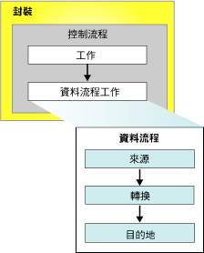

# Integration Services (SSIS) 封裝
  封裝是指經過組織的連接、控制流程元素、資料流程元素、事件處理常式、變數、參數以及組態的集合，您可以使用 [!INCLUDE[ssNoVersion](../includes/ssnoversion-md.md)] [!INCLUDE[ssISnoversion](../includes/ssisnoversion-md.md)] 提供的圖形設計工具組裝或利用撰寫程式的方式建立封裝。  然後將完成的封裝儲存到 [!INCLUDE[ssNoVersion](../includes/ssnoversion-md.md)]、 [!INCLUDE[ssIS](../includes/ssis-md.md)] 封裝存放區或檔案系統中，或者您可以將 ssISnoversion 專案部署到 [!INCLUDE[ssIS](../includes/ssis-md.md)] 伺服器。 封裝是所擷取、執行和儲存的工作單位。  
  
 當您初次建立封裝時，它是空的物件且沒有任何功能。 若要將功能加入至封裝，您可以加入控制流程，以及選擇性地將一或多項資料流程加入至封裝。  
  
 下列圖表說明包含控制流程的簡易封裝，而該控制流程的資料流程工作則擁有資料流程。  
  
   
  
 在您建立基本封裝之後，就可以加入記錄和變數這類進階功能，以擴充封裝功能。 如需詳細資訊，請參閱有關「擴充封裝功能的物件」一節。  
  
 完成的封裝可接著藉由設定封裝層級的屬性加以設定，讓它能實作安全性、從檢查點重新啟動封裝，或將交易加入封裝工作流程中。 如需詳細資訊，請參閱有關「支援擴充功能的屬性」一節。  
  
## 封裝的內容  
 **工作及容器 (控制流程)。** 控制流程是由一或多項在封裝執行時一併執行的工作和容器所組成。 若要在執行封裝控制流程中的下一項工作或容器時控制順序或定義條件，可使用優先順序條件約束連接封裝中的工作和容器。 工作和容器的子集亦可組成群組，並於封裝控制流程內做為一個單位重複執行。 如需詳細資訊，請參閱 [控制流程](../integration-services/control-flow/control-flow.md)。  
  
 **資料來源和目的地 (資料流程)。** 資料流程是由擷取和載入資料的來源和目的地、修改和擴充資料的轉換，以及連結來源、轉換與目的地的路徑所組成。 封裝控制流程中必須包含資料流程工作，您才能將資料流程加入至封裝中。 資料流程工作是建立、排列順序和執行資料流程的 [!INCLUDE[ssIS](../includes/ssis-md.md)] 封裝內的可執行檔。 針對封裝內的每一項資料流程工作，會個別開啟資料流程引擎的執行個體。 如需詳細資訊，請參閱 [資料流程工作](../integration-services/control-flow/data-flow-task.md) 和 [資料流程](../integration-services/data-flow/data-flow.md)。  
  
 **連接管理員 (連接)。** 通常封裝至少會包含一個連接管理員。 連接管理員是封裝與資料來源之間的連結，可定義連接字串，以存取封裝中之工作、轉換和事件處理常式所使用的資料。 [!INCLUDE[ssISnoversion](../includes/ssisnoversion-md.md)] 包含資料來源的連接類型，資料來源諸如文字和 XML 檔、關聯式資料庫，以及 [!INCLUDE[ssASnoversion](../includes/ssasnoversion-md.md)] 資料庫和專案。 如需詳細資訊，請參閱 [Integration Services &#40;SSIS&#41; 連接](../integration-services/connection-manager/integration-services-ssis-connections.md)。  
  
## 延伸封裝功能的物件  
 封裝可包含額外的物件，以便提供進階功能或擴充現有功能，例如事件處理常式、組態、記錄和變數。  
  
### 事件處理常式  
 事件處理常式是回應封裝、工作或容器所產生事件而執行的工作流程。 例如，您可以在預先執行的事件發生或發生錯誤時，使用事件處理常式檢查磁碟空間，並傳送電子郵件訊息，向管理員報告可用空間或錯誤資訊。 事件處理常式的結構類似封裝，其中包含控制流程和選用的資料流程。 事件處理常式可加入至封裝中的個別工作或容器。 如需詳細資訊，請參閱 [Integration Services &#40;SSIS&#41; 事件處理常式](../integration-services/integration-services-ssis-event-handlers.md)。  
  
### 組態  
 組態是屬性值配對，用來定義封裝及其執行時的工作、容器、變數、連接，以及事件處理常式的屬性。 使用組態即可更新屬性，而不需修改封裝。 當封裝執行時，便會載入組態資訊並更新屬性值。 例如，組態可更新連接的連接字串。  
  
 在不同電腦上安裝封裝時，組態會先儲存並隨著封裝部署。 安裝封裝時，可更新組態中的值，以便於不同環境中支援封裝。 如需詳細資訊，請參閱 [建立封裝組態](../integration-services/packages/create-package-configurations.md)。  
  
### 記錄和記錄提供者  
 記錄是封裝執行時所收集的封裝資訊集合。 例如，記錄可提供封裝執行的開始和結束時間。 記錄提供者會定義封裝及其容器和工作可用來記錄執行階段資訊的目的地類型與格式。 記錄與封裝相關，但封裝中的工作和容器可將資訊記錄至任何封裝記錄中。 [!INCLUDE[ssISnoversion](../includes/ssisnoversion-md.md)] 包含各種用來記錄的內建記錄提供者。 例如， [!INCLUDE[ssISnoversion](../includes/ssisnoversion-md.md)] 包含 [!INCLUDE[ssNoVersion](../includes/ssnoversion-md.md)] 和文字檔的記錄提供者。 您也可以建立自訂的記錄提供者，並用它們進行記錄。 如需詳細資訊，請參閱 [Integration Services &#40;SSIS&#41; 記錄](../integration-services/performance/integration-services-ssis-logging.md)。  
  
### 變數  
 [!INCLUDE[ssISnoversion](../includes/ssisnoversion-md.md)] 支援系統變數和使用者定義的變數。 系統變數提供執行階段時，有關封裝物件的實用資訊，而使用者定義的變數則支援封裝中的自訂狀況。 這兩種類型的變數都可在運算式、指令碼和組態中使用。  
  
 封裝層級的變數包括可供封裝使用的預先定義系統變數，以及使用者定義的封裝範圍變數。 如需詳細資訊，請參閱 [Integration Services (SSIS) 變數](../integration-services/integration-services-ssis-variables.md)。  
 
### 參數  
 [!INCLUDE[ssISnoversion](../includes/ssisnoversion-md.md)] 參數可讓您在封裝執行時，將值指派給封裝內的屬性。 您可以在專案層級建立 *「專案參數」* (Project Parameter)，並在封裝層級建立 *「封裝參數」* (Package Parameter)。 專案參數可用於向專案中的一個或多個封裝提供專案接收的任何外部輸入。 封裝參數可讓您修改封裝執行，而不需要編輯和重新部署封裝。 如需詳細資訊，請參閱 [Integration Services (SSIS) 參數](../integration-services/integration-services-ssis-package-and-project-parameters.md)。  
 
## 支援擴充功能的封裝屬性  
 封裝物件可設定成支援各種功能，包括於檢查點重新啟動封裝、以數位憑證簽署封裝、設定封裝保護等級，以及使用交易確保資料完整性。  
  
### 重新啟動封裝  
 封裝包括檢查點屬性，可讓您在一或多項工作失敗時，用來重新啟動封裝。 例如，如果封裝有兩項資料流程工作，分別更新兩個不同的表格，而第二項工作失敗了，則封裝可重新執行而不需要重複第一項資料流程工作。 對於需要長時間執行的封裝而言，重新啟動封裝可節省時間。 重新啟動表示您可以從失敗的工作啟動封裝，而不必重新執行整個封裝。 如需詳細資訊，請參閱 [Restart Packages by Using Checkpoints](../integration-services/packages/restart-packages-by-using-checkpoints.md)。  
  
### 保護封裝的安全  
 封裝可利用數位簽章簽署，並使用密碼或使用者金鑰加密。 數位簽章可驗證封裝的來源。 不過，您也必須將 [!INCLUDE[ssISnoversion](../includes/ssisnoversion-md.md)] 設定為在載入封裝時檢查數位簽章。 如需詳細資訊，請參閱 [使用數位簽章來識別封裝的來源](../integration-services/security/identify-the-source-of-packages-with-digital-signatures.md) 和 [封裝中的敏感性資料存取控制](../integration-services/security/access-control-for-sensitive-data-in-packages.md)。  
  
### 支援交易  
 在封裝上設定交易屬性，可讓封裝中的工作、容器和連接聯結交易。 交易屬性能確保封裝及其元素為一個單位的成敗。 封裝還能於交易中執行其他封裝並註冊其他封裝，如此您就能以單一工作單位的方式執行多個封裝。 如需詳細資訊，請參閱 [Integration Services 交易](../integration-services/integration-services-transactions.md)。  
  
## 封裝上可用的自訂記錄項目  
 下表列出封裝的自訂記錄項目。 如需詳細資訊，請參閱 [Integration Services &#40;SSIS&#41; 記錄](../integration-services/performance/integration-services-ssis-logging.md)。  
  
|記錄項目|說明|  
|---------------|-----------------|  
|**PackageStart**|指出封裝已經開始執行。   注意：此記錄項目會自動寫入記錄檔中。 您無法排除它。|  
|**PackageEnd**|指出封裝已經完成。   注意：此記錄項目會自動寫入記錄檔中。 您無法排除它。|  
|**Diagnostic**|提供影響封裝執行之系統組態的相關資訊，例如可以同時執行的可執行檔數目。|  
  
## 設定封裝的屬性  
 您可以在 [!INCLUDE[ssBIDevStudioFull](../includes/ssbidevstudiofull-md.md)] 的 [屬性] 視窗中，或以程式設計方式設定屬性。  
  
 如需如何使用 [!INCLUDE[ssBIDevStudioFull](../includes/ssbidevstudiofull-md.md)]來設定這些屬性的詳細資訊，請參閱 [設定封裝屬性](../integration-services/set-package-properties.md)。  
  
 如需以程式設計方式設定這些屬性的詳細資訊，請參閱 <xref:Microsoft.SqlServer.Dts.Runtime.Package>。  

## 將現有封裝重複使用為範本  
 封裝經常用來當作範本，用以建立共用基本功能的封裝。 您可以建立基本封裝，然後複製它，您也可以將封裝指定為範本。 例如，下載並複製檔案然後再擷取資料的封裝，可能會在列舉資料夾內檔案的「Foreach 迴圈」中包含 FTP 和「檔案系統」工作。 它也可以包含用來存取資料的一般檔案連接管理員，以及用來擷取資料的一般檔案來源。 資料的目的地各有不同，而且從基本封裝複製之後，目的地便會加入每個新封裝中。 您也可以建立封裝，然後再使用這些封裝當作加入 [!INCLUDE[ssISnoversion](../includes/ssisnoversion-md.md)] 專案之新封裝的範本。 如需詳細資訊，請參閱 [在 SQL Server 資料工具中建立封裝](../integration-services/create-packages-in-sql-server-data-tools.md)。  
  
 初次建立封裝時，系統將會以程式設計方式或使用「SSIS 設計師」，將 GUID 加入其 **ID** 屬性，並將名稱加入其 **Name** 屬性。 如果您透過複製現有封裝或使用範本封裝的方式來建立新封裝，將一併複製名稱和 GUID。 如果您使用記錄功能，這可能會造成問題，因為封裝的 GUID 和名稱會被寫入記錄檔，以識別記錄資訊所屬的封裝。 因此，您應該更新新封裝的名稱和 GUID，以協助區分新封裝與其複製來源封裝，並使記錄資料中的封裝有所區別。  
  
 若要變更封裝 GUID，請在 **之 [屬性] 視窗的** ID [!INCLUDE[ssBIDevStudioFull](../includes/ssbidevstudiofull-md.md)]屬性中重新產生 GUID。 若要變更封裝名稱，您可以更新 [屬性] 視窗中 **Name** 屬性的值。 您也可以使用 **dtutil** 命令提示字元，或以程式設計方式來更新 GUID 和名稱。 如需詳細資訊，請參閱 [設定封裝屬性](../integration-services/set-package-properties.md) 和 [dtutil 公用程式](../integration-services/dtutil-utility.md)。  
  
## 相關工作  
 [!INCLUDE[ssISnoversion](../includes/ssisnoversion-md.md)] 用來建立封裝的工具除了 [!INCLUDE[ssIS](../includes/ssis-md.md)] 物件模型之外，還包含兩項圖形工具：[ [!INCLUDE[ssNoVersion](../includes/ssnoversion-md.md)] 設計師] 和 [ [!INCLUDE[ssIS](../includes/ssis-md.md)] 匯入和匯出精靈]。 如需詳細資訊，請參閱下列主題。  
  
-   [匯入和匯出資料的 SQL server 匯入和匯出精靈](../integration-services/import-export-data/import-and-export-data-with-the-sql-server-import-and-export-wizard.md)  
  
-   [在 SQL Server Data Tools 中建立封裝](../integration-services/create-packages-in-sql-server-data-tools.md)  
  
-   請參閱[以程式設計方式建立封裝](../integration-services/building-packages-programmatically/building-packages-programmatically.md)開發人員指南中。 
  
  

