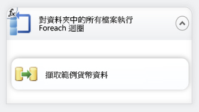
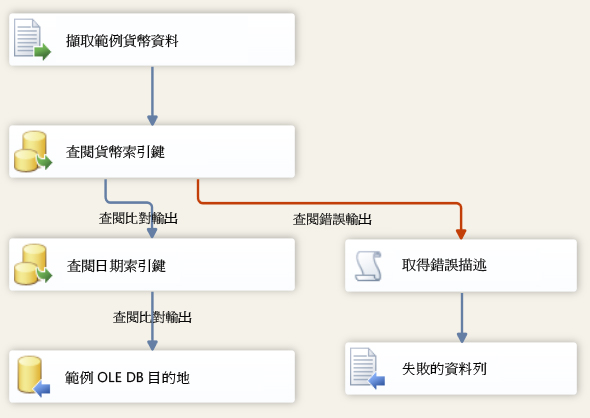

# 課程 6-3 - 測試第 6 課的封裝
在執行階段，您的封裝會從 VarFolderName 參數取得目錄屬性的值。  
  
若要確認封裝在執行階段使用新值來更新 Directory 屬性，只要執行封裝即可。 因為只有 3 個範例資料檔會複製到新目錄，所以資料流程只會執行 3 次，而不是反覆執行原始資料夾的 14 個檔案。  
  
## 檢查封裝配置  
在測試封裝之前，您應該確認第 6 課封裝中的控制流程和資料流程是否包含下圖所顯示的物件。 其控制流程應該與第 5 課的控制流程相同。 資料流程應該與第 5 課的資料流程相同。  
  
**控制流程**  
  
  
  
**資料流程**  
  
  
  
### 若要測試第 6 課的教學課程封裝  
  
1.  在 [偵錯] 功能表上，按一下 [開始偵錯]。  
  
2.  在封裝完成執行之後，在 [偵錯] 功能表上，按一下 [停止偵錯]。  
  
## 本課程的下一項工作  
[步驟 4：部署第 6 課的套件](../integration-services/lesson-6-4-deploying-the-lesson-6-package.md)  
  
  
  
