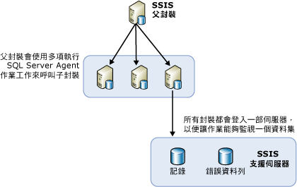

# 使用 SQL Server Agent 在遠端伺服器上設定封裝負載平衡
  當您必須執行許多封裝時，使用其他可用的伺服器會更方便。 當封裝全都受單一父封裝控制時，使用其他伺服器來執行封裝的這種方法，即稱為負載平衡。 在 [!INCLUDE[ssNoVersion](../../includes/ssnoversion-md.md)] [!INCLUDE[ssISnoversion](../../includes/ssisnoversion-md.md)]中，負載平衡是一種必須由封裝擁有者建構的手動程序。 伺服器並不會自動執行負載平衡。 此外，遠端伺服器上執行的封裝也必須是完整的封裝，而不是其他封裝中的個別工作。  
  
 在下列狀況下，負載平衡非常有用：  
  
-   封裝可以同時執行。  
  
-   封裝規模很大，而且如果連續執行，其執行時間可能超過允許處理的時間。  
  
 管理員和架構設計師可以判斷使用其他伺服器進行處理是否能夠改善其處理效能。  
  
## 負載平衡的圖例說明  
 下圖顯示伺服器上的父封裝。 此父封裝包含多項「執行 SQL 作業代理程式」工作。 父封裝中的每項工作都會呼叫遠端伺服器上的 SQL Server Agent。 這些遠端伺服器包含 SQL Server Agent 作業，而這些作業都有一個步驟可以呼叫該伺服器上的封裝。  
  
   
  
 以這種架構設定負載平衡所需要的步驟並不是新的概念。 相反地，負載平衡是利用現有概念和一般 SSIS 物件，以新的方式來達成。  
  
## 使用 SQL Server Agent 在遠端執行個體執行封裝  
 在遠端封裝執行的基本架構中，中央封裝位於控制其他遠端封裝的 SQL Server 執行個體上。 圖中顯示這個中央封裝，其名稱為 SSIS Parent。 這個父封裝所在的執行個體可控制執行子封裝之 SQL Server Agent 作業的執行。 這些子封裝的執行並未依照遠端伺服器上 SQL Server Agent 所控制的固定排程。 而是在父封裝呼叫時由 SQL Server Agent 啟動這些子封裝，並於 SQL Server Agent 所在的同一個 SQL Server 執行個體上執行。  
  
 您必須先設定父封裝和子封裝，並設定控制子封裝的 SQL Server Agent 作業，才能使用 SQL Server Agent 執行遠端封裝。 下列章節提供有關如何建立、設定、執行及維護遠端伺服器上執行之封裝的詳細資訊。 這個處理程序包含幾個步驟：  
  
-   建立子封裝並將它們安裝在遠端伺服器上。  
  
-   在要執行封裝的遠端執行個體上建立 SQL Server Agent 作業。  
  
-   建立父封裝。  
  
-   決定子封裝的記錄狀況。  
  
## 子封裝的實作
  使用 [!INCLUDE[ssISnoversion](../../includes/ssisnoversion-md.md)]實作負載平衡時，其他伺服器上會安裝子封裝，以充分利用可用的 CPU 或伺服器時間。 建立及執行子封裝需要下列步驟：  
  
-   設計子封裝。  
  
-   將封裝移到遠端伺服器。  
  
-   在包含執行子封裝之步驟的遠端伺服器上建立 SQL Server Agent 作業。  
  
-   測試及偵錯 SQL Server Agent 作業和子封裝。  
  
 設計子封裝時，封裝的設計並無任何限制，您可以放入任何所需的功能。 但是，如果封裝會存取資料，您必須確定執行封裝的伺服器擁有資料的存取權。  
  
 若要識別執行子封裝的父封裝，請在 [!INCLUDE[ssBIDevStudioFull](../../includes/ssbidevstudiofull-md.md)] 中，以滑鼠右鍵按一下方案總管中的封裝，然後按一下 [進入點封裝]。  
  
 子封裝設計完成之後，下一個步驟是將子封裝部署在遠端伺服器上。  
  
### 將子封裝移到遠端執行個體  
 有幾種方法可以將封裝移到其他伺服器。 建議的兩種方法為：  
  
-   使用 [!INCLUDE[ssManStudioFull](../../includes/ssmanstudiofull-md.md)]來匯出封裝。  
  
-   為包含想要部署之封裝的專案建立部署公用程式，然後執行「封裝安裝精靈」，將封裝安裝到檔案系統或 [!INCLUDE[ssNoVersion](../../includes/ssnoversion-md.md)]執行個體，以部署封裝。 如需詳細資訊，請參閱[舊版封裝部署 &#40;SSIS&#41;](../../integration-services/packages/legacy-package-deployment-ssis.md)。  
  
 您必須重複部署到想要使用的每一部遠端伺服器。  
  
### 建立 SQL Server Agent 作業  
 將子封裝部署到各種伺服器之後，請在包含子封裝的每一部伺服器上建立一項 SQL Server Agent 作業。 SQL Server Agent 作業包含一個在呼叫作業代理程式時執行子封裝的步驟。 SQL Server Agent 作業不是排程作業；只有在父封裝呼叫這些作業時，它們才會執行子封裝。 傳回給父封裝的作業成功或失敗通知，反映的是 SQL Server Agent 作業的成功或失敗，以及是否已成功呼叫作業，而非子封裝成功與否或其是否已執行。  
  
### 偵錯 SQL Server Agent 作業和子封裝  
 您可以使用下列其中一種方法來建立 SQL Server Agent 作業及其子封裝：  
  
-   按一下 [偵錯] / [啟動但不偵錯]，以便在 SSIS 設計師中執行每個子套件。  
  
-   使用 [!INCLUDE[ssManStudioFull](../../includes/ssmanstudiofull-md.md)]執行遠端電腦上的個別 SQL Server Agent 作業，以確定封裝執行無誤。  
  
 如需有關如何為您從 [!INCLUDE[ssNoVersion](../../includes/ssnoversion-md.md)] Agent 作業執行的封裝進行疑難排解，請參閱 [支援知識庫中的](http://support.microsoft.com/kb/918760) 從 SQL Server Agent 作業步驟呼叫 SSIS 封裝時，SSIS 封裝未執行 [!INCLUDE[msCoName](../../includes/msconame-md.md)] 。  
  
 SQL Server Agent 會檢查 Proxy 的子系統存取權，而且每當作業步驟執行時，就會提供 Proxy 的存取權。  
  
 您可以在 [!INCLUDE[ssManStudioFull](../../includes/ssmanstudiofull-md.md)]中建立 Proxy。  

## 父封裝的實作
  設定跨越各種伺服器之 SSIS 封裝的負載平衡時，在完成建立、部署子封裝，以及建立執行這些子封裝的遠端 SQL Server Agent 作業之後，下一個步驟就是建立父封裝。 父封裝將包含許多「執行 SQL Server Agent 作業」工作，每一項工作負責呼叫執行其中一個子封裝的不同 SQL Server Agent 作業。 接著父封裝中的「執行 SQL Server Agent 作業」工作會執行各種 SQL Server Agent 作業。 父封裝中的每項工作都包含如何連接到遠端伺服器以及要在該伺服器上執行哪一項作業之類的資訊。 如需詳細資訊，請參閱 [Execute SQL Server Agent Job Task](../../integration-services/control-flow/execute-sql-server-agent-job-task.md)。  
  
 若要識別執行子封裝的父封裝，請在 [!INCLUDE[ssBIDevStudioFull](../../includes/ssbidevstudiofull-md.md)] 中，以滑鼠右鍵按一下 [方案總管] 中的封裝，然後按一下 **[進入點封裝]**。  
  
### 列出子封裝  
 若您將包含父封裝及子封裝的專案部署到 [!INCLUDE[ssISnoversion](../../includes/ssisnoversion-md.md)] 伺服器，可以檢視由父封裝執行的子封裝清單。 當您執行父封裝時，會在 **中自動產生父封裝的 [概觀]**[!INCLUDE[ssManStudioFull](../../includes/ssmanstudiofull-md.md)]報告。 該告會列出父封裝中包含的執行封裝工作所執行之子封裝清單，如下圖所示。  
  
   
  
 如需存取 [概觀]  報告的資訊，請參閱＜ [Reports for the Integration Services Server](../../integration-services/performance/monitor-running-packages-and-other-operations.md#reports)＞。  
  
### 父封裝中的優先順序條件約束  
 建立父封裝中「執行 SQL Server Agent 作業」工作之間的優先順序條件約束時，這些優先順序條件約束只會控制遠端伺服器上 SQL Server Agent 作業的啟動時間。 優先順序條件約束不會接收有關從 SQL Server Agent 作業步驟執行之子封裝成功或失敗的資訊。  
  
 這表示子封裝的成功與否並不會傳播至父封裝，因為父封裝中「執行 SQL Server Agent」作業的唯一功能是要求 SQL Server Agent 作業執行子封裝。 在成功呼叫 SQL Server Agent 作業之後，父封裝將會收到 <xref:Microsoft.SqlServer.Dts.Runtime.DTSExecResult.Success> 的結果。  
  
 這種狀況下的失敗只代表呼叫遠端「SQL Server Agent 作業」工作的失敗。 可能發生這種錯誤的其中一種情況是遠端伺服器已經關閉而且代理程式無法回應。 不過，只要代理程式有反應，就代表父封裝已經順利完成其工作。  
  
> [!NOTE]  
>  您可以使用包含 Transact-SQL 陳述式為 **sp_start_job N'package_name'** 的「執行 SQL 工作」。 如需詳細資訊，請參閱 [sp_start_job &#40;Transact-SQL&#41;](../../relational-databases/system-stored-procedures/sp-start-job-transact-sql.md)。  
  
### 環境偵錯  
 測試父封裝時，請使用 [偵錯] / [開始偵錯] (F5) 來執行以使用設計師的偵錯環境。 或者，也可以使用命令提示公用程式 **dtexec**。 如需詳細資訊，請參閱 [dtexec Utility](../../integration-services/packages/dtexec-utility.md)。  

## 遠端伺服器上負載平衡封裝的記錄
  當所有子封裝都使用相同的記錄提供者，而且全部寫入同一個目的地時，可以讓管理員較容易管理各種伺服器上執行之所有子封裝的記錄檔。 為所有子封裝建立共用記錄檔的其中一個方法，就是透過設定子封裝，使它們將事件記錄到 SQL Server 記錄提供者。 您可以將所有封裝設定成使用同一個資料庫、同一部伺服器，以及伺服器的同一個執行個體。  
  
 若要檢視記錄檔，管理員只需登入單一伺服器即可檢視所有子封裝的記錄檔。  
  
 如需如何在套件中啟用記錄的資訊，請參閱 [Integration Services (SSIS) 記錄](../../integration-services/performance/integration-services-ssis-logging.md)。  

## 相關工作  
 [封裝的 SQL Server Agent 作業](../../integration-services/packages/sql-server-agent-jobs-for-packages.md)  
  
  
