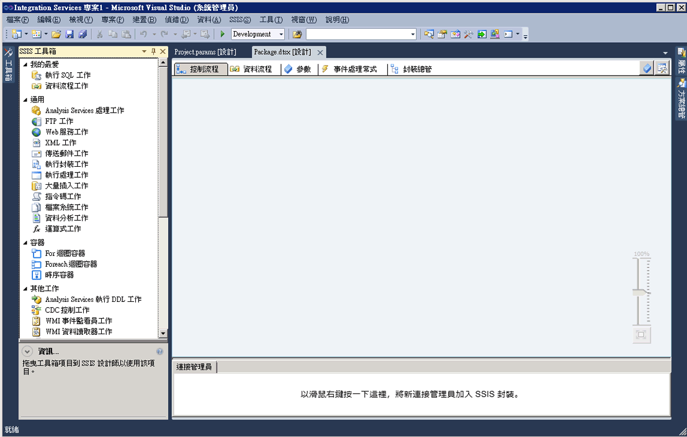

# SSIS 設計師
  [!INCLUDE[ssIS](../includes/ssis-md.md)] 設計師是可以用於建立及維護 [!INCLUDE[ssISnoversion](../includes/ssisnoversion-md.md)] 封裝的圖形工具。 [!INCLUDE[ssIS](../includes/ssis-md.md)][!INCLUDE[ssBIDevStudioFull](../includes/ssbidevstudiofull-md.md)] 提供的設計師是 [!INCLUDE[ssISnoversion](../includes/ssisnoversion-md.md)] 專案的一部分。  
  
 您可以使用「 [!INCLUDE[ssIS](../includes/ssis-md.md)] 設計師」執行下列工作：  
  
-   建構封裝中的控制流程。  
  
-   建構封裝中的資料流程。  
  
-   將事件處理常式加入封裝和封裝物件。  
  
-   檢視封裝內容。  
  
-   在執行階段，檢視封裝的執行進度。  
  
 下圖顯示 [!INCLUDE[ssIS](../includes/ssis-md.md)] 設計師與 [工具箱] 視窗。  
  
   
  
 [!INCLUDE[ssISnoversion](../includes/ssisnoversion-md.md)] 包含用來在封裝中加入功能的其他對話方塊和視窗， [!INCLUDE[ssBIDevStudioFull](../includes/ssbidevstudiofull-md.md)] 則提供用於設定開發環境及使用封裝的視窗和對話方塊。 如需詳細資訊，請參閱 [Integration Services User Interface](../integration-services/integration-services-user-interface.md)(Integration Services 使用者介面)。  
  
 [!INCLUDE[ssIS](../includes/ssis-md.md)] 設計師不具有對 [!INCLUDE[ssISnoversion](../includes/ssisnoversion-md.md)] 服務 (管理和監視封裝的服務) 的相依性，且不需要執行該服務即可在 [!INCLUDE[ssIS](../includes/ssis-md.md)] 設計師中建立或修改封裝。 不過，如果在 [!INCLUDE[ssIS](../includes/ssis-md.md)] 設計師處於開啟狀態時停止該服務，則將無法再開啟 [!INCLUDE[ssIS](../includes/ssis-md.md)] 設計師所提供的對話方塊，同時您可能會接收到「RPC 伺服器無法使用」這樣的錯誤訊息。 若要重設 [!INCLUDE[ssIS](../includes/ssis-md.md)] 設計師並繼續使用封裝，必須關閉設計師，結束 [!INCLUDE[ssBIDevStudioFull](../includes/ssbidevstudiofull-md.md)]，然後重新開啟 [!INCLUDE[ssBIDevStudioFull](../includes/ssbidevstudiofull-md.md)]( [!INCLUDE[ssISnoversion](../includes/ssisnoversion-md.md)] 專案) 和封裝。  
  
## 復原和取消復原  
 您可以在 [!INCLUDE[ssIS](../includes/ssis-md.md)] 設計師中復原和取消復原最多可達 20 個動作。 針對封裝，[控制流程]、[資料流程]、[事件處理常式] 及 [參數] 索引標籤，以及 [變數] 視窗中可以進行復原/取消復原。 針對專案，則可以在 [專案參數] 視窗中進行復原/取消復原。  
  
 您無法復原和取消復原針對新 [SSIS 工具箱] 所做的變更。  
  
 使用元件編輯器針對元件進行變更時，您可以將變更做為一個組進行復原和取消復原，而不是針對個別變更進行復原和取消復原。 變更組在復原與取消復原下拉式清單中顯示為單一動作。  
  
 若要復原某個動作，按一下 [復原] 工具列按鈕、[編輯/復原] 功能表項目，或按 CTRL + Z。 若要復原某個動作，請按一下 [復原] 工具列按鈕、[編輯/復原] 功能表項目，或按 CTRL + Y。按一下工具列按鈕旁的箭頭、反白顯示下拉式清單中的多個動作，然後在清單中按一下，可以復原和取消復原多個動作。  
  
## SSIS 設計師的組件  
 [!INCLUDE[ssIS](../includes/ssis-md.md)] 設計師有五個永久的索引標籤：各有一個索引標籤用於建立封裝控制流程、資料流程、參數和事件處理常式，還有一個索引標籤用於檢視封裝的內容。 在執行階段會出現第六個索引標籤，它會在封裝執行中顯示執行進度，並在完成時顯示執行結果。  
  
 此外， [!INCLUDE[ssIS](../includes/ssis-md.md)] 設計師還包含「連接管理員」區域，用於加入和設定由封裝用來連接到資料的連接管理員。  
  
### 控制流程索引標籤  
 您可以在 [控制流程] 索引標籤的設計介面上，建構封裝中的控制流程。請從 [工具箱] 將項目拖曳至設計介面，並透過按一下項目的圖示將其連接到控制流程中，然後從一個項目拖曳箭頭到另一個項目。  
  
 如需詳細資訊，請參閱 [控制流程](../integration-services/control-flow/control-flow.md)。  
  
### 資料流程索引標籤  
 如果封裝包含資料流程工作，您可以將資料流程加入封裝中。 您可以在 [資料流程] 索引標籤的設計介面上，建構封裝中的資料流程。請從 [工具箱] 將項目拖曳至設計介面，並透過按一下項目的圖示將其連接到資料流程中，然後從一個項目拖曳箭頭到另一個項目。  
  
 如需詳細資訊，請參閱 [資料流程](../integration-services/data-flow/data-flow.md)。  
  
### 參數索引標籤  
 Integration Services (SSIS) 參數可讓您在封裝執行時，將值指派給封裝內的屬性。 您可以在專案層級建立專案參數，並在封裝層級建立封裝參數。 專案參數可用於向專案中的一個或多個封裝提供專案接收的任何外部輸入。 封裝參數可讓您修改封裝執行，而不需要編輯和重新部署封裝。 此索引標籤可讓您管理封裝參數。  
  
 如需參數的詳細資訊，請參閱 [Integration Services (SSIS) 參數](integration-services-ssis-package-and-project-parameters.md)。  
  
> **重要！！**  參數只能用於針對專案部署模型而開發的專案。 因此，僅對於屬於設定為使用專案部署模型之專案一部分的封裝，您才會看到 [參數] 索引標籤。  
  
### 事件處理常式索引標籤  
 您可以在 [事件處理常式] 索引標籤的設計介面上，建構封裝中的事件。請在 [事件處理常式] 索引標籤上，選取要建立事件處理常式的封裝或封裝物件，然後選取要與事件處理常式產生關聯的事件。 事件處理常式具有控制流程和選擇性的資料流程。  
  
 如需詳細資訊，請參閱 [Add an Event Handler to a Package](http://msdn.microsoft.com/library/5e56885d-8658-480a-bed9-3f2f8003fd78)(將事件處理常式加入封裝中)。  
  
### 封裝總管索引標籤  
 封裝可能相當複雜，其中包括許多工作、連接管理員、變數和其他元素等。 封裝總管檢視可讓您查看封裝元素的完整清單。  
  
 如需詳細資訊，請參閱 [View Package Objects](../integration-services/view-package-objects.md)(檢視封裝物件)。  
  
### 進度/執行結果索引標籤  
 當封裝正在執行時，[進度] 索引標籤會顯示封裝的執行進度。 在完成執行封裝後，執行結果會在 [執行結果] 索引標籤上保持可用。  
  
> **注意**：若要啟用或停用 [進度] 索引標籤上的訊息顯示，請在 [SSIS] 功能表上切換 [偵錯進度報表] 選項。  
  
#### 連接管理員區域  
 您可以在 [連線管理員] 區域中，加入及修改封裝所使用的連線管理員。 [!INCLUDE[ssISnoversion](../includes/ssisnoversion-md.md)] 包含可以連接到各種不同的資料來源 (例如文字檔、OLE DB 資料庫及 .NET 提供者) 的連線管理員。  
  
 如需詳細資訊，請參閱 [Integration Services &#40;SSIS&#41; 連接](../integration-services/connection-manager/integration-services-ssis-connections.md)和[建立連接管理員](http://msdn.microsoft.com/library/6ca317b8-0061-4d9d-b830-ee8c21268345)。  
 
## 控制流程索引標籤
使用 **設計師的** [控制流程] [!INCLUDE[ssIS](../includes/ssis-md.md)] 索引標籤，即可在 [!INCLUDE[ssISnoversion](../includes/ssisnoversion-md.md)] 封裝中建立控制流程。  
  
 從 [!INCLUDE[ssIS](../includes/ssis-md.md)] [工具箱] **中，將代表** 工作和容器的圖形物件拖曳至 **[控制流程]** 索引標籤的設計介面來建立控制流程，然後將某個物件上的連接子拖曳至另一個物件來連接物件。 每一條連接線代表一個指定工作和容器執行之順序的優先順序條件約束。  
  
 此外，您可以使用 [!INCLUDE[ssIS](../includes/ssis-md.md)] 設計師，從 **[控制流程]** 索引標籤加入下列功能：  
  
-   實作記錄  
  
-   建立封裝組態  
  
-   使用憑證簽署封裝  
  
-   管理變數  
  
-   加入註解  
  
-   設定中斷點  
  
 若要將這些功能加入至 [!INCLUDE[ssIS](../includes/ssis-md.md)] 設計師中的個別工作或容器，請以滑鼠右鍵按一下設計介面上的物件，然後選取選項。  
 
## 資料流程索引標籤
使用 **設計師的** [資料流程] [!INCLUDE[ssIS](../includes/ssis-md.md)] 索引標籤，即可建立 [!INCLUDE[ssISnoversion](../includes/ssisnoversion-md.md)] 封裝中的資料流程。  
  
 將代表來源、轉換以及目的地的圖形物件，從 **[工具箱]** 拖曳至 **[資料流程]** 索引標籤的設計介面，然後連接物件來建立決定轉換執行順序的路徑，以建立資料流程。  
  
 以滑鼠右鍵按一下路徑，然後按一下 [資料檢視器]，即可加入資料檢視器，以檢視在每個資料流程物件之前與之後的資料。  
  
 您也可以使用 [!INCLUDE[ssIS](../includes/ssis-md.md)] 設計師，來加入 **[資料流程]** 索引標籤中的下列功能：  
  
-   管理變數  
  
-   加入註解  
  
 若要在 [!INCLUDE[ssIS](../includes/ssis-md.md)] 設計師中加入這些函數，請以滑鼠右鍵按一下設計介面，然後選取您要的選項。  
 
## 事件處理常式索引標籤
  使用 [!INCLUDE[ssIS](../includes/ssis-md.md)] 設計師的 [事件處理常式] 索引標籤，即可在 [!INCLUDE[ssISnoversion](../includes/ssisnoversion-md.md)] 封裝中建立控制流程。 執行事件處理常式以回應封裝所引發的事件，或回應封裝中的工作或容器所引發生的事件。  
  
## 選項。  
 **可執行檔**  
 選取要建立事件處理常式的可執行檔。 可執行檔可以是封裝，或封裝中的工作或容器。  
  
 **事件處理常式**  
 選取事件處理常式的類型。 從 [工具箱] 拖曳項目來建立事件處理常式。  
  
 **Delete**  
 選取事件處理常式，然後按一下 [刪除] 即可從封裝中移除它。  
  
 **按一下這裡可建立\<事件處理常式名稱\>可執行檔\<可執行檔名稱\>**  
 按一下即可建立事件處理常式。  
  
 從 [工具箱] 中，將代表 [!INCLUDE[ssIS](../includes/ssis-md.md)] 工作和容器的圖形物件拖曳至 [事件處理常式] 索引標籤的設計介面來建立控制流程，然後使用優先順序條件約束以定義它們執行的順序來連接物件。  
  
 此外，若要加入註解，請以滑鼠右鍵按一下設計介面，然後在功能表上，按一下 [加入註解]。  
 
## 封裝總管索引標籤
使用 [[!INCLUDE[ssIS](../includes/ssis-md.md)] 設計工具] 的封裝總管索引標籤，即可查看封裝中所有元素的階層式檢視：組態、連接、事件處理常式、可執行的物件 (例如：工作和容器)、記錄提供者、優先順序條件約束，以及變數。 如果封裝包含資料流程工作，封裝總管索引標籤就會包括其中含有資料流程元件之階層式檢視的節點。  
  
 以滑鼠右鍵按一下封裝元素，然後按一下 [屬性]，即可在 [屬性] 視窗中顯示元素的屬性，或是按一下 [刪除] 來刪除元素。 
 
## 進度索引標籤
當您在 **中執行封裝時，使用** 設計師的 [!INCLUDE[ssIS](../includes/ssis-md.md)] [進度] [!INCLUDE[ssISnoversion](../includes/ssisnoversion-md.md)] 索引標籤，即可檢視執行 [!INCLUDE[ssBIDevStudioFull](../includes/ssbidevstudiofull-md.md)]封裝的進度。 **[進度]** 索引標籤會列出開始時間、完成時間，以及驗證和執行封裝及其可執行檔的經過時間；封裝的任何資訊或警告；進度通知；封裝是成功還是失敗；以及在封裝執行期間所產生的任何錯誤訊息。  
  
 若要啟用或停用 **[進度]** 索引標籤上的訊息顯示，請在 **[SSIS]** 功能表上切換 **[偵錯進度報表]** 選項。 停用進度報告有助於在 [!INCLUDE[ssBIDevStudio](../includes/ssbidevstudio-md.md)]中執行複雜封裝時改善效能。  
  
 在封裝停止執行之後， **[進度]** 索引標籤會變成 **[執行結果]** 索引標籤。  
 
## 連接管理員區域
封裝會使用連接管理員連接到資料來源，例如檔案、關聯式資料庫和伺服器。  
  
 使用 **設計師的** [連接管理員] [!INCLUDE[ssIS](../includes/ssis-md.md)] 區域，即可加入、刪除、修改、重新命名和複製與貼上連接管理員。  
  
 以滑鼠右鍵按一下此區域，然後在功能表上，按一下要執行之工作的選項。
 
## 相關工作  
  
-   [在 SQL Server 資料工具中建立封裝](../integration-services/create-packages-in-sql-server-data-tools.md)  
  
## 另請參閱  
 [Integration Services User Interface](../integration-services/integration-services-user-interface.md)  
  
  

