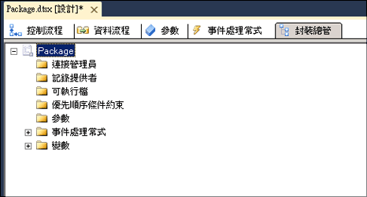

# 檢視封裝物件
  在「[!INCLUDE[ssIS](../includes/ssis-md.md)] 設計師」中，[封裝總管] 索引標籤提供封裝的總管檢視。 此檢視反映 [!INCLUDE[ssISnoversion](../includes/ssisnoversion-md.md)] 架構的容器階層。 封裝容器位於階層的頂端，您可以展開封裝以檢視其中的連接、可執行檔、事件處理常式、記錄提供者、優先順序條件約束和變數。  
  
 可執行檔 (封裝中的容器和工作) 可包含事件處理常式、優先順序條件約束和變數。 [!INCLUDE[ssISnoversion](../includes/ssisnoversion-md.md)] 支援容器的巢狀階層，而「For 迴圈」、「Foreach 迴圈」和「時序」容器可包含其他可執行檔。  
  
 如果某個封裝包含資料流程，封裝總管會列出「資料流程」工作，並包含一個列出資料流程元件的 [元件] 資料夾。  
  
 藉由 [封裝總管] 索引標籤，您可以刪除封裝中的物件並存取 [屬性] 視窗以檢視物件屬性。  
  
 下圖顯示簡單封裝的樹狀檢視。  
  
   
  
### 檢視封裝內容  
  
-   [在封裝總管中檢視封裝物件](../Topic/View%20Package%20Objects%20in%20Package%20Explorer.md)  
  
## 請參閱＜  
 [Integration Services 工作](../integration-services/control-flow/integration-services-tasks.md)   
 [整合服務容器](../integration-services/control-flow/integration-services-containers.md)   
 [優先順序條件約束](../integration-services/control-flow/precedence-constraints.md)   
 [Integration Services &#40;SSIS&#41; 變數](../integration-services/integration-services-ssis-variables.md)   
 [Integration Services &#40;SSIS&#41; 事件處理常式](../integration-services/integration-services-ssis-event-handlers.md)   
 [Integration Services &#40;SSIS&#41; 記錄](../integration-services/performance/integration-services-ssis-logging.md)  
  
  