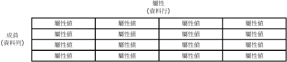

# 屬性 (Master Data Services)
  屬性是 [!INCLUDE[ssMDSshort](../includes/ssmdsshort-md.md)] 實體中包含的物件。 屬性值描述實體的成員。 屬性可用來描述分葉成員、合併成員或集合。  
  
## 屬性如何與其他的模型物件相關聯  
 您可以將屬性視為實體資料表中的資料行。 屬性值是用來描述特定成員的值。  
  
   
  
 當您建立包含多個屬性的實體時，您可以將屬性組織成屬性群組。 如需詳細資訊，請參閱 [屬性群組 &#40;Master Data Services&#41;](../master-data-services/attribute-groups-master-data-services.md)。  
  
## 必要的屬性  
 當您建立實體時，會自動建立 Name 和 Code 屬性。 Code 需要一個值，而且在實體中必須是唯一的。 您不能移除 Name 和 Code 屬性。  
  
## 屬性類型  
 屬性有三種類型：  
  
-   自由格式的屬性，允許以自由格式輸入文字、數字、日期或連結。  
  
-   由實體擴展的網域屬性。 如需詳細資訊，請參閱 [網域屬性 &#40;Master Data Services&#41;](../master-data-services/domain-based-attributes-master-data-services.md)。  
  
-   檔案屬性，用來儲存檔案、文件或影像。 檔案屬性透過要求檔案有特定副檔名，有助於資料一致性。 檔案屬性無法保證能防止惡意使用者上傳不同類型的檔案。  
  
### 數值的自由格式屬性  
 數值的自由格式屬性需要特殊處理，因為數值的自由格式屬性值僅限於 **SqlDouble** 數值類型。  
  
 根據預設，儘管內部最多維護 17 個位數，但 **SqlDouble** 值包含 15 個有效小數位數。 浮點數的有效位數有數個結果：  
  
-   對特定有效位數相等的兩個浮點數，可能因為它們的最低有效位數不同，而不相等。  
  
-   如果因為浮點數可能不完全近似十進位數字，而使用十進位數字，使用浮點數的數學或比較運算可能不會產生相同結果。  
  
-   如果牽涉到浮點數，值可能無法 *「往返」* (Roundtrip)。 如果運算將原始浮點數轉換成另一個形式，反運算將轉換的形式轉換回浮點數，而最終浮點數等於原始浮點數，值稱為往返。 往返可能因為轉換中遺漏或變更一個或多個最低有效位數而失敗。  
  
## 屬性範例  
 在下列範例中，實體有屬性：Name、Code、Subcategory、StandardCost、ListPrice 和 FilePhoto。 這些屬性描述成員。 每個成員都是由單一資料列的屬性值來表示。  
  
   
  
 在下列範例中，Product 實體包含：  
  
-   Name、Code、StandardCost 和 ListPrice 自由格式的屬性。  
  
-   Subcategory 網域屬性。  
  
-   FilePhoto 檔案屬性。  
  
 Subcategory 實體當做 Product 的網域屬性。 Category 實體當做 Subcategory 的網域屬性。 就像 Product 實體一樣，Category 和 Subcategory 實體每一個都包含預設的 Name 和 Code 屬性。  
  
   
  
## 相關工作  
  
|工作描述|主題|  
|----------------------|-----------|  
|建立新的自由格式文字屬性。|[建立文字屬性 &#40;Master Data Services&#41;](../master-data-services/create-a-text-attribute-master-data-services.md)|  
|建立新的自由格式數值屬性。|[建立數值屬性 &#40;Master Data Services&#41;](../master-data-services/create-a-numeric-attribute-master-data-services.md)|  
|建立新的自由格式連結屬性。|[建立連結屬性 &#40;Master Data Services&#41;](../master-data-services/create-a-link-attribute-master-data-services.md)|  
|建立新的檔案屬性。|[建立檔案屬性 &#40;Master Data Services&#41;](../master-data-services/create-a-file-attribute-master-data-services.md)|  
|建立新的網域屬性。|[建立網域屬性 &#40;Master Data Services&#41;](../master-data-services/create-a-domain-based-attribute-master-data-services.md)|  
|變更現有屬性的名稱。|[變更屬性名稱和資料類型 &#40;Master Data Services&#41;](../master-data-services/change-an-attribute-name-and-data-type-master-data-services.md)|  
|將現有屬性加入至變更追蹤群組。|[將屬性加入至變更追蹤群組 &#40;Master Data Services&#41;](../master-data-services/add-attributes-to-a-change-tracking-group-master-data-services.md)|  
|刪除現有屬性。|[刪除屬性 &#40;Master Data Services&#41;](../master-data-services/delete-an-attribute-master-data-services.md)|  
|變更屬性的順序。|[變更屬性的順序](../master-data-services/change-the-order-of-attributes.md)|  
|建立日期屬性|[建立日期屬性 &#40;Master Data Services&#41;](../master-data-services/create-a-date-attribute-master-data-services.md)|  
  
## 相關內容  
  
-   [網域屬性 &#40;Master Data Services&#41;](../master-data-services/domain-based-attributes-master-data-services.md)  
  
-   [屬性群組 &#40;Master Data Services&#41;](../master-data-services/attribute-groups-master-data-services.md)  
  
-   [成員 &#40;Master Data Services&#41;](../master-data-services/members-master-data-services.md)  
  
-   [分葉權限 &#40;Master Data Services&#41;](../master-data-services/leaf-permissions-master-data-services.md)
  
