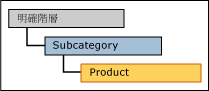
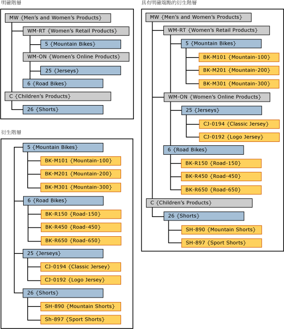

# 具有明確頂層的衍生階層 (Master Data Services)

[!INCLUDE[appliesto-ss-xxxx-xxxx-xxx-md-winonly](../includes/appliesto-ss-xxxx-xxxx-xxx-md-winonly.md)]

  在 [!INCLUDE[ssMDSshort](../includes/ssmdsshort-md.md)]中，當明確階層的層級當做衍生階層的最上層使用時，稱為具有明確頂層的衍生階層。  
  
 明確階層必須是以衍生階層最上方之實體的相同實體為基礎。  
  
 在 [!INCLUDE[ssMDSmdm](../includes/ssmdsmdm-md.md)] 使用者介面 (UI) 中，您可以將明確階層拖曳至衍生階層最上方，以建立此階層類型。  
  
   
  
## 具有明確頂層的衍生階層範例  
 在這個範例中，明確階層中的成員是來自 Subcategory 實體。 在衍生階層中，最上層成員也是來自 Subcategory 實體。  
  
   
  
 透過在衍生階層最上方使用明確階層，衍生階層會變得不完全。  
  
## 規則  
  
-   具有明確頂層的衍生階層中不能有一個以上的明確階層。  
  
-   同一個明確階層可以做為多個衍生階層的端點。  
  
-   不能指派階層成員權限給具有明確頂層的衍生階層。 如果您個別指派權限給明確階層或衍生階層，此權限會同時影響這兩個階層。  
  
## 相關工作  
  
|工作描述|主題|  
|----------------------|-----------|  
|建立衍生階層。|[建立衍生階層 &#40;Master Data Services&#41;](../master-data-services/create-a-derived-hierarchy-master-data-services.md)|  
|建立明確階層。|[建立明確階層 &#40;Master Data Services&#41;](../master-data-services/create-an-explicit-hierarchy-master-data-services.md)|  
|刪除現有衍生階層。|[刪除衍生階層 &#40;Master Data Services&#41;](../master-data-services/delete-a-derived-hierarchy-master-data-services.md)|  
|||  
  
## 相關內容  
  
-   [衍生階層 &#40;Master Data Services&#41;](../master-data-services/derived-hierarchies-master-data-services.md)  
  
-   [明確階層 &#40;Master Data Services&#41;](../master-data-services/explicit-hierarchies-master-data-services.md)  
  
  
