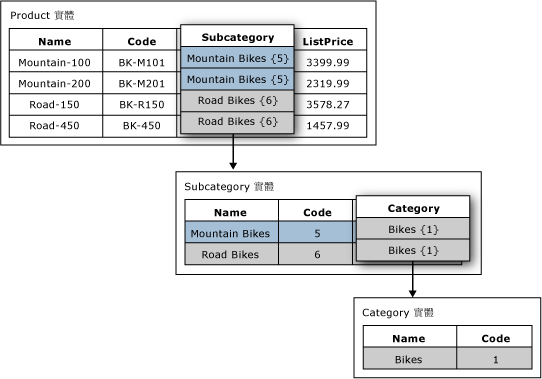

# 網域屬性 (Master Data Services)
  在 [!INCLUDE[ssMDSshort](../includes/ssmdsshort-md.md)]中，網域屬性是由其他實體成員擴展其值的屬性。 您可以將網域屬性視為受條件約束的清單，網域屬性會讓使用者無法輸入無效的屬性值。 若要選取屬性值，使用者必須從清單中挑選。  
  
## 網域屬性範例  
 在下圖中，Product 實體有稱為 Subcategory 的網域屬性。 Subcategory 屬性是由 Subcategory 實體的值擴展。  
  
 Subcategory 實體有稱為 Category 的網域屬性。 Category 屬性是由 Category 實體的值擴展。  
  
   
  
## 將相同的實體用於多個網域屬性  
 同一個實體可以當做多個實體的網域屬性。 例如，您可以建立稱為 YesNoIndicator 的實體，其具有成員：Yes、No 和 Maybe。 您可以建立名稱為 InStock 的網域屬性，並且使用 YesNoIndicator 實體做為來源。 您也可以建立名稱為 Approved 的其他網域屬性，並且使用 YesNoIndicator 實體做為來源。 每次您要使用者從 YesNoIndicator 實體成員清單中選擇時，都可以將此實體當做網域屬性使用。  
  
## 網域屬性可形成衍生階層  
 網域屬性關聯性是衍生階層的基礎。 如需詳細資訊，請參閱 [衍生階層 &#40;Master Data Services&#41;](../master-data-services/derived-hierarchies-master-data-services.md)。  
  
## 相關工作  
  
|工作描述|主題|  
|----------------------|-----------|  
|從現有實體來源中建立新的網域屬性。|[建立網域屬性 &#40;Master Data Services&#41;](../master-data-services/create-a-domain-based-attribute-master-data-services.md)|  
|建立新實體。|[建立實體 &#40;Master Data Services&#41;](../master-data-services/create-an-entity-master-data-services.md)|  
  
## 相關內容  
  
-   [衍生階層 &#40;Master Data Services&#41;](../master-data-services/derived-hierarchies-master-data-services.md)  
  
-   [屬性 &#40;Master Data Services&#41;](../master-data-services/attributes-master-data-services.md)  
  
-   [實體 &#40;Master Data Services&#41;](../master-data-services/entities-master-data-services.md)  
  
  
