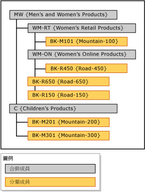

# 明確階層 (Master Data Services)

[!INCLUDE[appliesto-ss-xxxx-xxxx-xxx-md-winonly](../includes/appliesto-ss-xxxx-xxxx-xxx-md-winonly.md)]

  在 [!INCLUDE[ssMDSshort](../includes/ssmdsshort-md.md)]中，明確階層可以您指定的任何方式組織來自單一實體的成員。 衍生階層可以是不完全的，而且明確階層不像衍生階層，前者不是以網域屬性關聯性為基礎。  
  
> [!NOTE]  
>  明確階層已被取代。  
  
## 合併成員群組其他成員  
 明確階層會使用您為了分組其他成員所建立的合併成員。 這些合併成員一次只能屬於一個明確階層。 明確階層也包含其關聯實體的所有分葉成員。  
  
 明確階層可以是不完全的，這表示階層可以同時在不同層級結束。 每個合併成員都可以有數量不受限制的合併成員及其底下的分葉成員，也可以沒有任何成員。 分葉成員可以在單一彙總成員底下，或是在合併成員的多個層級底下。  
  
> [!NOTE]  
>  在您可以建立明確階層之前，實體必須啟用明確階層。  
  
## 明確階層的類型  
 有兩種類型的明確階層：強制和非強制。  
  
### 強制的明確階層  
 強制的明確階層是一種階層，其中的所有分葉成員都必須包括在階層樹狀結構中。 根據預設，所有成員都會包含在樹狀結構的根。 您可以視需要重新排列成員。  
  
### 非強制的明確階層  
 非強制的明確階層是一種階層，其所有分葉成員都是位於系統建立的 [未使用]  節點。 您可以在需要時，將成員移出這個節點。 其餘的成員可以保留在 [未使用]  節點中。  
  
 當您使用非強制的明確階層時，在此階層上所做的任何報告或分析可能不會符合強制的階層上所做的報告或分析。  
  
## 規則  
 下列規則適用於明確階層 (強制和非強制)。  
  
-   每個分葉成員只能包含在階層中一次。  
  
-   所有的合併成員都必須包含在階層中。  
  
-   合併成員不能位於一個以上的明確階層中。  
  
-   階層樹狀結構中的合併成員不必包含底下的分葉成員。  
  
-   如果您刪除明確階層，之前在此階層中使用的所有合併成員也會一併刪除。  
  
-   如果您刪除之前在明確階層中的合併成員，則之前依照該合併成員所分組的所有分葉成員都會移到根目錄。  
  
## 明確階層與衍生階層的比較  
 下表顯示明確階層與衍生階層之間的某些差異。  
  
|明確階層|衍生階層|  
|--------------------------|-------------------------|  
|結構是由使用者所定義|結構衍生自網域屬性之間的關聯性|  
|包含來自單一實體的成員|包含來自多個實體的成員|  
|使用合併成員群組其他成員|使用某個實體的分葉成員群組另一個實體的分葉成員|  
|可以是不完全的|永遠包含固定數目的層級|  
  
## 明確階層範例  
 在下列範例中，Product 實體包含這些分葉成員：BK-M101 {Mountain-100}、BK-M201 {Mountain-200}、BK-M301 {Mountain-300}、BK-R150 {Road-150}、BK-R450 {Road-450} 和 BK-R650 {Road-650}。  
  
 若要摘要列出在特定合併點上的分葉成員，您可以在 Product 實體中建立合併成員。 在階層樹狀結構中，於您想要摘要列出分葉成員的層級上插入合併成員。 您可以插入合併成員的位置並沒有任何限制，但是每一個成員 (分葉或合併成員) 只能使用一次。  
  
   
  
 合併成員可在任何層級用來分組成員，而且分葉成員和合併成員會依照您決定的順序來排序。  
  
## 相關工作  
  
|工作描述|主題|  
|----------------------|-----------|  
|建立新的明確階層。|[建立明確階層 &#40;Master Data Services&#41;](../master-data-services/create-an-explicit-hierarchy-master-data-services.md)|  
|變更現有明確階層的名稱。|[變更明確階層名稱 &#40;Master Data Services&#41;](../master-data-services/change-an-explicit-hierarchy-name-master-data-services.md)|  
|刪除現有明確階層。|[刪除明確階層 &#40;Master Data Services&#41;](../master-data-services/delete-an-explicit-hierarchy-master-data-services.md)|  
|||  
  
## 相關內容  
  
-   [衍生階層 &#40;Master Data Services&#41;](../master-data-services/derived-hierarchies-master-data-services.md)  
  
-   [集合 &#40;Master Data Services&#41;](../master-data-services/collections-master-data-services.md)  
  
  
