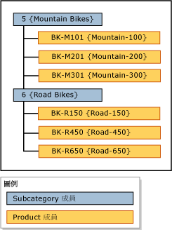

# 階層 (Master Data Services)

[!INCLUDE[appliesto-ss-xxxx-xxxx-xxx-md-winonly](../includes/appliesto-ss-xxxx-xxxx-xxx-md-winonly.md)]

  在 [!INCLUDE[ssMDSshort](../includes/ssmdsshort-md.md)]中，階層是一個樹狀目錄，您可以用它來執行以下作業：  
  
-   分組類似的成員供組織使用。  
  
-   合併及摘要成員來進行報告和分析。  
  
## 階層包含的內容  
 每個階層都包含一個或多個實體中的成員。 當您加入、變更或刪除成員時，所有的階層都會更新。 如此可確保資料在所有階層中都是正確的。 階層也有助於確保每個成員只計算一次。  
  
 如果您要建立成員子集的群組，請考慮使用集合。 如需詳細資訊，請參閱 [集合 &#40;Master Data Services&#41;](../master-data-services/collections-master-data-services.md)。  
  
## 階層類型  
 您可以建立多個階層，以不同的方式來檢視及組織成員。 您可以建立：  
  
-   來自單一實體的不完全階層，這些階層稱為明確階層。 如需詳細資訊，請參閱 [明確階層 &#40;Master Data Services&#41;](../master-data-services/explicit-hierarchies-master-data-services.md)。  
  
-   來自根據實體與及其屬性之間現有關聯性之多個實體的層級型階層，這些階層稱為衍生階層。 如需詳細資訊，請參閱 [衍生階層 &#40;Master Data Services&#41;](../master-data-services/derived-hierarchies-master-data-services.md)。  
  
> [!NOTE]  
>  階層中的所有成員都必須在相同的模型中。  
  
## 層次不是分類  
 階層與分類不同。 分類會同時根據多個屬性來組織成員，而階層則一次根據一個屬性來組織成員。 分類可以包含相同成員多次，而階層只能包含成員一次。  
  
 例如，相同的自行車可以包含在某個分類中兩次：一次是因為它是紅色，另一次是因為它的尺寸為 38。 在階層中，自行車只能包含一次，所以您必須決定是要根據它的顏色還是尺寸來顯示。  
  
## 階層範例  
 在下列範例中，產品成員是依子類別目錄成員分組。  
  
   
  
## 相關工作  
  
|工作描述|主題|  
|----------------------|-----------|  
|建立明確階層。|[建立明確階層 &#40;Master Data Services&#41;](../master-data-services/create-an-explicit-hierarchy-master-data-services.md)|  
|建立衍生階層。|[建立衍生階層 &#40;Master Data Services&#41;](../master-data-services/create-a-derived-hierarchy-master-data-services.md)|  
|隱藏或刪除現有衍生階層中的層級。|[隱藏或刪除衍生階層中的層級 &#40;Master Data Services&#41;](../master-data-services/hide-or-delete-levels-in-a-derived-hierarchy-master-data-services.md)|  
  
## 相關內容  
  
-   [明確階層 &#40;Master Data Services&#41;](../master-data-services/explicit-hierarchies-master-data-services.md)  
  
-   [衍生階層 &#40;Master Data Services&#41;](../master-data-services/derived-hierarchies-master-data-services.md)  
  
-   [遞迴階層 &#40;Master Data Services&#41;](../master-data-services/recursive-hierarchies-master-data-services.md)  
  
-   [具有明確頂層的衍生階層 &#40;Master Data Services&#41;](../master-data-services/derived-hierarchies-with-explicit-caps-master-data-services.md)  
  
-   [集合 &#40;Master Data Services&#41;](../master-data-services/collections-master-data-services.md)  
  
  
