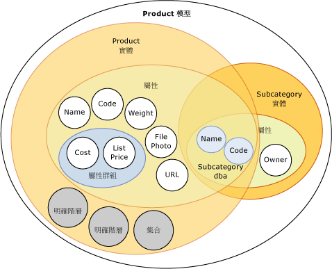
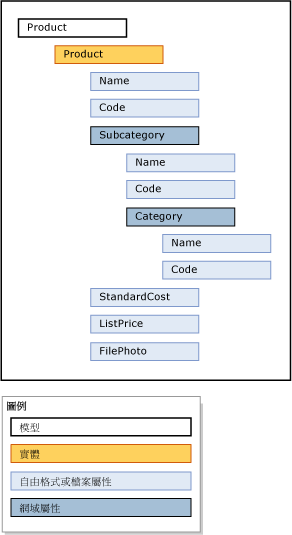

# 模型 (Master Data Services)
  模型是 [!INCLUDE[ssMDSshort](../includes/ssmdsshort-md.md)] 中最高層級的資料組織。 模型定義主要資料管理方案中的資料結構。 模型包含下列物件：  
  
-   實體  
  
-   屬性和屬性群組  
  
-   明確和衍生階層  
  
-   集合  
  
 模型組織主要資料的結構。 您 [!INCLUDE[ssMDSshort](../includes/ssmdsshort-md.md)] 實作可以有一或多個模型，每個群組類似的資料。 主要資料通常以四種方式分類：人員、位置、東西或概念。 例如，您可以建立一個 Product 模型來容納產品相關的資料，或是建立一個 Customer 模型來容納客戶相關的資料。  
  
 您可以指派使用者和群組權限來檢視及更新模型內的物件。 如果您未提供模型的權限，就不會顯示權限。  
  
 您可以在任何給定的時刻，於模型內建立主資料的複本。 這些複本稱為版本。  
  
 當您在測試環境中定義模型時，不論有沒有對應的資料，您都可以從測試環境到實際執行環境來部署此模型。 這樣就不需要在實際執行環境內重建模型。  
  
## 模型如何與其他物件相關聯  
 模型包含實體。 實體包含屬性、明確階層和集合。 屬性可以包含在屬性群組中。 當實體做為另一個實體的屬性時，就會有網域屬性。  
  
 下圖顯示模型中物件之間的關聯性。  
  
   
  
> [!NOTE]  
>  衍生階層也是模型物件，但在上圖中未顯示。 衍生階層衍生自實體之間存在的網域屬性關聯性。 請參閱 [衍生階層 & #40。Master Data Services & #41;](../master-data-services/derived-hierarchies-master-data-services.md) 如需詳細資訊。  
  
 主要資料是模型物件中包含的資料。 在 [!INCLUDE[ssMDSshort](../includes/ssmdsshort-md.md)] 中，主要資料是儲存為實體中的成員。  
  
 模型物件會保持處於 **系統管理** 功能區域 [!INCLUDE[ssMDSmdm](../includes/ssmdsmdm-md.md)] 使用者介面。  
  
## 模型範例  
 在下列範例中，Product 模型中的物件以邏輯方式分組產品相關資料。  
  
   
  
 其他常見的模型如下：  
  
-   帳戶，可能包括類似資產負債表帳戶、損益表帳戶、統計資料及帳戶類型等實體。  
  
-   客戶，可能包括類似性別、教育、職業及婚姻狀態等實體。  
  
-   地理位置，可能包括類似郵遞區號、城市、縣市、州、省、區域、領域、國家/地區及大陸等實體。  
  
## 相關工作  
  
|工作描述|主題|  
|----------------------|-----------|  
|建立模型來組織您的主要資料。|[建立模型和 #40。Master Data Services & #41;](../master-data-services/create-a-model-master-data-services.md)|  
|變更現有模型的名稱。|[編輯模型 & #40。Master Data Services & #41;](../master-data-services/edit-model-master-data-services.md)|  
|刪除現有模型。|[刪除模型 & #40。Master Data Services & #41;](../master-data-services/delete-a-model-master-data-services.md)|  
  
## 相關內容  
  
-   [Master Data Services 概觀與 #40。MDS & #41;](../master-data-services/master-data-services-overview-mds.md)  
  
-   [實體 & #40。Master Data Services & #41;](../master-data-services/entities-master-data-services.md)  
  
-   [屬性 & #40。Master Data Services & #41;](../master-data-services/attributes-master-data-services.md)  
  
-   [部署模型 & #40。Master Data Services & #41;](../master-data-services/deploying-models-master-data-services.md)  
  
-   [模型物件權限 & #40。Master Data Services & #41;](../master-data-services/model-object-permissions-master-data-services.md)  
  
  