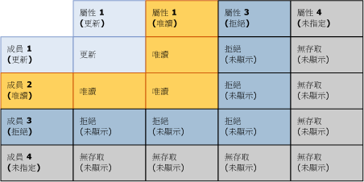
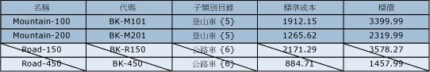
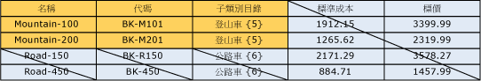

# 重疊的模型和成員的權限 (Master Data Services)

[!INCLUDE [SQL Server - Windows only ASDBMI  ](../includes/applies-to-version/sql-windows-only-asdbmi.md)]

  指派給成員的權限可能會與指派給模型物件的權限重疊。 當發生重疊情況時，比較嚴格的權限會生效。  
  
 如果成員擁有的權限與其對應模型物件的權限不同，則會套用下列規則：  
  
-   **[拒絕]** 會覆寫所有其他的權限。  
  
-   模型層級的 [系統管理員]**** 權限會覆寫所有其他權限，並且變更為子層級的 [全部 (CRUD)] 存取權限。  
  
-   有效存取權限會與成員和屬性的權限交集。  
  
     例如，如果成員權限包括 [建立] **** 和 [更新] ****，則屬性的權限為 [更新] ****。 有效權限是 [更新] ****。  
  
 下圖顯示當屬性權限與成員權限不同時，個別屬性值的哪些權限會生效。  
  
   
  
## 範例 1  
   
  
 在 **[模型]** 索引標籤上，Product 實體已被指派 **[更新]** 權限。 此實體中的所有屬性都會繼承該權限。  
  
 在 **[階層成員]** 索引標籤上，衍生階層中的 Mountain Bikes 子類別目錄節點已被指派 **[更新]** 權限。  
  
 結果：在 **[總管]** 中，使用者擁有 Mountain Bikes 節點中所有成員之所有屬性值的 **[更新]** 權限。 系統會隱藏所有其他成員和屬性。  
  
   
  
## 範例 2  
   
  
 在 **[模型]** 索引標籤上，Subcategory 屬性已被指派 **[更新]** 權限。  
  
 在 [階層成員] **** 索引標籤上，衍生階層中的 Mountain Bikes 子類別目錄節點已明確獲指派 [讀取] **** 權限。  
  
 結果：在 [總管] **** 中，使用者擁有 Mountain Bikes 節點中成員之 Subcategory 屬性值的 [讀取] **** 權限。 系統會隱藏所有其他成員和屬性。  
  
   
  
## 範例 3  
   
  
 在 [模型] **** 索引標籤上，Subcategory 屬性已獲指派 [讀取] **** 權限。  
  
 在 **[階層成員]** 索引標籤上，衍生階層中的 Mountain Bikes 子類別目錄已被明確指派 **[更新]** 權限。  
  
 結果：在 [總管] **** 中，使用者擁有屬性值的 [讀取] **** 權限。 系統會隱藏所有其他成員和屬性。  
  
   
  
## 另請參閱  
 [如何決定許可權 &#40;Master Data Services&#41;](../master-data-services/how-permissions-are-determined-master-data-services.md)   
 [重疊的使用者和群組的權限 &#40;Master Data Services&#41;](../master-data-services/overlapping-user-and-group-permissions-master-data-services.md)  
  
  
