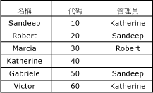

# 遞迴階層 (Master Data Services)
  在 [!INCLUDE[ssMDSshort](../includes/ssmdsshort-md.md)]中，遞迴階層是包含遞迴關聯性的衍生階層。 當實體有基於實體本身的網域屬性時，就會有遞迴關聯性。  
  
## 遞迴階層範例  
 典型的遞迴階層範例是組織結構。 在 [!INCLUDE[ssMDSshort](../includes/ssmdsshort-md.md)]中，您可以建立具有稱為經理之網域屬性的員工實體來進行。 經理屬性是從員工清單中擴展。 在這個範例組織中，所有員工都可以是經理。  
  
   
  
 您可以建立衍生階層，以反白顯示員工實體和經理網域屬性之間的關聯性。  
  
   
  
 若要讓每個成員只能包含在階層中一次，您可以錨定 Null 關聯性。 當您這樣做時，具有空白網域屬性值的成員會顯示在階層的最上層。  
  
   
  
 如果沒有錨定 Null 關聯性，則會多次包含成員。 所有成員都會顯示在最上層。 此外，也會顯示在其他成員底下當做屬性。  
  
   
  
 在這個範例中，Marcia 位於最上層。 她不是任何員工的經理，因為她不做為任何其他員工成員的網域屬性值。 相反地，Robert 底下有一個層級，因為 Robert 是做為 Marcia 的經理屬性值。  
  
## 規則  
  
-   衍生階層不能包含一個以上的遞迴關聯性。 但是可以擁有其他衍生關聯性 (例如，包含遞迴經理與員工關聯性的衍生階層也可以擁有國家 (地區) 與經理及員工與商店的關聯性)。  
  
-   不能指派成員權限 (在 [階層成員] 索引標籤上) 給遞迴階層中的成員。  
  
-   遞迴階層不能包含循環關聯性。 例如，如果 Sandeep 是 Katherine 的經理，Katherine 不能做為 Sandeep 的經理。 此外，Katherine 不能管理她自己。  
  
## 相關工作  
  
|工作描述|主題|  
|----------------------|-----------|  
|建立衍生階層。|[建立衍生階層 &#40;Master Data Services&#41;](../master-data-services/create-a-derived-hierarchy-master-data-services.md)|  
|變更現有衍生階層的名稱。|[變更衍生階層名稱 &#40;Master Data Services&#41;](../master-data-services/change-a-derived-hierarchy-name-master-data-services.md)|  
|刪除現有衍生階層。|[刪除衍生階層 &#40;Master Data Services&#41;](../master-data-services/delete-a-derived-hierarchy-master-data-services.md)|  
  
## 相關內容  
  
-   [網域屬性 &#40;Master Data Services&#41;](../master-data-services/domain-based-attributes-master-data-services.md)  
  
-   [衍生階層 &#40;Master Data Services&#41;](../master-data-services/derived-hierarchies-master-data-services.md)  
  
  

