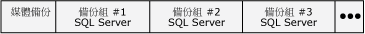
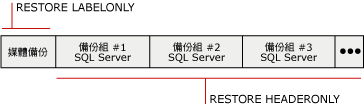

# 備份記錄與標頭資訊 (SQL Server)
[!INCLUDE[appliesto-ss-xxxx-xxxx-xxx-md](../../includes/appliesto-ss-xxxx-xxxx-xxx-md.md)]
  在伺服器執行個體上的所有 [!INCLUDE[ssNoVersion](../../includes/ssnoversion-md.md)] 備份與還原作業的完整記錄都會儲存在 **msdb** 資料庫中。 本主題介紹備份與還原記錄資料表，以及用於存取備份記錄的 [!INCLUDE[tsql](../../includes/tsql-md.md)] 陳述式。 本主題也會討論何時列出資料庫和交易記錄檔最有用，以及媒體標頭資訊與備份標頭資訊這兩者的使用時機。  
  
> [!IMPORTANT]  
>  若要管理遺失備份和還原記錄最近變更的風險，請經常備份 **msdb** 。 如需必須備份哪些系統資料庫的相關資訊，請參閱[系統資料庫的備份與還原 &#40;SQL Server&#41;](../../relational-databases/backup-restore/back-up-and-restore-of-system-databases-sql-server.md)。  
  
 **本主題內容：**  
  
-   [備份與還原記錄資料表](#BnRHistoryTables)  
  
-   [存取備份記錄的 Transact-SQL 陳述式](#TsqlStatementsForBackupHistory)  
  
-   [資料庫和交易記錄檔](#ListDbTlogFiles)  
  
-   [媒體標頭資訊](#MediaHeader)  
  
-   [備份標頭資訊](#BackupHeader)  
  
-   [媒體標頭與備份標頭資訊的比較](#CompareMediaHeaderBackupHeader)  
  
-   [備份驗證](#Verification)  
  
-   [相關工作](#RelatedTasks)  
  
##   備份與還原記錄資料表  
 此章節介紹儲存 **msdb** 系統資料庫中的備份及還原中繼資料的歷史記錄資料表。  
  
|記錄資料表|描述|  
|-------------------|-----------------|  
|[backupfile](../../relational-databases/system-tables/backupfile-transact-sql.md)|包含備份的每一個資料檔或記錄檔的資料行。|  
|[backupfilegroup](../../relational-databases/system-tables/backupfilegroup-transact-sql.md)|包含備份組中每一個檔案群組的資料列。|  
|[backupmediafamily](../../relational-databases/system-tables/backupmediafamily-transact-sql.md)|針對每個媒體家族，各包含一個資料列。 如果媒體家族位於鏡像媒體集中，則在這個媒體集中，這個家族的每個鏡像都會各有一個個別的資料列。|  
|[backupmediaset](../../relational-databases/system-tables/backupmediaset-transact-sql.md)|每個備份組各含一個資料列。|  
|[backupset](../../relational-databases/system-tables/backupset-transact-sql.md)|每個備份組各含一個資料列。|  
|[restorefile](../../relational-databases/system-tables/restorefile-transact-sql.md)|針對每個還原的檔案，各包含一個資料列。 這包括檔案群組名稱間接還原的檔案。|  
|[restorefilegroup](../../relational-databases/system-tables/restorefilegroup-transact-sql.md)|針對每個還原的檔案群組，各包含一個資料列。|  
|[restorehistory](../../relational-databases/system-tables/restorehistory-transact-sql.md)|每項還原作業都有一個資料列。|  
  
> [!NOTE]  
>  執行還原時，會修改備份記錄資料表和還原記錄資料表。  
  
##   存取備份記錄的 Transact-SQL 陳述式  
 還原資訊陳述式會與儲存在某些備份記錄資料表中的資訊對應。  
  
> [!IMPORTANT]  
>  RESTORE FILELISTONLY、RESTORE HEADERONLY、RESTORE LABELONLY 和 RESTORE VERIFYONLY Transact-SQL 陳述式需要 CREATE DATABASE 權限。 與舊版相較，這項需求更能完整地保障備份檔案及備份資訊的安全。 如需這個權限的相關資訊，請參閱 [GRANT 資料庫權限 &#40;Transact-SQL&#41;](../../t-sql/statements/grant-database-permissions-transact-sql.md)。  
  
|資訊陳述式|備份記錄資料表|描述|  
|---------------------------|--------------------------|-----------------|  
|[RESTORE FILELISTONLY](../../t-sql/statements/restore-statements-filelistonly-transact-sql.md)|[backupfile](../../relational-databases/system-tables/backupfile-transact-sql.md)|傳回結果集，其中會有資料庫清單與包含在指定備份組中的記錄。   如需詳細資訊，請參閱本主題稍後的「列出資料庫與交易記錄檔」。|  
|[RESTORE HEADERONLY](../../t-sql/statements/restore-statements-headeronly-transact-sql.md)|[backupset](../../relational-databases/system-tables/backupset-transact-sql.md)|擷取特定備份裝置上，所有備份組的所有備份前置資料。 執行 RESTORE HEADERONLY 的結果是結果集。   如需詳細資訊，請參閱本主題稍後的「檢視備份標頭資訊」。|  
|[RESTORE LABELONLY](../../t-sql/statements/restore-statements-labelonly-transact-sql.md)|[backupmediaset](../../relational-databases/system-tables/backupmediaset-transact-sql.md)|傳回結果集，其中會包含指定備份裝置上之備份媒體的相關資訊。   如需詳細資訊，請參閱本主題稍後的「檢視媒體標頭資訊」。|  
  
##   資料庫和交易記錄檔  
 在列出備份中的資料庫與交易記錄檔時所顯示的資訊包括：邏輯名稱、實體名稱、檔案類型 (資料庫或記錄)、檔案群組成員資格、檔案大小 (以位元組為單位)、允許的檔案大小上限以及預先定義的檔案成長大小 (以位元組為單位)。 在下列狀況中，這些資訊有助於在還原資料庫備份前判斷資料庫備份中的檔案名稱：  
  
-   損失了一部磁碟機，內含某資料庫的一或多個檔案。  
  
     您可以列出資料庫備份中的檔案，以判斷哪些檔案受到影響，然後在還原整個資料庫時將那些檔案還原到別的磁碟機，或者只是還原那些檔案，另外再套用備份資料庫後所建的任何交易記錄備份。  
  
-   要將資料庫從一部伺服器還原至別的伺服器，但該伺服器上沒有目錄結構與磁碟機對應。  
  
     列出備份中的檔案能讓您判斷哪些檔案受到影響。 例如，備份包含需要還原到磁碟機 E 的檔案，但是目的地伺服器並沒有磁碟機 E。當您還原這個檔案時，就必須將它重新放置到其他位置，如磁碟機 Z。  
  
##   媒體標頭資訊  
 檢視媒體標頭會顯示關於媒體本身的資訊，而非媒體上備份的資訊。 顯示的媒體標頭資訊包括：媒體名稱、描述、建立媒體標頭的軟體名稱以及寫入媒體標頭的日期。  
  
> [!NOTE]  
>  檢視媒體標頭會很快。  
  
 如需詳細資訊，請參閱本主題後面的 [媒體標頭與備份標頭資訊的比較](#CompareMediaHeaderBackupHeader)。  
  
##   備份標頭資訊  
 檢視備份標頭會顯示有關媒體上所有 [!INCLUDE[ssNoVersion](../../includes/ssnoversion-md.md)] 與非 [!INCLUDE[ssNoVersion](../../includes/ssnoversion-md.md)] 備份組的資訊。 顯示的資訊包括使用的備份裝置類型、備份類型 (例如資料庫、交易、檔案或差異資料庫)，以及備份開始與停止的日期/時間資訊。 當您必須決定要還原磁帶上的哪個備份組，或包含在媒體上的備份時，這項資訊會非常有用。  
  
> [!NOTE]  
>  對於高容量的磁帶而言，檢視備份標頭資訊可能很花時間，因為必須掃描整個媒體，才能顯示有關媒體上每個備份的資訊。  
  
 如需詳細資訊，請參閱本主題後面的 [媒體標頭與備份標頭資訊的比較](#CompareMediaHeaderBackupHeader)。  
  
### 要還原的備份組  
 您可以使用備份標頭中的資訊來識別要還原的備份組。 Database Engine 會針對備份媒體上的每個備份組編號。 這樣可讓您利用備份組在媒體上的位置，識別您要還原的備份組。 例如，下列媒體包含三個備份組。  
  
   
  
 若要還原特定的備份組，可指定所要還原的備份組位置編號。 例如，若要還原第二個備份組，請指定 2 當做要還原的備份組。  
  
##   媒體標頭與備份標頭資訊的比較  
 下圖提供的範例顯示檢視備份標頭與媒體標頭資訊之間的差異。 取得媒體標頭時，只需從磁帶的開頭擷取資訊。 取得備份標頭時，則必須掃描整捲磁帶來查看每個備份組的標頭。  
  
   
  
> [!NOTE]  
>  使用具有多個媒體家族的媒體集時，會將媒體標頭與備份組寫入所有媒體家族。 因此，只需要針對這些報表作業提供單一媒體家族。  
  
 如需有關如何檢視媒體標頭的詳細資訊，請參閱本主題前面的「檢視媒體標頭資訊」。  
  
 如需有關如何檢視備份裝置上所有備份組之備份標頭資訊的詳細資訊，請參閱本主題前面的＜檢視備份標頭資訊＞。  
  
##   備份驗證  
 驗證備份不是必要的步驟，但仍是很有用的作法。 驗證備份會檢查備份實際上是否完整無缺，以確定備份中的所有檔案都可以讀取也可以還原，並確定在您需要時可以還原備份。 您必須了解，驗證備份並不會驗證備份上的資料結構。 不過，如果是使用 WITH CHECKSUMS 所建立的備份，則使用 WITH CHECKSUMS 來驗證備份可提供適當的指示，指出備份中資料的可靠性。  
  
##   相關工作  
 **從備份與還原記錄資料表中刪除舊的資料列**  
  
-   [sp_delete_backuphistory &#40;Transact-SQL&#41;](../../relational-databases/system-stored-procedures/sp-delete-backuphistory-transact-sql.md)  
  
 **從備份與還原記錄資料表中刪除特定資料庫的所有資料列**  
  
-   [sp_delete_database_backuphistory &#40;Transact-SQL&#41;](../../relational-databases/system-stored-procedures/sp-delete-database-backuphistory-transact-sql.md)  
  
 **檢視備份組中的資料與記錄檔**  
  
-   [RESTORE FILELISTONLY &#40;Transact-SQL&#41;](../../t-sql/statements/restore-statements-filelistonly-transact-sql.md)  
  
-   <xref:Microsoft.SqlServer.Management.Smo.Restore.ReadFileList%2A> (SMO)  
  
 **檢視媒體標頭資訊**  
  
-   [RESTORE LABELONLY &#40;Transact-SQL&#41;](../../t-sql/statements/restore-statements-labelonly-transact-sql.md)  
  
-   [檢視邏輯備份裝置的屬性和內容 &#40;SQL Server&#41;](../../relational-databases/backup-restore/view-the-properties-and-contents-of-a-logical-backup-device-sql-server.md)  
  
-   [檢視備份磁帶或檔案的內容 &#40;SQL Server&#41;](../../relational-databases/backup-restore/view-the-contents-of-a-backup-tape-or-file-sql-server.md)  
  
-   <xref:Microsoft.SqlServer.Management.Smo.Restore.ReadMediaHeader%2A> (SMO)  
  
 **檢視備份標頭資訊**  
  
-   [RESTORE HEADERONLY &#40;Transact-SQL&#41;](../../t-sql/statements/restore-statements-headeronly-transact-sql.md)  
  
-   [檢視備份磁帶或檔案的內容 &#40;SQL Server&#41;](../../relational-databases/backup-restore/view-the-contents-of-a-backup-tape-or-file-sql-server.md)  
  
-   [檢視邏輯備份裝置的屬性和內容 &#40;SQL Server&#41;](../../relational-databases/backup-restore/view-the-properties-and-contents-of-a-logical-backup-device-sql-server.md)  
  
-   <xref:Microsoft.SqlServer.Management.Smo.Restore.ReadBackupHeader%2A> (SMO)  
  
 **從備份與還原記錄資料表中刪除舊的資料列**  
  
-   [sp_delete_backuphistory &#40;Transact-SQL&#41;](../../relational-databases/system-stored-procedures/sp-delete-backuphistory-transact-sql.md)  
  
 **從備份與還原記錄資料表中刪除特定資料庫的所有資料列**  
  
-   [sp_delete_database_backuphistory &#40;Transact-SQL&#41;](../../relational-databases/system-stored-procedures/sp-delete-database-backuphistory-transact-sql.md)  
  
 **檢視媒體標頭資訊**  
  
-   [RESTORE LABELONLY &#40;Transact-SQL&#41;](../../t-sql/statements/restore-statements-labelonly-transact-sql.md)  
  
-   [檢視邏輯備份裝置的屬性和內容 &#40;SQL Server&#41;](../../relational-databases/backup-restore/view-the-properties-and-contents-of-a-logical-backup-device-sql-server.md)  
  
-   [檢視備份磁帶或檔案的內容 &#40;SQL Server&#41;](../../relational-databases/backup-restore/view-the-contents-of-a-backup-tape-or-file-sql-server.md)  
  
-   <xref:Microsoft.SqlServer.Management.Smo.Restore.ReadMediaHeader%2A> (SMO)  
  
 **檢視備份標頭資訊**  
  
-   [RESTORE HEADERONLY &#40;Transact-SQL&#41;](../../t-sql/statements/restore-statements-headeronly-transact-sql.md)  
  
-   [檢視備份磁帶或檔案的內容 &#40;SQL Server&#41;](../../relational-databases/backup-restore/view-the-contents-of-a-backup-tape-or-file-sql-server.md)  
  
-   [檢視邏輯備份裝置的屬性和內容 &#40;SQL Server&#41;](../../relational-databases/backup-restore/view-the-properties-and-contents-of-a-logical-backup-device-sql-server.md)  
  
-   <xref:Microsoft.SqlServer.Management.Smo.Restore.ReadBackupHeader%2A> (SMO)  
  
 **若要檢視備份組中的檔案**  
  
-   [檢視備份組中的資料和記錄檔 &#40;SQL Server&#41;](../../relational-databases/backup-restore/view-the-data-and-log-files-in-a-backup-set-sql-server.md)  
  
-   [RESTORE HEADERONLY &#40;Transact-SQL&#41;](../../t-sql/statements/restore-statements-headeronly-transact-sql.md)  
  
 **驗證備份**  
  
-   [RESTORE VERIFYONLY &#40;Transact-SQL&#41;](../../t-sql/statements/restore-statements-verifyonly-transact-sql.md)  
  
-   <xref:Microsoft.SqlServer.Management.Smo.Restore.SqlVerify%2A> (SMO)  
  
## 另請參閱  
 [BACKUP &#40;Transact-SQL&#41;](../../t-sql/statements/backup-transact-sql.md)   
 [媒體集、媒體家族與備份組 &#40;SQL Server&#41;](../../relational-databases/backup-restore/media-sets-media-families-and-backup-sets-sql-server.md)   
 [備份裝置 &#40;SQL Server&#41;](../../relational-databases/backup-restore/backup-devices-sql-server.md)   
 [鏡像備份媒體集 &#40;SQL Server&#41;](../../relational-databases/backup-restore/mirrored-backup-media-sets-sql-server.md)   
 [備份和還原期間可能發生的媒體錯誤 &#40;SQL Server&#41;](../../relational-databases/backup-restore/possible-media-errors-during-backup-and-restore-sql-server.md)  
  
  
