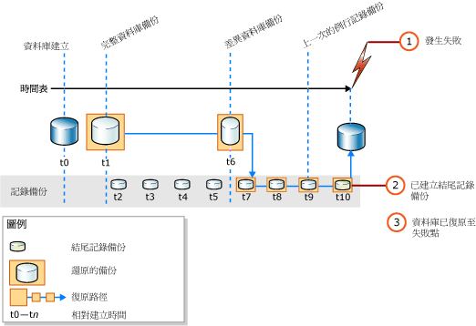

# <a name="complete-database-restores-full-recovery-model"></a>完整的資料庫還原 (完整復原模式)
[!INCLUDE[appliesto-ss-xxxx-xxxx-xxx-md](../../includes/appliesto-ss-xxxx-xxxx-xxx-md.md)]

  在完整資料庫還原中，目標是還原整個資料庫。 在還原期間，整個資料庫為離線狀態。 在讓資料庫的任何部分上線之前，所有的資料都必須復原到一致的位置；此時資料庫的所有部分都會回到相同的時間點，而且沒有未認可的交易存在。  
  
 在完整復原模式下，還原一個或多個資料備份之後，您必須先還原所有後續的交易記錄備份，然後再復原資料庫。 您可以將資料庫還原到其中一個記錄備份內的特定 *「復原點」* (Recovery point)。 復原點可以是特定日期和時間、標示的交易或記錄序號 (LSN)。  
  
 還原資料庫時 (特別是在完整復原模式或大量記錄復原模式下)，應該使用單一還原順序。 *「還原順序」* (Restore sequence) 包含一個或多個還原作業，會在一個或多個還原階段中移動資料。  
  
> [!IMPORTANT]  
>  建議您不要附加或還原來源不明或來源不受信任的資料庫。 這些資料庫可能包含惡意程式碼，因此可能執行非預期的 [!INCLUDE[tsql](../../includes/tsql-md.md)] 程式碼，或是修改結構描述或實體資料庫結構而造成錯誤。 使用來源不明或來源不受信任的資料庫之前，請先在非實際執行伺服器的資料庫上執行 [DBCC CHECKDB](../../t-sql/database-console-commands/dbcc-checkdb-transact-sql.md) ，同時檢查資料庫中的程式碼，例如預存程序或其他使用者定義程式碼。  
  
 **本主題內容：**  
  
-   [將資料庫還原到失敗點](#PointOfFailure)  
  
-   [將資料庫還原到記錄備份內的時間點](#PointWithinBackup)  
  
-   [相關工作](#RelatedTasks)  
  
> [!NOTE]  
>  如需舊版 [!INCLUDE[ssNoVersion](../../includes/ssnoversion-md.md)]之備份支援的資訊，請參閱 [RESTORE &#40;Transact-SQL&#41;](../../t-sql/statements/restore-statements-transact-sql.md)的＜相容性支援＞一節。  
  
##  <a name="PointOfFailure"></a> 將資料庫還原到失敗點  
 一般而言，將資料庫復原至失敗點的作業，包含下列基本步驟：  
  
1.  備份使用中的交易記錄檔 (即所謂的記錄檔結尾)。 這會建立結尾記錄備份。 如果沒有使用中的交易記錄，就會遺失該部分記錄中的所有交易。  
  
    > [!IMPORTANT]  
    >  在大量記錄復原模式下，備份包含大量記錄作業的記錄時，需要存取資料庫中的所有資料檔案。 如果無法存取資料檔案，就無法備份交易記錄。 在這種情況下，您必須手動重做最近一次備份記錄之後進行的所有變更。  
  
     如需詳細資訊，請參閱[結尾記錄備份 &#40;SQL Server&#41;](../../relational-databases/backup-restore/tail-log-backups-sql-server.md)。  
  
2.  還原最新的完整資料庫備份，但不復原資料庫 (RESTORE DATABASE *database_name* FROM *backup_device* WITH NORECOVERY)。  
  
3.  如果有差異備份存在，請還原最新的備份，但是不要復原資料庫 (RESTORE DATABASE *database_name* FROM *differential_backup_device* WITH NORECOVERY)。  
  
     還原最近一次的差異備份，可減少必須還原的記錄備份數目。  
  
4.  從剛才還原的備份之後所建立的第一個交易記錄備份開始，依順序以 NORECOVERY 還原記錄。  
  
5.  復原資料庫 (RESTORE DATABASE *database_name* WITH RECOVERY)。 或者，這個步驟也可以合併在還原最後的記錄備份。  
  
 下圖顯示此還原順序。 在失敗發生之後 (1)，會建立結尾記錄備份 (2)。 接下來，資料庫會還原至失敗點。 這個程序牽涉到還原資料庫備份、後續的差異備份，以及在差異備份之後所進行的每一個記錄備份，包括結尾記錄備份在內。  
  
   
  
> [!NOTE]  
>  當您將資料庫備份還原至不同的伺服器執行個體時，請參閱 [使用備份與還原複製資料庫](../../relational-databases/databases/copy-databases-with-backup-and-restore.md)。  
  
###  <a name="TsqlSyntax"></a> 基本 Transact-SQL RESTORE 語法  
 上圖中還原順序的基本 [RESTORE](../../t-sql/statements/restore-statements-transact-sql.md)[!INCLUDE[tsql](../../includes/tsql-md.md)] 語法如下：  
  
1.  RESTORE DATABASE *&lt;database&gt;* FROM *full database backup* WITH NORECOVERY;  
  
2.  RESTORE DATABASE *database* FROM *full_differential_backup* WITH NORECOVERY;  
  
3.  RESTORE LOG *database* FROM *log_backup* WITH NORECOVERY;  
  
     針對其他每個記錄備份重複此還原記錄步驟。  
  
4.  RESTORE DATABASE *&lt;database&gt;* WITH RECOVERY;  
  
###  <a name="ExampleToPoFTsql"></a> 範例：復原到失敗點 (Transact-SQL)  
 下列 [!INCLUDE[tsql](../../includes/tsql-md.md)] 範例顯示將資料庫還原到失敗點之還原順序中的基本選項。 此範例會建立資料庫的結尾記錄備份。 接下來，此範例會還原完整的資料庫備份和記錄備份，然後還原結尾記錄備份。 此範例會在一個不同的最後步驟中復原資料庫。  
  
> [!NOTE]  
>  此範例使用 [完整資料庫備份 &#40;SQL Server&#41;](../../relational-databases/backup-restore/full-database-backups-sql-server.md)的＜相容性支援＞一節。 在資料庫備份之前， [!INCLUDE[ssSampleDBobject](../../includes/sssampledbobject-md.md)] 範例資料庫會設定為使用完整復原模式。  
  
```  
USE master;  
--Create tail-log backup.  
BACKUP LOG AdventureWorks2012   
TO DISK = 'Z:\SQLServerBackups\AdventureWorksFullRM.bak'    
   WITH NORECOVERY;   
GO  
--Restore the full database backup (from backup set 1).  
RESTORE DATABASE AdventureWorks2012   
  FROM DISK = 'Z:\SQLServerBackups\AdventureWorksFullRM.bak'   
  WITH FILE=1,   
    NORECOVERY;  
  
--Restore the regular log backup (from backup set 2).  
RESTORE LOG AdventureWorks2012   
  FROM DISK = 'Z:\SQLServerBackups\AdventureWorksFullRM.bak'   
  WITH FILE=2,   
    NORECOVERY;  
  
--Restore the tail-log backup (from backup set 3).  
RESTORE LOG AdventureWorks2012   
  FROM DISK = 'Z:\SQLServerBackups\AdventureWorksFullRM.bak'  
  WITH FILE=3,   
    NORECOVERY;  
GO  
--recover the database:  
RESTORE DATABASE AdventureWorks2012 WITH RECOVERY;  
GO  
```  
  
##  <a name="PointWithinBackup"></a> 將資料庫還原到記錄備份內的時間點  
 在完整復原模式下，完整資料庫還原通常可以復原到某個時間點、標示的交易或記錄備份內的 LSN。 然而，在大量記錄復原模式下，如果記錄備份包含大量記錄的變更，則無法進行時間點復原。  
  
### <a name="sample-point-in-time-restore-scenarios"></a>範例時間點還原案例  
 下列範例假設有一個關鍵任務的資料庫系統，每天午夜時會建立一次完整資料庫備份，從星期一到星期六每小時整點時會建立一次差異資料庫備份，而全天每隔 10 分鐘會建立一次交易記錄備份。 若要將資料庫還原至星期三 5:19 A.M. 時的狀態， 請執行下列工作：  
  
1.  還原星期二午夜建立的完整資料庫備份。  
  
2.  還原星期三上午 5:00 建立的差異資料庫備份 。  
  
3.  套用星期三上午 5:10 建立的交易記錄備份， 。  
  
4.  套用星期三上午 5:20 建立的交易記錄備份， 並指定復原程序僅適用於上午 5:19 之前發生的交易。  
  
 或者，如果需要將資料庫還原至星期四 3:04 A.M. 時的狀態， 但是無法使用星期四 3:00 A.M. 時建立的差異資料庫備份， 則執行下列操作：  
  
1.  還原星期三午夜建立的資料庫備份。  
  
2.  還原星期四上午 2:00 建立的差異資料庫備份 建立的交易記錄備份。  
  
3.  套用星期四上午 2:10 到 變成上午 3:00。 建立的交易記錄備份。  
  
4.  套用星期四上午 3:10 建立的交易記錄備份， 並在上午 3:04 停止復原程序。  
  
> [!NOTE]  
>  如需特定時間點還原的範例，請參閱 [將 SQL Server 資料庫還原至某個時間點 &#40;完整復原模式&#41;](../../relational-databases/backup-restore/restore-a-sql-server-database-to-a-point-in-time-full-recovery-model.md)的＜相容性支援＞一節。  
  
##  <a name="RelatedTasks"></a> 相關工作  
 **還原完整資料庫備份**  
  
-   [Restore a Database Backup Using SSMS](../../relational-databases/backup-restore/restore-a-database-backup-using-ssms.md)  
  
-   [將資料庫還原到新位置 &#40;SQL Server&#41;](../../relational-databases/backup-restore/restore-a-database-to-a-new-location-sql-server.md)  
  
 **還原差異資料庫備份**  
  
-   [還原差異資料庫備份 &#40;SQL Server&#41;](../../relational-databases/backup-restore/restore-a-differential-database-backup-sql-server.md)  
  
 **還原交易記錄備份**  
  
-   [還原交易記錄備份 &#40;SQL Server&#41;](../../relational-databases/backup-restore/restore-a-transaction-log-backup-sql-server.md)  
  
 **使用 SQL Server 管理物件 (SMO) 還原備份**  
  
-   <xref:Microsoft.SqlServer.Management.Smo.Restore.SqlRestore%2A>  
  
 **將資料庫還原到記錄備份內的時間點**  
  
-   [將 SQL Server 資料庫還原至某個時間點 &#40;完整復原模式&#41;](../../relational-databases/backup-restore/restore-a-sql-server-database-to-a-point-in-time-full-recovery-model.md)  
  
-   [復原包含標示之交易的相關資料庫](../../relational-databases/backup-restore/recovery-of-related-databases-that-contain-marked-transaction.md)  
  
-   [復原到記錄序號 &#40;SQL Server&#41;](../../relational-databases/backup-restore/recover-to-a-log-sequence-number-sql-server.md)  
  
## <a name="see-also"></a>另請參閱  
 [RESTORE &#40;Transact-SQL&#41;](../../t-sql/statements/restore-statements-transact-sql.md)   
 [BACKUP &#40;Transact-SQL&#41;](../../t-sql/statements/backup-transact-sql.md)   
 [套用交易記錄備份 &#40;SQL Server&#41;](../../relational-databases/backup-restore/apply-transaction-log-backups-sql-server.md)   
 [sp_addumpdevice &#40;Transact-SQL&#41;](../../relational-databases/system-stored-procedures/sp-addumpdevice-transact-sql.md)   
 [完整資料庫備份 &#40;SQL Server&#41;](../../relational-databases/backup-restore/full-database-backups-sql-server.md)   
 [差異備份 &#40;SQL Server&#41;](../../relational-databases/backup-restore/differential-backups-sql-server.md)   
 [備份概觀 &#40;SQL Server&#41;](../../relational-databases/backup-restore/backup-overview-sql-server.md)   
 [還原和復原概觀 &#40;SQL Server&#41;](../../relational-databases/backup-restore/restore-and-recovery-overview-sql-server.md)  
  
  
