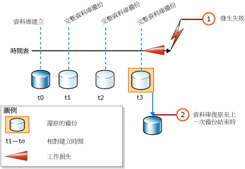
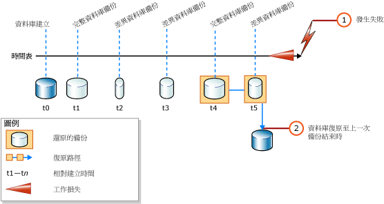

# <a name="complete-database-restores-simple-recovery-model"></a>完整資料庫還原 (簡單復原模式)
[!INCLUDE[tsql-appliesto-ss2016-xxxx-xxxx-xxx_md](../../includes/tsql-appliesto-ss2016-xxxx-xxxx-xxx-md.md)]

  在完整資料庫還原中，目標是還原整個資料庫。 在還原期間，整個資料庫為離線狀態。 在讓資料庫的任何部分上線之前，所有的資料都必須復原到一致的位置；此時資料庫的所有部分都會回到相同的時間點，而且沒有未認可的交易存在。  
  
 在簡單復原模式下，無法將資料庫還原到特定備份中的特定時間點。  
  
> [!IMPORTANT]  
>  建議您不要附加或還原來源不明或來源不受信任的資料庫。 這些資料庫可能包含惡意程式碼，因此可能執行非預期的 [!INCLUDE[tsql](../../includes/tsql-md.md)] 程式碼，或是修改結構描述或實體資料庫結構而造成錯誤。 使用來源不明或來源不受信任的資料庫之前，請先在非實際執行伺服器的資料庫上執行 [DBCC CHECKDB](../../t-sql/database-console-commands/dbcc-checkdb-transact-sql.md) ，同時檢查資料庫中的程式碼，例如預存程序或其他使用者定義程式碼。  
  
 **本主題內容：**  
  
-   [簡單復原模式下的資料庫備份概觀](#Overview)  
  
-   [相關工作](#RelatedTasks)  
  
> [!NOTE]  
>  如需舊版 [!INCLUDE[ssNoVersion](../../includes/ssnoversion-md.md)]之備份支援的相關資訊，請參閱 [RESTORE &#40;Transact-SQL&#41;](../../t-sql/statements/restore-statements-transact-sql.md)的＜相容性支援＞一節。  
  
##  <a name="Overview"></a> 簡單復原模式下的資料庫備份概觀  
 在簡單復原模式下進行完整資料庫還原只需要一個或兩個 [RESTORE](../../t-sql/statements/restore-statements-transact-sql.md) 陳述式，視是否想要還原差異資料庫備份而定。 如果您只使用完整資料庫備份，則只需要還原最近的備份，如下圖所示。  
  
   
  
 如果也要使用差異資料庫備份，請還原最近一次完整資料庫備份，但不要復原資料庫，然後才還原最近一次差異資料庫備份，並復原資料庫。 下圖顯示這項程序。  
  
   
  
> [!NOTE]  
>  若您想將資料庫備份還原至不同的伺服器執行個體，請參閱 [使用備份與還原複製資料庫](../../relational-databases/databases/copy-databases-with-backup-and-restore.md)。  
  
###  <a name="TsqlSyntax"></a> 基本 Transact-SQL RESTORE 語法  
 用於還原完整資料庫備份的基本 [!INCLUDE[tsql](../../includes/tsql-md.md)][RESTORE](../../t-sql/statements/restore-statements-transact-sql.md) 語法為：  
  
 RESTORE DATABASE *database_name* FROM *backup_device* [ WITH NORECOVERY ]  
  
> [!NOTE]  
>  若您也想還原差異資料庫備份，請使用 WITH NORECOVERY。  
  
 用於還原資料庫備份的基本 [RESTORE](../../t-sql/statements/restore-statements-transact-sql.md) 語法為：  
  
 RESTORE DATABASE *database_name* FROM *backup_device* WITH RECOVERY  
  
###  <a name="Example"></a> 範例 (Transact-SQL)  
 下列範例首先顯示如何使用 [BACKUP](../../t-sql/statements/backup-transact-sql.md) 陳述式來建立 [!INCLUDE[ssSampleDBobject](../../includes/sssampledbobject-md.md)] 資料庫的完整資料庫備份及差異資料庫備份。 此範例接著依序還原這些備份。 資料庫會還原到差異資料庫備份完成時的狀態。  
  
 這個範例顯示在完整資料庫還原實例中，還原順序的一些關鍵選項。 *「還原順序」* (Restore sequence) 包含一個或多個還原作業，會在一個或多個還原階段中移動資料。 會省略與這個檔案還原無關的語法和詳細資料。 為了清楚起見，建議您在復原資料庫時明確指定 RECOVERY 選項，即使它是預設的。  
  
> [!NOTE]  
>  此範例會從設定復原模式為 [的](../../t-sql/statements/alter-database-transact-sql.md) ALTER DATABASE `SIMPLE`陳述式開始進行。  
  
```  
USE master;  
--Make sure the database is using the simple recovery model.  
ALTER DATABASE AdventureWorks2012 SET RECOVERY SIMPLE;  
GO  
-- Back up the full AdventureWorks2012 database.  
BACKUP DATABASE AdventureWorks2012   
TO DISK = 'Z:\SQLServerBackups\AdventureWorks2012.bak'   
  WITH FORMAT;  
GO  
--Create a differential database backup.  
BACKUP DATABASE AdventureWorks2012   
TO DISK = 'Z:\SQLServerBackups\AdventureWorks2012.bak'  
   WITH DIFFERENTIAL;  
GO  
--Restore the full database backup (from backup set 1).  
RESTORE DATABASE AdventureWorks2012   
FROM DISK = 'Z:\SQLServerBackups\AdventureWorks2012.bak'   
   WITH FILE=1, NORECOVERY;  
--Restore the differential backup (from backup set 2).  
RESTORE DATABASE AdventureWorks2012   
FROM DISK = 'Z:\SQLServerBackups\AdventureWorks2012.bak'   
   WITH FILE=2, RECOVERY;  
GO  
```  
  
##  <a name="RelatedTasks"></a> 相關工作  
 **還原完整資料庫備份**  
  
-   [在簡單復原模式下還原資料庫備份 &#40;Transact-SQL&#41;](../../relational-databases/backup-restore/restore-a-database-backup-under-the-simple-recovery-model-transact-sql.md)  
  
-   [Restore a Database Backup Using SSMS](../../relational-databases/backup-restore/restore-a-database-backup-using-ssms.md)  
  
-   [將資料庫還原到新位置 &#40;SQL Server&#41;](../../relational-databases/backup-restore/restore-a-database-to-a-new-location-sql-server.md)  
  
 **還原差異資料庫備份**  
  
-   [還原差異資料庫備份 &#40;SQL Server&#41;](../../relational-databases/backup-restore/restore-a-differential-database-backup-sql-server.md)  
  
 **使用 SQL Server 管理物件 (SMO) 還原備份**  
  
-   <xref:Microsoft.SqlServer.Management.Smo.Restore.SqlRestore%2A>  
  
## <a name="see-also"></a>另請參閱  
 [RESTORE &#40;Transact-SQL&#41;](../../t-sql/statements/restore-statements-transact-sql.md)   
 [BACKUP &#40;Transact-SQL&#41;](../../t-sql/statements/backup-transact-sql.md)   
 [sp_addumpdevice &#40;Transact-SQL&#41;](../../relational-databases/system-stored-procedures/sp-addumpdevice-transact-sql.md)   
 [完整資料庫備份 &#40;SQL Server&#41;](../../relational-databases/backup-restore/full-database-backups-sql-server.md)   
 [差異備份 &#40;SQL Server&#41;](../../relational-databases/backup-restore/differential-backups-sql-server.md)   
 [備份概觀 &#40;SQL Server&#41;](../../relational-databases/backup-restore/backup-overview-sql-server.md)   
 [還原和復原概觀 &#40;SQL Server&#41;](../../relational-databases/backup-restore/restore-and-recovery-overview-sql-server.md)  
  
  
