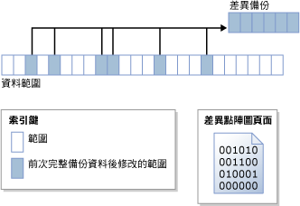

# 差異備份 (SQL Server)
  此備份和還原主題與所有的 [!INCLUDE[ssNoVersion](../../includes/ssnoversion-md.md)] 資料庫相關。  
  
 差異備份是以之前最近一次的完整資料備份為基礎。 差異備份只擷取自那次完整備份以後變更過的資料。 差異備份據以為基礎的完整備份就稱為差異的 *「基底」* (Base)。 完整備份 (不包括僅限複製備份) 可做為一系列差異備份的基底，包括資料庫備份、部分備份及檔案備份。 檔案差異備份的基底備份可以包含在完整備份、檔案備份或部分備份之中。  
  
  
##   優點  
  
-   相較於建立完整備份，建立差異備份可以非常快速。 差異備份只會記錄自差異備份據以為基礎的完整備份以後變更過的資料。 這有利於經常備份資料，以降低資料遺失的風險。 但是，在還原差異備份之前，必須先還原其基底。 因此，從差異備份中還原較之從完整備份中還原，由於需要兩個備份檔案，因此勢必要採取更多的步驟和時間。  
  
-   如果資料庫某個子集的修改比資料庫的其餘部分更加頻繁，差異資料庫備份就特別有用。 在這些情形下，差異資料庫備份可以讓您經常備份，而避免完整資料庫備份的負擔。  
  
-   在完整復原模式下，使用差異備份可減少您必須還原的記錄備份數目。  
  
##   差異備份概觀  
 差異備份擷取從建立差異基底到建立差異備份已變更之任何 *「範圍」* (Extent) (八個實體連續頁面的集合) 的狀態。 這表示給定差異備份的大小取決於基底之後變更過的資料量。 一般而言，基底愈舊，新的差異備份就會愈大。 在一系列的差異備份中，經常更新的範圍很可能包含每個差異備份中的不同資料。  
  
 下圖說明差異備份的運作方式。 圖中顯示 24 個資料範圍，其中 6 個已經變更。 差異備份只包含這 6 個資料範圍。 差異備份作業必須藉助點陣圖頁面 (此頁面包含每個範圍的一個位元)。 對於基底之後已更新的每個範圍，點陣圖中的位元將設為 1。  
  
   
  
> [!NOTE]  
>  僅限複製備份不會更新差異點陣圖。 因此，只複製備份不影響後續的差異備份。  
  
 在基底之後不久建立的差異備份，其大小通常比差異基底小得多， 因此可以節省儲存空間和備份時間。 不過，資料庫隨著時間不斷變更後，資料庫和特定差異基底之間的差異也會跟著增加。 差異備份及其基底之間相隔的時間愈長，差異備份的規模可能愈大。 這表示差異備份的大小到最後會與差異基底的大小十分接近。 大型的差異備份將喪失備份速度較快與規模較小的優勢。  
  
 隨著差異備份大小增加，還原差異備份會大幅增加還原資料庫所需的時間。 因此，建議您定期進行新的完整備份，為資料建立新的差異基底。 例如，您可能每週進行整個資料庫的完整備份 (亦即，完整資料庫備份)，然後在該週定期進行一連串的差異資料庫備份。  
  
 還原時，您必須在還原差異備份之前先還原其基底。 接著，只還原最新的差異備份，以便將資料庫向前復原到建立該差異備份的時間點。 通常，您會在還原最新的完整備份之後，接著還原以該完整備份為基礎的最新差異備份。  
  
## 使用記憶體最佳化資料表的資料庫差異備份  
 如需差異備份和具有記憶體最佳化資料表之資料庫的資訊，請參閱 [備份含有記憶體最佳化資料表的資料庫](../../relational-databases/in-memory-oltp/backing-up-a-database-with-memory-optimized-tables.md)。  
  
##   唯讀資料庫的差異備份  
 若為唯讀資料庫，單獨使用的完整備份會比搭配差異備份一起使用更容易管理。 當資料庫是唯讀時，備份和其他作業無法改變檔案所包含的中繼資料。 因此，差異備份所需的中繼資料，例如差異備份開始的記錄序號 (差異基底 LSN)，會儲存在 **master** 資料庫中。 如果差異基底是在資料庫為唯讀時建立，則差異點陣圖顯示的變更會比基底備份之後實際發生的變更還要多。 備份會讀取這些額外資料，但是不會將它寫入備份，因為 **backupset** 系統資料表中儲存的 [differential_base_lsn](../../relational-databases/system-tables/backupset-transact-sql.md) 是用來判斷在基底之後是否實際變更過資料。  
  
 重建，還原或卸離後再重新附加唯讀資料庫時，會遺失差異基底資訊。 發生這種情形的原因是， **master** 資料庫與使用者資料庫並未同步。 [!INCLUDE[ssDEnoversion](../../includes/ssdenoversion-md.md)] 無法偵測或防止此問題。 以後的任何差異備份將不會以最近的完整備份為基底，因此可能會產生出人意料的結果。 若要建立新的差異基底，我們建議您建立完整資料庫備份。  
  
### 對唯讀資料庫使用差異備份的最佳作法  
 在建立唯讀資料庫的完整資料庫備份之後，如果您打算建立後續的差異備份，請備份 **master** 資料庫。  
  
 如果 **master** 資料庫遺失，在還原使用者資料庫的任何差異備份之前，請先將此資料庫還原。  
  
 如果您先卸離再附加您打算於稍後使用差異備份的唯讀資料庫，請盡可能進行唯讀資料庫和 **master** 資料庫的完整資料庫備份。  
  
##   相關工作  
  
-   [建立差異資料庫備份 &#40;SQL Server&#41;](../../relational-databases/backup-restore/create-a-differential-database-backup-sql-server.md)  
  
-   [還原差異資料庫備份 &#40;SQL Server&#41;](../../relational-databases/backup-restore/restore-a-differential-database-backup-sql-server.md)  
  
  
## 另請參閱  
 [備份概觀 &#40;SQL Server&#41;](../../relational-databases/backup-restore/backup-overview-sql-server.md)   
 [完整資料庫備份 &#40;SQL Server&#41;](../../relational-databases/backup-restore/full-database-backups-sql-server.md)   
 [完整資料庫還原 &#40;完整復原模式&#41;](../../relational-databases/backup-restore/complete-database-restores-full-recovery-model.md)   
 [完整資料庫還原 &#40;簡單復原模式&#41;](../../relational-databases/backup-restore/complete-database-restores-simple-recovery-model.md)   
 [交易記錄備份 &#40;SQL Server&#41;](../../relational-databases/backup-restore/transaction-log-backups-sql-server.md)  
  
  
