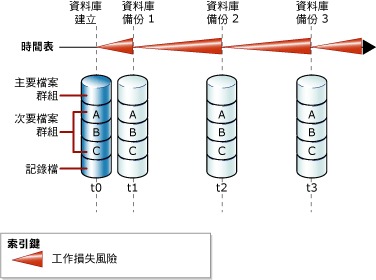
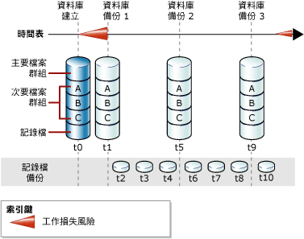

# <a name="full-database-backups-sql-server"></a>完整資料庫備份 (SQL Server)
[!INCLUDE[appliesto-ss-xxxx-xxxx-xxx-md](../../includes/appliesto-ss-xxxx-xxxx-xxx-md.md)]
  完整資料庫備份會備份整個資料庫。 這包括交易記錄的部分，讓完整資料庫得以在還原完整資料庫備份之後復原。 完整資料庫備份代表備份完成時的資料庫。  
  
> [!TIP]  
>  資料庫的大小增加時，完整資料庫備份就需要更多的時間才能完成，同時也需要更多的儲存空間。 因此，若為大型資料庫，您可能會想透過一系列的 *「差異資料庫備份」* (Differential database backups) 補充完整資料庫備份。 如需詳細資訊，請參閱 [差異備份 &#40;SQL Server&#41;](../../relational-databases/backup-restore/differential-backups-sql-server.md)。  
  
> [!IMPORTANT]  
>  資料庫備份上的 TRUSTWORTHY 是設為 OFF。 如需如何將 TRUSTWORTHY 設成 ON 的資訊，請參閱 [ALTER DATABASE SET 選項 &#40;Transact-SQL&#41;](../../t-sql/statements/alter-database-transact-sql-set-options.md)。  
  
 **本主題內容：**  
  
-   [簡單復原模式下的資料庫備份](#DbBuRMs)  
  
-   [完整復原模式下的資料庫備份](#DbBuRMf)  
  
-   [使用完整資料庫備份來還原資料庫](#RestoreDbBu)  
  
-   [相關工作](#RelatedTasks)  
  
##  <a name="database-backups-under-the-simple-recovery-model"></a><a name="DbBuRMs"></a> 簡單復原模式下的資料庫備份  
 在簡單復原模式下，每次備份之後，如果會發生損毀，資料庫都將承受可能遺失工作的風險。 工作遺失風險隨著每一次更新而增加，直到下次備份為止；此時工作遺失風險便會歸零，但是又會重新開始另一循環的工作遺失風險。 一段時間之後，備份之間的工作遺失風險會增加。 下圖顯示只使用完整資料庫備份之備份策略的工作遺失風險。  
  
   
  
### <a name="example--tsql"></a>範例 ([!INCLUDE[tsql](../../includes/tsql-md.md)])  
 下列範例顯示如何使用 WITH FORMAT 來覆寫任何現有備份並建立新的媒體集，以建立完整資料庫備份。  
  
```  
-- Back up the AdventureWorks2012 database to new media set.  
BACKUP DATABASE AdventureWorks2012  
    TO DISK = 'Z:\SQLServerBackups\AdventureWorksSimpleRM.bak'   
    WITH FORMAT;  
GO  
```  
  
##  <a name="database-backups-under-the-full-recovery-model"></a><a name="DbBuRMf"></a> 完整復原模式下的資料庫備份  
 若為使用完整和大量記錄復原的資料庫，資料庫備份是必要的，但還是不足夠。 交易記錄備份也是必要的。 下圖顯示完整復原模式下可行的最不複雜的備份策略。  
  
   
  
 如需如何建立記錄備份的相關資訊，請參閱[交易記錄備份 &#40;SQL Server&#41;](../../relational-databases/backup-restore/transaction-log-backups-sql-server.md)。  
  
### <a name="example--tsql"></a>範例 ([!INCLUDE[tsql](../../includes/tsql-md.md)])  
 下列範例顯示如何使用 WITH FORMAT 來覆寫任何現有備份並建立新的媒體集，以建立完整資料庫備份。 然後，此範例會接著備份交易記錄。 在實際的情況下，您必須執行一連串的定期記錄備份。 就此範例而言， [!INCLUDE[ssSampleDBobject](../../includes/sssampledbobject-md.md)] 範例資料庫會設定為使用完整復原模式。  
  
```  
USE master;  
ALTER DATABASE AdventureWorks2012 SET RECOVERY FULL;  
GO  
-- Back up the AdventureWorks2012 database to new media set (backup set 1).  
BACKUP DATABASE AdventureWorks2012  
  TO DISK = 'Z:\SQLServerBackups\AdventureWorks2012FullRM.bak'   
  WITH FORMAT;  
GO  
--Create a routine log backup (backup set 2).  
BACKUP LOG AdventureWorks2012 TO DISK = 'Z:\SQLServerBackups\AdventureWorks2012FullRM.bak';  
GO  
```  
  
##  <a name="use-a-full-database-backup-to-restore-the-database"></a><a name="RestoreDbBu"></a> 使用完整資料庫備份來還原資料庫  
 您可以將資料庫從完整資料庫備份還原到任何位置，在一個步驟中重新建立整個資料庫。 在備份中包含足夠的交易記錄，以讓您將資料庫復原至在備份完成時的時間點。 還原的資料庫會符合資料庫備份完成時的原本狀態，再扣除掉任何未認可的交易。 在完整復原模式之下，應該接著還原所有後續的交易記錄備份。 在資料庫復原之後，會回復未認可的交易。  
  
 如需詳細資訊，請參閱[完整資料庫還原 &#40;簡單復原模式&#41;](../../relational-databases/backup-restore/complete-database-restores-simple-recovery-model.md) 或[完整資料庫還原 &#40;完整復原模式&#41;](../../relational-databases/backup-restore/complete-database-restores-full-recovery-model.md)。  
  
##  <a name="related-tasks"></a><a name="RelatedTasks"></a> 相關工作  
 **建立完整資料庫備份**  
  
-   [建立完整資料庫備份 &#40;SQL Server&#41;](../../relational-databases/backup-restore/create-a-full-database-backup-sql-server.md)  
  
-   <xref:Microsoft.SqlServer.Management.Smo.Backup.SqlBackup%2A> (SMO)  
  
 **排程備份作業**  
  
 [使用維護計畫精靈](../../relational-databases/maintenance-plans/use-the-maintenance-plan-wizard.md)  
  
## <a name="see-also"></a>另請參閱  
 [SQL Server 資料庫的備份與還原](../../relational-databases/backup-restore/back-up-and-restore-of-sql-server-databases.md)   
 [備份概觀 &#40;SQL Server&#41;](../../relational-databases/backup-restore/backup-overview-sql-server.md)   
 [備份與還原 Analysis Services 資料庫](https://docs.microsoft.com/analysis-services/multidimensional-models/backup-and-restore-of-analysis-services-databases)  
  
  
