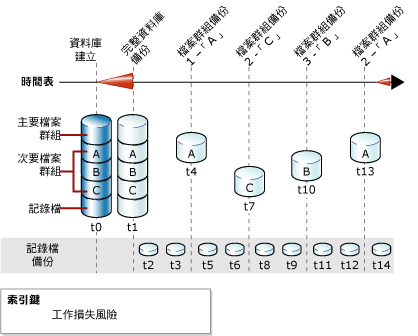

# 完整檔案備份 (SQL Server)
[!INCLUDE[appliesto-ss-xxxx-xxxx-xxx-md](../../includes/appliesto-ss-xxxx-xxxx-xxx-md.md)]
  本主題僅與包含多個檔案或檔案群組的 [!INCLUDE[ssNoVersion](../../includes/ssnoversion-md.md)] 資料庫有關。  
  
 [!INCLUDE[ssNoVersion](../../includes/ssnoversion-md.md)] 資料庫中的檔案可個別進行備份和還原。 而且，您可以指定整個檔案群組，而不是個別指定每個構成的檔案。 請注意，如果檔案群組的任何檔案離線 (例如因為檔案正在還原中)，整個檔案群組就會離線，並且無法進行備份。  
  
 唯讀檔案群組的檔案備份可以結合部分備份。 部分備份包含所有讀取/寫入檔案群組，以及一個或多個唯讀檔案群組 (選用)。 如需詳細資訊，請參閱[部分備份 &#40;SQL Server&#41;](../../relational-databases/backup-restore/partial-backups-sql-server.md)。  
  
 檔案備份可以當成差異檔案備份的 *「差異基底」* (Differential base)。 如需詳細資訊，請參閱 [差異備份 &#40;SQL Server&#41;](../../relational-databases/backup-restore/differential-backups-sql-server.md)。  
  
> [!NOTE]  
>  完整檔案備份通常稱為「檔案備份」，但與「差異檔案備份」明確對照時除外。  
  
 **本主題內容：**  
  
-   [檔案備份的優點](#Benefits)  
  
-   [檔案備份的缺點](#Disadvantages)  
  
-   [檔案備份概觀](#Overview)  
  
-   [相關工作](#RelatedTasks)  
  
##   檔案備份的優點  
 檔案備份提供下列優於資料庫備份的優點：  
  
-   使用檔案備份可以增加復原的速度，因為這樣可以讓您只還原受損的檔案，而不需要還原資料庫的其餘部分。  
  
     例如，如果資料庫由數個檔案組成，這些檔案分別位在不同磁碟上，現在有一個磁碟故障了，就只需還原故障磁碟上的檔案。 損毀的檔案可以快速予以還原，而且其復原速度也比復原整個資料庫還要快。  
  
-   比起完整資料庫備份，檔案備份在排程與媒體處理上彈性更大，因為對於大型資料庫，完整資料庫備份會變得難以管理。 對於含有各種更新特性資料的大型資料庫來說，檔案或檔案群組備份的增強彈性也很有用處。  
  
##   檔案備份的缺點  
  
-   相較於完整資料庫備份，檔案備份的主要缺點在於增加管理上的複雜性。 維護和持續追蹤完整的備份組是相當耗時的工作，其耗費成本甚至可能會超過完整資料庫備份的空間需求。  
  
-   如果損毀的檔案沒有備份，媒體故障將可能造成整個資料庫無法復原。 因此，必須維護一組完整的檔案備份，而在完整/大量記錄復原模式下，則還要備份一個或多個記錄備份，至少涵蓋第一次完整檔案備份和最後一次完整檔案備份之間的間隔。  
  
##   檔案備份概觀  
 完整檔案備份會備份一個或多個檔案或檔案群組中的所有資料。 根據預設，檔案備份會包含足以將檔案向前復原到備份作業結束的記錄檔記錄。  
  
 對於每一個復原模式來說，備份唯讀檔案或檔案群組都是相同的。 在完整復原模式下，一組完整的完整檔案備份連同足以涵蓋所有檔案備份的記錄備份，就相當於一個完整資料庫備份。  
  
 同一時間只能進行一個檔案備份作業。 您可以在一個作業中備份多個檔案，但是如果您只需要還原單一檔案，這樣可能延長復原的時間。 這是因為若要找到這個檔案，就要讀取整個備份。  
  
> [!NOTE]  
>  您可以從資料庫備份還原個別檔案；不過，若要尋找並還原一個檔案，從資料庫備份著手會比從檔案備份來得更久。  
  
### 檔案備份和簡單復原模式  
 在簡單復原模式下，必須將所有的讀取/寫入檔案備份在一起。 這樣可以確保將資料庫還原到一致的時間點。 不要個別指定每一個讀取/寫入檔案或檔案群組，請改用 READ_WRITE_FILEGROUPS 選項。 這個選項會備份資料庫中的所有讀取/寫入檔案群組。 指定 READ_WRITE_FILEGROUPS 所建立的備份即稱為「部分備份」。 如需詳細資訊，請參閱[部分備份 &#40;SQL Server&#41;](../../relational-databases/backup-restore/partial-backups-sql-server.md)。  
  
### 檔案備份和完整復原模式  
 在完整復原模式下，不論備份策略的其餘部分為何，您都必須備份交易記錄。 一組完整的完整檔案備份，連同足以從第一個檔案備份開始涵蓋所有檔案備份的記錄備份，就相當於一個完整資料庫備份。  
  
 只使用檔案和記錄備份來還原資料庫可能會很複雜。 因此，最好是盡可能執行完整資料庫備份，然後在第一次檔案備份之前啟動記錄備份。 下圖顯示在建立資料庫 (時間 t0) 之後不久即建立完整資料庫備份 (時間 t1) 的策略。 第一個資料庫備份可讓交易記錄備份啟動。 交易記錄備份已排程為依設定的間隔進行。 當間隔最符合資料庫的商務需求時，就會進行檔案備份。 本圖顯示逐一備份的四個檔案群組。 這些檔案群組的備份順序 (A、C、B、A) 反映了資料庫的商務需求。  
  
   
  
> [!NOTE]  
>  在完整復原模式下，還原讀取/寫入檔案備份時必須向前復原交易記錄，以確保檔案與資料庫其餘部分的一致性。 為了避免向前復原過多的交易記錄備份，請考慮使用差異檔案備份。 如需詳細資訊，請參閱 [差異備份 &#40;SQL Server&#41;](../../relational-databases/backup-restore/differential-backups-sql-server.md)。  
  
##   相關工作  
 **建立檔案或檔案群組備份**  
  
-   [備份檔案和檔案群組 &#40;SQL Server&#41;](../../relational-databases/backup-restore/back-up-files-and-filegroups-sql-server.md)  
  
-   <xref:Microsoft.SqlServer.Management.Smo.Backup.SqlBackup%2A> (SMO)  
  
> [!NOTE]  
>  「維護計畫精靈」不支援檔案備份。  
  
## 另請參閱  
 [BACKUP &#40;Transact-SQL&#41;](../../t-sql/statements/backup-transact-sql.md)   
 [備份概觀 &#40;SQL Server&#41;](../../relational-databases/backup-restore/backup-overview-sql-server.md)   
 [備份與還原：互通性與共存性 &#40;SQL Server&#41;](../../relational-databases/backup-restore/backup-and-restore-interoperability-and-coexistence-sql-server.md)   
 [差異備份 &#40;SQL Server&#41;](../../relational-databases/backup-restore/differential-backups-sql-server.md)   
 [檔案還原 &#40;簡單復原模式&#41;](../../relational-databases/backup-restore/file-restores-simple-recovery-model.md)   
 [檔案還原 &#40;完整復原模式&#41;](../../relational-databases/backup-restore/file-restores-full-recovery-model.md)   
 [線上還原 &#40;SQL Server&#41;](../../relational-databases/backup-restore/online-restore-sql-server.md)   
 [分次還原 &#40;SQL Server&#41;](../../relational-databases/backup-restore/piecemeal-restores-sql-server.md)  
  
  
