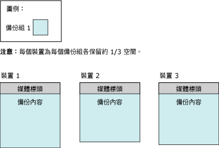
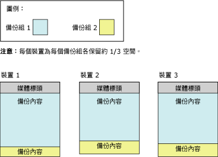

# <a name="media-sets-media-families-and-backup-sets-sql-server"></a>媒體集、媒體家族與備份組 (SQL Server)
  **本主題介紹 [!INCLUDE[ssNoVersion](../../includes/ssnoversion-md.md)] 備份和還原的基本備份媒體詞彙，適合供初次使用 [!INCLUDE[ssNoVersion](../../includes/ssnoversion-md.md)]的使用者閱讀。** 
  
  此主題描述 [!INCLUDE[ssNoVersion](../../includes/ssnoversion-md.md)] 用於備份媒體的格式、備份媒體與備份裝置之間的對應、備份在備份媒體上的組織，以及媒體集和媒體家族的數個考量。 此主題也描述第一次使用備份媒體，或將舊媒體集取代為新媒體集之前初始化或格式化備份媒體的步驟、如何覆寫媒體集中舊備份組的步驟，以及如何將新備份組附加至媒體集的步驟。  
  
>**注意！** 如需將 SQL Server 備份放至 Windows Azure Blob 儲存體服務的詳細資訊，請參閱 [使用 Microsoft Azure Blob 儲存體服務進行 SQL Server 備份及還原](../../relational-databases/backup-restore/sql-server-backup-and-restore-with-microsoft-azure-blob-storage-service.md)。  
   
##  <a name="TermsAndDefinitions"></a> 詞彙  
 **媒體集**  
 按順序排列的備份媒體集合 (磁帶或磁碟檔案)，由一個或多個備份作業使用固定的備份裝置類型與數量寫入。  
  
 **媒體家族**  
 在單一非鏡像裝置上或媒體集的一組鏡像裝置上所建立的備份。  
  
**備份組**  
 透過成功的備份作業，加入至媒體集的備份內容。  
  

##  <a name="OvMediaSetsFamiliesBackupSets"></a> 媒體集、媒體家族和備份組的概觀  
 單一媒體集是由一組一個或多個備份媒體上的備份組成。 「媒體集」(Media Set) 是按順序排列的「備份媒體」(Backup Media) 集合 (磁帶、磁碟檔案或Azure Blob)，由一個或多個備份作業使用固定的備份裝置類型與數量寫入。 給定的媒體集會使用磁帶機、磁碟機或Azure Blob，但是不得為兩個以上的組合。 
 
**範例：** 與媒體集相關的備份裝置可能是三個磁帶機，分別稱為 `\\.\TAPE0`、 `\\.\TAPE1`和 `\\.\TAPE2`。 此媒體集僅包含磁帶，一開始最少有三個磁帶 (每個磁帶機一個)。 備份裝置類型與數量是在媒體集建立時確立，而且無法變更。 不過，可在必要時以相同類型的裝置取代備份和還原作業間的指定裝置。  
  
 媒體集是在備份作業格式化備份媒體期間，於備份媒體上建立。 如需詳細資訊，請參閱本主題稍後的 [建立新媒體集](#CreatingMediaSet)。 完成格式化後，每個檔案或磁帶會包含媒體集的媒體標頭，且備妥要接收備份內容。 有了適當的標頭，備份作業就可以在指定供作業使用的所有備份裝置上，繼續將指定的資料備份至備份媒體。  
  
> **注意！** 媒體集可以鏡像，避免損毀媒體磁碟區 (磁帶或磁碟檔案)。 如需詳細資訊，請參閱本主題稍後的 [鏡像備份媒體集 &#40;SQL Server&#41;](../../relational-databases/backup-restore/mirrored-backup-media-sets-sql-server.md)的使用者閱讀。  
  
 壓縮和未壓縮的備份無法在媒體集中一起出現。 任何 [!INCLUDE[ssKatmai](../../includes/sskatmai-md.md)] 或更新版本都可以讀取壓縮的備份。 如需詳細資訊，請參閱[備份壓縮 &#40;SQL Server&#41;](../../relational-databases/backup-restore/backup-compression-sql-server.md)。  

  
## <a name="media-families"></a>媒體家族  
 在單一非鏡像裝置上或媒體集鏡像裝置組上所建立的備份，即構成一個 *「媒體家族」*(Media family)。 媒體集使用的備份裝置數量決定媒體集內的媒體家族數。 例如，如果媒體集使用兩個非鏡像的備份裝置，此媒體集即包含兩個媒體家族。  
  
在鏡像的媒體集中，每個媒體家族都是鏡像。 例如，如果使用六個備份裝置格式化媒體集，其中兩個使用鏡像，共有三個媒體家族，每個都包含兩份等量的備份資料。 如需鏡像媒體集的詳細資訊，請參閱 [鏡像備份媒體集 &#40;SQL Server&#41;](../../relational-databases/backup-restore/mirrored-backup-media-sets-sql-server.md)的使用者閱讀。  
  
 媒體家族內的每個磁帶或磁碟都會指派一個 *「媒體序號」*。 磁碟的媒體序號永遠是 1。 在磁帶媒體家族中，初始磁帶的序號為 1，第二個磁帶的序號為 2，以此類推。 如需詳細資訊，請參閱本主題稍後的 [媒體集、媒體家族與備份組 (SQL Server)](../../relational-databases/backup-restore/media-sets-media-families-and-backup-sets-sql-server.md)的使用者閱讀。
  
## <a name="the-media-header"></a>媒體標頭  
 備份媒體 (磁碟檔案或磁帶) 的每個磁碟區都包含一個媒體標頭，此標頭是由使用磁帶 (或磁碟) 的第一個備份作業所建立。 此標頭會保持不變，直到重新格式化媒體。  
  
 媒體標頭包含識別媒體 (磁碟檔案或磁帶) 所需的所有資訊，而標頭會位在所屬的媒體家族內。 這項資訊包括：  
  
-   媒體的名稱。  
  
     (選擇性) 建議您使用可清楚識別媒體的媒體名稱。 媒體名稱是由格式化該媒體的人指派。  
  
-   媒體集的唯一識別碼。  
  
-   媒體集內的媒體家族編號。  
  
-   包含此媒體之媒體家族的序號。  
  
-   媒體家族的唯一識別碼。  
  
-   媒體家族內此媒體的序號。 對於磁碟檔案，這個值永遠為 1。  
  
-   媒體描述是否包含 MTF 媒體標籤或媒體描述。  
  
    >**注意！** 備份或還原作業所用的所有媒體都使用稱為 [!INCLUDE[msCoName](../../includes/msconame-md.md)] Tape Format (MTF) 的標準備份格式。 MTF 允許使用者指定含有 MTF 特定描述的磁帶標籤。 [!INCLUDE[ssNoVersion](../../includes/ssnoversion-md.md)] 會保留另一個應用程式所寫入的任何 MTF 媒體標籤，但是不會寫入 MTF 媒體標籤。  
  
-   [!INCLUDE[msCoName](../../includes/msconame-md.md)] Tape Format 媒體標籤或媒體描述 (自由形式文字)。  
  
-   寫入標籤的備份軟體名稱。  
  
-   格式化媒體之軟體廠商的唯一廠商識別碼。  
  
-   寫入標籤時的日期和時間。  
  
-   媒體集內的鏡像數目 (1-4)；1 代表無鏡像裝置。  
  
 [!INCLUDE[ssCurrent](../../includes/sscurrent-md.md)] 可處理由舊版 [!INCLUDE[ssNoVersion](../../includes/ssnoversion-md.md)]格式化的媒體。  
  
## <a name="backup-sets"></a>備份組  
 成功的備份作業會將一個 *「備份組」* (Backup set) 加入至媒體集。 這個備份組是根據備份所屬的媒體集加以描述。 如果備份媒體僅由一個媒體家族組成，則該家族就包含整個備份組。 如果備份媒體由多個媒體家族組成，則備份組會分散於其中。 在每個媒體上，備份組都會包含描述該備份組的標頭。  
  
 這個範例顯示一個 [!INCLUDE[tsql](../../includes/tsql-md.md)] 陳述式，為使用三個磁帶機做為備份裝置的 `MyAdvWorks_MediaSet_1` 資料庫，建立稱為 [!INCLUDE[ssSampleDBobject](../../includes/sssampledbobject-md.md)] 的媒體集：  
  
```  
BACKUP DATABASE AdventureWorks2012  
TO TAPE = '\\.\tape0', TAPE = '\\.\tape1', TAPE = '\\.\tape2'  
WITH   
   FORMAT,  
   MEDIANAME = 'MyAdvWorks_MediaSet_1'  
```  
  
 如果成功，此備份作業會產生新的媒體集，內含新的媒體標頭與一個分佈於三個磁帶的備份組。 下圖說明這些結果：  
  
   
  
 一般來說，媒體集建立之後，隨後接連發生的備份作業，將會它們的備份組附加到媒體集。 媒體集是由備份組使用的所有媒體組成，不論包含的媒體或備份裝置數目為何。 備份組會根據它們在媒體集內的位置連續編號，您可以用以指定要還原的備份組。  
  
 媒體集的每個備份作業必須寫入同一個的備份裝置編號與類型。 如同第一個備份組一樣有多個裝置，隨後每個備份組的內容會分佈在所有裝置上的備份媒體中。 繼續上述範例，第二個備份作業 (差異備份) 將資訊附加到相同的媒體集：  
  
```  
BACKUP DATABASE AdventureWorks2012  
TO TAPE = '\\.\tape0', TAPE = '\\.\tape1', TAPE = '\\.\tape2'  
WITH   
   NOINIT,  
   MEDIANAME = 'AdventureWorksMediaSet1',  
   DIFFERENTIAL  
```  
  
> **注意！** NOINIT 選項是預設值，為了表明而包括於上。  
  
 如果第二個備份作業成功，就會將第二個備份組寫入媒體集，接連散發備份內容：  
  
   
  
 當您要還原備份時，可以使用 FILE 選項來指定所要使用的備份。 下列範例示範 FILE **=***backup_set_file_number* 子句在還原 [!INCLUDE[ssSampleDBobject](../../includes/sssampledbobject-md.md)] 資料庫的完整資料庫備份時的用法，並接著示範在相同媒體集上進行差異資料庫備份。 這個媒體集使用三個備份磁帶，分別位於磁帶機 `\\.\tape0`、 `tape1`和 `tape2`。  
  
```  
RESTORE DATABASE AdventureWorks2012 FROM TAPE = '\\.\tape0', TAPE = '\\.\tape1', TAPE = '\\.\tape2'  
   WITH   
   MEDIANAME = 'AdventureWorksMediaSet1',  
   FILE=1,   
   NORECOVERY;  
RESTORE DATABASE AdventureWorks2012 FROM TAPE = '\\.\tape0', TAPE = '\\.\tape1', TAPE = '\\.\tape2'   
   WITH   
   MEDIANAME = 'AdventureWorksMediaSet1',  
   FILE=2,   
   RECOVERY;  
GO  
```  
  
 如需儲存媒體集與其媒體家族及備份組相關資訊之記錄資料表的相關資訊，請參閱 [備份記錄與標頭資訊 &#40;SQL Server&#41;](../../relational-databases/backup-restore/backup-history-and-header-information-sql-server.md)的使用者閱讀。  
  
 媒體集內的備份媒體數量取決於數個因素：  
  
-   備份裝置數量  
  
-   備份裝置類型  
  
-   備份組數量  

  
##  <a name="CreatingMediaSet"></a> Creating a new media set  
 若要建立新的媒體集，您必須將備份媒體 (一個或多個磁帶或磁碟檔案) 格式化。 格式化的過程會變更備份媒體，如下所示：  
  
1.  刪除舊標頭 (若有的話)，有效率地刪除備份媒體上先前的內容。  
  
     將磁帶裝置格式化，會刪除目前所掛載磁帶上的所有先前內容。 將磁碟格式化，則只會影響您指定給備份作業的檔案。  
  
2.  在每個備份裝置的備份媒體 (磁帶或磁碟檔案) 上寫入新的媒體標頭。  

  
##  <a name="UseExistingMediaSet"></a> 備份至現有的媒體集  
 備份至現有的媒體集時，您有下列兩個選項：  
  
-   附加至現有的媒體集。  
  
     為了盡可能善用可用空間，新的備份組通常會附加至現有的媒體集。 附加至備份會保留任何先前的備份。 如需詳細資訊，請參閱本節稍後的 [附加至現有備份組](#Appending)。  

附加動作是 BACKUP 的預設行為，可以使用 NOINIT 選項明確地指定。  
  
-   以目前的備份來覆寫所有現有的備份組，將目前的媒體標頭留在原處。  
  
     [!INCLUDE[ssNoVersion](../../includes/ssnoversion-md.md)] 備份具有保護機制，可防止您在無意中覆寫媒體。 但是若備份組已達到預先定義的期限，備份就會自動覆寫備份組。  
  
     針對磁帶標頭，適當地保留標頭有其意義。 如需詳細資訊，請參閱本節稍後的 [覆寫備份組](#Overwriting)。  

    >  若要覆寫現有的備份組，可以使用 BACKUP 陳述式的 INIT 選項來指定。  
  
##  <a name="Appending"></a> Appending to existing backup sets  
 不同時間執行的備份可以寫在相同的媒體上，不論是不是來自相同的資料庫。 藉由將另一個備份組附加至現有媒體的方法，就可以不影響媒體原先的內容，而在媒體最後一個備份結尾處寫入新的備份。  
  
 依預設值， [!INCLUDE[ssNoVersion](../../includes/ssnoversion-md.md)] 一定會將新備份附加至媒體。 附加只可以發生在媒體結尾。 例如，如果媒體磁碟區包含五個備份組，就無法跳過前三個備份組，而使用新的備份組覆寫第四個備份組。  
  
 如果磁帶備份採用 BACKUP WITH NOREWIND，則在作業結束後，磁帶會保持開啟狀態。 這樣您就可以在磁帶上附加其他備份，否則就得將磁帶倒帶，再向前搜尋，找出最後的備份組。 您可以在 **sys.dm_io_backup_tapes** 動態管理檢視中找出開啟的磁帶機清單。如需詳細資訊，請參閱 [sys.dm_io_backup_tapes &#40;Transact-SQL&#41;](../../relational-databases/system-dynamic-management-views/sys-dm-io-backup-tapes-transact-sql.md)。  
  
 Microsoft Windows 備份和 [!INCLUDE[ssNoVersion](../../includes/ssnoversion-md.md)] 備份可以共用相同的媒體，但是無法相互操作。 [!INCLUDE[ssNoVersion](../../includes/ssnoversion-md.md)] 備份無法備份 Windows 資料。  
  
> **重要！** 壓縮和未壓縮的備份無法在媒體集中一起出現。 任何 [!INCLUDE[ssKatmai](../../includes/sskatmai-md.md)] 或更新版本都可以讀取壓縮的備份。 如需詳細資訊，請參閱[備份壓縮 &#40;SQL Server&#41;](../../relational-databases/backup-restore/backup-compression-sql-server.md)。  
  
 
##  <a name="Overwriting"></a> Overwriting backup sets  
 若要覆寫現有的備份組，可以使用 BACKUP 陳述式的 INIT 選項來指定。 這個選項會覆寫媒體中的所有備份組，並保留媒體標頭 (如果有的話)。 如果沒有媒體標頭，就會加以建立。  
  
 針對磁帶標頭，適當地保留標頭有其意義。 對於磁碟備份媒體而言，只有備份作業中指定的備份裝置所用的檔案會被覆寫，磁碟上的其他檔案則不受影響。 覆寫備份時會保留任何現有的媒體標頭，而新的備份會建立為備份裝置上的第一個備份。 如果沒有現有的媒體標頭，則會自動寫入含相關媒體名稱與媒體描述的有效媒體標頭。 如果現有的媒體標頭無效，備份作業會終止。 若為空白媒體，則會以給定的 MEDIANAME、MEDIAPASSWORD 與 MEDIADESCRIPTION (若有的話) 來產生新的媒體標頭。  
  
 
 若發生下列其中一種情況，就不會覆寫備份媒體：  
  
-   媒體上的現有備份尚未到期 (若指定了 SKIP，則不會檢查到期日)。  
  
     到期日會指定備份過期的日期，之後就可以被別的備份覆寫。 建立備份時，可以指定到期日。 依預設，到期日是由 **sp_configure** 所設定的 **media retention**選項來決定。 如需詳細資訊，請參閱本主題稍後的 [sp_configure &#40;Transact-SQL&#41;](../../relational-databases/system-stored-procedures/sp-configure-transact-sql.md)的使用者閱讀。  
  
-   媒體名稱 (如果提供的話) 不符合備份媒體的名稱。  
  
     媒體名稱是為了易於識別媒體而用的描述性名稱。  
  
 如果確定要覆寫現有媒體 (例如，如果知道已不再需要磁帶上的備份)，就可以明確地略過這些檢查。  
  
 若備份媒體受到 Microsoft Windows 的密碼保護，Microsoft SQL Server 就無法寫入此媒體。 若要覆寫受到密碼保護的媒體，您必須重新初始化該媒體。  
  

  
##  <a name="SequenceNumbers"></a> 序號  
 對於媒體集或媒體家族內的多個備份媒體而言，有正確的順序很重要。 因此，備份會依照下列方式指派序號：  
  
-   媒體集內的連續媒體家族  
  
     媒體集內的媒體家族，會根據其在媒體集內的位置依順序編號。 媒體家族的編號是記錄在 **backupmediafamily** 資料表的 **family_sequence_number** 資料行中。  
  
-   媒體家族內的實體媒體  
  
     媒體序號代表實體媒體在媒體家族內的順序。 初始備份媒體的序號是 1。 這會標記為 1；第二個 (第一個接續磁帶) 會標記為 2；依此類推。 在還原備份組時，媒體序號可確保還原備份的操作員以正確的順序掛載正確的媒體。  
  
###  <a name="MultipleDevices"></a> 多個裝置  
 使用多個磁帶機或磁碟檔案時，需考量以下事項：  
  
-   備份方面：  
  
     後續的所有備份作業必須使用備份作業所建立的整個媒體集。 例如，如果使用兩個磁帶備份裝置建立媒體集，後續涉及相同媒體集的所有備份作業都必須使用兩個備份裝置。  
  
-   還原方面：  
  
     對磁碟備份中的任何還原以及任何線上還原而言，必須同時掛載全體媒體家族中的所有家族。 若要從磁帶備份中進行離線還原，則可以較少的備份裝置處理媒體家族。 對每個媒體家族而言，其處理必須先完成，另一個媒體家族的處理才會開始。 媒體家族永遠會平行處理，除非是以單一裝置進行還原。  
  
##  <a name="RelatedTasks"></a> 相關工作  
 **建立新的媒體集**  
  
-   [建立完整資料庫備份 &#40;SQL Server&#41;](../../relational-databases/backup-restore/create-a-full-database-backup-sql-server.md) ([備份至新的媒體集，並清除所有現有的備份組] 選項)  
  
-   [BACKUP &#40;Transact-SQL&#41;](../../t-sql/statements/backup-transact-sql.md) (FORMAT 選項)  
  
-   <xref:Microsoft.SqlServer.Management.Smo.Backup.FormatMedia%2A>  
  
 **將新備份附加至現有媒體**  
  
-   [建立完整資料庫備份 &#40;SQL Server&#41;](../../relational-databases/backup-restore/create-a-full-database-backup-sql-server.md) ([附加至現有的備份組] 選項)  
  
-   [BACKUP &#40;Transact-SQL&#41;](../../t-sql/statements/backup-transact-sql.md) (NOINIT 選項)  
  
 **覆寫現有備份組**  
  
-   [建立完整資料庫備份 &#40;SQL Server&#41;](../../relational-databases/backup-restore/create-a-full-database-backup-sql-server.md) ([覆寫所有現有的備份組] 選項)  
  
-   [BACKUP &#40;Transact-SQL&#41;](../../t-sql/statements/backup-transact-sql.md) (INIT 選項)  
  
 **設定到期日**  
  
-   [設定備份的到期日 &#40;SQL Server&#41;](../../relational-databases/backup-restore/set-the-expiration-date-on-a-backup-sql-server.md)  
  
 **檢視媒體順序與家族序號**  
  
-   [檢視邏輯備份裝置的屬性和內容 &#40;SQL Server&#41;](../../relational-databases/backup-restore/view-the-properties-and-contents-of-a-logical-backup-device-sql-server.md)  
  
-   [backupmediafamily &#40;Transact-SQL&#41;](../../relational-databases/system-tables/backupmediafamily-transact-sql.md) (**family_sequence_number** 資料行)  
  
 **檢視特定備份裝置上的備份組**  
  
-   [檢視備份組中的資料和記錄檔 &#40;SQL Server&#41;](../../relational-databases/backup-restore/view-the-data-and-log-files-in-a-backup-set-sql-server.md)  
  
-   [檢視邏輯備份裝置的屬性和內容 &#40;SQL Server&#41;](../../relational-databases/backup-restore/view-the-properties-and-contents-of-a-logical-backup-device-sql-server.md)  
  
-   [RESTORE HEADERONLY &#40;Transact-SQL&#41;](../../t-sql/statements/restore-statements-headeronly-transact-sql.md)  
  
 **讀取備份裝置上媒體的媒體標頭**  
  
-   [RESTORE LABELONLY &#40;Transact-SQL&#41;](../../t-sql/statements/restore-statements-labelonly-transact-sql.md)  
 
  
## <a name="see-also"></a>另請參閱  
 [SQL Server 資料庫的備份與還原](../../relational-databases/backup-restore/back-up-and-restore-of-sql-server-databases.md)   
 [備份和還原期間可能發生的媒體錯誤 &#40;SQL Server&#41;](../../relational-databases/backup-restore/possible-media-errors-during-backup-and-restore-sql-server.md)   
 [備份記錄與標頭資訊 &#40;SQL Server&#41;](../../relational-databases/backup-restore/backup-history-and-header-information-sql-server.md)   
 [鏡像備份媒體集 &#40;SQL Server&#41;](../../relational-databases/backup-restore/mirrored-backup-media-sets-sql-server.md)   
 [BACKUP &#40;Transact-SQL&#41;](../../t-sql/statements/backup-transact-sql.md)   
 [RESTORE &#40;Transact-SQL&#41;](../../t-sql/statements/restore-statements-transact-sql.md)   
 [RESTORE REWINDONLY &#40;Transact-SQL&#41;](../../t-sql/statements/restore-statements-rewindonly-transact-sql.md)   
 [sp_configure &#40;Transact-SQL&#41;](../../relational-databases/system-stored-procedures/sp-configure-transact-sql.md)  
  
  

