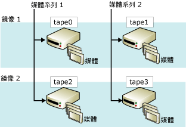

# 鏡像備份媒體集 (SQL Server)
    
> [!NOTE]  
>  只有 [!INCLUDE[ssNoVersion](../../includes/ssnoversion-md.md)]Enterprise Edition 才支援鏡像備份媒體集。  
  
 鏡像媒體集可降低備份裝置功能不正常的影響，進而提高備份可靠性。 這些功能不正常特別嚴重，因為備份是避免資料遺失的最後一道防線。 隨著資料庫增長，備份裝置或媒體失敗導致備份無法還原的機會也越大。 鏡像備份媒體提供的備援性可以提升備份的可靠性。  
  
> [!NOTE]  
>  如需媒體集的一般資訊，請參閱 [媒體集、媒體家族與備份組 &#40;SQL Server&#41;](../../relational-databases/backup-restore/media-sets-media-families-and-backup-sets-sql-server.md)Enterprise Edition 才支援鏡像備份媒體集。  
  
 **本主題內容：**  
  
-   [鏡像媒體集概觀](#OverviewofMirroredMediaSets)  
  
-   [備份鏡像的硬體需求](#HardwareReqs)  
  
-   [相關工作](#RelatedTasks)  
  
##   鏡像媒體集概觀  
 媒體鏡像是媒體集的一種屬性。 「鏡像媒體集」**是由多份媒體集複本 (「鏡像」**) 組成。 媒體集包含一個或多個媒體家族，其中每一個都對應到備份裝置。 例如，如果 BACKUP DATABASE 陳述式的 TO 子句列出三個裝置，BACKUP 會將資料分散在三個媒體家族中，每個裝置一份資料。 建立媒體集 (由 BACKUP DATABASE 陳述式指定 WITH FORMAT) 時，就會定義媒體家族和鏡像的數目。  
  
 鏡像媒體集包含二到四個鏡像。 每個鏡像都包含媒體集中的所有媒體家族。 鏡像需要相同數目的裝置，每個媒體家族有一個裝置。 每個鏡像需要每個媒體家族有不同的備份裝置。 例如，由四個媒體家族而有三個鏡像組成的鏡像媒體集需要十二個備份裝置。 所有裝置都必須相同。 例如，相同製造商所提供的相同型號磁帶機。  
  
 下圖提供以兩個鏡像的兩個媒體家族組成的鏡像媒體集範例。 每個媒體家族都包含三個媒體磁碟區，磁碟區是每個鏡像備份一次。  
  
   
  
 鏡像上對應磁碟區有相同的內容。 如此可在還原時互換。 例如在之前圖表中，tape2 的第三個磁碟區可與 tape0 的第三個磁碟區互換。  
  
 [!INCLUDE[ssDEnoversion](../../includes/ssdenoversion-md.md)] 會同步寫入每個裝置，以保證鏡像媒體具有完全相同的內容。 其中任何一個鏡像填滿時，會同時跨裝置填滿所有鏡像。  
  
> [!IMPORTANT]  
>  您無法藉由移除鏡像的方式，將鏡像媒體集以隱含方式打散 (分割)。 若鏡像中的任何磁帶或磁碟損壞或重新格式化，則該鏡像就不能再用於其他備份作業。 若最後還有一個完整鏡像作用中，則可以讀取該媒體集。 若每個鏡像都遺失特定媒體家族，則該媒體集沒有用處。  
  
 備份和還原作業的需求視所有鏡像是否必須存在而異。 若要讓備份作業寫入 (亦即，建立或擴充) 鏡像媒體集，所有的鏡像都必須存在。 相對地，當從鏡像媒體集中還原備份時，每個媒體家族只能指定單一鏡像。 您可以從比家族少的裝置進行還原，但每個媒體家族只處理一次。 不過，如果有其他鏡像，當出現錯誤時，解決部分還原問題的速度會比較快。 您可以利用另一個鏡像的對應磁碟區來替代損毀的媒體磁碟區。 這是因為 RESTORE 與 RESTORE VERIFYONLY 支援使用另一個鏡像的對應備份媒體磁碟區來替換損壞的媒體。  
  
##   備份鏡像的硬體需求  
 鏡像適用於磁碟與磁帶 (磁碟不支援接續磁帶)。 單一備份或還原作業的所有備份裝置都必須是相同類型 - 磁碟或磁帶。  
  
 在這些廣泛的類別中，您必須使用具有相同屬性的類似裝置。 裝置不夠類似會產生錯誤訊息 (3212)。 為了避免裝置不符的風險，請使用相同的裝置，例如，只使用相同製造商製造的同型號磁碟機。  
  
##   相關工作  
 **若要備份至鏡像備份裝置**  
  
-   [備份至鏡像媒體集 &#40;Transact-SQL&#41;](../../relational-databases/backup-restore/back-up-to-a-mirrored-media-set-transact-sql.md)  
  
## 另請參閱  
 [備份和還原期間可能發生的媒體錯誤 &#40;SQL Server&#41;](../../relational-databases/backup-restore/possible-media-errors-during-backup-and-restore-sql-server.md)   
 [RESTORE VERIFYONLY &#40;Transact-SQL&#41;](../../t-sql/statements/restore-statements-verifyonly-transact-sql.md)   
 [備份裝置 &#40;SQL Server&#41;](../../relational-databases/backup-restore/backup-devices-sql-server.md)   
 [媒體集、媒體家族與備份組 &#40;SQL Server&#41;](../../relational-databases/backup-restore/media-sets-media-families-and-backup-sets-sql-server.md)  
  
  
