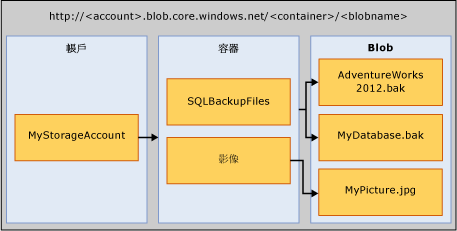

# <a name="sql-server-backup-to-url"></a>SQL Server 備份至 URL
[!INCLUDE[tsql-appliesto-ss2016-xxxx-xxxx-xxx_md](../../includes/tsql-appliesto-ss2016-xxxx-xxxx-xxx-md.md)]

  本主題介紹使用 Microsoft Azure Blob 儲存體服務作為備份目的地所需的概念、需求及元件。 使用磁碟或磁帶時，備份和還原功能相同或類似，只有些許的差異。 本主題包含這些差異和一些程式碼範例。  
  
## <a name="requirements-components-and-concepts"></a>需求、元件和概念  
 **本節內容：**  
  
-   [安全性](#security)  
  
-   [重要元件和概念簡介](#intorkeyconcepts)  
  
-   [Microsoft Azure Blob 儲存體服務](#Blob)  
  
-   [SQL Server 元件](#sqlserver)  
  
-   [限制](#limitations)  
  
-   [支援 Backup/Restore 陳述式](#Support)  
  
-   [在 SQL Server Management Studio 中使用備份工作](../../relational-databases/backup-restore/sql-server-backup-to-url.md#BackupTaskSSMS)  
  
-   [使用 [維護計畫精靈] 將 SQL Server 備份至 URL](../../relational-databases/backup-restore/sql-server-backup-to-url.md#MaintenanceWiz)  
  
-   [使用 SQL Server Management Studio 從 Windows Azure 儲存體還原](../../relational-databases/backup-restore/sql-server-backup-to-url.md#RestoreSSMS)  
  
###  <a name="security"></a> 安全性  
 以下是備份至 Microsoft Azure Blob 儲存體服務或從中還原時的安全性考量和需求。  
  
-   建立 Microsoft Azure Blob 儲存體服務的容器時，建議您將存取權設為 [私用] 。 將存取權設定為 [私用] 可將存取對象限制為能夠提供必要資訊來驗證 Windows Azure 帳戶的使用者或帳戶。  
  
    > [!IMPORTANT]  
    >  [!INCLUDE[ssNoVersion](../../includes/ssnoversion-md.md)] 需要在 [!INCLUDE[ssNoVersion](../../includes/ssnoversion-md.md)] 認證中儲存 Windows Azure 帳戶名稱和存取金鑰驗證或共用存取簽章和存取 Token。 當 Windows Azure 帳戶執行備份或還原作業時，這項資訊就會用來驗證該帳戶。  
  
-   用來發出 BACKUP 或 RESTORE 命令的使用者帳戶應該位於擁有 **改變任何認證** 權限的 **db_backup 運算子** 資料庫角色中。  
  
###  <a name="intorkeyconcepts"></a> 重要元件和概念簡介  
 下列兩節將介紹 Microsoft Azure Blob 儲存體服務，以及備份至 Microsoft Azure Blob 儲存體服務或從中還原時使用的 [!INCLUDE[ssNoVersion](../../includes/ssnoversion-md.md)] 元件。 為了備份至 Microsoft Azure Blob 儲存體服務或從中還原，請務必了解這些元件以及它們之間的互動方式。  
  
 在您的 Azure 訂閱內建立 Windows Azure 儲存體帳戶是這個程序的第一個步驟。 這個儲存體帳戶是系統管理帳戶，有以儲存體帳戶建立之所有容器和物件的完整系統管理權限。 [!INCLUDE[ssNoVersion](../../includes/ssnoversion-md.md)] 可以使用 Windows Azure 儲存體帳戶名稱及其存取金鑰值來驗證和讀寫 Blob 至 Microsoft Azure Blob 儲存體服務，或使用針對特定容器產生的共用存取簽章 Token 授與它讀寫權限。 如需 Azure 儲存體帳戶的詳細資訊，請參閱 [關於 Azure 儲存體帳戶](https://azure.microsoft.com/documentation/articles/storage-create-storage-account/) ，如需共用存取簽章的詳細資訊，請參閱 [共用存取簽章，第 1 部分：了解 SAS 模型](https://azure.microsoft.com/documentation/articles/storage-dotnet-shared-access-signature-part-1/)。 [!INCLUDE[ssNoVersion](../../includes/ssnoversion-md.md)] 認證會儲存這項驗證資訊，並且在備份或還原作業期間使用。  
  
###  <a name="blockbloborpageblob"></a> 備份至區塊 Blob 與分頁 Blob 
 Microsoft Azure Blob 儲存體服務可以儲存的 Blob 類型有兩種：區塊和分頁 Blob。 SQL Server 備份可根據使用的 Transact-SQL 語法，使用任一種 Blob 類型：若在認證中使用儲存體金鑰，則會使用分頁 Blob；若使用共用存取簽章，則會使用區塊 Blob。
 
 備份至區塊 Blob 功能僅能在 SQL Server 2016 或更新版本中使用。 若您執行 SQL Server 2016 或更新版本，我們建議您改為備份至區塊 Blob，而非分頁 Blob。 主要的原因如下：
- 相較於儲存體金鑰，共用存取簽章是授權 Blob 存取更安全的方式。
- 您可以備份至多個區塊 Blob，以取得更佳的備份及還原效能，並支援更大的資料庫備份。
- [區塊 Blob](https://azure.microsoft.com/pricing/details/storage/blobs/) 比[分頁 Blob](https://azure.microsoft.com/pricing/details/storage/page-blobs/) 更便宜。 

當您備份至區塊 Blob 時，您可以指定的最大區塊大小為 4 MB。 單一區塊 Blob 檔案的大小上限為 4 MB * 50000 = 195 GB。 若您的資料庫大小超過 195 GB，我們建議您：
- 使用備份壓縮
- 備份至多個區塊 Blob

###  <a name="Blob"></a> Microsoft Azure Blob 儲存體服務  
 **儲存體帳戶** ：儲存體帳戶是所有儲存體服務的起點。 若要存取 Microsoft Azure Blob 儲存體服務，請先建立 Microsoft Azure 儲存體帳戶。 如需詳細資訊，請參閱 [建立儲存體帳戶](https://azure.microsoft.com/documentation/articles/storage-create-storage-account/)。  
  
 **容器** ：容器會提供一組 Blob 的群組，而且可以儲存不限數目的 Blob。 若要將 [!INCLUDE[ssNoVersion](../../includes/ssnoversion-md.md)] 備份寫入 Microsoft Azure Blob 服務，您至少必須建立根容器。 您可以針對容器產生共用存取簽章 Token，並僅對特定容器的物件授與存取權。  
  
 **Blob** ：任何類型和大小的檔案。 Microsoft Azure Blob 儲存體服務可以儲存的 Blob 類型有兩種：區塊和分頁 Blob。 [!INCLUDE[ssNoVersion](../../includes/ssnoversion-md.md)] 備份可以使用這兩種 Blob 類型，視所用的 Transact-SQL 語法而定。 您可以使用下列 URL 格式來定址 Blob： https://\<儲存體帳戶>.blob.core.windows.net/\<容器>/\<Blob>。 如需 Microsoft Azure Blob 儲存體服務的詳細資訊，請參閱 [以 .NET 開始使用 Azure Blob 儲存體](https://www.windowsazure.com/develop/net/how-to-guides/blob-storage/)。 如需分頁 Blob 的詳細資訊，請參閱 [了解區塊 Blob、附加 Blob 和分頁 Blob](https://msdn.microsoft.com/library/windowsazure/ee691964.aspx)。  
  
   
  
 **Azure 快照集︰** 在某個時點間取得的 Azure blob 快照集。 如需詳細資訊，請參閱 [建立 Blob 的快照集](https://msdn.microsoft.com/library/azure/hh488361.aspx)。 [!INCLUDE[ssNoVersion](../../includes/ssnoversion-md.md)] 備份現在支援儲存在 Microsoft Azure Blob 儲存體服務中的資料庫檔案 Azure 快照集備份。 如需詳細資訊，請參閱 [Azure 中資料庫檔案的檔案快照集備份](../../relational-databases/backup-restore/file-snapshot-backups-for-database-files-in-azure.md)。  
  
###  <a name="sqlserver"></a> [!INCLUDE[ssNoVersion](../../includes/ssnoversion-md.md)] Components  
 **URL：** URL 會指定唯一備份檔案的統一資源識別項 (URI)。 此 URL 是用來提供 [!INCLUDE[ssNoVersion](../../includes/ssnoversion-md.md)] 備份檔案的位置和名稱。 此 URL 必須指向實際的 Blob，而非只有容器。 如果 Blob 不存在，就會建立 Blob。 如果指定了現有的 Blob，除非同時指定 "WITH FORMAT" 選項覆寫 Blob 中現有的備份檔，否則 BACKUP 會失敗。  
  
 以下是 URL 值範例：http[s]://ACCOUNTNAME.blob.core.windows.net/\<容器>/\<.bak>。 HTTPS 不是必要項目，但是建議使用。  
  
 **認證** ： [!INCLUDE[ssNoVersion](../../includes/ssnoversion-md.md)] 認證是用來儲存連接到 SQL Server 外部資源所需之驗證資訊的物件。 此處， [!INCLUDE[ssNoVersion](../../includes/ssnoversion-md.md)] 備份和還原程序會使用認證，向 Microsoft Azure Blob 儲存體服務及其容器和 Blob 物件驗證。 認證會儲存儲存體帳戶名稱和儲存體帳戶 **存取金鑰** 值，或容器 URL 及其共用存取簽章 Token。 一旦建立認證，BACKUP/RESTORE 陳述式的語法就會決定 Blob 類型和所需的認證。  
  
 如需如何建立共用存取簽章的範例，請參閱本主題稍後的 [建立共用存取簽章](../../relational-databases/backup-restore/sql-server-backup-to-url.md#SAS) 範例，若要建立 [!INCLUDE[ssNoVersion](../../includes/ssnoversion-md.md)] 認證，請參閱本主題稍後的 [建立認證](../../relational-databases/backup-restore/sql-server-backup-to-url.md#credential) 範例。  
  
 如需認證的一般資訊，請參閱 [認證](../security/authentication-access/credentials-database-engine.md)  
  
 如需使用認證之其他範例的資訊，請參閱 [建立 SQL Server Agent Proxy](../../ssms/agent/create-a-sql-server-agent-proxy.md)。  
  
###  <a name="limitations"></a> 限制  
  
-   不支援備份至進階儲存體。  
  
-   SQL Server 會將使用分頁 Blob 支援的備份大小上限限制為 1 TB。 使用區塊 Blob 支援的備份大小上限則會限制為大約 200 MB (50,000 個區塊 * 4MB 的 MAXTRANSFERSIZE)。 區塊 Blob 支援等量分割，以支援實質上較大的備份大小。  
  
-   您可以使用 TSQL、SMO、PowerShell Cmdlet、SQL Server Management Studio [備份精靈] 或 [還原精靈] 發出 Backup 或 Restore 陳述式。   
  
-   不支援建立邏輯裝置名稱。 因此，不支援使用 sp_dumpdevice 或透過 SQL Server Management Studio 加入 URL 做為備份裝置。  
  
-   不支援附加至現有的備份 Blob。 現有 blob 的備份只能使用 **WITH FORMAT** 選項來覆寫。 不過，當使用檔案快照集備份時 (使用 **WITH FILE_SNAPSHOT** 引數)，不允許 **WITH FORMAT** 引數，以避免留下使用原始檔案快照集備份建立的孤立檔案快照集。  
  
-   只有使用區塊 Blob 和使用共用存取簽章 (SAS) Token 才支援備份至單一備份作業中的多個 Blob，而不是 SQL 認證的儲存體帳戶金鑰。  
  
-   針對分頁 Blob，不支援指定 **BLOCKSIZE**。 
  
-   針對分頁 Blob，不支援指定 **MAXTRANSFERSIZE**。 
  
-   不支援指定備份組選項 - **RETAINDAYS** 和 **EXPIREDATE** 。  
  
-   [!INCLUDE[ssNoVersion](../../includes/ssnoversion-md.md)] 的備份裝置名稱大小上限為 259 個字元。 BACKUP TO URL 會用 36 個字元的必要項目指定 URL - 'https://.blob.core.windows.net//.bak'，而保留 223 個字元供帳戶、容器和 Blob 名稱共用。  
  
###  <a name="Support"></a> 支援 Backup/Restore 陳述式  
  
|Backup/Restore 陳述式|支援|例外狀況|註解|
|-|-|-|-|
|BACKUP|Y|針對區塊 Blob，支援指定 BLOCKSIZE 和 MAXTRANSFERSIZE。 它們不支援用於分頁 Blob。 | 備份至區塊 Blob 需要 SQL Server 認證中所儲存的共用存取簽章。 備份至分頁 Blob 需要 [!INCLUDE[ssNoVersion](../../includes/ssnoversion-md.md)] 認證中所儲存的儲存體帳戶金鑰，而且需要指定 WITH CREDENTIAL 引數。|  
|RESTORE|Y||如果 [!INCLUDE[ssNoVersion](../../includes/ssnoversion-md.md)] 認證是使用作為密碼的儲存體帳戶金鑰所定義，則需要定義 [!INCLUDE[ssNoVersion](../../includes/ssnoversion-md.md)] 認證，而且需要指定 WITH CREDENTIAL 引數。|  
|RESTORE FILELISTONLY|Y||如果 [!INCLUDE[ssNoVersion](../../includes/ssnoversion-md.md)] 認證是使用作為密碼的儲存體帳戶金鑰所定義，則需要定義 [!INCLUDE[ssNoVersion](../../includes/ssnoversion-md.md)] 認證，而且需要指定 WITH CREDENTIAL 引數。|  
|RESTORE HEADERONLY|Y||如果 [!INCLUDE[ssNoVersion](../../includes/ssnoversion-md.md)] 認證是使用作為密碼的儲存體帳戶金鑰所定義，則需要定義 [!INCLUDE[ssNoVersion](../../includes/ssnoversion-md.md)] 認證，而且需要指定 WITH CREDENTIAL 引數。|  
|RESTORE LABELONLY|Y||如果 [!INCLUDE[ssNoVersion](../../includes/ssnoversion-md.md)] 認證是使用作為密碼的儲存體帳戶金鑰所定義，則需要定義 [!INCLUDE[ssNoVersion](../../includes/ssnoversion-md.md)] 認證，而且需要指定 WITH CREDENTIAL 引數。|  
|RESTORE VERIFYONLY|Y||如果 [!INCLUDE[ssNoVersion](../../includes/ssnoversion-md.md)] 認證是使用作為密碼的儲存體帳戶金鑰所定義，則需要定義 [!INCLUDE[ssNoVersion](../../includes/ssnoversion-md.md)] 認證，而且需要指定 WITH CREDENTIAL 引數。|  
|RESTORE REWINDONLY|−|||  
  
 如需 Backup 陳述式的語法和一般資訊，請參閱 [BACKUP &#40;Transact-SQL&#41;](../../t-sql/statements/backup-transact-sql.md)。  
  
 如需 Restore 陳述式的語法和一般資訊，請參閱 [RESTORE &#40;Transact-SQL&#41;](../../t-sql/statements/restore-statements-transact-sql.md)。  
  
### <a name="support-for-backup-arguments"></a>支援 Backup 引數  

|引數|支援|例外狀況|註解|  
|-|-|-|-|  
|DATABASE|Y|||  
|LOG|Y|||  
||  
|TO (URL)|Y|與 DISK 和 TAPE 不同，URL 不支援指定或建立邏輯名稱。|這個引數是用來指定備份檔案的 URL 路徑。|  
|MIRROR TO|Y|||  
|**WITH 選項：**||||  
|CREDENTIAL|Y||使用 BACKUP TO URL 選項備份至 Microsoft Azure Blob 儲存體服務時，而且只有當 [!INCLUDE[ssNoVersion](../../includes/ssnoversion-md.md)] 認證是使用作為密碼的儲存體帳戶金鑰定義時，才支援 WITH CREDENTIAL。|  
|FILE_SNAPSHOT|Y|||  
|ENCRYPTION|Y||當指定 **WITH ENCRYPTION** 引數時， [!INCLUDE[ssNoVersion](../../includes/ssnoversion-md.md)] 檔案快照集備份會確保整個資料庫先以 TDE 加密再備份；而且在這個情況下，會使用資料庫對 TDE 指定的演算法加密檔案快照集備份檔案本身。 如果整個資料庫中的資料庫所有資料都未加密，則備份會失敗 (例如，加密程序尚未完成)。|  
|DIFFERENTIAL|Y|||  
|COPY_ONLY|Y|||  
|COMPRESSION&#124;NO_COMPRESSION|Y|不支援檔案快照備份||  
|DESCRIPTION|Y|||  
|NAME|Y|||  
|EXPIREDATE &#124; RETAINDAYS|−|||  
|NOINIT &#124; INIT|−||您無法附加至 Blob。 若要覆寫備份，請使用 **WITH FORMAT** 引數。 不過，當使用檔案快照集備份時 (使用 **WITH FILE_SNAPSHOT** 引數)，不允許 **WITH FORMAT** 引數，以避免留下使用原始備份建立的孤立檔案快照集。|  
|NOSKIP &#124; SKIP|−|||  
|NOFORMAT &#124; FORMAT|Y||除非指定了 **WITH FORMAT** ，否則將備份帶入現有的 Blob 會失敗。 指定 **WITH FORMAT** 時就會覆寫現有的 Blob。 不過，當使用檔案快照集備份時 (使用 **WITH FILE_SNAPSHOT** 引數)，不允許 FORMAT 引數，以避免留下使用原始檔案快照集備份建立的孤立檔案快照集。 不過，當使用檔案快照集備份時 (使用 **WITH FILE_SNAPSHOT** 引數)，不允許 **WITH FORMAT** 引數，以避免留下使用原始備份建立的孤立檔案快照集。|  
|MEDIADESCRIPTION|Y|||  
|MEDIANAME|Y|||  
|BLOCKSIZE|Y|不支援用於分頁 Blob。 支援用於區塊 Blob。| 建議使用 BLOCKSIZE=65536，以最佳化使用區塊 Blob 中所允許的 50,000 個區塊。 |  
|BUFFERCOUNT|Y|||  
|MAXTRANSFERSIZE|Y|不支援用於分頁 Blob。 支援用於區塊 Blob。| 預設值為 1048576。 此值的最大範圍為 4 MB，並以 65536 個位元組增量。</br> 建議使用 MAXTRANSFERSIZE=4194304，以最佳化使用區塊 Blob 中所允許的 50,000 個區塊。 |  
|NO_CHECKSUM &#124; CHECKSUM|Y|||  
|STOP_ON_ERROR &#124; CONTINUE_AFTER_ERROR|Y|||  
|STATS|Y|||  
|REWIND &#124; NOREWIND|−|||  
|UNLOAD &#124; NOUNLOAD|−|||  
|NORECOVERY &#124; STANDBY|Y|||  
|NO_TRUNCATE|Y|||  
  
 如需 Backup 引數的詳細資訊，請參閱 [BACKUP &#40;Transact-SQL&#41;](../../t-sql/statements/backup-transact-sql.md)。  
  
### <a name="support-for-restore-arguments"></a>支援 Restore 引數  
  
|引數|支援|例外狀況|註解|  
|-|-|-|-|  
|DATABASE|Y|||  
|LOG|Y|||  
|FROM (URL)|Y||FROM URL 引數是用來指定備份檔案的 URL 路徑。|  
|**WITH Options:**||||  
|CREDENTIAL|Y||當您使用 RESTORE FROM URL 選項，從 Microsoft Azure Blob 儲存體服務還原時，才支援 WITH CREDENTIAL。|  
|PARTIAL|Y|||  
|RECOVERY &#124; NORECOVERY &#124; STANDBY|Y|||  
|LOADHISTORY|Y|||  
|MOVE|Y|||  
|REPLACE|Y|||  
|RESTART|Y|||  
|RESTRICTED_USER|Y|||  
|FILE|−|||  
|PASSWORD|Y|||  
|MEDIANAME|Y|||  
|MEDIAPASSWORD|Y|||  
|BLOCKSIZE|Y|||  
|BUFFERCOUNT|−|||  
|MAXTRANSFERSIZE|−|||  
|CHECKSUM &#124; NO_CHECKSUM|Y|||  
|STOP_ON_ERROR &#124; CONTINUE_AFTER_ERROR|Y|||  
|FILESTREAM|Y|不支援快照備份||  
|STATS|Y|||  
|REWIND &#124; NOREWIND|−|||  
|UNLOAD &#124; NOUNLOAD|−|||  
|KEEP_REPLICATION|Y|||  
|KEEP_CDC|Y|||  
|ENABLE_BROKER &#124; ERROR_BROKER_CONVERSATIONS &#124; NEW_BROKER|Y|||  
|STOPAT &#124; STOPATMARK &#124; STOPBEFOREMARK|Y|||  
  
 如需 Restore 引數的詳細資訊，請參閱 [RESTORE 引數 &#40;Transact-SQL&#41;](../../t-sql/statements/restore-statements-arguments-transact-sql.md)。  
  
##  <a name="BackupTaskSSMS"></a> 在 SQL Server Management Studio 中使用備份工作  
您可以在 SQL Server Management Studio 中使用 SQL Server 認證，透過備份工作將資料庫備份至 URL。  
  
> [!NOTE]  
>  若要建立 [!INCLUDE[ssNoVersion](../../includes/ssnoversion-md.md)] 檔案快照集備份，或覆寫現有的媒體集，您必須在 SQL Server Management Studio 中使用 Transact-SQL、Powershell 或 C#，而不是使用備份工作。  
  
 下列步驟說明在 SQL Server Management Studio 中對備份資料庫工作進行變更，以允許備份至 Windows Azure 儲存體：  
  
1.  在物件總管中，連接到 SQL Server Database Engine 的執行個體，然後展開該執行個體。

2.  展開 [資料庫]，以滑鼠右鍵按一下所需的資料庫，指向 [工作]，然後按一下 [備份...]。
  
3.  [一般] 頁面之 [目的地] 區段的 [備份至:] 下拉式清單中提供 [URL] 選項。  [URL] 選項可用以建立備份至 Microsoft Azure 儲存體。 按一下 [加入]，[選取備份目的地] 對話方塊隨即開啟：
   
    1.  **Azure 儲存體容器：** 儲存備份檔案的 Microsoft Azure 儲存體容器名稱。  從下拉式清單中選取現有的容器，或手動輸入容器。 
  
    2.  **共用存取原則：** 輸入手動輸入之容器的共用存取簽章。  如果已選擇現有的容器，則此欄位無法使用。 
  
    3.  **備份檔案：** 備份檔案的名稱。
    
    4.  **新容器：** 用來註冊您沒有共用存取簽章的現有容器。  請參閱 [連接到 Microsoft Azure 訂用帳戶](../../relational-databases/backup-restore/connect-to-a-microsoft-azure-subscription.md)。
  
> [!NOTE] 
>  **加入**單一媒體集有多個備份檔案和儲存體容器的支援。
  
 當您選取 **URL** 作為目的地時，[媒體選項] 頁面中的某些選項會停用。  下列主題包含有關備份資料庫對話方塊的詳細資訊：  
  
 [備份資料庫 &#40;一般頁面&#41;](../../relational-databases/backup-restore/back-up-database-general-page.md)  
  
 [備份資料庫 &#40;媒體選項頁面&#41;](../../relational-databases/backup-restore/back-up-database-media-options-page.md)  
  
 [備份資料庫 &#40;備份選項頁面&#41;](../../relational-databases/backup-restore/back-up-database-backup-options-page.md)  
  
 [建立認證 - 向 Azure 儲存體驗證](../../relational-databases/backup-restore/create-credential-authenticate-to-azure-storage.md)  
  
##  <a name="MaintenanceWiz"></a> 使用 [維護計畫精靈] 將 SQL Server 備份至 URL  
 與先前所述的備份工作類似，SQL Server Management Studio 中的 [維護計畫精靈] 可包含 **URL** 作為其中一個目的地選項，以及作為備份至 Microsoft Azure 儲存體 (像是 SQL 認證) 所需的其他支援物件。 如需詳細資訊，請參閱 **Using Maintenance Plan Wizard** 中的 [Define Backup Tasks](../../relational-databases/maintenance-plans/use-the-maintenance-plan-wizard.md#SSMSProcedure)一節。  
  
> [!NOTE]  
>  若要建立等量的備份組、 [!INCLUDE[ssNoVersion](../../includes/ssnoversion-md.md)] 檔案快照集備份，或使用共用存取權杖的 SQL 認證，您必須在 [維護計畫精靈] 中使用 Transact-SQL、Powershell 或 C#，而不是使用備份工作。  
  
##  <a name="RestoreSSMS"></a> 使用 SQL Server Management Studio 從 Microsoft Azure 儲存體還原  
還原資料庫工作會包含 **URL** 作為還原裝置的來源。  下列步驟說明使用還原工作，從 Microsoft Azure Blob 儲存體服務還原︰ 
  
1.  以滑鼠右鍵按一下 [資料庫]，然後選取 [還原資料庫...]。 
  
2.  在 [一般] 頁面上，選取 [來源] 區段下的 [裝置]。
  
3.  按一下瀏覽 (...) 按鈕，開啟 [選取備份裝置] 對話方塊。 

4.  從 [備份媒體類型:] 下拉式清單中選取 [URL]。  按一下 [加入] 開啟 [選取備份檔案位置] 對話方塊。

    1.  **Azure 儲存體容器：** 包含備份檔案之 Microsoft Azure 儲存體容器的完整名稱。  從下拉式清單中選取現有的容器，或手動輸入完整容器名稱。
      
    2.  **共用存取簽章：**  用來輸入指定容器的共用存取簽章。
      
    3.  **加入：**  用來註冊您沒有共用存取簽章的現有容器。  請參閱[連接到 Microsoft Azure 訂用帳戶](../../relational-databases/backup-restore/connect-to-a-microsoft-azure-subscription.md)。
      
    4.  **確定：** SQL Server 會使用您提供的 SQL 認證資訊連接到 Microsoft Azure 儲存體，並開啟 [在 Microsoft Azure 中尋找備份檔案] 對話。 位於儲存體容器中的備份檔案，會顯示在此頁面上。 選取您要用以還原的檔案，並按一下 **[確定]**。 如此會讓您回到 [選取備份裝置] 對話方塊，而按一下此對話方塊中的 [確定]，會帶您回到您可完成還原的主要 [還原] 對話方塊。 
  
     [還原資料庫 &#40;一般頁面&#41;](../../relational-databases/backup-restore/restore-database-general-page.md)  
  
     [還原資料庫 &#40;檔案頁面&#41;](../../relational-databases/backup-restore/restore-database-files-page.md)  
  
     [還原資料庫 &#40;選項頁面&#41;](../../relational-databases/backup-restore/restore-database-options-page.md)  
  
##  <a name="Examples"></a> 程式碼範例  
 本節包含下列範例。  
  
-   [建立認證](#credential)  
  
-   [備份完整資料庫](#complete)  
    
-   [使用 STOPAT 還原至時間點](#PITR)  
  
> [!NOTE]  
>  如需搭配使用 SQL Server 2016 和 Microsoft Azure Blob 儲存體服務的教學課程，請參閱 [教學課程：搭配使用 Microsoft Azure Blob 儲存體服務和 SQL Server 2016 資料庫](../tutorial-use-azure-blob-storage-service-with-sql-server-2016.md)  
  
###  <a name="SAS"></a> 建立共用存取簽章  
 下列範例會建立共用存取簽章，可用在新建立的容器上建立 [!INCLUDE[ssNoVersion](../../includes/ssnoversion-md.md)] 認證。 此指令碼會建立關聯到預存存取原則的共用存取簽章。 如需詳細資訊，請參閱 [共用存取簽章，第 1 部分：了解 SAS 模型](https://azure.microsoft.com/documentation/articles/storage-dotnet-shared-access-signature-part-1/)。 這個指令碼也會撰寫在 SQL Server 上建立認證所需的 T-SQL 命令。 

> [!NOTE] 
> 此範例需要 Microsoft Azure Powershell。 如需安裝及使用 Azure Powershell 的資訊，請參閱 [如何安裝和設定 Azure PowerShell](https://azure.microsoft.com/documentation/articles/powershell-install-configure/)。  
> 這些指令碼是使用 Azure PowerShell 5.1.15063 所驗證。 


**與預存存取原則相關聯的共用存取簽章**  
  
```Powershell  
# Define global variables for the script  
$prefixName = '<a prefix name>'  # used as the prefix for the name for various objects  
$subscriptionName='<your subscription name>'   # the name of subscription name you will use  
$locationName = '<a data center location>'  # the data center region you will use  
$storageAccountName= $prefixName + 'storage' # the storage account name you will create or use  
$containerName= $prefixName + 'container'  # the storage container name to which you will attach the SAS policy with its SAS token  
$policyName = $prefixName + 'policy' # the name of the SAS policy  


# Set a variable for the name of the resource group you will create or use  
$resourceGroupName=$prefixName + 'rg'   

# adds an authenticated Azure account for use in the session   
Login-AzureRmAccount

# set the tenant, subscription and environment for use in the rest of   
Set-AzureRmContext -SubscriptionName $subscriptionName   

# create a new resource group - comment out this line to use an existing resource group  
New-AzureRmResourceGroup -Name $resourceGroupName -Location $locationName   

# Create a new ARM storage account - comment out this line to use an existing ARM storage account  
New-AzureRmStorageAccount -Name $storageAccountName -ResourceGroupName $resourceGroupName -Type Standard_RAGRS -Location $locationName   

# Get the access keys for the ARM storage account  
$accountKeys = Get-AzureRmStorageAccountKey -ResourceGroupName $resourceGroupName -Name $storageAccountName  

# Create a new storage account context using an ARM storage account  
$storageContext = New-AzureStorageContext -StorageAccountName $storageAccountName -StorageAccountKey $accountKeys[0].value 

# Creates a new container in blob storage  
$container = New-AzureStorageContainer -Context $storageContext -Name $containerName  
$cbc = $container.CloudBlobContainer  

# Sets up a Stored Access Policy and a Shared Access Signature for the new container  
$policy = New-AzureStorageContainerStoredAccessPolicy -Container $containerName -Policy $policyName -Context $storageContext -ExpiryTime $(Get-Date).ToUniversalTime().AddYears(10) -Permission "rwld"
$sas = New-AzureStorageContainerSASToken -Policy $policyName -Context $storageContext -Container $containerName


# Gets the Shared Access Signature for the policy  
$policy = new-object 'Microsoft.WindowsAzure.Storage.Blob.SharedAccessBlobPolicy'  
$sas = $cbc.GetSharedAccessSignature($policy, $policyName)  
Write-Host 'Shared Access Signature= '$($sas.Substring(1))''  

# Outputs the Transact SQL to the clipboard and to the screen to create the credential using the Shared Access Signature  
Write-Host 'Credential T-SQL'  
$tSql = "CREATE CREDENTIAL [{0}] WITH IDENTITY='Shared Access Signature', SECRET='{1}'" -f $cbc.Uri,$sas.Substring(1)   
$tSql | clip  
Write-Host $tSql  
```  

成功執行指令碼之後，請將 `CREATE CREDENTIAL` 命令複製到查詢工具，再連線到 SQL Server 執行個體，然後執行命令以建立含共用存取簽章的認證。 

###  <a name="credential"></a> 建立認證  
 下列範例會建立 [!INCLUDE[ssNoVersion](../../includes/ssnoversion-md.md)] 認證，以向 Microsoft Azure Blob 儲存體服務驗證。 執行下列其中一項動作。 
  
1.  **使用共用存取簽章**  

   如果您已執行上述建立共用存取簽章的指令碼，請將 `CREATE CREDENTIAL` 複製到查詢編輯器，再連線到您的 SQL Server 執行個體，然後執行命令。 

   下列為建立認證以使用共用存取簽章的 T-SQL 範例。 

   ```sql  
   IF NOT EXISTS  
   (SELECT * FROM sys.credentials   
   WHERE name = 'https://<mystorageaccountname>.blob.core.windows.net/<mystorageaccountcontainername>')  
   CREATE CREDENTIAL [https://<mystorageaccountname>.blob.core.windows.net/<mystorageaccountcontainername>] 
      WITH IDENTITY = 'SHARED ACCESS SIGNATURE',  
      SECRET = '<SAS_TOKEN>';  
   ```  
  
2.  **使用儲存體帳戶的身分識別和存取金鑰**  
  
   ```sql 
   IF NOT EXISTS  
   (SELECT * FROM sys.credentials   
   WHERE name = '<mycredentialname>')  
   CREATE CREDENTIAL [<mycredentialname>] WITH IDENTITY = '<mystorageaccountname>'  
   ,SECRET = '<mystorageaccountaccesskey>';  
   ```  
  
###  <a name="complete"></a> 執行完整的資料庫備份  
 下列範例會將 AdventureWorks2016 資料庫完整備份至 Microsoft Azure Blob 儲存體服務。 執行下列其中之一：   
  
  
2.  **至 URL，使用共用存取簽章**  
  
   ```sql  
   BACKUP DATABASE AdventureWorks2016   
   TO URL = 'https://<mystorageaccountname>.blob.core.windows.net/<mycontainername>/AdventureWorks2016.bak';  
   GO   
   ```  

1.  **至 URL，使用儲存體帳戶的身分識別和存取金鑰**  
  
   ```sql
   BACKUP DATABASE AdventureWorks2016  
   TO URL = 'https://<mystorageaccountname>.blob.core.windows.net/<mycontainername>/AdventureWorks2016.bak'   
         WITH CREDENTIAL = '<mycredentialname>'   
        ,COMPRESSION  
        ,STATS = 5;  
   GO   
   ```  
  

  
  
###  <a name="PITR"></a> 使用 STOPAT 還原至時間點  
 下列範例會將 AdventureWorks2016 範例資料庫還原至某個時點狀態，並且顯示還原作業。  
  
1.  **從 URL，使用共用存取簽章**  
  
   ```sql
   RESTORE DATABASE AdventureWorks2016 FROM URL = 'https://<mystorageaccountname>.blob.core.windows.net/<mycontainername>/AdventureWorks2016_2015_05_18_16_00_00.bak'   
   WITH MOVE 'AdventureWorks2016_data' to 'C:\Program Files\Microsoft SQL Server\<myinstancename>\MSSQL\DATA\AdventureWorks2016.mdf'  
   ,MOVE 'AdventureWorks2016_log' to 'C:\Program Files\Microsoft SQL Server\<myinstancename>\MSSQL\DATA\AdventureWorks2016.ldf'  
   ,NORECOVERY  
   ,REPLACE  
   ,STATS = 5;  
   GO   
  
   RESTORE LOG AdventureWorks2016 FROM URL = 'https://<mystorageaccountname>.blob.core.windows.net/<mycontainername>/AdventureWorks2016_2015_05_18_18_00_00.trn'   
   WITH   
   RECOVERY   
   ,STOPAT = 'May 18, 2015 5:35 PM'   
   GO  
   ```  
  
## <a name="see-also"></a>另請參閱  
 [SQL Server 備份至 URL 的最佳作法和疑難排解](../../relational-databases/backup-restore/sql-server-backup-to-url-best-practices-and-troubleshooting.md)   
 [系統資料庫的備份與還原 &#40;SQL Server&#41;](../../relational-databases/backup-restore/back-up-and-restore-of-system-databases-sql-server.md)   
 [教學課程：搭配使用 Microsoft Azure Blob 儲存體服務和 SQL Server 2016 資料庫](../tutorial-use-azure-blob-storage-service-with-sql-server-2016.md)  
  
  
