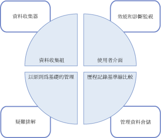
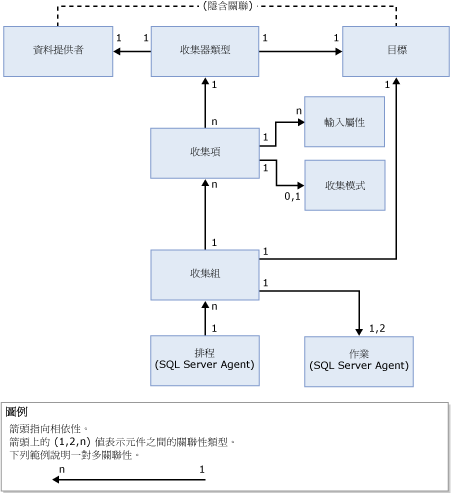

# 資料收集
[!INCLUDE[appliesto-ss-xxxx-xxxx-xxx-md](../../includes/appliesto-ss-xxxx-xxxx-xxx-md.md)]
  資料收集器是 [!INCLUDE[ssCurrent](../../includes/sscurrent-md.md)] 的元件，它會收集不同的資料集。 資料收集會連續執行或依照使用者定義的排程執行。 然後，資料收集器會將收集而來的資料儲存在關聯式資料庫內 (稱為管理資料倉儲)。  
  
## 什麼是資料收集器？ 
 資料收集器是 [!INCLUDE[ssCurrent](../../includes/sscurrent-md.md)] 及 [!INCLUDE[ssNoVersion](../../includes/ssnoversion-md.md)]提供之工具的資料收集平台的核心元件。 資料收集器會在資料庫伺服器和應用程式之間提供一個集中的資料收集點。 這個收集點可以從各種來源取得資料，而不只限於效能資料，這點與 SQL 追蹤不同。  
  
 資料收集器可讓您調整資料收集的範圍，以適合測試與實際環境的需要。 資料收集器也會使用資料倉儲，這是藉由設定不同的資料保留期間而讓您管理所收集之資料的關聯式資料庫。  
  
 資料收集器支援動態微調資料收集，而且可透過它的 API 加以擴充。 如需詳細資訊，請參閱 [Data Collector Programming](http://msdn.microsoft.com/library/53b4752b-055d-4716-b2bc-75b4cce84101)。  
  
 下圖顯示資料收集器如何納入 [!INCLUDE[ssCurrent](../../includes/sscurrent-md.md)]資料收集和資料管理的整體策略中。  
  
   
  
## 概念  
 資料收集器與 [!INCLUDE[ssNoVersion](../../includes/ssnoversion-md.md)] Agent 和 [!INCLUDE[ssISnoversion](../../includes/ssisnoversion-md.md)]整合在一起，而且會廣泛地使用這兩者。 因此，在您使用資料收集器之前，應該要先了解與這些 [!INCLUDE[ssNoVersion](../../includes/ssnoversion-md.md)] 元件有關的某些概念。  
  
 [!INCLUDE[ssNoVersion](../../includes/ssnoversion-md.md)] Agent 可用來排定和執行收集作業。 您應該了解以下概念：  
  
-   作業  
  
-   作業步驟  
  
-   作業排程  
  
-   子系統  
  
-   Proxy 帳戶  
  
 如需詳細資訊，請參閱[自動化管理工作 &#40;SQL Server Agent&#41;](http://msdn.microsoft.com/library/541ee5ac-2c9f-4b74-b4f0-13b7bd5920b0)。  
  
 [!INCLUDE[ssISnoversion](../../includes/ssisnoversion-md.md)] ([!INCLUDE[ssIS](../../includes/ssis-md.md)]) 可用來執行從個別資料提供者收集資料的套件。 您應該要熟悉下列的 [!INCLUDE[ssIS](../../includes/ssis-md.md)] 工具和概念：  
  
-   [!INCLUDE[ssIS](../../includes/ssis-md.md)] 套件  
  
-   [!INCLUDE[ssIS](../../includes/ssis-md.md)] 封裝組態  
  
 如需詳細資訊，請參閱 [Integration Services &#40;SSIS&#41; 封裝](../../integration-services/integration-services-ssis-packages.md)。  
  
## 詞彙  
 **目標**  
 支援資料收集之 [!INCLUDE[ssDE](../../includes/ssde-md.md)] 版本中 [!INCLUDE[ssNoVersion](../../includes/ssnoversion-md.md)] 的執行個體。 如需支援之版本的詳細資訊，請參閱 [SQL Server 2016 版本支援的功能](~/sql-server/editions-and-supported-features-for-sql-server-2016.md)的＜管理能力＞一節。  
  
 *「目標根」* (Target Root) 會定義目標階層中的子樹。 在這些由目標根定義之子樹上套用篩選後所產生之目標的群組，就是 *「目標集」* (Target Set)。 目標根可以是資料庫、 [!INCLUDE[ssNoVersion](../../includes/ssnoversion-md.md)]的執行個體或電腦執行個體。  
  
**目標類型**  
 目標的類型，它具有某些特性和行為。 例如， [!INCLUDE[ssNoVersion](../../includes/ssnoversion-md.md)] 執行個體目標的特性與 [!INCLUDE[ssNoVersion](../../includes/ssnoversion-md.md)] 資料庫目標的特性不同。  
  
 **資料提供者**  
 已知的資料來源，為提供資料給收集器型別的目標類型所特有。  
  
**收集器類型**  
 包裝 [!INCLUDE[ssIS](../../includes/ssis-md.md)] 封裝的邏輯包裝函數，可提供實際機制來收集資料，並將資料上傳到管理資料倉儲。  
  
 **收集項**  
 收集器型別的執行個體。 收集項是使用一組特定的輸入屬性和收集頻率所建立的。  
  
 **收集組**  
 收集項的群組。 收集組是資料收集的單位，使用者可以透過使用者介面來與它互動。  
  
 **收集模式**  
 收集資料和儲存資料的方式。 收集模式可以是快取或非快取。 快取模式支援持續收集，而非快取模式則是要用於視需要收集或收集快照集。  
  
 **管理資料倉儲**  
 用於儲存收集之資料的關聯式資料庫。  
  
 下圖顯示資料收集器元件之間的相依性和關聯性。  
  
   
  
 如圖中所示，資料提供者對於資料收集器而言是外部的，而且依照定義與目標之間有隱含關聯性。 此資料提供者為特定目標所特有 (例如，關聯式引擎之類的 [!INCLUDE[ssNoVersion](../../includes/ssnoversion-md.md)] 服務)，並提供可由資料收集器所使用的資料，例如 [!INCLUDE[ssNoVersion](../../includes/ssnoversion-md.md)]中的系統檢視表、效能監視器計數器和 WMI 提供者。  
  
 收集器型別是目標類型所特有 (根據資料提供者與目標類型的邏輯關聯)。 收集器型別會定義如何從特定的資料提供者收集資料 (使用系統化的參數) 及指定資料儲存結構描述。 必須要有資料提供者結構描述和儲存結構描述，才能儲存所收集的資料。 收集器型別也會提供管理資料倉儲的位置，此位置可位於執行資料收集的電腦或是另一部電腦上。  
  
 圖中所示的收集項就是透過輸入參數 (例如收集器型別的 XML 結構描述) 參數化之特定收集器型別的執行個體。 所有的收集項都必須在相同的目標根或空的目標根上運作。 如此可讓資料收集器結合作業系統或特定目標根 (但不是不同的目標根) 的收集器型別。  
  
 收集項會定義收集頻率，以決定值的快照取得頻率。 雖然收集項是收集組的建置組塊，但是收集項不能獨立存在。  
  
 收集組會在伺服器執行個體上定義及部署，而且彼此可以獨立執行。 每一個收集組都可以套用到一個目標，這個目標會符合屬於收集組之一部分的所有收集器型別的目標類型。 收集組是由 [!INCLUDE[ssNoVersion](../../includes/ssnoversion-md.md)] Agent 作業所執行，而且會依照預先定義的排程將資料上傳到管理資料倉儲。  
  
 由收集組中的不同執行個體所收集的所有資料，都會依照相同的排程上傳到管理資料倉儲。 這個排程會定義為共用 [!INCLUDE[ssNoVersion](../../includes/ssnoversion-md.md)] Agent 排程，而且可由一個以上的收集組所使用。 收集組會當做單一實體來開啟或關閉；收集項無法個別開啟或關閉。  
  
 當您建立或更新收集組時，可以設定收集模式來收集資料，並將資料上傳到管理資料倉儲。 排程的類型是由收集的類型所決定：快取或非快取。 如果快取收集，則每一次的資料收集和上傳都會在不同的作業上執行。 收集執行所依據的排程會在 [!INCLUDE[ssNoVersion](../../includes/ssnoversion-md.md)] Agent 啟動時開始，並依照收集項中所指定的頻率來執行。 上傳作業會根據使用者指定的排程執行。  
  
 在非快取收集下，資料收集和上傳都會在單一作業上執行，但是會分成兩個步驟。 第一個步驟是收集，第二個步驟是上傳。 視需要收集不需要任何排程。  
  
 在啟用收集組之後，可以根據排程或是視需要來開始資料收集。 當資料收集開始時， [!INCLUDE[ssNoVersion](../../includes/ssnoversion-md.md)] Agent 會針對資料收集器繁衍處理序，接著此處理序會針對收集組載入 [!INCLUDE[ssISnoversion](../../includes/ssisnoversion-md.md)] 封裝。 代表集合類型的收集項會從指定目標上的適當資料提供者蒐集資料。 當收集週期結束時，這些資料會上傳到管理資料倉儲。  
  
## 您可以執行的動作  
  
|描述|主題|  
|----------------------|-----------|  
|管理資料收集的不同層面，例如啟用或停用資料收集、變更收集組的組態，或是檢視管理資料倉儲中的資料。|[管理資料收集](../../relational-databases/data-collection/manage-data-collection.md)|  
|使用這些報表來取得監視系統容量和疑難排解系統效能的資訊。|[系統資料收集組報表](../../relational-databases/data-collection/system-data-collection-set-reports.md)|  
|使用管理資料倉儲從伺服器 (資料收集目標) 收集資料。|[管理資料倉儲](../../relational-databases/data-collection/management-data-warehouse.md)| 
|利用 SQL Server Profiler 的伺服器端追蹤功能來匯出追蹤定義，以便用來建立使用一般 SQL 追蹤收集器類型的收集組。| [使用 SQL Server Profiler 來建立 SQL 追蹤收集組 (SQL Server Management Studio)](https://msdn.microsoft.com/library/cc645955(v=sql.130).aspx)
  
  

