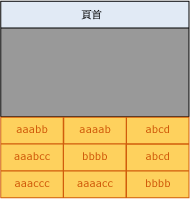
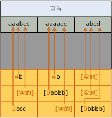
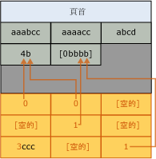

# 頁面壓縮實作
[!INCLUDE[appliesto-ss-asdb-xxxx-xxx-md](../../includes/appliesto-ss-asdb-xxxx-xxx-md.md)]

  本主題摘要說明 [!INCLUDE[ssDE](../../includes/ssde-md.md)] 如何實作頁面壓縮。 這個摘要提供協助您計畫資料所需之儲存空間的基本資訊。  
  
 資料表、資料表資料分割、索引和索引資料分割的頁面壓縮都很類似。 下列的資料表頁面壓縮描述同樣適用於所有物件類型的頁面壓縮。 下列範例會壓縮字元字串，但前置詞和字典壓縮會對其他的資料類型套用相同的原則。  
  
 以頁面壓縮來壓縮資料表及索引的分葉層級是由下列順序的三種作業組成：  
  
1.  資料列壓縮  
  
2.  前置詞壓縮  
  
3.  字典壓縮  
  
 在您使用頁面壓縮時，索引的非分葉層級頁面會藉由僅使用資料列壓縮來進行壓縮。 如需資料列壓縮的詳細資訊，請參閱 [資料列壓縮實作](../../relational-databases/data-compression/row-compression-implementation.md)。  
  
## 前置詞壓縮  
 對於進行壓縮的每個頁面，前置詞壓縮會使用下列步驟：  
  
1.  針對每個欄位識別一個值，以用來減少每個資料行中值的儲存空間。  
  
2.  會建立代表每個資料行前置詞值的資料列，並將其儲存在緊接在頁面標頭後的壓縮資訊 (CI) 結構中。  
  
3.  資料行中重複的前置詞值會由對應之前置詞的參考取代。 如果資料列中的值不完全符合選取的前置詞值，仍可指出部分相符。  
  
 下列圖例顯示資料表範例頁面在前置詞壓縮前的狀況。  
  
   
  
 下列圖例顯示相同頁面在前置詞壓縮後的狀況。 前置詞會移到標頭，而資料行值則變更為前置詞的參考。  
  
   
  
 在第一個資料列的第一個資料行中，值 4b 指出該資料列會有前置詞 (aaab) 的前四個字元和字元 b。 這樣會產生結果值 aaabb，即為原始值。  
  
## 字典壓縮  
 在完成前置詞壓縮後，就會套用字典壓縮。 字典壓縮會搜尋頁面上的任何位置是否有重複的值，然後將它們儲存在 CI 區域中。 與前置詞壓縮不同的是，字典壓縮並不是限定於單一資料行。 字典壓縮可以取代頁面上任何位置的重複值。 下列圖例顯示相同頁面在字典壓縮後的狀況。  
  
   
  
 請注意，值 4b 已由頁面的不同資料行參考。  
  
## 何時會發生頁面壓縮  
 在建立具有頁面壓縮的新資料表時，不會進行任何壓縮。 不過，資料表的中繼資料指出應該使用頁面壓縮。 資料在新增至第一個資料頁面時會進行資料列壓縮。 因為頁面尚未填滿，所以無法藉由頁面壓縮取得任何優點。 當頁面填滿時，下一個新增的資料列就會起始頁面壓縮作業。 此時會檢視整個頁面；每個資料行都會受到評估，查看是否要進行前置詞壓縮，然後再評估是否要進行字典壓縮。 如果頁面壓縮已在頁面上建立足夠的空間容納額外的資料列，則會新增該資料列，然後再對資料進行資料列壓縮及頁面壓縮。 如果透過頁面壓縮所取得的空間與 CI 結構所需的空間之間的差異並不明顯，則不會針對該頁面使用頁面壓縮。 新頁面若可以容納未來的資料列則已，若不能容納，就會對資料表新增新的頁面。 新頁面一開始並不會進行頁面壓縮，這與第一個頁面類似。  
  
 當包含資料的現有資料表轉換成頁面壓縮時，每個頁面都會重建且接受評估。 重建所有頁面會導致資料表、索引或資料分割的重建。  
  
## 另請參閱  
 [資料壓縮](../../relational-databases/data-compression/data-compression.md)   
 [資料列壓縮實作](../../relational-databases/data-compression/row-compression-implementation.md)  
  
  
