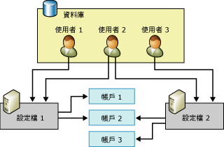

# Database Mail 組態物件
  Database Mail 包含兩個組態物件：這些資料庫組態物件提供您方法，來設定 Database Mail 從資料庫應用程式或 [!INCLUDE[ssNoVersion](../../includes/ssnoversion-md.md)] Agent 傳送電子郵件時應使用的設定。  
  
-   Database Mail 帳戶  
  
-   Database Mail 設定檔  
  
  
##   Database Mail 組態物件關聯性  
 下圖說明顯示兩個設定檔、三個帳戶及三個使用者。 「使用者 1」有「設定檔 1」的存取權，前者使用「帳戶 1」及「帳戶 2」。 「使用者 3」有「設定檔 2」的存取權，而「設定檔 2」使用「帳戶 3」及「帳戶 3」。 「使用者 2」有「設定檔 1」及「設定檔 2」的存取權。  
  
   
  
  
##   Database Mail 帳戶  
 Database Mail 帳戶包含 Microsoft [!INCLUDE[ssNoVersion](../../includes/ssnoversion-md.md)] 用來將電子郵件訊息傳送到 SMTP 伺服器的資訊。 每個帳戶包含一個電子郵件伺服器的資訊。  
  
 Database Mail 支援三種與 SMTP 伺服器溝通的驗證方法：  
  
-   Windows 驗證：Database Mail 使用 [!INCLUDE[ssDEnoversion](../../includes/ssdenoversion-md.md)] Windows 服務帳戶的憑證進行 SMTP 伺服器驗證。  
  
-   基本驗證：Database Mail 使用指定的使用者名稱與密碼來進行 SMTP 伺服器驗證。  
  
-   匿名驗證：SMTP 伺服器不需要任何驗證。  Database Mail 將不會使用任何認證來進行 SMTP 伺服器驗證。  
  
 帳戶資訊儲存在 **msdb** 資料庫中。 每個帳戶都是由下列資訊組成：  
  
-   帳戶的名稱。  
  
-   帳戶的描述。  
  
-   帳戶的電子郵件地址。  
  
-   帳戶的顯示名稱。  
  
-   用來作為帳戶回覆資訊的電子郵件地址。  
  
-   電子郵件伺服器的名稱。  
  
-   電子郵件伺服器的類型。 若是 [!INCLUDE[msCoName](../../includes/msconame-md.md)] [!INCLUDE[ssNoVersion](../../includes/ssnoversion-md.md)]，一律為 Simple Mail Transfer Protocol (SMTP)。  
  
-   電子郵件伺服器的通訊埠編號。  
  
-   位元資料行會指出 SMTP 郵件伺服器的連接是否使用安全通訊端層 (SSL) 來建立。  
  
-   位元資料行會指出 SMTP 伺服器的連接是否使用為 [!INCLUDE[ssDEnoversion](../../includes/ssdenoversion-md.md)]所設定的憑證來建立。  
  
-   用來驗證電子郵件伺服器的使用者名稱 (若電子郵件伺服器需要驗證的話)。  
  
-   用來驗證電子郵件伺服器的密碼 (若電子郵件伺服器需要驗證的話)。  
  
 「Database Mail 組態精靈」提供一個便捷的方式來建立及管理帳戶。 您也可以使用 **msdb** 中的組態預存程序來建立及管理帳戶。  
  
  
##   Database Mail 設定檔  
 Database Mail 設定檔是相關 Database Mail 帳戶的排序集合。 使用 Database Mail 傳送電子郵件的應用程式會指定設定檔，而不是直接使用帳戶。 將個別電子郵件伺服器的資訊與應用程式所使用的物件區隔開來，可以增進彈性及可靠性：設定檔會提供自動容錯移轉功能，所以如果有一部電子郵件伺服器沒有回應，Database Mail 就會自動將郵件傳送至另一部電子郵件伺服器。 資料庫管理員不需要變更應用程式的程式碼或作業步驟，即可加入、移除或重新設定帳戶。  
  
 設定檔也可以協助資料庫管理員控制電子郵件的存取。 必須要有 **DatabaseMailUserRole** 成員資格，才能傳送 Database Mail。 管理員可以利用設定檔所提供的額外彈性來控制傳送郵件的人員及使用的帳戶。  
  
 設定檔可能是公用或私人的。  
  
 **msdb** 資料庫中之 **DatabaseMailUserRole** 資料庫角色的所有成員都可以存取 **公用設定檔** 。 它們讓 **DatabaseMailUserRole** 角色的所有成員可以使用設定檔傳送電子郵件。  
  
 **msdb** 資料庫中的安全性主體會定義 **私人設定檔** 。 它們只容許指定的資料庫使用者、角色和 **sysadmin** 固定伺服器角色的成員，使用該設定檔來傳送電子郵件。 設定檔依預設是私人的，而且只有 **sysadmin** 固定伺服器角色的成員才能存取。 若要使用私人設定檔， **sysadmin** 必須授與使用者權限，才能夠使用設定檔。 此外， **sp_send_dbmail** 預存程序的 EXECUTE 權限只授與 **DatabaseMailUserRole**的成員。 系統管理員必須將使用者加入 **DatabaseMailUserRole** 資料庫角色，使用者才能夠傳送電子郵件。  
  
 萬一電子郵件伺服器無法連上或無法處理訊息，設定檔將可改善其可靠性。 設定檔中的每個帳戶都有序號。 序號決定了 Database Mail 使用設定檔中之帳戶的順序。 對於新的電子郵件訊息，Database Mail 會使用最後一個成功傳送訊息的帳戶，或若是訊息尚未傳送，就使用最低序號的帳戶。 如果這個帳戶失敗，Database Mail 會使用序號次高的帳戶，依此類推，直到 Database Mail 傳送訊息成功為止，或直到序號最高的帳戶失敗為止。 如果序號最高的帳戶失敗，Database Mail 會在 **sysmail_configure_sp** 的 **AccountRetryDelay**參數所設定的時間之內，暫停傳送郵件，之後，再從最低的序號開始，重新嘗試傳送郵件的處理序。 請利用 **sysmail_configure_sp** 的 **AccountRetryAttempts**參數，設定外部郵件處理序嘗試利用指定設定檔中的每個帳戶，來傳送電子郵件訊息的次數。  
  
 如果有多個序號相同的帳戶存在，Database Mail 只會將其中一個帳戶用在給定的電子郵件訊息上。 在這個情況下，Database Mail 並無法保證這個序號會用到哪個帳戶，也無法保證各訊息會用到相同的帳戶。  
  
  
##   Database Mail 組態工作  
 下表描述 Database Mail 組態工作。  
  
|組態工作|主題連結|  
|------------------------|----------------|  
|描述如何建立 Database Mail 帳戶|[建立 Database Mail 帳戶](../../relational-databases/database-mail/create-a-database-mail-account.md)|  
|描述如何建立 Database Mail 設定檔|[建立 Database Mail 設定檔](../../relational-databases/database-mail/create-a-database-mail-profile.md)|  
|描述如何設定 Database Mail|[設定 Database Mail](../../relational-databases/database-mail/configure-database-mail.md)|  
|描述如何使用範本建立 Database Mail 組態指令碼||  
  
  
##   其他資料庫組態工作 (系統預存程序)  
 Database Mail 組態預存程序位於 **msdb** 資料庫。  
  
 下表列出用來設定和管理 Database Mail 的預存程序。  
  
### Database Mail 設定  
  
|名稱|描述|  
|----------|-----------------|  
|[sysmail_configure_sp (Transact-SQL)](../../relational-databases/system-stored-procedures/sysmail-configure-sp-transact-sql.md)|變更 Database Mail 的組態設定。|  
|[sysmail_help_configure_sp (Transact-SQL)](../../relational-databases/system-stored-procedures/sysmail-help-configure-sp-transact-sql.md)|顯示 Database Mail 的組態設定。|  
  
### 帳戶與設定檔  
  
|名稱|描述|  
|----------|-----------------|  
|[sysmail_add_profileaccount_sp (Transact-SQL)](../../relational-databases/system-stored-procedures/sysmail-add-profileaccount-sp-transact-sql.md)|將郵件帳戶加入到 Database Mail 設定檔。|  
|[sysmail_delete_account_sp (Transact-SQL)](../../relational-databases/system-stored-procedures/sysmail-delete-account-sp-transact-sql.md)|刪除 Database Mail 帳戶。|  
|[sysmail_delete_profile_sp (Transact-SQL)](../../relational-databases/system-stored-procedures/sysmail-delete-profile-sp-transact-sql.md)|刪除 Database Mail 設定檔。|  
|[sysmail_delete_profileaccount_sp (Transact-SQL)](../../relational-databases/system-stored-procedures/sysmail-delete-profileaccount-sp-transact-sql.md)|從 Database Mail 設定檔中移除帳戶。|  
|[sysmail_help_account_sp (Transact-SQL)](../../relational-databases/system-stored-procedures/sysmail-help-account-sp-transact-sql.md)|列出 Database Mail 帳戶的相關資訊。|  
|[sysmail_help_profile_sp (Transact-SQL)](../../relational-databases/system-stored-procedures/sysmail-help-profile-sp-transact-sql.md)|列出一或多個 Database Mail 設定檔的相關資訊。|  
|[sysmail_help_profileaccount_sp (Transact-SQL)](../../relational-databases/system-stored-procedures/sysmail-help-profileaccount-sp-transact-sql.md)|列出與一個或多個 Database Mail 設定檔相關聯的帳戶。|  
|[sysmail_update_account_sp (Transact-SQL)](../../relational-databases/system-stored-procedures/sysmail-update-account-sp-transact-sql.md)|更新現有 Database Mail 帳戶的資訊。|  
|[sysmail_update_profile_sp (Transact-SQL)](../../relational-databases/system-stored-procedures/sysmail-update-profile-sp-transact-sql.md)|變更 Database Mail 設定檔的描述或名稱。|  
|[sysmail_update_profileaccount_sp (Transact-SQL)](../../relational-databases/system-stored-procedures/sysmail-update-profileaccount-sp-transact-sql.md)|更新 Database Mail 設定檔內的帳戶序號。|  
  
### 安全性  
  
|名稱|描述|  
|----------|-----------------|  
|[sysmail_add_principalprofile_sp (Transact-SQL)](../../relational-databases/system-stored-procedures/sysmail-add-principalprofile-sp-transact-sql.md)|授與資料庫主體使用 Database Mail 設定檔的權限。|  
|[sysmail_delete_principalprofile_sp (Transact-SQL)](../../relational-databases/system-stored-procedures/sysmail-delete-principalprofile-sp-transact-sql.md)|移除資料庫使用者使用公用或私人 Database Mail 設定檔的權限。|  
|[sysmail_help_principalprofile_sp (Transact-SQL)](../../relational-databases/system-stored-procedures/sysmail-help-principalprofile-sp-transact-sql.md)|列出指定資料庫使用者的 Database Mail 設定檔資訊。|  
|[sysmail_update_principalprofile_sp (Transact-SQL)](../../relational-databases/system-stored-procedures/sysmail-update-principalprofile-sp-transact-sql.md)|更新指定資料庫使用者的權限資訊。|  
  
### 系統狀態  
  
|名稱|描述|  
|----------|-----------------|  
|[sysmail_start_sp &#40;Transact-SQL&#41;](../../relational-databases/system-stored-procedures/sysmail-start-sp-transact-sql.md)|啟動 Database Mail 外部程式，以及關聯的 SQL Service Broker 佇列。|  
|[sysmail_stop_sp &#40;Transact-SQL&#41;](../../relational-databases/system-stored-procedures/sysmail-stop-sp-transact-sql.md)|停止 Database Mail 外部程式，以及關聯的 SQL Service Broker 佇列。|  
|[sysmail_help_status_sp &#40;Transact-SQL&#41;](../../relational-databases/system-stored-procedures/sysmail-help-status-sp-transact-sql.md)|指示 Database Mail 是否已啟動。|  
  
##   其他參考  
  
-   [Database Mail 記錄與稽核](../../relational-databases/database-mail/database-mail-log-and-audits.md)  
  
  
  

